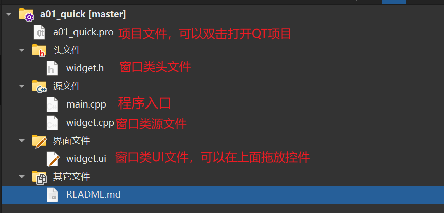
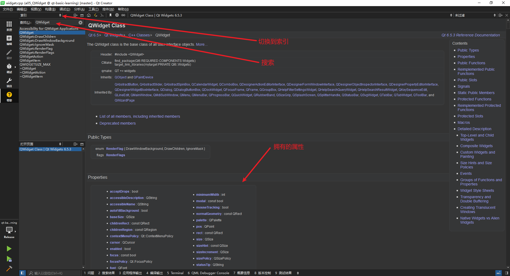
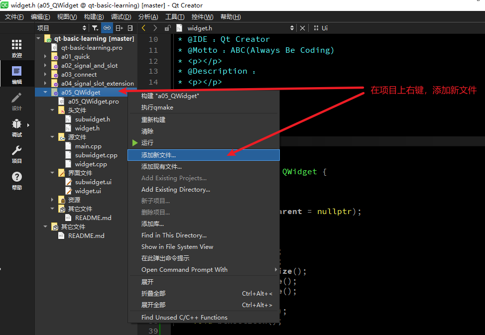
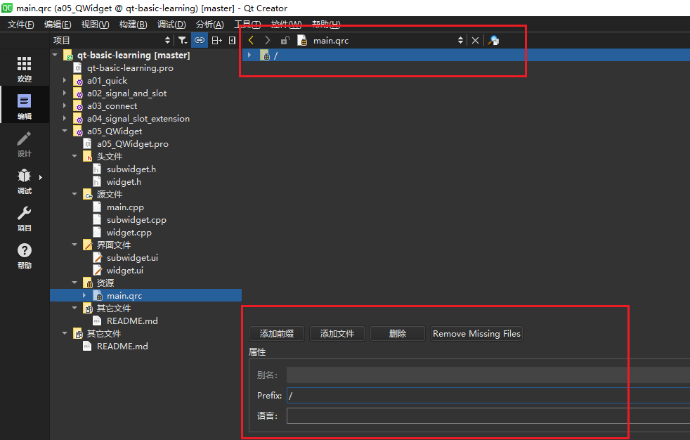
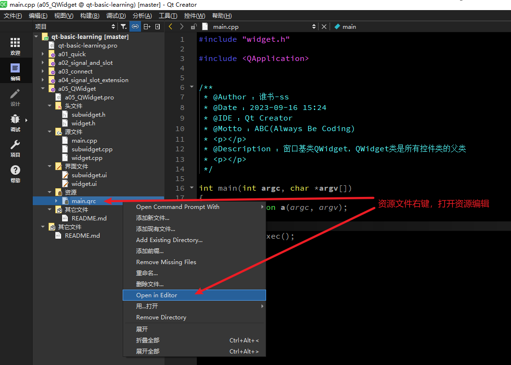
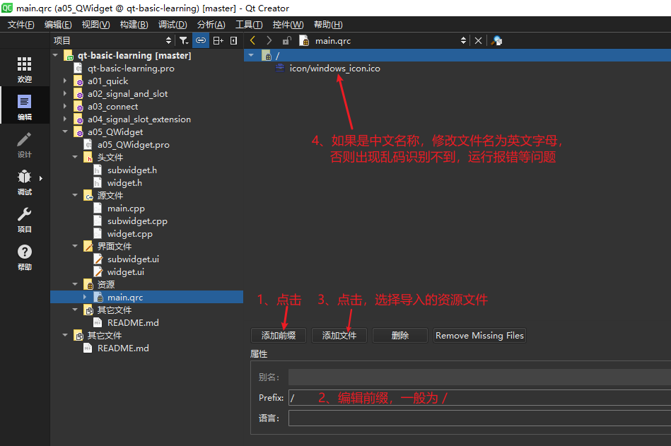
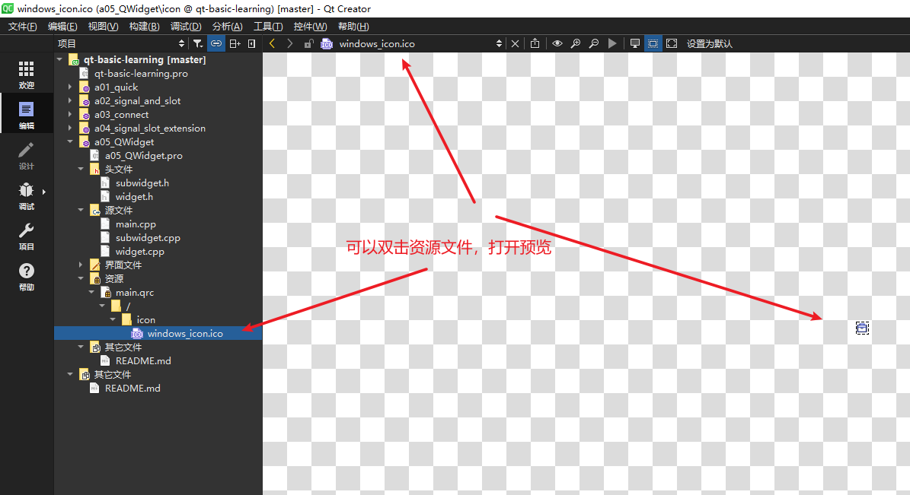

# qt-basic-learning

Qt基础学习笔记。

下面每个一级标题对应代码工程中的子项目名称。此README.md的内容由每个子项目下的README.md内容合并在一起，所以每个标题的内容都可以在子项目中的README.md找到


<br><br><br>

# a01_quick
快速入门


## 工程项目文件说明




## 编译构建
Qt6之后，官方建议是cmake，但是Qt6还是会支持qmake的，qmake相对来说是比较简单的。

## Qt 中常用的模块
```bash
# QtCore 模块是Qt应用程序的基础，是核心的非图形类。
# 提供了信号与槽的通信机制，并发和多线程，容器，事件系统
Qt Core

# 最重要的GUI模块。图形用户界面 (GUI) 组件的基类。
Qt GUI
  
# 包含基于GUI应用程序的典型小部件类，比如按钮、文本框、标签等
# 在 Qt5 中, 从 Gui 模块中分离出来。
Qt widgets

# 网络模块。用于支持 TCP, UDP, HTTP 通信
Qt Network

# 多媒体模块。音频、视频、广播和相机功能类。  
Qt Multimedia

# Qt Multimedia 的小部件。
Qt Multimedia Widgets

# 数据库模块。用于操作数据库，比如后面会将到的 sqlite、MySQL  
Qt SQL
  
# web引擎模块。用于 web 相关的开发
Qt WebEngine

############################################################
# 以下是 QML 相关的模块
# QML 是什么呢？
# 简单来说，就是使用类似 js 的语法来构建界面，而不是 widget 的方式

# Qt QML模块。用于 QML 和 JavaScript 语言。
Qt QML

# 该模块用于使用 QML2 编写的 GUI 应用程序。用于构建具有自定义用户界面的高度动态应用程序的声明性框架。  
Qt Quick
  
# 提供轻量级 QML 类型，用于为桌面、嵌入式和移动设备创建高性能用户界面。这些类型采用简单的样式架构并且非常高效。
Qt Quick Controls
  
# 用于从 Qt Quick 应用程序创建系统对话框并与之交互的类型。
Qt Quick Dialogs
  
# 用于在 Qt Quick 中安排项目的布局。
Qt Quick Layouts

```


<br><br><br>

# a02_signal_and_slot

## 学习内容

信号和槽（标准信号槽 和 自定义信号槽）


## 标准信号槽

ui拖放按钮，分别是btnMax，btnNormal，btnMin，btnClose

widget.cpp 中设置按钮文本
```c++
ui->btnMax->setText("最大化显示");
ui->btnNormal->setText("正常显示");
ui->btnMin->setText("最小化");
ui->btnClose->setText("关闭窗口");
```

函数 connect() 用于连接`信号`和`槽`

函数格式：`connect(sender, signal, receiver, slot)`
- sender: 发出信号的对象，比如 QpushButton 按钮
- signal: 发出的信号，比如 clicked() 点击操作
- receiver: 接收信号的对象，比如 QWidget 窗口
- slot: 接收信号之后，调用的函数

使用：
```c++
connect(ui->btnMax, SIGNAL(clicked()), this, SLOT(showMaximized()));
connect(ui->btnNormal, SIGNAL(clicked()), this, SLOT(showNormal()));
connect(ui->btnMin, SIGNAL(clicked()), this, SLOT(showMinimized()));
connect(ui->btnClose, SIGNAL(clicked()), this, SLOT(close()));
```

`showMaximized()`，`showNormal()`，`showMinimized()`，`close()` 均为Qt的标准函数


## 自定义信号槽

创建两个类的头文件和源文件，分别是commander.h（指挥官）和 soldier.h（士兵），都需要继承自 QObject类，添加 Q_OBJECT 宏，才能正常使用Qt 的信号和槽机制。

commander.h 声明两个go() 跑的方法，一个有参一个无参（测试信号方法可以重载）

soldier.h 声明两个fight() 战斗的方法，槽函数的返回值和参数，要和信号保持一致

soldier.cpp 实现两个fight()方法
```c++
void Soldier::fight() {
    std::cout << "fight" << std::endl;
}

void Soldier::fight(QString str) {
    std::cout << "fight for " << str.toStdString() <<std::endl;
}
```

创建两个实例
```c++
Commander commander;
Soldier soldier;
```

建立信号和槽的连接
```c++
connect(&commander, SIGNAL(go()), &soldier, SLOT(fight()));
connect(&commander, SIGNAL(go(Qstring)), &soldier, SLOT(fight(Qstring)));
```

发送信号
```c++
commander.go();
commander.go("freedom");
```


<br><br><br>

# a03_connect

## 学习内容

信号和槽要建立连接，本质上是通过 `connect` 函数来连接实现的。但是从写法或者操作上来说，有多种方式，以下总结了 5 种方式：
- SIGNAL/SLOT（Qt4）
- 函数地址（Qt5）
- UI 设计师界面 - 转到槽
- UI 设计师界面 - 信号槽编辑器
- lambda 表达式


## SIGNAL/SLOT（Qt4）
SIGNAL/SLOT（Qt4） 这两个宏，将函数名以及对应的参数，转换为字符串，这是 Qt4 中使用的方式

格式：`connect(sender, SIGNAL(signal()), receiver, SLOT(slot()));`

这种方式，编译器不会做错误检查，即使函数名或者参数写错了，也可以编译通过，这样就把问题留在了运行阶段。

比如：`connect(ui->btnMax, SIGNAL(clicked()), this, SLOT(showMaximized()));`

如果 showMaximized 不小心写成了 showMaximize，点击【构建】菜单->【重新构建】，在【编译输出】窗口并不会报错，而在运行时报错


## 函数地址（Qt5）
函数地址（Qt5），这种方式，编译时就会对函数类型，参数个数做检查。

格式：`connect(sender, &Sender::signal, receiver, &Receiver::slot);`
- sender：信号发送者
- &Sender::signal：发送的信号
- receiver：信号接收者
- &Receiver::slot：槽函数

比如：`connect(ui->btnNormal, &QPushButton::clicked, this, &QWidget::showNormal);`


## UI设计师界面-鼠标右键，转到槽
在 UI 设计师界面，右键单击 btnMin，然后选择【转到槽…】，弹出窗口，选择 clicked()即可生成并跳转到槽函数，即可在 widget.h 和 widget.cpp 中生成对应的代码，此时会根据按钮的 name 自动生成对应的槽函数

不推荐使用这种方式：https://github.com/KDE/clazy/blob/1.11/docs/checks/README-connect-by-name.md

## UI设计师界面-信号槽编辑器
使用这种方式，实现点击 btnClose 按钮，关闭窗口。

进入到 UI 设计师界面，【View】菜单 ->【视图】->【Signal & Slots Editor】，在打开的信号槽编辑器中，点击绿色的加号+ 就可以连接信号和槽了：

不推荐使用这种方式：https://github.com/KDE/clazy/blob/1.11/docs/checks/README-connect-by-name.md

## Lambda 表达式
修改窗口的标题
```c++
connect(ui->btnSetTitle, &QPushButton::clicked, this, [this]() {
    this->setWindowTitle("[连接信号槽的 5 种方式]");
});
```

## 使用总结

推荐使用`函数地址（Qt5）` 和 lambda 表达式。

connect()连接使用方式在Qt6中变化不大，与Qt5的使用方式一致

- SIGNAL/SLOT（Qt4）
  传统的使用方式，传递的是信号和槽函数的字符串名称，编译时不检查类型和参数，运行时容易出错
- 函数地址（Qt5）<font color="#dd0000">（强烈推荐使用）</font>
  语法简洁，易于阅读；
  没有字符串转换的开销；
  编译时的类型检查，使得连接安全性得到增强；
- UI 设计师界面 - 转到槽
  灵活性不如代码，复杂页面需要通过代码实现；
  如果使用其它ide开发，可能出现问题；
  运行时动态创建和销毁的 UI 元素，使用UI界面设计，会比较困难。
- UI 设计师界面 - 信号槽编辑器
  灵活性不如代码，复杂页面需要通过代码实现；
  如果使用其它ide开发，可能出现问题；
  运行时动态创建和销毁的 UI 元素，使用UI界面设计，会比较困难。
- lambda 表达式<font color="#dd0000">（强烈推荐使用）</font>
  语法简洁，易于阅读；
  没有字符串转换的开销；
  编译时的类型检查，使得连接安全性得到增强；
  可以直接在connect的地方定义一段处理逻辑，特别适合处理简单的，不值得单独定义槽函数的逻辑


<br><br><br>

# a04_signal_slot_extension

## 学习内容

- 如何连接重载的信号和槽
- 一个信号连接多个槽
- 多个信号连接一个槽
- 信号连接信号
- 断开连接 - disconnect

## 如何连接重载的信号和槽

在信号和槽存在重载时，Qt4 和 Qt5 的写法是有区别的：

Qt4 方式: 可以在 SIGNAL/SLOT 中指定函数参数类型，因此写法比较简单。

Qt5 方式: 指定信号和槽时，只能指定函数名，无法向 Qt4 那样指定函数参数类型，需要单独定义函数指针，写法上稍显麻烦。

## 一个信号连接多个槽

```c++
connect(sender, SIGNAL(signal), receiver1, SLOT(fun1()));
connect(sender, SIGNAL(signal), receiver2, SLOT(fun2()));
```
这样，当 signal 这个信号发出时，它连接的 2 个槽函数 fun1，fun2 都会被执行，并且：

Qt4：信号发射时，与之相连接的槽函数的执行顺序是随机的。

Qt5+: 信号发射时，这些槽函数的执行顺序与建立连接的顺序相同。

## 多个信号连接一个槽

```c++
connect(sender, SIGNAL(signal1), receiver, SLOT(fun()));
connect(sender, SIGNAL(signal2), receiver, SLOT(fun()));
```

##信号连接信号

信号不仅可以连接槽，还可以和连接信号，
 
如：`connect(obj1, SIGNAL(signal1), obj2, SIGNAL(signal2));`

这样，当 obj1 发送 signal1 信号时，就会触发 obj2 发送 signal2 信号。

## 断开连接 - disconnect

用于断开信号和槽之间已经建立的连接。disconnect 函数并不常用，因为当一个对象 delete 之后， Qt 自动取消所有连接到这个对象上面的槽。


<br><br><br>

# a05_QWidget

## 学习内容

由于`QWidget`类是所有控件类的父类，并且在`a01_quick`中就已经使用到了，因此需要先来学习QWidget相关技术点。

- 所有窗口类的基类
  Qt中有3个窗口的基类：`QWidget`、`QMainWindow`、`QDialog`；在创建Qt工程时，会让我们选择继承自哪一个窗口类；其中，`QMainWindow`、`QDialog`都是继承自`QWidge`
- 所有控件类的基类
  Qt中的控件类（按钮、输入框、单选框等）也属于窗口类，它们的基类也是`QWidget`
- 可以内嵌到其他窗口的内部，此时需要给其指定父窗口
- 可以作为独立的窗口显示，此时不能给其指定父窗口

基于案例一步步的使用！


## 如何显示QWidget窗口

1、新建一个基于QWidget的子窗口类，类名为`SubWidget`，

2、以创建工程时创建的`Widget`为父类（`widget.cpp`），要显示子窗口`SubWidget`（`subWidget.cpp`），需要在父类`Widget`中调用，即在`widget.cpp`中调用
```c++
#include "widget.h"
#include "ui_widget.h"
#include "subwidget.h"


/**
 * @Author ：谁书-ss
 * @Date ：2023-09-16 15:24
 * @IDE ：Qt Creator
 * @Motto ：ABC(Always Be Coding)
 * <p></p>
 * @Description ：
 * <p></p>
 */

Widget::Widget(QWidget *parent)
    : QWidget(parent)
    , ui(new Ui::Widget) {
    ui->setupUi(this);

    //未指定父窗口，那么这个窗口就是独立的窗口，需要调用其show方法来显示，运行之后，出现两个独立窗口
    //SubWidget* subWidget = new SubWidget();
    //subWidget->setWindowTitle("SubWidget");
    //subWidget->show();

    // 如果指定了父窗口，那么就不需要调用show方法了，因为父窗口显示时，会将其子窗口一起显示出来。
    SubWidget *subWidget = new SubWidget(this);
    subWidget->setWindowTitle("SubWidget");

}

Widget::~Widget() {
    delete ui;
}
```

## 常用的属性和方法

### Qt帮助文档

可以点击`Qt Creator`工具左侧的【帮助】，切换到【索引】，输入QWidget，就可以查看 QWidget 的详细帮助文档，如下：




### 设置窗口属性

位置、大小、标题、图标、资源文件

`widget.h` 头文件
```c++
#ifndef WIDGET_H
#define WIDGET_H

#include <QWidget>


/**
 * @Author ：谁书-ss
 * @Date ：2023-09-16 15:24
 * @IDE ：Qt Creator
 * @Motto ：ABC(Always Be Coding)
 * <p></p>
 * @Description ：
 * <p></p>
 */

QT_BEGIN_NAMESPACE
namespace Ui {
    class Widget;
}
QT_END_NAMESPACE

class Widget : public QWidget {
    Q_OBJECT

public:
    Widget(QWidget *parent = nullptr);
    ~Widget();

public slots:
    void btnGetSize();
    void btnSetSize();
    void btnSetFixedSize();
    void btnSetMinSize();
    void btnSetMaxSize();
    void btnMove();
    void btnSetTitle();
    void btnSetIcon();

private:
    Ui::Widget *ui;
};
#endif // WIDGET_H

```


`widget.cpp` 源文件
```c++
#include "widget.h"
#include "ui_widget.h"

#include "QDebug"

/**
 * @Author ：谁书-ss
 * @Date ：2023-09-16 15:24
 * @IDE ：Qt Creator
 * @Motto ：ABC(Always Be Coding)
 * <p></p>
 * @Description ：
 * <p></p>
 */

Widget::Widget(QWidget *parent)
    : QWidget(parent)
    , ui(new Ui::Widget) {
    ui->setupUi(this);

    //未指定父窗口，那么这个窗口就是独立的窗口，需要调用其show方法来显示，运行之后，出现两个独立窗口
    // SubWidget* subWidget = new SubWidget();
    // subWidget->setWindowTitle("SubWidget");
    // subWidget->show();

    // 如果指定了父窗口，那么就不需要调用show方法了，因为父窗口显示时，会将其子窗口一起显示出来。
    // SubWidget *subWidget = new SubWidget(this);
    // subWidget->setWindowTitle("SubWidget");

    // 获取窗口大小，位置
    connect(ui->btnGetSize, &QPushButton::clicked, this, &Widget::btnGetSize);
    // 设置窗口大小
    connect(ui->btnSetSize, &QPushButton::clicked, this, &Widget::btnSetSize);
    // 设置窗口固定大小
    connect(ui->btnSetFixedSize, &QPushButton::clicked, this, &Widget::btnSetFixedSize);
    // 设置窗口最小大小
    connect(ui->btnSetMinSize, &QPushButton::clicked, this, &Widget::btnSetMinSize);
    // 设置窗口最大大小
    connect(ui->btnSetMaxSize, &QPushButton::clicked, this, &Widget::btnSetMaxSize);
    // 设置窗口移动到：（100,100）
    connect(ui->btnMove, &QPushButton::clicked, this, &Widget::btnMove);
    // 设置窗口标题
    connect(ui->btnSetTitle, &QPushButton::clicked, this, &Widget::btnSetTitle);
    // 设置窗口Icon
    connect(ui->btnSetIcon, &QPushButton::clicked, this, &Widget::btnSetIcon);

}

Widget::~Widget() {
    delete ui;
}

void Widget::btnGetSize() {
    qDebug() << "--------------获取窗口信息---------------";
    QRect rect = this->geometry();
    qDebug() << "左上：" << rect.topLeft();
    qDebug() << "右上：" << rect.topRight();
    qDebug() << "左下：" << rect.bottomLeft();
    qDebug() << "右下：" << rect.bottomRight();
    qDebug() << "宽：" << rect.width();
    qDebug() << "高：" << rect.height();
}
void Widget::btnSetSize() {
    qDebug() << "--------------设置窗口大小---------------";
    this->resize(400, 400);
}
void Widget::btnSetFixedSize() {
    qDebug() << "--------------设置窗口固定大小---------------";
    this->setFixedSize(500, 500);
}
void Widget::btnSetMinSize() {
    qDebug() << "--------------设置窗口最小大小---------------";
    this->setMinimumSize(300, 300);
}
void Widget::btnSetMaxSize() {
    qDebug() << "--------------设置窗口最大大小---------------";
    this->setMaximumSize(600, 600);
}
void Widget::btnMove() {
    qDebug() << "--------------设置窗口移动到：（100,100）---------------";
    this->move(100, 100);
}
void Widget::btnSetTitle() {
    qDebug() << "--------------设置窗口标题---------------";
    this->setWindowTitle("标题05_QWidget");
}
void Widget::btnSetIcon() {
    qDebug() << "--------------设置窗口Icon---------------";
    // 不能用中文
    this->setWindowIcon(QIcon(":/icon/windows_icon.ico"));
}

```

### 图标、资源文件的使用

项目右键 > 添加新文件。如下图所示：


QT > Qt Resource File。如下图所示：


`文件名`不是具体导入的图片名或视频文件名称。这里的`文件名`相当于一个文件夹的名称，而文件夹下可以有多张图片或视频文件，所以这里的`文件名`其实就是一个资源文件的分组名。如下图所示：


点击下一步；点击完成之后，进入到资源编辑页面。如下图所示：


如果没有出现上面的资源编辑页面，就进行以下操作。如下图所示：


添加资源文件（图片、视频），操作完之后，记得`Ctrl + S`保存


查看预览资源

