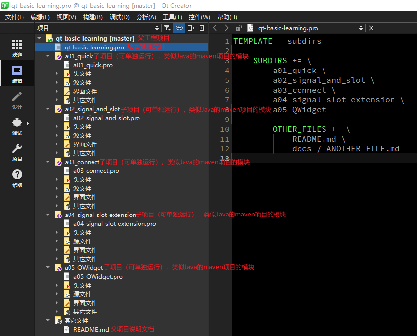
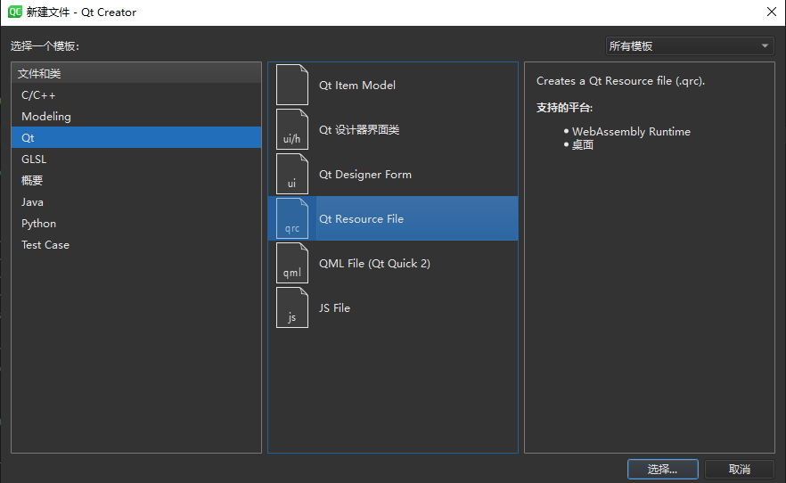
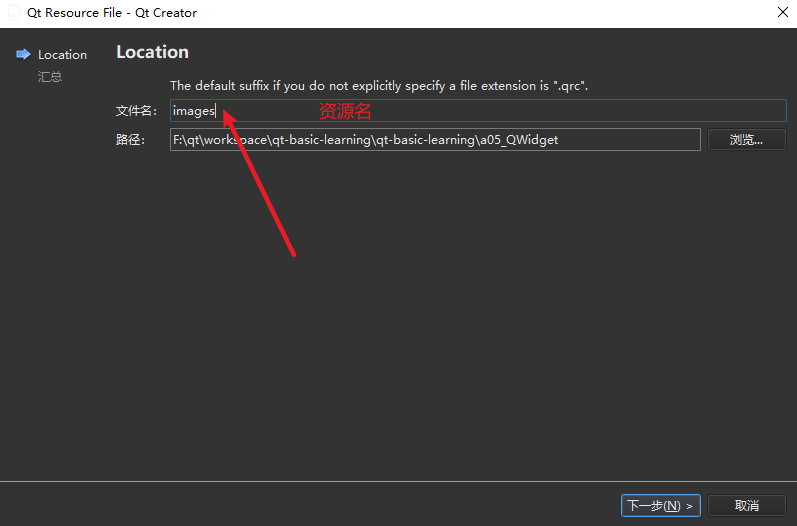
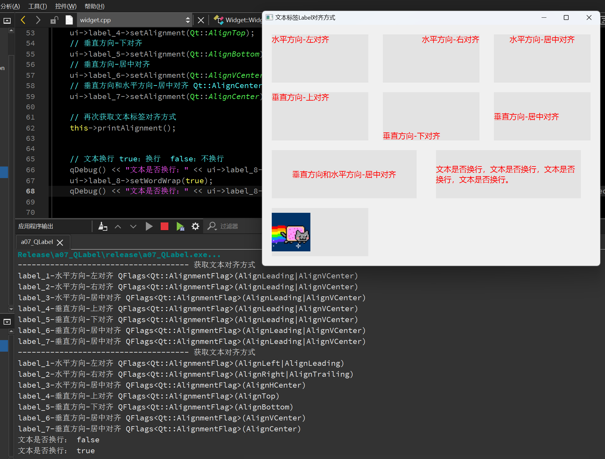
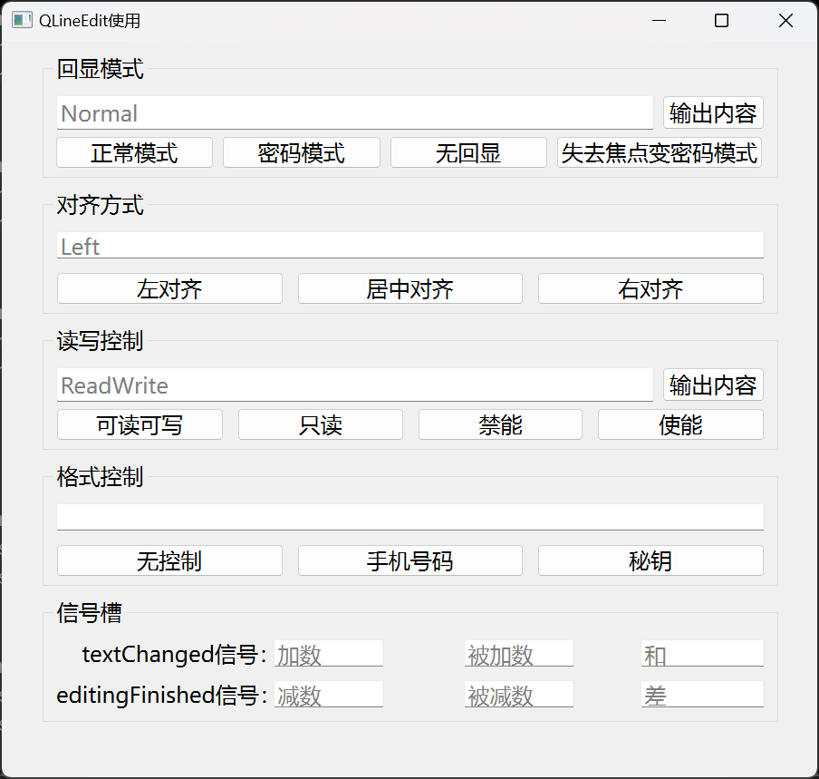
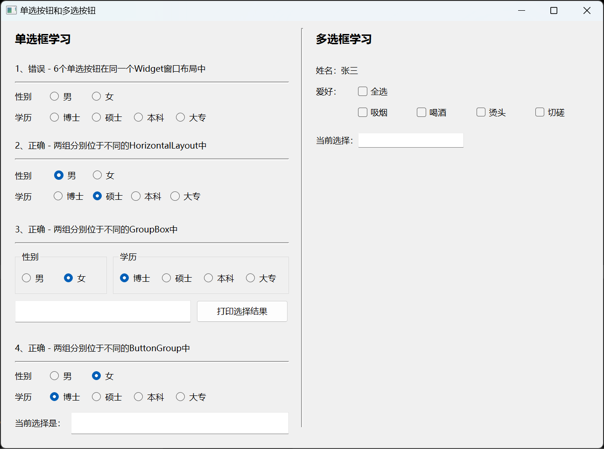
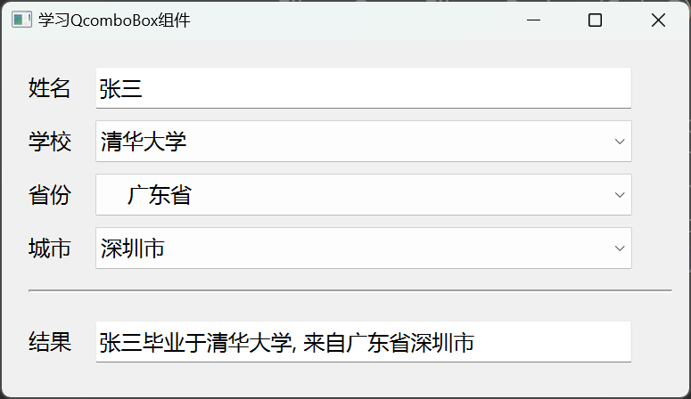

# qt-basic-learning

Qt基础学习笔记。

教程来源：https://blog.csdn.net/bili_mingwang/category_11945281.html

下面每个一级标题对应代码工程中的子项目名称。为了方便浏览，此README.md的内容由每个子项目下的README.md内容合并在一起的，每个标题下的内容都可以在子项目中的README.md中找到，内容是一致的。


<br><br><br>

# a01_quick
快速入门


## 工程项目文件说明




## 编译构建
Qt6之后，官方建议是cmake，但是Qt6还是会支持qmake的，qmake相对来说是比较简单的。

## Qt 中常用的模块
```bash
# QtCore 模块是Qt应用程序的基础，是核心的非图形类。
# 提供了信号与槽的通信机制，并发和多线程，容器，事件系统
Qt Core

# 最重要的GUI模块。图形用户界面 (GUI) 组件的基类。
Qt GUI
  
# 包含基于GUI应用程序的典型小部件类，比如按钮、文本框、标签等
# 在 Qt5 中, 从 Gui 模块中分离出来。
Qt widgets

# 网络模块。用于支持 TCP, UDP, HTTP 通信
Qt Network

# 多媒体模块。音频、视频、广播和相机功能类。  
Qt Multimedia

# Qt Multimedia 的小部件。
Qt Multimedia Widgets

# 数据库模块。用于操作数据库，比如后面会将到的 sqlite、MySQL  
Qt SQL
  
# web引擎模块。用于 web 相关的开发
Qt WebEngine

############################################################
# 以下是 QML 相关的模块
# QML 是什么呢？
# 简单来说，就是使用类似 js 的语法来构建界面，而不是 widget 的方式

# Qt QML模块。用于 QML 和 JavaScript 语言。
Qt QML

# 该模块用于使用 QML2 编写的 GUI 应用程序。用于构建具有自定义用户界面的高度动态应用程序的声明性框架。  
Qt Quick
  
# 提供轻量级 QML 类型，用于为桌面、嵌入式和移动设备创建高性能用户界面。这些类型采用简单的样式架构并且非常高效。
Qt Quick Controls
  
# 用于从 Qt Quick 应用程序创建系统对话框并与之交互的类型。
Qt Quick Dialogs
  
# 用于在 Qt Quick 中安排项目的布局。
Qt Quick Layouts

```


<br><br><br>

# a02_signal_and_slot

## 学习内容

信号和槽（标准信号槽 和 自定义信号槽）


## 标准信号槽

ui拖放按钮，分别是btnMax，btnNormal，btnMin，btnClose

widget.cpp 中设置按钮文本
```c++
ui->btnMax->setText("最大化显示");
ui->btnNormal->setText("正常显示");
ui->btnMin->setText("最小化");
ui->btnClose->setText("关闭窗口");
```

函数 connect() 用于连接`信号`和`槽`

函数格式：`connect(sender, signal, receiver, slot)`
- sender: 发出信号的对象，比如 QpushButton 按钮
- signal: 发出的信号，比如 clicked() 点击操作
- receiver: 接收信号的对象，比如 QWidget 窗口
- slot: 接收信号之后，调用的函数

使用：
```c++
connect(ui->btnMax, SIGNAL(clicked()), this, SLOT(showMaximized()));
connect(ui->btnNormal, SIGNAL(clicked()), this, SLOT(showNormal()));
connect(ui->btnMin, SIGNAL(clicked()), this, SLOT(showMinimized()));
connect(ui->btnClose, SIGNAL(clicked()), this, SLOT(close()));
```

`showMaximized()`，`showNormal()`，`showMinimized()`，`close()` 均为Qt的标准函数


## 自定义信号槽

创建两个类的头文件和源文件，分别是commander.h（指挥官）和 soldier.h（士兵），都需要继承自 QObject类，添加 Q_OBJECT 宏，才能正常使用Qt 的信号和槽机制。

commander.h 声明两个go() 跑的方法，一个有参一个无参（测试信号方法可以重载）

soldier.h 声明两个fight() 战斗的方法，槽函数的返回值和参数，要和信号保持一致

soldier.cpp 实现两个fight()方法
```c++
void Soldier::fight() {
    std::cout << "fight" << std::endl;
}

void Soldier::fight(QString str) {
    std::cout << "fight for " << str.toStdString() <<std::endl;
}
```

创建两个实例
```c++
Commander commander;
Soldier soldier;
```

建立信号和槽的连接
```c++
connect(&commander, SIGNAL(go()), &soldier, SLOT(fight()));
connect(&commander, SIGNAL(go(Qstring)), &soldier, SLOT(fight(Qstring)));
```

发送信号
```c++
commander.go();
commander.go("freedom");
```


<br><br><br>

# a03_connect

## 学习内容

信号和槽要建立连接，本质上是通过 `connect` 函数来连接实现的。但是从写法或者操作上来说，有多种方式，以下总结了 5 种方式：
- SIGNAL/SLOT（Qt4）
- 函数地址（Qt5）
- UI 设计师界面 - 转到槽
- UI 设计师界面 - 信号槽编辑器
- lambda 表达式


## SIGNAL/SLOT（Qt4）
SIGNAL/SLOT（Qt4） 这两个宏，将函数名以及对应的参数，转换为字符串，这是 Qt4 中使用的方式

格式：`connect(sender, SIGNAL(signal()), receiver, SLOT(slot()));`

这种方式，编译器不会做错误检查，即使函数名或者参数写错了，也可以编译通过，这样就把问题留在了运行阶段。

比如：`connect(ui->btnMax, SIGNAL(clicked()), this, SLOT(showMaximized()));`

如果 showMaximized 不小心写成了 showMaximize，点击【构建】菜单->【重新构建】，在【编译输出】窗口并不会报错，而在运行时报错

不推荐使用这种方式：https://github.com/KDE/clazy/blob/1.11/docs/checks/README-connect-by-name.md

## 函数地址（Qt5）
函数地址（Qt5），这种方式，编译时就会对函数类型，参数个数做检查。

格式：`connect(sender, &Sender::signal, receiver, &Receiver::slot);`
- sender：信号发送者
- &Sender::signal：发送的信号
- receiver：信号接收者
- &Receiver::slot：槽函数

比如：`connect(ui->btnNormal, &QPushButton::clicked, this, &QWidget::showNormal);`


## UI设计师界面-鼠标右键，转到槽
在 UI 设计师界面，右键单击 btnMin，然后选择【转到槽…】，弹出窗口，选择 clicked()即可生成并跳转到槽函数，即可在 widget.h 和 widget.cpp 中生成对应的代码，此时会根据按钮的 name 自动生成对应的槽函数

不推荐使用这种方式：https://github.com/KDE/clazy/blob/1.11/docs/checks/README-connect-by-name.md

## UI设计师界面-信号槽编辑器
使用这种方式，实现点击 btnClose 按钮，关闭窗口。

进入到 UI 设计师界面，【View】菜单 ->【视图】->【Signal & Slots Editor】，在打开的信号槽编辑器中，点击绿色的加号+ 就可以连接信号和槽了：

不推荐使用这种方式：https://github.com/KDE/clazy/blob/1.11/docs/checks/README-connect-by-name.md

## Lambda 表达式
修改窗口的标题
```c++
connect(ui->btnSetTitle, &QPushButton::clicked, this, [this]() {
    this->setWindowTitle("[连接信号槽的 5 种方式]");
});
```

## 使用总结

推荐使用`函数地址（Qt5）` 和 lambda 表达式。

connect()连接使用方式在Qt6中变化不大，与Qt5的使用方式一致

- SIGNAL/SLOT（Qt4）
  传统的使用方式，传递的是信号和槽函数的字符串名称，编译时不检查类型和参数，运行时容易出错
- 函数地址（Qt5）<font color="#dd0000">（强烈推荐使用）</font>
  语法简洁，易于阅读；
  没有字符串转换的开销；
  编译时的类型检查，使得连接安全性得到增强；
- UI 设计师界面 - 转到槽
  灵活性不如代码，复杂页面需要通过代码实现；
  如果使用其它ide开发，可能出现问题；
  运行时动态创建和销毁的 UI 元素，使用UI界面设计，会比较困难。
- UI 设计师界面 - 信号槽编辑器
  灵活性不如代码，复杂页面需要通过代码实现；
  如果使用其它ide开发，可能出现问题；
  运行时动态创建和销毁的 UI 元素，使用UI界面设计，会比较困难。
- lambda 表达式<font color="#dd0000">（强烈推荐使用）</font>
  语法简洁，易于阅读；
  没有字符串转换的开销；
  编译时的类型检查，使得连接安全性得到增强；
  可以直接在connect的地方定义一段处理逻辑，特别适合处理简单的，不值得单独定义槽函数的逻辑


<br><br><br>

# a04_signal_slot_extension

## 学习内容

- 如何连接重载的信号和槽
- 一个信号连接多个槽
- 多个信号连接一个槽
- 信号连接信号
- 断开连接 - disconnect

## 如何连接重载的信号和槽

在信号和槽存在重载时，Qt4 和 Qt5 的写法是有区别的：

Qt4 方式: 可以在 SIGNAL/SLOT 中指定函数参数类型，因此写法比较简单。

Qt5 方式: 指定信号和槽时，只能指定函数名，无法向 Qt4 那样指定函数参数类型，需要单独定义函数指针，写法上稍显麻烦。

## 一个信号连接多个槽

```c++
connect(sender, SIGNAL(signal), receiver1, SLOT(fun1()));
connect(sender, SIGNAL(signal), receiver2, SLOT(fun2()));
```
这样，当 signal 这个信号发出时，它连接的 2 个槽函数 fun1，fun2 都会被执行，并且：

Qt4：信号发射时，与之相连接的槽函数的执行顺序是随机的。

Qt5+: 信号发射时，这些槽函数的执行顺序与建立连接的顺序相同。

## 多个信号连接一个槽

```c++
connect(sender, SIGNAL(signal1), receiver, SLOT(fun()));
connect(sender, SIGNAL(signal2), receiver, SLOT(fun()));
```

##信号连接信号

信号不仅可以连接槽，还可以和连接信号，
 
如：`connect(obj1, SIGNAL(signal1), obj2, SIGNAL(signal2));`

这样，当 obj1 发送 signal1 信号时，就会触发 obj2 发送 signal2 信号。

## 断开连接 - disconnect

用于断开信号和槽之间已经建立的连接。disconnect 函数并不常用，因为当一个对象 delete 之后， Qt 自动取消所有连接到这个对象上面的槽。


<br><br><br>

# a05_QWidget

## 学习内容

由于`QWidget`类是所有控件类的父类，并且在`a01_quick`中就已经使用到了，因此需要先来学习QWidget相关技术点。

- 所有窗口类的基类
  Qt中有3个窗口的基类：`QWidget`、`QMainWindow`、`QDialog`；在创建Qt工程时，会让我们选择继承自哪一个窗口类；其中，`QMainWindow`、`QDialog`都是继承自`QWidge`
- 所有控件类的基类
  Qt中的控件类（按钮、输入框、单选框等）也属于窗口类，它们的基类也是`QWidget`
- 可以内嵌到其他窗口的内部，此时需要给其指定父窗口
- 可以作为独立的窗口显示，此时不能给其指定父窗口

基于案例一步步的使用！


## 如何显示QWidget窗口

1、新建一个基于QWidget的子窗口类，类名为`SubWidget`，

2、以创建工程时创建的`Widget`为父类（`widget.cpp`），要显示子窗口`SubWidget`（`subWidget.cpp`），需要在父类`Widget`中调用，即在`widget.cpp`中调用
```c++
#include "widget.h"
#include "ui_widget.h"
#include "subwidget.h"


/**
 * @Author ：谁书-ss
 * @Date ：2023-09-16 15:24
 * @IDE ：Qt Creator
 * @Motto ：ABC(Always Be Coding)
 * <p></p>
 * @Description ：
 * <p></p>
 */

Widget::Widget(QWidget *parent)
    : QWidget(parent)
    , ui(new Ui::Widget) {
    ui->setupUi(this);

    //未指定父窗口，那么这个窗口就是独立的窗口，需要调用其show方法来显示，运行之后，出现两个独立窗口
    //SubWidget* subWidget = new SubWidget();
    //subWidget->setWindowTitle("SubWidget");
    //subWidget->show();

    // 如果指定了父窗口，那么就不需要调用show方法了，因为父窗口显示时，会将其子窗口一起显示出来。
    SubWidget *subWidget = new SubWidget(this);
    subWidget->setWindowTitle("SubWidget");

}

Widget::~Widget() {
    delete ui;
}
```

## 常用的属性和方法

### Qt帮助文档

可以点击`Qt Creator`工具左侧的【帮助】，切换到【索引】，输入QWidget，就可以查看 QWidget 的详细帮助文档，如下：


### 设置窗口属性

位置、大小、标题、图标、资源文件

`widget.h` 头文件
```c++
#ifndef WIDGET_H
#define WIDGET_H

#include <QWidget>


/**
 * @Author ：谁书-ss
 * @Date ：2023-09-16 15:24
 * @IDE ：Qt Creator
 * @Motto ：ABC(Always Be Coding)
 * <p></p>
 * @Description ：
 * <p></p>
 */

QT_BEGIN_NAMESPACE
namespace Ui {
    class Widget;
}
QT_END_NAMESPACE

class Widget : public QWidget {
    Q_OBJECT

public:
    Widget(QWidget *parent = nullptr);
    ~Widget();

public slots:
    void btnGetSize();
    void btnSetSize();
    void btnSetFixedSize();
    void btnSetMinSize();
    void btnSetMaxSize();
    void btnMove();
    void btnSetTitle();
    void btnSetIcon();

private:
    Ui::Widget *ui;
};
#endif // WIDGET_H

```


`widget.cpp` 源文件
```c++
#include "widget.h"
#include "ui_widget.h"

#include "QDebug"

/**
 * @Author ：谁书-ss
 * @Date ：2023-09-16 15:24
 * @IDE ：Qt Creator
 * @Motto ：ABC(Always Be Coding)
 * <p></p>
 * @Description ：
 * <p></p>
 */

Widget::Widget(QWidget *parent)
    : QWidget(parent)
    , ui(new Ui::Widget) {
    ui->setupUi(this);

    //未指定父窗口，那么这个窗口就是独立的窗口，需要调用其show方法来显示，运行之后，出现两个独立窗口
    // SubWidget* subWidget = new SubWidget();
    // subWidget->setWindowTitle("SubWidget");
    // subWidget->show();

    // 如果指定了父窗口，那么就不需要调用show方法了，因为父窗口显示时，会将其子窗口一起显示出来。
    // SubWidget *subWidget = new SubWidget(this);
    // subWidget->setWindowTitle("SubWidget");

    // 获取窗口大小，位置
    connect(ui->btnGetSize, &QPushButton::clicked, this, &Widget::btnGetSize);
    // 设置窗口大小
    connect(ui->btnSetSize, &QPushButton::clicked, this, &Widget::btnSetSize);
    // 设置窗口固定大小
    connect(ui->btnSetFixedSize, &QPushButton::clicked, this, &Widget::btnSetFixedSize);
    // 设置窗口最小大小
    connect(ui->btnSetMinSize, &QPushButton::clicked, this, &Widget::btnSetMinSize);
    // 设置窗口最大大小
    connect(ui->btnSetMaxSize, &QPushButton::clicked, this, &Widget::btnSetMaxSize);
    // 设置窗口移动到：（100,100）
    connect(ui->btnMove, &QPushButton::clicked, this, &Widget::btnMove);
    // 设置窗口标题
    connect(ui->btnSetTitle, &QPushButton::clicked, this, &Widget::btnSetTitle);
    // 设置窗口Icon
    connect(ui->btnSetIcon, &QPushButton::clicked, this, &Widget::btnSetIcon);

}

Widget::~Widget() {
    delete ui;
}

void Widget::btnGetSize() {
    qDebug() << "--------------获取窗口信息---------------";
    QRect rect = this->geometry();
    qDebug() << "左上：" << rect.topLeft();
    qDebug() << "右上：" << rect.topRight();
    qDebug() << "左下：" << rect.bottomLeft();
    qDebug() << "右下：" << rect.bottomRight();
    qDebug() << "宽：" << rect.width();
    qDebug() << "高：" << rect.height();
}
void Widget::btnSetSize() {
    qDebug() << "--------------设置窗口大小---------------";
    this->resize(400, 400);
}
void Widget::btnSetFixedSize() {
    qDebug() << "--------------设置窗口固定大小---------------";
    this->setFixedSize(500, 500);
}
void Widget::btnSetMinSize() {
    qDebug() << "--------------设置窗口最小大小---------------";
    this->setMinimumSize(300, 300);
}
void Widget::btnSetMaxSize() {
    qDebug() << "--------------设置窗口最大大小---------------";
    this->setMaximumSize(600, 600);
}
void Widget::btnMove() {
    qDebug() << "--------------设置窗口移动到：（100,100）---------------";
    this->move(100, 100);
}
void Widget::btnSetTitle() {
    qDebug() << "--------------设置窗口标题---------------";
    this->setWindowTitle("标题05_QWidget");
}
void Widget::btnSetIcon() {
    qDebug() << "--------------设置窗口Icon---------------";
    // 不能用中文
    this->setWindowIcon(QIcon(":/icon/windows_icon.ico"));
}

```

### 图标、资源文件的使用

项目右键 > 添加新文件。如下图所示：


QT > Qt Resource File。如下图所示：


`文件名`不是具体导入的图片名或视频文件名称。这里的`文件名`相当于一个文件夹的名称，而文件夹下可以有多张图片或视频文件，所以这里的`文件名`其实就是一个资源文件的分组名。如下图所示：


点击下一步；点击完成之后，进入到资源编辑页面。如下图所示：


如果没有出现上面的资源编辑页面，就进行以下操作。如下图所示：


添加资源文件（图片、视频），操作完之后，记得`Ctrl + S`保存


查看预览资源


<br><br><br>

# a06_QPushButton

## 学习内容

`QPushButton`是Qt中的按钮，通常用于用户的点击，然后执行相应操作。

- 字体、字体颜色、Icon
- 按钮样式
- 按钮事件：按下、抬起

## 案例

**效果**


**代码**

`widget.h` 头文件
```c++
#ifndef WIDGET_H
#define WIDGET_H

#include <QWidget>

/**
 * @Author ：谁书-ss
 * @Date ：2023-11-30 12:55
 * @IDE ：Qt Creator
 * @Motto ：ABC(Always Be Coding)
 * <p></p>
 * @Description ：
 * <p></p>
 */

QT_BEGIN_NAMESPACE
namespace Ui {
class Widget;
}
QT_END_NAMESPACE

class Widget : public QWidget
{
    Q_OBJECT

public:
    Widget(QWidget *parent = nullptr);
    ~Widget();

private slots:
    void startStopButton();
    void connectButton();
    void signalButtonClicked();
    void signalButtonPressed();
    void signalButtonReleased();

private:
    Ui::Widget *ui;
};
#endif // WIDGET_H

```

`widget.cpp` 源文件
```c++
#include "widget.h"
#include "ui_widget.h"

#include "QDebug"

/**
 * @Author ：谁书-ss
 * @Date ：2023-11-30 12:55
 * @IDE ：Qt Creator
 * @Motto ：ABC(Always Be Coding)
 * <p></p>
 * @Description ：
 * <p></p>
 */

Widget::Widget(QWidget *parent)
    : QWidget(parent)
    , ui(new Ui::Widget)
{
    ui->setupUi(this);

    // 启动、停止
    this->startStopButton();
    connect(ui->startStopButton, &QPushButton::clicked, this, &Widget::startStopButton);
    // 连接 禁止
    ui->sendCommandButton->setEnabled(false);
    connect(ui->connectButton, &QPushButton::clicked, this, &Widget::connectButton);
    // 样式
    ui->styleButton->setStyleSheet("color:rgb(255, 0, 0);background-color: qlineargradient(spread:pad, x1:0, y1:0, x2:1, y2:0, stop:0 rgba(0, 0, 0, 255), stop:1 rgba(255, 255, 255, 255));");
    // 信号：按下、抬起
    connect(ui->signalButton, &QPushButton::clicked, this, &Widget::signalButtonClicked);
    connect(ui->signalButton, &QPushButton::pressed, this, &Widget::signalButtonPressed);
    connect(ui->signalButton, &QPushButton::released, this, &Widget::signalButtonReleased);
}

Widget::~Widget()
{
    delete ui;
}

void Widget::startStopButton() {
    QString  btnText = ui->startStopButton->text();

    if(btnText == "启动") {
        // 设置文本和字体
        ui->startStopButton->setText("停止");
        ui->startStopButton->setFont(QFont("黑体", 16));
        // 设置图标
        ui->startStopButton->setIcon(QIcon(":/files/stop.png"));
        ui->startStopButton->setIconSize(QSize(48, 48));
    } else {
        ui->startStopButton->setText("启动");
        ui->startStopButton->setFont(QFont("黑体", 12));
        ui->startStopButton->setIcon(QIcon(":/files/start.png"));
        ui->startStopButton->setIconSize(QSize(48, 48));
    }
}

void Widget::connectButton() {
    QString s = ui->connectButton->text();
    if(s == "断开连接") {
        ui->connectButton->setText("连接");
        ui->sendCommandButton->setEnabled(false);
    } else {
        ui->connectButton->setText("断开连接");
        ui->sendCommandButton->setEnabled(true);
    }
}

// 按钮抬起时，发射clicked信号
void Widget::signalButtonClicked() {
    qDebug() << "Clicked。。。";
}
// 按钮按下时，发射pressed信号
void Widget::signalButtonPressed() {
    qDebug() << "Pressed。。。";
}
// 按钮抬起时，发射released信号
void Widget::signalButtonReleased() {
    qDebug() << "Released。。。";
}


```


<br><br><br>

# a07_QLabel

## 学习内容

`QLabel`是Qt中的标签类，通常用于显示提示性的文本，也可以显示图像


## 属性和方法

**效果**



`widget.h` 头文件
```c++
#ifndef WIDGET_H
#define WIDGET_H

#include <QWidget>


/**
 * @Author ：谁书-ss
 * @Date ：2023-12-01 22:07
 * @IDE ：Qt Creator
 * @Motto ：ABC(Always Be Coding)
 * <p></p>
 * @Description ：
 * <p></p>
 */

QT_BEGIN_NAMESPACE
namespace Ui {
class Widget;
}
QT_END_NAMESPACE

class Widget : public QWidget
{
    Q_OBJECT

public:
    Widget(QWidget *parent = nullptr);
    ~Widget();
    void printAlignment();

private:
    Ui::Widget *ui;
};
#endif // WIDGET_H

```

`widget.cpp` 源文件
```c++
#include "widget.h"
#include "ui_widget.h"

#include "QDebug"

/**
 * @Author ：谁书-ss
 * @Date ：2023-12-01 22:07
 * @IDE ：Qt Creator
 * @Motto ：ABC(Always Be Coding)
 * <p></p>
 * @Description ：
 * <p></p>
 */

Widget::Widget(QWidget *parent)
    : QWidget(parent)
    , ui(new Ui::Widget) {
    ui->setupUi(this);
    this->setWindowTitle("文本标签Label对齐方式");

    // 设置样式
    ui->label_1->setStyleSheet("color:rgb(255, 0, 0);background-color:rgb(227, 227, 227);");
    ui->label_2->setStyleSheet("color:rgb(255, 0, 0);background-color:rgb(227, 227, 227);");
    ui->label_3->setStyleSheet("color:rgb(255, 0, 0);background-color:rgb(227, 227, 227);");
    ui->label_4->setStyleSheet("color:rgb(255, 0, 0);background-color:rgb(227, 227, 227);");
    ui->label_5->setStyleSheet("color:rgb(255, 0, 0);background-color:rgb(227, 227, 227);");
    ui->label_6->setStyleSheet("color:rgb(255, 0, 0);background-color:rgb(227, 227, 227);");
    ui->label_7->setStyleSheet("color:rgb(255, 0, 0);background-color:rgb(227, 227, 227);");
    ui->label_8->setStyleSheet("color:rgb(255, 0, 0);background-color:rgb(227, 227, 227);");
    ui->label_9->setStyleSheet("color:rgb(255, 0, 0);background-color:rgb(227, 227, 227);");
    // 获取和设置按钮上显示的文本
    ui->label_1->setText("水平方向-左对齐");
    ui->label_2->setText("水平方向-右对齐");
    ui->label_3->setText("水平方向-居中对齐");
    ui->label_4->setText("垂直方向-上对齐");
    ui->label_5->setText("垂直方向-下对齐");
    ui->label_6->setText("垂直方向-居中对齐");
    ui->label_7->setText("垂直方向和水平方向-居中对齐");
    ui->label_8->setText("文本是否换行，文本是否换行，文本是否换行，文本是否换行。");
    ui->label_9->setText("设置图像");

    // 获取文本标签对齐方式
    this->printAlignment();

    // 水平方向-左对齐
    ui->label_1->setAlignment(Qt::AlignLeft);
    // 水平方向-右对齐
    ui->label_2->setAlignment(Qt::AlignRight);
    // 水平方向-居中对齐
    ui->label_3->setAlignment(Qt::AlignHCenter);
    // 垂直方向-上对齐
    ui->label_4->setAlignment(Qt::AlignTop);
    // 垂直方向-下对齐
    ui->label_5->setAlignment(Qt::AlignBottom);
    // 垂直方向-居中对齐
    ui->label_6->setAlignment(Qt::AlignVCenter);
    // 垂直方向和水平方向-居中对齐 Qt::AlignCenter（AlignVCenter | AlignHCenter）
    ui->label_7->setAlignment(Qt::AlignCenter);

    // 再次获取文本标签对齐方式
    this->printAlignment();


    // 文本换行 true：换行  false：不换行
    qDebug() << "文本是否换行：" << ui->label_8->wordWrap();
    ui->label_8->setWordWrap(true);
    qDebug() << "文本是否换行：" << ui->label_8->wordWrap();


    // 图像
    QPixmap pix(":/files/cat.png");
    ui->label_9->setPixmap(pix);

}

Widget::~Widget() {
    delete ui;
}

void Widget::printAlignment() {
    qDebug() << "------------------------------------- 获取文本对齐方式";
    auto localAlignment1 = ui->label_1->alignment();
    auto localAlignment2 = ui->label_2->alignment();
    auto localAlignment3 = ui->label_3->alignment();
    auto localAlignment4 = ui->label_4->alignment();
    auto localAlignment5 = ui->label_5->alignment();
    auto localAlignment6 = ui->label_6->alignment();
    auto localAlignment7 = ui->label_7->alignment();
    qDebug() << "label_1-水平方向-左对齐" << localAlignment1;
    qDebug() << "label_2-水平方向-右对齐" << localAlignment2;
    qDebug() << "label_3-水平方向-居中对齐" << localAlignment3;
    qDebug() << "label_4-垂直方向-上对齐" << localAlignment4;
    qDebug() << "label_5-垂直方向-下对齐" << localAlignment5;
    qDebug() << "label_6-垂直方向-居中对齐" << localAlignment6;
    qDebug() << "label_7-垂直方向-居中对齐" << localAlignment7;
}

```


<br><br><br>
# a08_QLineEdit

## 学习内容

`QLineEdit`是Qt中的文本框，准确地说是单行文本框，通常用于接受用户的输入。

`QLineEdit` 中内置的信号
- cursorPositionChanged(int, int)
- editingFinished()
- inputRejected()
- returnPressed()
- selectionChanged()
- textChanged(QString)
- textEdited(QString)


## 属性和方法

**效果**




`widget.h` 头文件
```c++
#ifndef WIDGET_H
#define WIDGET_H

#include <QWidget>


/**
 * @Author ：谁书-ss
 * @Date ：2023-12-03 14:56
 * @IDE ：Qt Creator
 * @Motto ：ABC(Always Be Coding)
 * <p></p>
 * @Description ：
 * <p></p>
 */

QT_BEGIN_NAMESPACE
namespace Ui {
class Widget;
}
QT_END_NAMESPACE

class Widget : public QWidget
{
    Q_OBJECT

public:
    Widget(QWidget *parent = nullptr);
    ~Widget();

private slots:
    // 回显模式
    void btnEchoNormal();
    void btnEchoPassword();
    void btnEchoNoEcho();
    void btnEchoPasswordEchoOnEdit();
    void btnEchoPrint();
    // 对齐方式
    void btnAlignLeft();
    void btnAlignCenter();
    void btnAlignRight();
    // 读写控制
    void btnAccessReadWrite();
    void btnAccessReadOnly();
    void btnAccessDisabled();
    void btnAccessEnabled();
    void btnAccessPrint();
    // 格式控制
    void btnMaskNone();
    void btnMaskPhone();
    void btnMaskLicense();
    // 信号槽
    void leAdd1_TextChanged(const QString &arg1);
    void leAdd2_TextChanged(const QString &arg1);
    void leSub1_EditingFinished();
    void leSub2_EditingFinished();


private:
    Ui::Widget *ui;
};
#endif // WIDGET_H

```

`widget.cpp` 源文件
```c++
#include "widget.h"
#include "ui_widget.h"
#include "QDebug"
#include "qvalidator.h"

#include "QMessageBox"
#include "QTime"
#include "QPixmap"

/**
 * @Author ：谁书-ss
 * @Date ：2023-12-03 14:56
 * @IDE ：Qt Creator
 * @Motto ：ABC(Always Be Coding)
 * <p></p>
 * @Description ：
 * <p></p>
 */

Widget::Widget(QWidget *parent)
    : QWidget(parent)
    , ui(new Ui::Widget) {
    ui->setupUi(this);
    this->setWindowTitle("QLineEdit使用");

    // 默认 正常模式
    btnEchoNormal();
    // 默认 左对齐
    btnAlignLeft();
    // 默认 可读可写
    btnAccessReadWrite();
    // 默认 无格式控制
    btnMaskNone();
    // 设置校验,只允许文本框中输入整数
    ui->leAdd1->setValidator(new QIntValidator(this));
    ui->leAdd1->setPlaceholderText("加数");
    ui->leAdd2->setValidator(new QIntValidator(this));
    ui->leAdd2->setPlaceholderText("被加数");
    ui->leAddResult->setPlaceholderText("和");
    // 设置校验,只允许文本框中输入整数
    ui->leSub1->setValidator(new QIntValidator(this));
    ui->leSub1->setPlaceholderText("减数");
    ui->leSub2->setValidator(new QIntValidator(this));
    ui->leSub2->setPlaceholderText("被减数");
    ui->leSubResult->setPlaceholderText("差");


    // 1、回显模式
    connect(ui->btnEchoNormal, &QPushButton::clicked, this, &Widget::btnEchoNormal);
    connect(ui->btnEchoPassword, &QPushButton::clicked, this, &Widget::btnEchoPassword);
    connect(ui->btnEchoNoEcho, &QPushButton::clicked, this, &Widget::btnEchoNoEcho);
    connect(ui->btnEchoPasswordEchoOnEdit, &QPushButton::clicked, this, &Widget::btnEchoPasswordEchoOnEdit);
    connect(ui->btnEchoPrint, &QPushButton::clicked, this, &Widget::btnEchoPrint);
    // 2、对齐方式
    connect(ui->btnAlignLeft, &QPushButton::clicked, this, &Widget::btnAlignLeft);
    connect(ui->btnAlignCenter, &QPushButton::clicked, this, &Widget::btnAlignCenter);
    connect(ui->btnAlignRight, &QPushButton::clicked, this, &Widget::btnAlignRight);
    // 3、读写控制
    connect(ui->btnAccessReadWrite, &QPushButton::clicked, this, &Widget::btnAccessReadWrite);
    connect(ui->btnAccessReadOnly, &QPushButton::clicked, this, &Widget::btnAccessReadOnly);
    connect(ui->btnAccessDisabled, &QPushButton::clicked, this, &Widget::btnAccessDisabled);
    connect(ui->btnAccessEnabled, &QPushButton::clicked, this, &Widget::btnAccessEnabled);
    connect(ui->btnAccessPrint, &QPushButton::clicked, this, &Widget::btnAccessPrint);
    // 4、格式控制
    connect(ui->btnMaskNone, &QPushButton::clicked, this, &Widget::btnMaskNone);
    connect(ui->btnMaskPhone, &QPushButton::clicked, this, &Widget::btnMaskPhone);
    connect(ui->btnMaskLicense, &QPushButton::clicked, this, &Widget::btnMaskLicense);
    // 5、信号槽演示
    connect(ui->leAdd1, &QLineEdit::textChanged, this, &Widget::leAdd1_TextChanged);
    connect(ui->leAdd2, &QLineEdit::textChanged, this, &Widget::leAdd1_TextChanged);
    connect(ui->leSub1, &QLineEdit::editingFinished, this, &Widget::leSub1_EditingFinished);
    connect(ui->leSub2, &QLineEdit::editingFinished, this, &Widget::leSub2_EditingFinished);
}

Widget::~Widget() {
    delete ui;
}

// 1、回显模式
// 1.1 正常模式
void Widget::btnEchoNormal() {
    ui->leEcho->clear();
    ui->leEcho->setEchoMode(QLineEdit::Normal);
    ui->leEcho->setPlaceholderText("Normal");
}
// 1.2 密码模式
void Widget::btnEchoPassword() {
    ui->leEcho->clear();
    ui->leEcho->setEchoMode(QLineEdit::Password);
    ui->leEcho->setPlaceholderText("Password");
}
// 1.3 不回显
void Widget::btnEchoNoEcho() {
    ui->leEcho->clear();
    ui->leEcho->setEchoMode(QLineEdit::NoEcho);
    ui->leEcho->setPlaceholderText("NoEcho");
}
// 1.4 失去焦点时为密码模式
void Widget::btnEchoPasswordEchoOnEdit() {
    ui->leEcho->clear();
    ui->leEcho->setEchoMode(QLineEdit::PasswordEchoOnEdit);
    ui->leEcho->setPlaceholderText("PasswordEchoOnEdit");
}
// 输出内容
void Widget::btnEchoPrint() {
    QMessageBox::information(this, "回显模式", ui->leEcho->text());
}

// 2、对齐方式
// 2.1 左对齐
void Widget::btnAlignLeft() {
    ui->leAlignment->setAlignment(Qt::AlignLeft);
    ui->leAlignment->setPlaceholderText("Left");
}
// 2.2 居中对齐
void Widget::btnAlignCenter() {
    ui->leAlignment->setAlignment(Qt::AlignCenter);
    ui->leAlignment->setPlaceholderText("Center");
}
// 2.3 右对齐
void Widget::btnAlignRight() {
    ui->leAlignment->setAlignment(Qt::AlignRight);
    ui->leAlignment->setPlaceholderText("Right");
}

// 3、读写控制
// 3.1 可读可写
void Widget::btnAccessReadWrite() {
    ui->leAccess->setReadOnly(false);
    ui->leAccess->setPlaceholderText("ReadWrite");
}
// 3.2 只读
void Widget::btnAccessReadOnly() {
    ui->leAccess->setReadOnly(true);
    ui->leAccess->setPlaceholderText("ReadOnly");
}
// 3.3 禁能
void Widget::btnAccessDisabled() {
    ui->leAccess->setEnabled(false);
    ui->leAccess->setPlaceholderText("Disabled");
}
// 3.4 使能
void Widget::btnAccessEnabled() {
    ui->leAccess->setEnabled(true);
    ui->leAccess->setPlaceholderText("Enabled");
}
// 输出内容
void Widget::btnAccessPrint() {
    QMessageBox::information(this, "文本框演示", ui->leAccess->text());
}

// 4、格式控制
// 4.1 无格式
void Widget::btnMaskNone() {
    ui->leMask->setInputMask("");
}
// 4.2 电话号码格式
void Widget::btnMaskPhone() {
    // ;# - 表示格式字符串结束，并且未输入时显示#
    ui->leMask->setInputMask("99999999999;#");
}
// 4.3 密钥格式
void Widget::btnMaskLicense() {
    ui->leMask->setInputMask(">AAAAA-AAAAA-AAAAA-AAAAA-AAAAA;*");
}

// 5、信号槽演示
// 5.1 textChanged信号 - 实现自动计算加法结果
void Widget::leAdd1_TextChanged(const QString &arg1) {
    int sum = arg1.toInt() + ui->leAdd2->text().toInt();
    ui->leAddResult->setText(QString::number(sum));
}
void Widget::leAdd2_TextChanged(const QString &arg1) {
    int sum = arg1.toInt() + ui->leAdd1->text().toInt();
    ui->leAddResult->setText(QString::number(sum));
}
// 5.2 editingFinished信号 - 实现自动计算减法结果
void Widget::leSub1_EditingFinished() {
    int result = ui->leSub1->text().toInt() - ui->leSub2->text().toInt();
    ui->leSubResult->setText(QString::number(result));
}
void Widget::leSub2_EditingFinished() {
    int result = ui->leSub1->text().toInt() - ui->leSub2->text().toInt();
    ui->leSubResult->setText(QString::number(result));
}

```


<br><br><br>

# a09_QRadioButton_and_QCheckBox

## 学习内容

- Qt中的单选按钮类是`QRadioButton`
  它是一个可以切换选中（checked）或未选中（unchecked）状态的单选按钮，单选按钮常用在 “多选一” 的场景，也就是说，在一组单选按钮中，一次只能选中一个单选按钮。比如性别中的 “男女” 二选一，学历中的 “博士/硕士/本科/其他” 四选一，等等。
- Qt中的复选按钮类是`QCheckBox`
  它和单选按钮很相似，单选按钮常用在 “多选一” 的场景，而复选按钮常用在 "多选多"的场景比如喜欢的水果选项中，可以在 “苹果/桃/梨/橘子/香蕉” 中选择多个。


## 属性和方法

### 文本
这两个是其父类 QAbstractButton 中的属性和方法，因此 QPushButton、QRadioButton、QCheckBox 都具有该属性
```c++
// 获取和设置显示的文本
QString text() const
void setText(const QString &text)
```

### 状态

单选按钮，有选中（Checked）和非选中（UnChecked）这两种状态；
```c++
// 获取和设置单选按钮的选中状态
bool isChecked() const
void setChecked(bool)
```

复选按钮可以有三种状态：
- Qt::Checked 选中
- Qt::Unchecked 非选中
- Qt::PartiallyChecked 半选中，比如当一组复选按钮中只选择了部分时，可以设置其父项为半选状态，如下

可以设置复选按钮，是否支持三态，如下：
```c++
// 用于获取和设置是否支持三态
bool isTristate() const
void setTristate(bool y = true)
```

如果不支持三态，使用方法单选按钮一样，只有选中（Checked）和非选中（unchecked）两种状态，没有半选中状态（ PartiallyChecked ）

此时可以使用如下获取复选按钮是否选中：
```c++
// 获取和设置复选按钮是否选中：checked/unchecked
bool isChecked() const
void setChecked(bool)
```

如果支持三态，除了选中（Checked）和非选中（unchecked）两种状态，还有半选中状态（ PartiallyChecked ）

此时可以使用如下获取复选按钮的状态：
```c++
// 设置和获取复选按钮的状态
Qt::CheckState checkState() const
void setCheckState(Qt::CheckState state)
```

### 自动排他

单选按钮实现的是 “多选一”，因此单选按钮的该属性默认是使能的，复选按钮同样可以设置是否自动排他
```c++
// 获取和设置自动排他
bool autoExclusive() const
void setAutoExclusive(bool)
```

## 案例

**效果**



`widget.h` 头文件
```c++
#ifndef WIDGET_H
#define WIDGET_H

#include <QWidget>
#include <QButtonGroup>

/**
 * @Author ：谁书-ss
 * @Date ：2023-12-03 17:09
 * @IDE ：Qt Creator
 * @Motto ：ABC(Always Be Coding)
 * <p></p>
 * @Description ：
 * <p></p>
 */

QT_BEGIN_NAMESPACE
namespace Ui {
class Widget;
}
QT_END_NAMESPACE

class Widget : public QWidget
{
    Q_OBJECT

public:
    Widget(QWidget *parent = nullptr);
    ~Widget();

private slots:
    void btnGetSelectionClicked();
    void onRadioButtonClicked();
    void cbAllClicked();
    void onStateChanged();

private:
    Ui::Widget *ui;
    QButtonGroup* buttonGroup;
    QButtonGroup* buttonGroup2;
};
#endif // WIDGET_H

```

`widget.cpp` 源文件
```c++
#include "widget.h"
#include "ui_widget.h"


/**
 * @Author ：谁书-ss
 * @Date ：2023-12-03 17:09
 * @IDE ：Qt Creator
 * @Motto ：ABC(Always Be Coding)
 * <p></p>
 * @Description ：
 * <p></p>
 */

Widget::Widget(QWidget *parent)
    : QWidget(parent)
    , ui(new Ui::Widget)
{
    ui->setupUi(this);
    this->setWindowTitle("单选按钮和多选按钮");

    // =========================================================== 单选组件
    // 第二组
    ui->rb2_1->setChecked(true);
    ui->rb2_4->setChecked(true);
    // 第三组
    ui->rb3_2->setChecked(true);
    ui->rb3_3->setChecked(true);
    connect(ui->btn3, &QPushButton::clicked, this, &Widget::btnGetSelectionClicked);
    // 第四组
    buttonGroup = new QButtonGroup(this);
    buttonGroup->addButton(ui->rb4_1, 1);
    buttonGroup->addButton(ui->rb4_2, 2);
    ui->rb4_2->setChecked(true);
    buttonGroup2 = new QButtonGroup(this);
    buttonGroup2->addButton(ui->rb4_3, 3);
    buttonGroup2->addButton(ui->rb4_4, 4);
    buttonGroup2->addButton(ui->rb4_5, 5);
    buttonGroup2->addButton(ui->rb4_6, 6);
    ui->rb4_3->setChecked(true);

    connect(ui->rb4_1, &QRadioButton::clicked, this, &Widget::onRadioButtonClicked);
    connect(ui->rb4_2, &QRadioButton::clicked, this, &Widget::onRadioButtonClicked);
    connect(ui->rb4_3, &QRadioButton::clicked, this, &Widget::onRadioButtonClicked);
    connect(ui->rb4_4, &QRadioButton::clicked, this, &Widget::onRadioButtonClicked);
    connect(ui->rb4_5, &QRadioButton::clicked, this, &Widget::onRadioButtonClicked);
    connect(ui->rb4_6, &QRadioButton::clicked, this, &Widget::onRadioButtonClicked);


    // =========================================================== 多选组件
    // 这里需要将“全选”按钮的状态设置为false
    // 鼠标点击时，只允许在checked和unchecked之间切换，不允许出现半选状态
    ui->cbAll->setTristate(false);
    // 多选按
    connect(ui->cbAll, &QCheckBox::stateChanged, this, &Widget::cbAllClicked);
    // 5个复选按钮对应同一个槽函数
    connect(ui->cb1, &QCheckBox::stateChanged, this, &Widget::onStateChanged);
    connect(ui->cb2, &QCheckBox::stateChanged, this, &Widget::onStateChanged);
    connect(ui->cb3, &QCheckBox::stateChanged, this, &Widget::onStateChanged);
    connect(ui->cb4, &QCheckBox::stateChanged, this, &Widget::onStateChanged);


}

Widget::~Widget()
{
    delete ui;
}

void Widget::btnGetSelectionClicked(){
    QString s;

    if(ui->rb3_1->isChecked()) {
        s += ui->rb3_1->text();
    } else if(ui->rb3_2->isChecked()) {
        s += ui->rb3_2->text();
    }

    if(ui->rb3_3->isChecked()) {
        s += ui->rb3_3->text();
    } else if(ui->rb3_4->isChecked()) {
        s += ui->rb3_4->text();
    } else if(ui->rb3_5->isChecked()) {
        s += ui->rb3_5->text();
    } else if(ui->rb3_6->isChecked()) {
        s += ui->rb3_6->text();
    }

    ui->te3->setText(s);
}

void Widget::onRadioButtonClicked()
{
    QString s;

    int checkedGenderId = buttonGroup->checkedId();
    if(checkedGenderId == 1) {
        s += "男";
    } else if(checkedGenderId == 2) {
        s += "女";
    }

    int checkedEduId = buttonGroup2->checkedId();
    if(checkedEduId == 3) {
        s += "博士";
    } else if(checkedEduId == 4) {
        s += "硕士";
    } else if(checkedEduId == 5) {
        s += "本科";
    } else if(checkedEduId == 6) {
        s += "大专";
    } else if(checkedEduId == 6) {
        s += "其他";
    }

    ui->te4->setText(s);
}

void Widget::cbAllClicked() {
    Qt::CheckState state = ui->cbAll->checkState();
    if(state == Qt::Checked) {
        ui->cb1->setChecked(true);
        ui->cb2->setChecked(true);
        ui->cb3->setChecked(true);
        ui->cb4->setChecked(true);
    } else if(state == Qt::Unchecked) {
        ui->cb1->setChecked(false);
        ui->cb2->setChecked(false);
        ui->cb3->setChecked(false);
        ui->cb4->setChecked(false);
    } else {

    }
}

void Widget::onStateChanged() {
    QString s;

    int cb1Checked = ui->cb1->isChecked();
    int cb2Checked = ui->cb2->isChecked();
    int cb3Checked = ui->cb3->isChecked();
    int cb4Checked = ui->cb4->isChecked();

    if(cb1Checked && cb2Checked && cb3Checked && cb4Checked) {
        // 全部选中
        ui->cbAll->setCheckState(Qt::Checked);
    } else if (!(cb1Checked || cb2Checked || cb3Checked || cb4Checked)) {
        // 全部未选中
        ui->cbAll->setCheckState(Qt::Unchecked);
    } else {
        // 部分选中
        ui->cbAll->setCheckState(Qt::PartiallyChecked);
    }

    if(cb1Checked) {
        s += ui->cb1->text() += " ";
    }
    if(cb2Checked) {
        s += ui->cb2->text() += " ";
    }
    if(cb3Checked) {
        s += ui->cb3->text() += " ";
    }
    if(cb4Checked) {
        s += ui->cb4->text() += " ";
    }

    ui->leResult->setText(s);
}

```


<br><br><br>

# a10_QComboBox

## 学习内容

Qt中的组合框是集 按钮和下拉列表于一体的控件，它占用的屏幕空间很小，对应的类是`QComboBox`


## 属性和方法

### 文本

当前组合框中当前项的索引和文本
```c++
// 获取当前条目的索引和文本
int currentIndex() const
QString currentText() const

// 获取和设置指定索引条目的文本    
QString itemText(int index) const
void setItemText(int index, const QString &text)
```


### 图标

给条目添加图标

```c++
// 获取和设置对应索引条目的图标
QIcon itemIcon(int index) const
void setItemIcon(int index, const QIcon &icon)
```


### 插入和删除

向组合框`QComboBox`中插入和删除项目

**新增条目：可以一次新增一个条目，也可以一次新增多个条目**

```c++
// 一次新增一个条目
void addItem(const QString &text, const QVariant &userData = QVariant())
void addItem(const QIcon &icon, const QString &text, const QVariant &userData = QVariant())
    
// 一次新增多个条目    
void addItems(const QStringList &texts)
```

**插入条目：可以一次插入一个条目，也可以一次插入多个条目**

```c++
// 一次插入一个条目
void insertItem(int index, const QString &text, const QVariant &userData = QVariant())
void insertItem(int index, const QIcon &icon, const QString &text, const QVariant &userData = QVariant())

// 一次插入一个条目
void insertItems(int index, const QStringList &list)
```

**插入策略：在插入条目时，还可以指定插入的策略**

```c++
// 获取和设置插入策略
QComboBox::InsertPolicy insertPolicy() const
void setInsertPolicy(QComboBox::InsertPolicy policy)
```

常用的插入策略有：

- QComboBox::NoInsert 不插入
- QComboBox::InsertAtTop 作为第一条条目插入（替换原第一条条目）
- QComboBox::InsertAtCurrent 替换当前条目
- QComboBox::InsertAtBottom 在最后一个条目之后插入
- QComboBox::InsertAfterCurrent 在当前条目之后插入
- QComboBox::InsertBeforeCurrent 在当前条目之前插入
- QComboBox::InsertAlphabetically 按英文字母顺序插入

**插入分隔符：用于在条目之间插入一条分隔符**

```c++
// 在指定索引位置处插入分隔符
void insertSeparator(int index)
```

**删除条目：删除指定索引位置的条目**

```c++
// 删除指定索引的条目
void removeItem(int index)
```


### 信号槽

```c++
// 当前选中的条目变化时，会发射这两个信号
void currentIndexChanged(int index)
void currentTextChanged(const QString &text)
```

## 案例

**效果**



`widget.h` 头文件
```c++
#ifndef WIDGET_H
#define WIDGET_H

#include <QWidget>


/**
 * @Author ：谁书-ss
 * @Date ：2023-12-05 16:24
 * @IDE ：Qt Creator
 * @Motto ：ABC(Always Be Coding)
 * <p></p>
 * @Description ：
 * <p></p>
 */

QT_BEGIN_NAMESPACE
namespace Ui {
class Widget;
}
QT_END_NAMESPACE

class Widget : public QWidget
{
    Q_OBJECT

public:
    Widget(QWidget *parent = nullptr);
    ~Widget();

private slots:
    void onCboUniversityChanged(int index);
    void onCboProvinceChanged(int index);
    void onCboCityChanged(int index);
    void onLineEditChanged();

private:
    Ui::Widget *ui;
};
#endif // WIDGET_H

```

`widget.cpp` 源文件
```c++
#include "widget.h"
#include "ui_widget.h"


/**
 * @Author ：谁书-ss
 * @Date ：2023-12-05 16:24
 * @IDE ：Qt Creator
 * @Motto ：ABC(Always Be Coding)
 * <p></p>
 * @Description ：
 * <p></p>
 */

QStringList gdCityList = {"广州市", "深圳市", "珠海市", "东莞市"};
QStringList zjCityList = {"杭州市", "宁波市", "温州市", "绍兴市"};
QStringList sdCityList = {"济南市", "青岛市", "烟台市", "威海市"};
QStringList hbCityList = {"石家庄市", "保定市", "廊坊市", "衡水市"};
QStringList nmCityList = {"呼和浩特市", "包头市", "呼伦贝尔市", "赤峰市"};
QStringList hnCityList = {"郑州市", "新乡市", "鹤壁市", "安阳市", "濮阳市"};

Widget::Widget(QWidget *parent)
    : QWidget(parent)
    , ui(new Ui::Widget) {
    ui->setupUi(this);
    this->setWindowTitle("学习QcomboBox组件");

    // 添加大学
    ui->cboUniversity->addItem("清华大学");
    ui->cboUniversity->addItem("北京大学");
    ui->cboUniversity->addItem("中国人民大学");

    // 添加省份
    ui->cboProvince->addItem("广东省");
    ui->cboProvince->addItem("浙江省");
    ui->cboProvince->addItem("山东省");
    ui->cboProvince->addItem("河北省");
    ui->cboProvince->addItem("内蒙古自治区省");
    ui->cboProvince->addItem("河南省");

    // 为省份条目添加图标
    ui->cboProvince->setItemIcon(0, QIcon(":/icon/gd.ico"));
    ui->cboProvince->setItemIcon(1, QIcon(":/icon/zj.ico"));
    ui->cboProvince->setItemIcon(2, QIcon(":/icon/sd.ico"));
    ui->cboProvince->setItemIcon(3, QIcon(":/icon/hb.ico"));
    ui->cboProvince->setItemIcon(4, QIcon(":/icon/nm.ico"));
    ui->cboProvince->setItemIcon(5, QIcon(":/icon/he.ico"));
    // 默认选中第一项-广东省
    ui->cboProvince->setCurrentIndex(0);

    // 添加城市
    ui->cboCity->addItems(gdCityList);

    // 信号槽
    connect(ui->cboUniversity, &QComboBox::currentIndexChanged, this, &Widget::onCboUniversityChanged);
    connect(ui->cboProvince, &QComboBox::currentIndexChanged, this, &Widget::onCboProvinceChanged);
    connect(ui->cboCity, &QComboBox::currentIndexChanged, this, &Widget::onCboCityChanged);

    // 姓名文本框变化时，更新结果
    connect(ui->leName, &QLineEdit::textChanged, this, &Widget::onLineEditChanged);

}

Widget::~Widget() {
    delete ui;
}

void Widget::onCboUniversityChanged(int index) {
    // 获取姓名、大学、省份、城市
    QString name = ui->leName->text();
    QString university = ui->cboUniversity->currentText();
    QString province = ui->cboProvince->currentText();
    QString city = ui->cboCity->currentText();

    if(!name.isEmpty()) {
        ui->leResult->setText(name + "毕业于" + university + ", 来自" + province + city);
    }
}

void Widget::onCboProvinceChanged(int index) {
    // 先将city对应的列表清空
    ui->cboCity->clear();

    switch (index) {
    case 0:
        ui->cboCity->addItems(gdCityList);
        break;
    case 1:
        ui->cboCity->addItems(zjCityList);
        break;
    case 2:
        ui->cboCity->addItems(sdCityList);
        break;
    case 3:
        ui->cboCity->addItems(hbCityList);
        break;
    case 4:
        ui->cboCity->addItems(nmCityList);
        break;
    case 5:
        ui->cboCity->addItems(hnCityList);
        break;
    default:
        break;
    }

    // 获取姓名、大学、省份、城市
    QString name = ui->leName->text();
    QString university = ui->cboUniversity->currentText();
    QString province = ui->cboProvince->currentText();
    QString city = ui->cboCity->currentText();

    if(!name.isEmpty()) {
        ui->leResult->setText(name + "毕业于" + university + ", 来自" + province + city);
    }
}

void Widget::onCboCityChanged(int index) {
    // 获取姓名、大学、省份、城市
    QString name = ui->leName->text();
    QString university = ui->cboUniversity->currentText();
    QString province = ui->cboProvince->currentText();
    QString city = ui->cboCity->currentText();

    if(!name.isEmpty()) {
        ui->leResult->setText(name + "毕业于" + university + ", 来自" + province + city);
    }
}

void Widget::onLineEditChanged() {
    // 获取姓名、大学、省份、城市
    QString name = ui->leName->text();
    QString university = ui->cboUniversity->currentText();
    QString province = ui->cboProvince->currentText();
    QString city = ui->cboCity->currentText();

    if(!name.isEmpty()) {
        ui->leResult->setText(name + "毕业于" + university + ", 来自" + province + city);
    }
}

```


<br><br><br>

# a11_QSpinBox

## 学习内容

微调框`QSpinBox`，允许按照一定的步长，来增加或减少其中显示的数值

修改微调框数值的方式包括：
- 单击右侧的向上/向下按钮
- 按键盘的向上/向下键
- 在微调框获取焦点时，通过鼠标滚轮的上下滚动
- 手动输入

`QSpinBox` ：用于整数的显示和输入
`DoubleSpinBox` ：用于浮点数的显示和输入

它们都是 `QAbstractSpinBox` 的子类，具有大多数相同的属性，只是参数类型不同（一个`int`，一个`double`）


## 属性和方法

### 值

微调框和值相关的属性包括：当前值、最大值、最小值

```c++
// 获取和设置当前值
int value() const
void setValue(int val)

// 获取和设置最大值
int maximum() const
void setMaximum(int max)

// 获取和设置最小值
int minimum() const
void setMinimum(int min)

// 一次设置最大值和最小值
void setRange(int minimum, int maximum)
```


### 步长

步长是指按右侧上下调整按钮时的单步改变值，也就是按一次，增加或减少的值

```c++
// 获取和设置步长
 int singleStep() const
 void setSingleStep(int val)
```


### 循环

`wrapping` 属性用于设置是否允许循环

比如范围设置为 `0-99`

- 当数值达到 `99` 时，再点击向上的按钮，此时数值会变为 `0`
- 当数值达到 `0` 时，再点击向下的按钮，此时数值会变为 `99`

```c++
// 获取和设置是否允许循环
bool wrapping() const
void setWrapping(bool w)
```


### 加速

用于设置数值增加和减少的速度

如果设置为 `true`，随着长按向上/向下箭头时间的增加，数值会加速增加/减少。

```c++
// 获取和设置是否允许加速
bool isAccelerated() const
void setAccelerated(bool on)
```


### 前缀、后缀

用于设置微调框的前缀和后缀显示，比如，如果微调框中显示的是重量，可以添加一个 KG 的后缀，如果微调框中显示的是单价，可以添加一个 ￥ 的前缀

```c++
// 获取和设置前缀
QString prefix() const
void setPrefix(const QString &prefix)
 
// 获取和设置后缀
QString suffix() const
void setSuffix(const QString &suffix)
```


### 信号槽

当微调框中的数值发生变化时，会发射 `valueChanged` 信号

```c++
void valueChanged(int i)
```


## 案例

**效果**


`widget.h` 头文件
```c++
#ifndef WIDGET_H
#define WIDGET_H

#include <QWidget>


/**
 * @Author ：谁书-ss
 * @Date ：2023-12-05 17:14
 * @IDE ：Qt Creator
 * @Motto ：ABC(Always Be Coding)
 * <p></p>
 * @Description ：
 * <p></p>
 */

QT_BEGIN_NAMESPACE
namespace Ui {
class Widget;
}
QT_END_NAMESPACE

class Widget : public QWidget
{
    Q_OBJECT

public:
    Widget(QWidget *parent = nullptr);
    ~Widget();

private slots:
    void sbPriceChanged(double privce);
    void sbWeightChanged(int weight);

private:
    Ui::Widget *ui;
};
#endif // WIDGET_H

```

`widget.cpp` 源文件
```c++
#include "widget.h"
#include "ui_widget.h"


/**
 * @Author ：谁书-ss
 * @Date ：2023-12-05 17:14
 * @IDE ：Qt Creator
 * @Motto ：ABC(Always Be Coding)
 * <p></p>
 * @Description ：
 * <p></p>
 */

Widget::Widget(QWidget *parent)
    : QWidget(parent)
    , ui(new Ui::Widget) {
    ui->setupUi(this);
    this->setWindowTitle("学习微调框QSpinBox");

    // 1、设置单价
    // 设置最大值和最小值
    ui->sbPrice->setMinimum(1);
    ui->sbPrice->setMaximum(100);
    // ui->sbPrice->setRange(1, 100);

    // 设置前缀
    ui->sbPrice->setPrefix("￥");

    // 设置步长
    ui->sbPrice->setSingleStep(1);

    // 设置加速
    ui->sbPrice->setAccelerated(true);

    // 设置循环
    ui->sbPrice->setWrapping(true);


    // 2、设置重量
    // 设置最大值和最小值
    ui->sbWeight->setMaximum(200);
    ui->sbWeight->setMinimum(100);
    // ui->sbWeight->setRange(100, 200);

    // 设置后缀
    ui->sbWeight->setSuffix(" KG");

    // 设置步长
    ui->sbWeight->setSingleStep(1);

    // 设置加速
    ui->sbWeight->setAccelerated(true);

    // 设置循环
    ui->sbWeight->setWrapping(true);


    connect(ui->sbPrice, &QSpinBox::valueChanged, this, &Widget::sbPriceChanged);
    connect(ui->sbWeight, &QSpinBox::valueChanged, this, &Widget::sbWeightChanged);
}

Widget::~Widget() {
    delete ui;
}

void Widget::sbPriceChanged(double privce) {
    double price = privce;
    // double price = ui->dsbPrice->value();

    int weight = ui->sbWeight->value();

    ui->leTotal->setText(QString::number(price * weight));
}

void Widget::sbWeightChanged(int weight) {
    double price = ui->sbPrice->value();

    // int weight = ui->sbWeight->value();

    ui->leTotal->setText(QString::number(price * weight));
}

```


<br><br><br>


