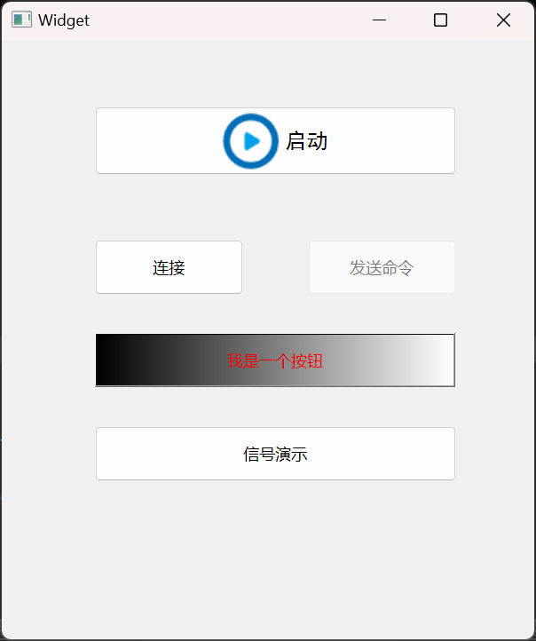
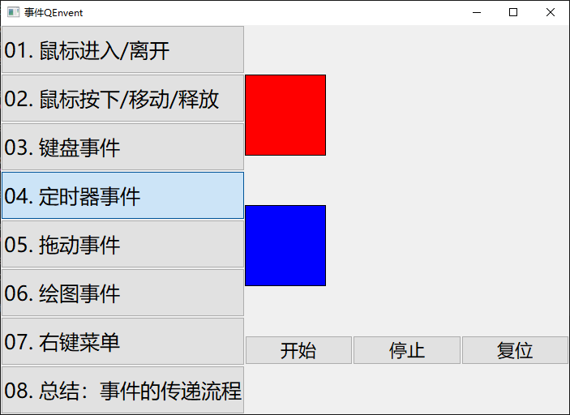

# qt-basic-learning

Qt基础学习笔记。

教程来源（c*d*）：https://blog.csdn.net/bili_mingwang/category_11945281.html

教程来源（b站）：https://space.bilibili.com/484726558

下面每个一级标题对应代码工程中的子项目名称。为了方便浏览，此README.md的内容由每个子项目下的README.md内容合并在一起的，每个标题下的内容都可以在子项目中的README.md中找到，内容是一致的。


<br><br><br>

# a01_quick
快速入门


## 工程项目文件说明


## 编译构建
Qt6之后，官方建议是cmake，但是Qt6还是会支持qmake的，qmake相对来说是比较简单的。

## Qt 中常用的模块
```bash
# QtCore 模块是Qt应用程序的基础，是核心的非图形类。
# 提供了信号与槽的通信机制，并发和多线程，容器，事件系统
Qt Core

# 最重要的GUI模块。图形用户界面 (GUI) 组件的基类。
Qt GUI
  
# 包含基于GUI应用程序的典型小部件类，比如按钮、文本框、标签等
# 在 Qt5 中, 从 Gui 模块中分离出来。
Qt widgets

# 网络模块。用于支持 TCP, UDP, HTTP 通信
Qt Network

# 多媒体模块。音频、视频、广播和相机功能类。  
Qt Multimedia

# Qt Multimedia 的小部件。
Qt Multimedia Widgets

# 数据库模块。用于操作数据库，比如后面会将到的 sqlite、MySQL  
Qt SQL
  
# web引擎模块。用于 web 相关的开发
Qt WebEngine

############################################################
# 以下是 QML 相关的模块
# QML 是什么呢？
# 简单来说，就是使用类似 js 的语法来构建界面，而不是 widget 的方式

# Qt QML模块。用于 QML 和 JavaScript 语言。
Qt QML

# 该模块用于使用 QML2 编写的 GUI 应用程序。用于构建具有自定义用户界面的高度动态应用程序的声明性框架。  
Qt Quick
  
# 提供轻量级 QML 类型，用于为桌面、嵌入式和移动设备创建高性能用户界面。这些类型采用简单的样式架构并且非常高效。
Qt Quick Controls
  
# 用于从 Qt Quick 应用程序创建系统对话框并与之交互的类型。
Qt Quick Dialogs
  
# 用于在 Qt Quick 中安排项目的布局。
Qt Quick Layouts

```


<br><br><br>

# a02_signal_and_slot

## 学习内容

信号和槽（标准信号槽 和 自定义信号槽）


## 标准信号槽

ui拖放按钮，分别是btnMax，btnNormal，btnMin，btnClose

widget.cpp 中设置按钮文本
```c++
ui->btnMax->setText("最大化显示");
ui->btnNormal->setText("正常显示");
ui->btnMin->setText("最小化");
ui->btnClose->setText("关闭窗口");
```

函数 connect() 用于连接`信号`和`槽`

函数格式：`connect(sender, signal, receiver, slot)`
- sender: 发出信号的对象，比如 QpushButton 按钮
- signal: 发出的信号，比如 clicked() 点击操作
- receiver: 接收信号的对象，比如 QWidget 窗口
- slot: 接收信号之后，调用的函数

使用：
```c++
connect(ui->btnMax, SIGNAL(clicked()), this, SLOT(showMaximized()));
connect(ui->btnNormal, SIGNAL(clicked()), this, SLOT(showNormal()));
connect(ui->btnMin, SIGNAL(clicked()), this, SLOT(showMinimized()));
connect(ui->btnClose, SIGNAL(clicked()), this, SLOT(close()));
```

`showMaximized()`，`showNormal()`，`showMinimized()`，`close()` 均为Qt的标准函数


## 自定义信号槽

创建两个类的头文件和源文件，分别是commander.h（指挥官）和 soldier.h（士兵），都需要继承自 QObject类，添加 Q_OBJECT 宏，才能正常使用Qt 的信号和槽机制。

commander.h 声明两个go() 跑的方法，一个有参一个无参（测试信号方法可以重载）

soldier.h 声明两个fight() 战斗的方法，槽函数的返回值和参数，要和信号保持一致

soldier.cpp 实现两个fight()方法
```c++
void Soldier::fight() {
    std::cout << "fight" << std::endl;
}

void Soldier::fight(QString str) {
    std::cout << "fight for " << str.toStdString() <<std::endl;
}
```

创建两个实例
```c++
Commander commander;
Soldier soldier;
```

建立信号和槽的连接
```c++
connect(&commander, SIGNAL(go()), &soldier, SLOT(fight()));
connect(&commander, SIGNAL(go(Qstring)), &soldier, SLOT(fight(Qstring)));
```

发送信号
```c++
commander.go();
commander.go("freedom");
```


<br><br><br>

# a03_connect

## 学习内容

信号和槽要建立连接，本质上是通过 `connect` 函数来连接实现的。但是从写法或者操作上来说，有多种方式，以下总结了 5 种方式：
- SIGNAL/SLOT（Qt4）
- 函数地址（Qt5）
- UI 设计师界面 - 转到槽
- UI 设计师界面 - 信号槽编辑器
- lambda 表达式


## SIGNAL/SLOT（Qt4）
SIGNAL/SLOT（Qt4） 这两个宏，将函数名以及对应的参数，转换为字符串，这是 Qt4 中使用的方式

格式：`connect(sender, SIGNAL(signal()), receiver, SLOT(slot()));`

这种方式，编译器不会做错误检查，即使函数名或者参数写错了，也可以编译通过，这样就把问题留在了运行阶段。

比如：`connect(ui->btnMax, SIGNAL(clicked()), this, SLOT(showMaximized()));`

如果 showMaximized 不小心写成了 showMaximize，点击【构建】菜单->【重新构建】，在【编译输出】窗口并不会报错，而在运行时报错

不推荐使用这种方式：https://github.com/KDE/clazy/blob/1.11/docs/checks/README-connect-by-name.md

## 函数地址（Qt5）
函数地址（Qt5），这种方式，编译时就会对函数类型，参数个数做检查。

格式：`connect(sender, &Sender::signal, receiver, &Receiver::slot);`
- sender：信号发送者
- &Sender::signal：发送的信号
- receiver：信号接收者
- &Receiver::slot：槽函数

比如：`connect(ui->btnNormal, &QPushButton::clicked, this, &QWidget::showNormal);`


## UI设计师界面-鼠标右键，转到槽
在 UI 设计师界面，右键单击 btnMin，然后选择【转到槽…】，弹出窗口，选择 clicked()即可生成并跳转到槽函数，即可在 widget.h 和 widget.cpp 中生成对应的代码，此时会根据按钮的 name 自动生成对应的槽函数

不推荐使用这种方式：https://github.com/KDE/clazy/blob/1.11/docs/checks/README-connect-by-name.md

## UI设计师界面-信号槽编辑器
使用这种方式，实现点击 btnClose 按钮，关闭窗口。

进入到 UI 设计师界面，【View】菜单 ->【视图】->【Signal & Slots Editor】，在打开的信号槽编辑器中，点击绿色的加号+ 就可以连接信号和槽了：

不推荐使用这种方式：https://github.com/KDE/clazy/blob/1.11/docs/checks/README-connect-by-name.md

## Lambda 表达式
修改窗口的标题
```c++
connect(ui->btnSetTitle, &QPushButton::clicked, this, [this]() {
    this->setWindowTitle("[连接信号槽的 5 种方式]");
});
```

## 使用总结

推荐使用`函数地址（Qt5）` 和 lambda 表达式。

connect()连接使用方式在Qt6中变化不大，与Qt5的使用方式一致

- SIGNAL/SLOT（Qt4）
  传统的使用方式，传递的是信号和槽函数的字符串名称，编译时不检查类型和参数，运行时容易出错
- 函数地址（Qt5）<font color="#dd0000">（强烈推荐使用）</font>
  语法简洁，易于阅读；
  没有字符串转换的开销；
  编译时的类型检查，使得连接安全性得到增强；
- UI 设计师界面 - 转到槽
  灵活性不如代码，复杂页面需要通过代码实现；
  如果使用其它ide开发，可能出现问题；
  运行时动态创建和销毁的 UI 元素，使用UI界面设计，会比较困难。
- UI 设计师界面 - 信号槽编辑器
  灵活性不如代码，复杂页面需要通过代码实现；
  如果使用其它ide开发，可能出现问题；
  运行时动态创建和销毁的 UI 元素，使用UI界面设计，会比较困难。
- lambda 表达式<font color="#dd0000">（强烈推荐使用）</font>
  语法简洁，易于阅读；
  没有字符串转换的开销；
  编译时的类型检查，使得连接安全性得到增强；
  可以直接在connect的地方定义一段处理逻辑，特别适合处理简单的，不值得单独定义槽函数的逻辑


<br><br><br>

# a04_signal_slot_extension

## 学习内容

- 如何连接重载的信号和槽
- 一个信号连接多个槽
- 多个信号连接一个槽
- 信号连接信号
- 断开连接 - disconnect

## 如何连接重载的信号和槽

在信号和槽存在重载时，Qt4 和 Qt5 的写法是有区别的：

Qt4 方式: 可以在 SIGNAL/SLOT 中指定函数参数类型，因此写法比较简单。

Qt5 方式: 指定信号和槽时，只能指定函数名，无法向 Qt4 那样指定函数参数类型，需要单独定义函数指针，写法上稍显麻烦。

## 一个信号连接多个槽

```c++
connect(sender, SIGNAL(signal), receiver1, SLOT(fun1()));
connect(sender, SIGNAL(signal), receiver2, SLOT(fun2()));
```
这样，当 signal 这个信号发出时，它连接的 2 个槽函数 fun1，fun2 都会被执行，并且：

Qt4：信号发射时，与之相连接的槽函数的执行顺序是随机的。

Qt5+: 信号发射时，这些槽函数的执行顺序与建立连接的顺序相同。

## 多个信号连接一个槽

```c++
connect(sender, SIGNAL(signal1), receiver, SLOT(fun()));
connect(sender, SIGNAL(signal2), receiver, SLOT(fun()));
```

##信号连接信号

信号不仅可以连接槽，还可以和连接信号，
 
如：`connect(obj1, SIGNAL(signal1), obj2, SIGNAL(signal2));`

这样，当 obj1 发送 signal1 信号时，就会触发 obj2 发送 signal2 信号。

## 断开连接 - disconnect

用于断开信号和槽之间已经建立的连接。disconnect 函数并不常用，因为当一个对象 delete 之后， Qt 自动取消所有连接到这个对象上面的槽。


<br><br><br>

# a05_QWidget

## 学习内容

由于`QWidget`类是所有控件类的父类，并且在`a01_quick`中就已经使用到了，因此需要先来学习QWidget相关技术点。

- 所有窗口类的基类
  Qt中有3个窗口的基类：`QWidget`、`QMainWindow`、`QDialog`；在创建Qt工程时，会让我们选择继承自哪一个窗口类；其中，`QMainWindow`、`QDialog`都是继承自`QWidge`
- 所有控件类的基类
  Qt中的控件类（按钮、输入框、单选框等）也属于窗口类，它们的基类也是`QWidget`
- 可以内嵌到其他窗口的内部，此时需要给其指定父窗口
- 可以作为独立的窗口显示，此时不能给其指定父窗口

基于案例一步步的使用！


## 如何显示QWidget窗口

1、新建一个基于QWidget的子窗口类，类名为`SubWidget`，

2、以创建工程时创建的`Widget`为父类（`widget.cpp`），要显示子窗口`SubWidget`（`subWidget.cpp`），需要在父类`Widget`中调用，即在`widget.cpp`中调用
```c++
#include "widget.h"
#include "ui_widget.h"
#include "subwidget.h"


/**
 * @Author ：谁书-ss
 * @Date ：2023-09-16 15:24
 * @IDE ：Qt Creator
 * @Motto ：ABC(Always Be Coding)
 * <p></p>
 * @Description ：
 * <p></p>
 */

Widget::Widget(QWidget *parent)
    : QWidget(parent)
    , ui(new Ui::Widget) {
    ui->setupUi(this);

    //未指定父窗口，那么这个窗口就是独立的窗口，需要调用其show方法来显示，运行之后，出现两个独立窗口
    //SubWidget* subWidget = new SubWidget();
    //subWidget->setWindowTitle("SubWidget");
    //subWidget->show();

    // 如果指定了父窗口，那么就不需要调用show方法了，因为父窗口显示时，会将其子窗口一起显示出来。
    SubWidget *subWidget = new SubWidget(this);
    subWidget->setWindowTitle("SubWidget");

}

Widget::~Widget() {
    delete ui;
}
```

## 常用的属性和方法

### Qt帮助文档

可以点击`Qt Creator`工具左侧的【帮助】，切换到【索引】，输入QWidget，就可以查看 QWidget 的详细帮助文档，如下：


### 设置窗口属性

位置、大小、标题、图标、资源文件

`widget.h` 头文件
```c++
#ifndef WIDGET_H
#define WIDGET_H

#include <QWidget>


/**
 * @Author ：谁书-ss
 * @Date ：2023-09-16 15:24
 * @IDE ：Qt Creator
 * @Motto ：ABC(Always Be Coding)
 * <p></p>
 * @Description ：
 * <p></p>
 */

QT_BEGIN_NAMESPACE
namespace Ui {
    class Widget;
}
QT_END_NAMESPACE

class Widget : public QWidget {
    Q_OBJECT

public:
    Widget(QWidget *parent = nullptr);
    ~Widget();

public slots:
    void btnGetSize();
    void btnSetSize();
    void btnSetFixedSize();
    void btnSetMinSize();
    void btnSetMaxSize();
    void btnMove();
    void btnSetTitle();
    void btnSetIcon();

private:
    Ui::Widget *ui;
};
#endif // WIDGET_H

```


`widget.cpp` 源文件
```c++
#include "widget.h"
#include "ui_widget.h"

#include "QDebug"

/**
 * @Author ：谁书-ss
 * @Date ：2023-09-16 15:24
 * @IDE ：Qt Creator
 * @Motto ：ABC(Always Be Coding)
 * <p></p>
 * @Description ：
 * <p></p>
 */

Widget::Widget(QWidget *parent)
    : QWidget(parent)
    , ui(new Ui::Widget) {
    ui->setupUi(this);

    //未指定父窗口，那么这个窗口就是独立的窗口，需要调用其show方法来显示，运行之后，出现两个独立窗口
    // SubWidget* subWidget = new SubWidget();
    // subWidget->setWindowTitle("SubWidget");
    // subWidget->show();

    // 如果指定了父窗口，那么就不需要调用show方法了，因为父窗口显示时，会将其子窗口一起显示出来。
    // SubWidget *subWidget = new SubWidget(this);
    // subWidget->setWindowTitle("SubWidget");

    // 获取窗口大小，位置
    connect(ui->btnGetSize, &QPushButton::clicked, this, &Widget::btnGetSize);
    // 设置窗口大小
    connect(ui->btnSetSize, &QPushButton::clicked, this, &Widget::btnSetSize);
    // 设置窗口固定大小
    connect(ui->btnSetFixedSize, &QPushButton::clicked, this, &Widget::btnSetFixedSize);
    // 设置窗口最小大小
    connect(ui->btnSetMinSize, &QPushButton::clicked, this, &Widget::btnSetMinSize);
    // 设置窗口最大大小
    connect(ui->btnSetMaxSize, &QPushButton::clicked, this, &Widget::btnSetMaxSize);
    // 设置窗口移动到：（100,100）
    connect(ui->btnMove, &QPushButton::clicked, this, &Widget::btnMove);
    // 设置窗口标题
    connect(ui->btnSetTitle, &QPushButton::clicked, this, &Widget::btnSetTitle);
    // 设置窗口Icon
    connect(ui->btnSetIcon, &QPushButton::clicked, this, &Widget::btnSetIcon);

}

Widget::~Widget() {
    delete ui;
}

void Widget::btnGetSize() {
    qDebug() << "--------------获取窗口信息---------------";
    QRect rect = this->geometry();
    qDebug() << "左上：" << rect.topLeft();
    qDebug() << "右上：" << rect.topRight();
    qDebug() << "左下：" << rect.bottomLeft();
    qDebug() << "右下：" << rect.bottomRight();
    qDebug() << "宽：" << rect.width();
    qDebug() << "高：" << rect.height();
}
void Widget::btnSetSize() {
    qDebug() << "--------------设置窗口大小---------------";
    this->resize(400, 400);
}
void Widget::btnSetFixedSize() {
    qDebug() << "--------------设置窗口固定大小---------------";
    this->setFixedSize(500, 500);
}
void Widget::btnSetMinSize() {
    qDebug() << "--------------设置窗口最小大小---------------";
    this->setMinimumSize(300, 300);
}
void Widget::btnSetMaxSize() {
    qDebug() << "--------------设置窗口最大大小---------------";
    this->setMaximumSize(600, 600);
}
void Widget::btnMove() {
    qDebug() << "--------------设置窗口移动到：（100,100）---------------";
    this->move(100, 100);
}
void Widget::btnSetTitle() {
    qDebug() << "--------------设置窗口标题---------------";
    this->setWindowTitle("标题05_QWidget");
}
void Widget::btnSetIcon() {
    qDebug() << "--------------设置窗口Icon---------------";
    // 不能用中文
    this->setWindowIcon(QIcon(":/icon/windows_icon.ico"));
}

```

### 图标、资源文件的使用

项目右键 > 添加新文件。如下图所示：


QT > Qt Resource File。如下图所示：


`文件名`不是具体导入的图片名或视频文件名称。这里的`文件名`相当于一个文件夹的名称，而文件夹下可以有多张图片或视频文件，所以这里的`文件名`其实就是一个资源文件的分组名。如下图所示：


点击下一步；点击完成之后，进入到资源编辑页面。如下图所示：


如果没有出现上面的资源编辑页面，就进行以下操作。如下图所示：


添加资源文件（图片、视频），操作完之后，记得`Ctrl + S`保存


查看预览资源


<br><br><br>

# a06_QPushButton

## 学习内容

`QPushButton`是Qt中的按钮，通常用于用户的点击，然后执行相应操作。

- 字体、字体颜色、Icon
- 按钮样式
- 按钮事件：按下、抬起

## 案例

**效果**




**代码**

`widget.h` 头文件
```c++
#ifndef WIDGET_H
#define WIDGET_H

#include <QWidget>

/**
 * @Author ：谁书-ss
 * @Date ：2023-11-30 12:55
 * @IDE ：Qt Creator
 * @Motto ：ABC(Always Be Coding)
 * <p></p>
 * @Description ：
 * <p></p>
 */

QT_BEGIN_NAMESPACE
namespace Ui {
class Widget;
}
QT_END_NAMESPACE

class Widget : public QWidget
{
    Q_OBJECT

public:
    Widget(QWidget *parent = nullptr);
    ~Widget();

private slots:
    void startStopButton();
    void connectButton();
    void signalButtonClicked();
    void signalButtonPressed();
    void signalButtonReleased();

private:
    Ui::Widget *ui;
};
#endif // WIDGET_H

```

`widget.cpp` 源文件
```c++
#include "widget.h"
#include "ui_widget.h"

#include "QDebug"

/**
 * @Author ：谁书-ss
 * @Date ：2023-11-30 12:55
 * @IDE ：Qt Creator
 * @Motto ：ABC(Always Be Coding)
 * <p></p>
 * @Description ：
 * <p></p>
 */

Widget::Widget(QWidget *parent)
    : QWidget(parent)
    , ui(new Ui::Widget)
{
    ui->setupUi(this);

    // 启动、停止
    this->startStopButton();
    connect(ui->startStopButton, &QPushButton::clicked, this, &Widget::startStopButton);
    // 连接 禁止
    ui->sendCommandButton->setEnabled(false);
    connect(ui->connectButton, &QPushButton::clicked, this, &Widget::connectButton);
    // 样式
    ui->styleButton->setStyleSheet("color:rgb(255, 0, 0);background-color: qlineargradient(spread:pad, x1:0, y1:0, x2:1, y2:0, stop:0 rgba(0, 0, 0, 255), stop:1 rgba(255, 255, 255, 255));");
    // 信号：按下、抬起
    connect(ui->signalButton, &QPushButton::clicked, this, &Widget::signalButtonClicked);
    connect(ui->signalButton, &QPushButton::pressed, this, &Widget::signalButtonPressed);
    connect(ui->signalButton, &QPushButton::released, this, &Widget::signalButtonReleased);
}

Widget::~Widget()
{
    delete ui;
}

void Widget::startStopButton() {
    QString  btnText = ui->startStopButton->text();

    if(btnText == "启动") {
        // 设置文本和字体
        ui->startStopButton->setText("停止");
        ui->startStopButton->setFont(QFont("黑体", 16));
        // 设置图标
        ui->startStopButton->setIcon(QIcon(":/files/stop.png"));
        ui->startStopButton->setIconSize(QSize(48, 48));
    } else {
        ui->startStopButton->setText("启动");
        ui->startStopButton->setFont(QFont("黑体", 12));
        ui->startStopButton->setIcon(QIcon(":/files/start.png"));
        ui->startStopButton->setIconSize(QSize(48, 48));
    }
}

void Widget::connectButton() {
    QString s = ui->connectButton->text();
    if(s == "断开连接") {
        ui->connectButton->setText("连接");
        ui->sendCommandButton->setEnabled(false);
    } else {
        ui->connectButton->setText("断开连接");
        ui->sendCommandButton->setEnabled(true);
    }
}

// 按钮抬起时，发射clicked信号
void Widget::signalButtonClicked() {
    qDebug() << "Clicked。。。";
}
// 按钮按下时，发射pressed信号
void Widget::signalButtonPressed() {
    qDebug() << "Pressed。。。";
}
// 按钮抬起时，发射released信号
void Widget::signalButtonReleased() {
    qDebug() << "Released。。。";
}


```


<br><br><br>

# a07_QLabel

## 学习内容

`QLabel`是Qt中的标签类，通常用于显示提示性的文本，也可以显示图像


## 属性和方法

**效果**


`widget.h` 头文件
```c++
#ifndef WIDGET_H
#define WIDGET_H

#include <QWidget>


/**
 * @Author ：谁书-ss
 * @Date ：2023-12-01 22:07
 * @IDE ：Qt Creator
 * @Motto ：ABC(Always Be Coding)
 * <p></p>
 * @Description ：
 * <p></p>
 */

QT_BEGIN_NAMESPACE
namespace Ui {
class Widget;
}
QT_END_NAMESPACE

class Widget : public QWidget
{
    Q_OBJECT

public:
    Widget(QWidget *parent = nullptr);
    ~Widget();
    void printAlignment();

private:
    Ui::Widget *ui;
};
#endif // WIDGET_H

```

`widget.cpp` 源文件
```c++
#include "widget.h"
#include "ui_widget.h"

#include "QDebug"

/**
 * @Author ：谁书-ss
 * @Date ：2023-12-01 22:07
 * @IDE ：Qt Creator
 * @Motto ：ABC(Always Be Coding)
 * <p></p>
 * @Description ：
 * <p></p>
 */

Widget::Widget(QWidget *parent)
    : QWidget(parent)
    , ui(new Ui::Widget) {
    ui->setupUi(this);
    this->setWindowTitle("文本标签Label对齐方式");

    // 设置样式
    ui->label_1->setStyleSheet("color:rgb(255, 0, 0);background-color:rgb(227, 227, 227);");
    ui->label_2->setStyleSheet("color:rgb(255, 0, 0);background-color:rgb(227, 227, 227);");
    ui->label_3->setStyleSheet("color:rgb(255, 0, 0);background-color:rgb(227, 227, 227);");
    ui->label_4->setStyleSheet("color:rgb(255, 0, 0);background-color:rgb(227, 227, 227);");
    ui->label_5->setStyleSheet("color:rgb(255, 0, 0);background-color:rgb(227, 227, 227);");
    ui->label_6->setStyleSheet("color:rgb(255, 0, 0);background-color:rgb(227, 227, 227);");
    ui->label_7->setStyleSheet("color:rgb(255, 0, 0);background-color:rgb(227, 227, 227);");
    ui->label_8->setStyleSheet("color:rgb(255, 0, 0);background-color:rgb(227, 227, 227);");
    ui->label_9->setStyleSheet("color:rgb(255, 0, 0);background-color:rgb(227, 227, 227);");
    // 获取和设置按钮上显示的文本
    ui->label_1->setText("水平方向-左对齐");
    ui->label_2->setText("水平方向-右对齐");
    ui->label_3->setText("水平方向-居中对齐");
    ui->label_4->setText("垂直方向-上对齐");
    ui->label_5->setText("垂直方向-下对齐");
    ui->label_6->setText("垂直方向-居中对齐");
    ui->label_7->setText("垂直方向和水平方向-居中对齐");
    ui->label_8->setText("文本是否换行，文本是否换行，文本是否换行，文本是否换行。");
    ui->label_9->setText("设置图像");

    // 获取文本标签对齐方式
    this->printAlignment();

    // 水平方向-左对齐
    ui->label_1->setAlignment(Qt::AlignLeft);
    // 水平方向-右对齐
    ui->label_2->setAlignment(Qt::AlignRight);
    // 水平方向-居中对齐
    ui->label_3->setAlignment(Qt::AlignHCenter);
    // 垂直方向-上对齐
    ui->label_4->setAlignment(Qt::AlignTop);
    // 垂直方向-下对齐
    ui->label_5->setAlignment(Qt::AlignBottom);
    // 垂直方向-居中对齐
    ui->label_6->setAlignment(Qt::AlignVCenter);
    // 垂直方向和水平方向-居中对齐 Qt::AlignCenter（AlignVCenter | AlignHCenter）
    ui->label_7->setAlignment(Qt::AlignCenter);

    // 再次获取文本标签对齐方式
    this->printAlignment();


    // 文本换行 true：换行  false：不换行
    qDebug() << "文本是否换行：" << ui->label_8->wordWrap();
    ui->label_8->setWordWrap(true);
    qDebug() << "文本是否换行：" << ui->label_8->wordWrap();


    // 图像
    QPixmap pix(":/files/cat.png");
    ui->label_9->setPixmap(pix);

}

Widget::~Widget() {
    delete ui;
}

void Widget::printAlignment() {
    qDebug() << "------------------------------------- 获取文本对齐方式";
    auto localAlignment1 = ui->label_1->alignment();
    auto localAlignment2 = ui->label_2->alignment();
    auto localAlignment3 = ui->label_3->alignment();
    auto localAlignment4 = ui->label_4->alignment();
    auto localAlignment5 = ui->label_5->alignment();
    auto localAlignment6 = ui->label_6->alignment();
    auto localAlignment7 = ui->label_7->alignment();
    qDebug() << "label_1-水平方向-左对齐" << localAlignment1;
    qDebug() << "label_2-水平方向-右对齐" << localAlignment2;
    qDebug() << "label_3-水平方向-居中对齐" << localAlignment3;
    qDebug() << "label_4-垂直方向-上对齐" << localAlignment4;
    qDebug() << "label_5-垂直方向-下对齐" << localAlignment5;
    qDebug() << "label_6-垂直方向-居中对齐" << localAlignment6;
    qDebug() << "label_7-垂直方向-居中对齐" << localAlignment7;
}

```


<br><br><br>
# a08_QLineEdit

## 学习内容

`QLineEdit`是Qt中的文本框，准确地说是单行文本框，通常用于接受用户的输入。

`QLineEdit` 中内置的信号
- cursorPositionChanged(int, int)
- editingFinished()
- inputRejected()
- returnPressed()
- selectionChanged()
- textChanged(QString)
- textEdited(QString)


## 属性和方法

**效果**


`widget.h` 头文件
```c++
#ifndef WIDGET_H
#define WIDGET_H

#include <QWidget>


/**
 * @Author ：谁书-ss
 * @Date ：2023-12-03 14:56
 * @IDE ：Qt Creator
 * @Motto ：ABC(Always Be Coding)
 * <p></p>
 * @Description ：
 * <p></p>
 */

QT_BEGIN_NAMESPACE
namespace Ui {
class Widget;
}
QT_END_NAMESPACE

class Widget : public QWidget
{
    Q_OBJECT

public:
    Widget(QWidget *parent = nullptr);
    ~Widget();

private slots:
    // 回显模式
    void btnEchoNormal();
    void btnEchoPassword();
    void btnEchoNoEcho();
    void btnEchoPasswordEchoOnEdit();
    void btnEchoPrint();
    // 对齐方式
    void btnAlignLeft();
    void btnAlignCenter();
    void btnAlignRight();
    // 读写控制
    void btnAccessReadWrite();
    void btnAccessReadOnly();
    void btnAccessDisabled();
    void btnAccessEnabled();
    void btnAccessPrint();
    // 格式控制
    void btnMaskNone();
    void btnMaskPhone();
    void btnMaskLicense();
    // 信号槽
    void leAdd1_TextChanged(const QString &arg1);
    void leAdd2_TextChanged(const QString &arg1);
    void leSub1_EditingFinished();
    void leSub2_EditingFinished();


private:
    Ui::Widget *ui;
};
#endif // WIDGET_H

```

`widget.cpp` 源文件
```c++
#include "widget.h"
#include "ui_widget.h"
#include "QDebug"
#include "qvalidator.h"

#include "QMessageBox"
#include "QTime"
#include "QPixmap"

/**
 * @Author ：谁书-ss
 * @Date ：2023-12-03 14:56
 * @IDE ：Qt Creator
 * @Motto ：ABC(Always Be Coding)
 * <p></p>
 * @Description ：
 * <p></p>
 */

Widget::Widget(QWidget *parent)
    : QWidget(parent)
    , ui(new Ui::Widget) {
    ui->setupUi(this);
    this->setWindowTitle("QLineEdit使用");

    // 默认 正常模式
    btnEchoNormal();
    // 默认 左对齐
    btnAlignLeft();
    // 默认 可读可写
    btnAccessReadWrite();
    // 默认 无格式控制
    btnMaskNone();
    // 设置校验,只允许文本框中输入整数
    ui->leAdd1->setValidator(new QIntValidator(this));
    ui->leAdd1->setPlaceholderText("加数");
    ui->leAdd2->setValidator(new QIntValidator(this));
    ui->leAdd2->setPlaceholderText("被加数");
    ui->leAddResult->setPlaceholderText("和");
    // 设置校验,只允许文本框中输入整数
    ui->leSub1->setValidator(new QIntValidator(this));
    ui->leSub1->setPlaceholderText("减数");
    ui->leSub2->setValidator(new QIntValidator(this));
    ui->leSub2->setPlaceholderText("被减数");
    ui->leSubResult->setPlaceholderText("差");


    // 1、回显模式
    connect(ui->btnEchoNormal, &QPushButton::clicked, this, &Widget::btnEchoNormal);
    connect(ui->btnEchoPassword, &QPushButton::clicked, this, &Widget::btnEchoPassword);
    connect(ui->btnEchoNoEcho, &QPushButton::clicked, this, &Widget::btnEchoNoEcho);
    connect(ui->btnEchoPasswordEchoOnEdit, &QPushButton::clicked, this, &Widget::btnEchoPasswordEchoOnEdit);
    connect(ui->btnEchoPrint, &QPushButton::clicked, this, &Widget::btnEchoPrint);
    // 2、对齐方式
    connect(ui->btnAlignLeft, &QPushButton::clicked, this, &Widget::btnAlignLeft);
    connect(ui->btnAlignCenter, &QPushButton::clicked, this, &Widget::btnAlignCenter);
    connect(ui->btnAlignRight, &QPushButton::clicked, this, &Widget::btnAlignRight);
    // 3、读写控制
    connect(ui->btnAccessReadWrite, &QPushButton::clicked, this, &Widget::btnAccessReadWrite);
    connect(ui->btnAccessReadOnly, &QPushButton::clicked, this, &Widget::btnAccessReadOnly);
    connect(ui->btnAccessDisabled, &QPushButton::clicked, this, &Widget::btnAccessDisabled);
    connect(ui->btnAccessEnabled, &QPushButton::clicked, this, &Widget::btnAccessEnabled);
    connect(ui->btnAccessPrint, &QPushButton::clicked, this, &Widget::btnAccessPrint);
    // 4、格式控制
    connect(ui->btnMaskNone, &QPushButton::clicked, this, &Widget::btnMaskNone);
    connect(ui->btnMaskPhone, &QPushButton::clicked, this, &Widget::btnMaskPhone);
    connect(ui->btnMaskLicense, &QPushButton::clicked, this, &Widget::btnMaskLicense);
    // 5、信号槽演示
    connect(ui->leAdd1, &QLineEdit::textChanged, this, &Widget::leAdd1_TextChanged);
    connect(ui->leAdd2, &QLineEdit::textChanged, this, &Widget::leAdd1_TextChanged);
    connect(ui->leSub1, &QLineEdit::editingFinished, this, &Widget::leSub1_EditingFinished);
    connect(ui->leSub2, &QLineEdit::editingFinished, this, &Widget::leSub2_EditingFinished);
}

Widget::~Widget() {
    delete ui;
}

// 1、回显模式
// 1.1 正常模式
void Widget::btnEchoNormal() {
    ui->leEcho->clear();
    ui->leEcho->setEchoMode(QLineEdit::Normal);
    ui->leEcho->setPlaceholderText("Normal");
}
// 1.2 密码模式
void Widget::btnEchoPassword() {
    ui->leEcho->clear();
    ui->leEcho->setEchoMode(QLineEdit::Password);
    ui->leEcho->setPlaceholderText("Password");
}
// 1.3 不回显
void Widget::btnEchoNoEcho() {
    ui->leEcho->clear();
    ui->leEcho->setEchoMode(QLineEdit::NoEcho);
    ui->leEcho->setPlaceholderText("NoEcho");
}
// 1.4 失去焦点时为密码模式
void Widget::btnEchoPasswordEchoOnEdit() {
    ui->leEcho->clear();
    ui->leEcho->setEchoMode(QLineEdit::PasswordEchoOnEdit);
    ui->leEcho->setPlaceholderText("PasswordEchoOnEdit");
}
// 输出内容
void Widget::btnEchoPrint() {
    QMessageBox::information(this, "回显模式", ui->leEcho->text());
}

// 2、对齐方式
// 2.1 左对齐
void Widget::btnAlignLeft() {
    ui->leAlignment->setAlignment(Qt::AlignLeft);
    ui->leAlignment->setPlaceholderText("Left");
}
// 2.2 居中对齐
void Widget::btnAlignCenter() {
    ui->leAlignment->setAlignment(Qt::AlignCenter);
    ui->leAlignment->setPlaceholderText("Center");
}
// 2.3 右对齐
void Widget::btnAlignRight() {
    ui->leAlignment->setAlignment(Qt::AlignRight);
    ui->leAlignment->setPlaceholderText("Right");
}

// 3、读写控制
// 3.1 可读可写
void Widget::btnAccessReadWrite() {
    ui->leAccess->setReadOnly(false);
    ui->leAccess->setPlaceholderText("ReadWrite");
}
// 3.2 只读
void Widget::btnAccessReadOnly() {
    ui->leAccess->setReadOnly(true);
    ui->leAccess->setPlaceholderText("ReadOnly");
}
// 3.3 禁能
void Widget::btnAccessDisabled() {
    ui->leAccess->setEnabled(false);
    ui->leAccess->setPlaceholderText("Disabled");
}
// 3.4 使能
void Widget::btnAccessEnabled() {
    ui->leAccess->setEnabled(true);
    ui->leAccess->setPlaceholderText("Enabled");
}
// 输出内容
void Widget::btnAccessPrint() {
    QMessageBox::information(this, "文本框演示", ui->leAccess->text());
}

// 4、格式控制
// 4.1 无格式
void Widget::btnMaskNone() {
    ui->leMask->setInputMask("");
}
// 4.2 电话号码格式
void Widget::btnMaskPhone() {
    // ;# - 表示格式字符串结束，并且未输入时显示#
    ui->leMask->setInputMask("99999999999;#");
}
// 4.3 密钥格式
void Widget::btnMaskLicense() {
    ui->leMask->setInputMask(">AAAAA-AAAAA-AAAAA-AAAAA-AAAAA;*");
}

// 5、信号槽演示
// 5.1 textChanged信号 - 实现自动计算加法结果
void Widget::leAdd1_TextChanged(const QString &arg1) {
    int sum = arg1.toInt() + ui->leAdd2->text().toInt();
    ui->leAddResult->setText(QString::number(sum));
}
void Widget::leAdd2_TextChanged(const QString &arg1) {
    int sum = arg1.toInt() + ui->leAdd1->text().toInt();
    ui->leAddResult->setText(QString::number(sum));
}
// 5.2 editingFinished信号 - 实现自动计算减法结果
void Widget::leSub1_EditingFinished() {
    int result = ui->leSub1->text().toInt() - ui->leSub2->text().toInt();
    ui->leSubResult->setText(QString::number(result));
}
void Widget::leSub2_EditingFinished() {
    int result = ui->leSub1->text().toInt() - ui->leSub2->text().toInt();
    ui->leSubResult->setText(QString::number(result));
}

```


<br><br><br>

# a09_QRadioButton_and_QCheckBox

## 学习内容

- Qt中的单选按钮类是`QRadioButton`
  它是一个可以切换选中（checked）或未选中（unchecked）状态的单选按钮，单选按钮常用在 “多选一” 的场景，也就是说，在一组单选按钮中，一次只能选中一个单选按钮。比如性别中的 “男女” 二选一，学历中的 “博士/硕士/本科/其他” 四选一，等等。
- Qt中的复选按钮类是`QCheckBox`
  它和单选按钮很相似，单选按钮常用在 “多选一” 的场景，而复选按钮常用在 "多选多"的场景比如喜欢的水果选项中，可以在 “苹果/桃/梨/橘子/香蕉” 中选择多个。


## 属性和方法

### 文本
这两个是其父类 QAbstractButton 中的属性和方法，因此 QPushButton、QRadioButton、QCheckBox 都具有该属性
```c++
// 获取和设置显示的文本
QString text() const
void setText(const QString &text)
```

### 状态

单选按钮，有选中（Checked）和非选中（UnChecked）这两种状态；
```c++
// 获取和设置单选按钮的选中状态
bool isChecked() const
void setChecked(bool)
```

复选按钮可以有三种状态：
- Qt::Checked 选中
- Qt::Unchecked 非选中
- Qt::PartiallyChecked 半选中，比如当一组复选按钮中只选择了部分时，可以设置其父项为半选状态，如下

可以设置复选按钮，是否支持三态，如下：
```c++
// 用于获取和设置是否支持三态
bool isTristate() const
void setTristate(bool y = true)
```

如果不支持三态，使用方法单选按钮一样，只有选中（Checked）和非选中（unchecked）两种状态，没有半选中状态（ PartiallyChecked ）

此时可以使用如下获取复选按钮是否选中：
```c++
// 获取和设置复选按钮是否选中：checked/unchecked
bool isChecked() const
void setChecked(bool)
```

如果支持三态，除了选中（Checked）和非选中（unchecked）两种状态，还有半选中状态（ PartiallyChecked ）

此时可以使用如下获取复选按钮的状态：
```c++
// 设置和获取复选按钮的状态
Qt::CheckState checkState() const
void setCheckState(Qt::CheckState state)
```

### 自动排他

单选按钮实现的是 “多选一”，因此单选按钮的该属性默认是使能的，复选按钮同样可以设置是否自动排他
```c++
// 获取和设置自动排他
bool autoExclusive() const
void setAutoExclusive(bool)
```

## 案例

**效果**


`widget.h` 头文件
```c++
#ifndef WIDGET_H
#define WIDGET_H

#include <QWidget>
#include <QButtonGroup>

/**
 * @Author ：谁书-ss
 * @Date ：2023-12-03 17:09
 * @IDE ：Qt Creator
 * @Motto ：ABC(Always Be Coding)
 * <p></p>
 * @Description ：
 * <p></p>
 */

QT_BEGIN_NAMESPACE
namespace Ui {
class Widget;
}
QT_END_NAMESPACE

class Widget : public QWidget
{
    Q_OBJECT

public:
    Widget(QWidget *parent = nullptr);
    ~Widget();

private slots:
    void btnGetSelectionClicked();
    void onRadioButtonClicked();
    void cbAllClicked();
    void onStateChanged();

private:
    Ui::Widget *ui;
    QButtonGroup* buttonGroup;
    QButtonGroup* buttonGroup2;
};
#endif // WIDGET_H

```

`widget.cpp` 源文件
```c++
#include "widget.h"
#include "ui_widget.h"


/**
 * @Author ：谁书-ss
 * @Date ：2023-12-03 17:09
 * @IDE ：Qt Creator
 * @Motto ：ABC(Always Be Coding)
 * <p></p>
 * @Description ：
 * <p></p>
 */

Widget::Widget(QWidget *parent)
    : QWidget(parent)
    , ui(new Ui::Widget)
{
    ui->setupUi(this);
    this->setWindowTitle("单选按钮和多选按钮");

    // =========================================================== 单选组件
    // 第二组
    ui->rb2_1->setChecked(true);
    ui->rb2_4->setChecked(true);
    // 第三组
    ui->rb3_2->setChecked(true);
    ui->rb3_3->setChecked(true);
    connect(ui->btn3, &QPushButton::clicked, this, &Widget::btnGetSelectionClicked);
    // 第四组
    buttonGroup = new QButtonGroup(this);
    buttonGroup->addButton(ui->rb4_1, 1);
    buttonGroup->addButton(ui->rb4_2, 2);
    ui->rb4_2->setChecked(true);
    buttonGroup2 = new QButtonGroup(this);
    buttonGroup2->addButton(ui->rb4_3, 3);
    buttonGroup2->addButton(ui->rb4_4, 4);
    buttonGroup2->addButton(ui->rb4_5, 5);
    buttonGroup2->addButton(ui->rb4_6, 6);
    ui->rb4_3->setChecked(true);

    connect(ui->rb4_1, &QRadioButton::clicked, this, &Widget::onRadioButtonClicked);
    connect(ui->rb4_2, &QRadioButton::clicked, this, &Widget::onRadioButtonClicked);
    connect(ui->rb4_3, &QRadioButton::clicked, this, &Widget::onRadioButtonClicked);
    connect(ui->rb4_4, &QRadioButton::clicked, this, &Widget::onRadioButtonClicked);
    connect(ui->rb4_5, &QRadioButton::clicked, this, &Widget::onRadioButtonClicked);
    connect(ui->rb4_6, &QRadioButton::clicked, this, &Widget::onRadioButtonClicked);


    // =========================================================== 多选组件
    // 这里需要将“全选”按钮的状态设置为false
    // 鼠标点击时，只允许在checked和unchecked之间切换，不允许出现半选状态
    ui->cbAll->setTristate(false);
    // 多选按
    connect(ui->cbAll, &QCheckBox::stateChanged, this, &Widget::cbAllClicked);
    // 5个复选按钮对应同一个槽函数
    connect(ui->cb1, &QCheckBox::stateChanged, this, &Widget::onStateChanged);
    connect(ui->cb2, &QCheckBox::stateChanged, this, &Widget::onStateChanged);
    connect(ui->cb3, &QCheckBox::stateChanged, this, &Widget::onStateChanged);
    connect(ui->cb4, &QCheckBox::stateChanged, this, &Widget::onStateChanged);


}

Widget::~Widget()
{
    delete ui;
}

void Widget::btnGetSelectionClicked(){
    QString s;

    if(ui->rb3_1->isChecked()) {
        s += ui->rb3_1->text();
    } else if(ui->rb3_2->isChecked()) {
        s += ui->rb3_2->text();
    }

    if(ui->rb3_3->isChecked()) {
        s += ui->rb3_3->text();
    } else if(ui->rb3_4->isChecked()) {
        s += ui->rb3_4->text();
    } else if(ui->rb3_5->isChecked()) {
        s += ui->rb3_5->text();
    } else if(ui->rb3_6->isChecked()) {
        s += ui->rb3_6->text();
    }

    ui->te3->setText(s);
}

void Widget::onRadioButtonClicked()
{
    QString s;

    int checkedGenderId = buttonGroup->checkedId();
    if(checkedGenderId == 1) {
        s += "男";
    } else if(checkedGenderId == 2) {
        s += "女";
    }

    int checkedEduId = buttonGroup2->checkedId();
    if(checkedEduId == 3) {
        s += "博士";
    } else if(checkedEduId == 4) {
        s += "硕士";
    } else if(checkedEduId == 5) {
        s += "本科";
    } else if(checkedEduId == 6) {
        s += "大专";
    } else if(checkedEduId == 6) {
        s += "其他";
    }

    ui->te4->setText(s);
}

void Widget::cbAllClicked() {
    Qt::CheckState state = ui->cbAll->checkState();
    if(state == Qt::Checked) {
        ui->cb1->setChecked(true);
        ui->cb2->setChecked(true);
        ui->cb3->setChecked(true);
        ui->cb4->setChecked(true);
    } else if(state == Qt::Unchecked) {
        ui->cb1->setChecked(false);
        ui->cb2->setChecked(false);
        ui->cb3->setChecked(false);
        ui->cb4->setChecked(false);
    } else {

    }
}

void Widget::onStateChanged() {
    QString s;

    int cb1Checked = ui->cb1->isChecked();
    int cb2Checked = ui->cb2->isChecked();
    int cb3Checked = ui->cb3->isChecked();
    int cb4Checked = ui->cb4->isChecked();

    if(cb1Checked && cb2Checked && cb3Checked && cb4Checked) {
        // 全部选中
        ui->cbAll->setCheckState(Qt::Checked);
    } else if (!(cb1Checked || cb2Checked || cb3Checked || cb4Checked)) {
        // 全部未选中
        ui->cbAll->setCheckState(Qt::Unchecked);
    } else {
        // 部分选中
        ui->cbAll->setCheckState(Qt::PartiallyChecked);
    }

    if(cb1Checked) {
        s += ui->cb1->text() += " ";
    }
    if(cb2Checked) {
        s += ui->cb2->text() += " ";
    }
    if(cb3Checked) {
        s += ui->cb3->text() += " ";
    }
    if(cb4Checked) {
        s += ui->cb4->text() += " ";
    }

    ui->leResult->setText(s);
}

```


<br><br><br>

# a10_QComboBox

## 学习内容

Qt中的组合框是集 按钮和下拉列表于一体的控件，它占用的屏幕空间很小，对应的类是`QComboBox`


## 属性和方法

### 文本

当前组合框中当前项的索引和文本
```c++
// 获取当前条目的索引和文本
int currentIndex() const
QString currentText() const

// 获取和设置指定索引条目的文本    
QString itemText(int index) const
void setItemText(int index, const QString &text)
```


### 图标

给条目添加图标

```c++
// 获取和设置对应索引条目的图标
QIcon itemIcon(int index) const
void setItemIcon(int index, const QIcon &icon)
```


### 插入和删除

向组合框`QComboBox`中插入和删除项目

**新增条目：可以一次新增一个条目，也可以一次新增多个条目**

```c++
// 一次新增一个条目
void addItem(const QString &text, const QVariant &userData = QVariant())
void addItem(const QIcon &icon, const QString &text, const QVariant &userData = QVariant())
    
// 一次新增多个条目    
void addItems(const QStringList &texts)
```

**插入条目：可以一次插入一个条目，也可以一次插入多个条目**

```c++
// 一次插入一个条目
void insertItem(int index, const QString &text, const QVariant &userData = QVariant())
void insertItem(int index, const QIcon &icon, const QString &text, const QVariant &userData = QVariant())

// 一次插入一个条目
void insertItems(int index, const QStringList &list)
```

**插入策略：在插入条目时，还可以指定插入的策略**

```c++
// 获取和设置插入策略
QComboBox::InsertPolicy insertPolicy() const
void setInsertPolicy(QComboBox::InsertPolicy policy)
```

常用的插入策略有：

- QComboBox::NoInsert 不插入
- QComboBox::InsertAtTop 作为第一条条目插入（替换原第一条条目）
- QComboBox::InsertAtCurrent 替换当前条目
- QComboBox::InsertAtBottom 在最后一个条目之后插入
- QComboBox::InsertAfterCurrent 在当前条目之后插入
- QComboBox::InsertBeforeCurrent 在当前条目之前插入
- QComboBox::InsertAlphabetically 按英文字母顺序插入

**插入分隔符：用于在条目之间插入一条分隔符**

```c++
// 在指定索引位置处插入分隔符
void insertSeparator(int index)
```

**删除条目：删除指定索引位置的条目**

```c++
// 删除指定索引的条目
void removeItem(int index)
```


### 信号槽

```c++
// 当前选中的条目变化时，会发射这两个信号
void currentIndexChanged(int index)
void currentTextChanged(const QString &text)
```

## 案例

**效果**


`widget.h` 头文件
```c++
#ifndef WIDGET_H
#define WIDGET_H

#include <QWidget>


/**
 * @Author ：谁书-ss
 * @Date ：2023-12-05 16:24
 * @IDE ：Qt Creator
 * @Motto ：ABC(Always Be Coding)
 * <p></p>
 * @Description ：
 * <p></p>
 */

QT_BEGIN_NAMESPACE
namespace Ui {
class Widget;
}
QT_END_NAMESPACE

class Widget : public QWidget
{
    Q_OBJECT

public:
    Widget(QWidget *parent = nullptr);
    ~Widget();

private slots:
    void onCboUniversityChanged(int index);
    void onCboProvinceChanged(int index);
    void onCboCityChanged(int index);
    void onLineEditChanged();

private:
    Ui::Widget *ui;
};
#endif // WIDGET_H

```

`widget.cpp` 源文件
```c++
#include "widget.h"
#include "ui_widget.h"


/**
 * @Author ：谁书-ss
 * @Date ：2023-12-05 16:24
 * @IDE ：Qt Creator
 * @Motto ：ABC(Always Be Coding)
 * <p></p>
 * @Description ：
 * <p></p>
 */

QStringList gdCityList = {"广州市", "深圳市", "珠海市", "东莞市"};
QStringList zjCityList = {"杭州市", "宁波市", "温州市", "绍兴市"};
QStringList sdCityList = {"济南市", "青岛市", "烟台市", "威海市"};
QStringList hbCityList = {"石家庄市", "保定市", "廊坊市", "衡水市"};
QStringList nmCityList = {"呼和浩特市", "包头市", "呼伦贝尔市", "赤峰市"};
QStringList hnCityList = {"郑州市", "新乡市", "鹤壁市", "安阳市", "濮阳市"};

Widget::Widget(QWidget *parent)
    : QWidget(parent)
    , ui(new Ui::Widget) {
    ui->setupUi(this);
    this->setWindowTitle("学习QcomboBox组件");

    // 添加大学
    ui->cboUniversity->addItem("清华大学");
    ui->cboUniversity->addItem("北京大学");
    ui->cboUniversity->addItem("中国人民大学");

    // 添加省份
    ui->cboProvince->addItem("广东省");
    ui->cboProvince->addItem("浙江省");
    ui->cboProvince->addItem("山东省");
    ui->cboProvince->addItem("河北省");
    ui->cboProvince->addItem("内蒙古自治区省");
    ui->cboProvince->addItem("河南省");

    // 为省份条目添加图标
    ui->cboProvince->setItemIcon(0, QIcon(":/icon/gd.ico"));
    ui->cboProvince->setItemIcon(1, QIcon(":/icon/zj.ico"));
    ui->cboProvince->setItemIcon(2, QIcon(":/icon/sd.ico"));
    ui->cboProvince->setItemIcon(3, QIcon(":/icon/hb.ico"));
    ui->cboProvince->setItemIcon(4, QIcon(":/icon/nm.ico"));
    ui->cboProvince->setItemIcon(5, QIcon(":/icon/he.ico"));
    // 默认选中第一项-广东省
    ui->cboProvince->setCurrentIndex(0);

    // 添加城市
    ui->cboCity->addItems(gdCityList);

    // 信号槽
    connect(ui->cboUniversity, &QComboBox::currentIndexChanged, this, &Widget::onCboUniversityChanged);
    connect(ui->cboProvince, &QComboBox::currentIndexChanged, this, &Widget::onCboProvinceChanged);
    connect(ui->cboCity, &QComboBox::currentIndexChanged, this, &Widget::onCboCityChanged);

    // 姓名文本框变化时，更新结果
    connect(ui->leName, &QLineEdit::textChanged, this, &Widget::onLineEditChanged);

}

Widget::~Widget() {
    delete ui;
}

void Widget::onCboUniversityChanged(int index) {
    // 获取姓名、大学、省份、城市
    QString name = ui->leName->text();
    QString university = ui->cboUniversity->currentText();
    QString province = ui->cboProvince->currentText();
    QString city = ui->cboCity->currentText();

    if(!name.isEmpty()) {
        ui->leResult->setText(name + "毕业于" + university + ", 来自" + province + city);
    }
}

void Widget::onCboProvinceChanged(int index) {
    // 先将city对应的列表清空
    ui->cboCity->clear();

    switch (index) {
    case 0:
        ui->cboCity->addItems(gdCityList);
        break;
    case 1:
        ui->cboCity->addItems(zjCityList);
        break;
    case 2:
        ui->cboCity->addItems(sdCityList);
        break;
    case 3:
        ui->cboCity->addItems(hbCityList);
        break;
    case 4:
        ui->cboCity->addItems(nmCityList);
        break;
    case 5:
        ui->cboCity->addItems(hnCityList);
        break;
    default:
        break;
    }

    // 获取姓名、大学、省份、城市
    QString name = ui->leName->text();
    QString university = ui->cboUniversity->currentText();
    QString province = ui->cboProvince->currentText();
    QString city = ui->cboCity->currentText();

    if(!name.isEmpty()) {
        ui->leResult->setText(name + "毕业于" + university + ", 来自" + province + city);
    }
}

void Widget::onCboCityChanged(int index) {
    // 获取姓名、大学、省份、城市
    QString name = ui->leName->text();
    QString university = ui->cboUniversity->currentText();
    QString province = ui->cboProvince->currentText();
    QString city = ui->cboCity->currentText();

    if(!name.isEmpty()) {
        ui->leResult->setText(name + "毕业于" + university + ", 来自" + province + city);
    }
}

void Widget::onLineEditChanged() {
    // 获取姓名、大学、省份、城市
    QString name = ui->leName->text();
    QString university = ui->cboUniversity->currentText();
    QString province = ui->cboProvince->currentText();
    QString city = ui->cboCity->currentText();

    if(!name.isEmpty()) {
        ui->leResult->setText(name + "毕业于" + university + ", 来自" + province + city);
    }
}

```


<br><br><br>

# a11_QSpinBox

## 学习内容

微调框`QSpinBox`，允许按照一定的步长，来增加或减少其中显示的数值

修改微调框数值的方式包括：
- 单击右侧的向上/向下按钮
- 按键盘的向上/向下键
- 在微调框获取焦点时，通过鼠标滚轮的上下滚动
- 手动输入

`QSpinBox` ：用于整数的显示和输入
`DoubleSpinBox` ：用于浮点数的显示和输入

它们都是 `QAbstractSpinBox` 的子类，具有大多数相同的属性，只是参数类型不同（一个`int`，一个`double`）


## 属性和方法

### 值

微调框和值相关的属性包括：当前值、最大值、最小值

```c++
// 获取和设置当前值
int value() const
void setValue(int val)

// 获取和设置最大值
int maximum() const
void setMaximum(int max)

// 获取和设置最小值
int minimum() const
void setMinimum(int min)

// 一次设置最大值和最小值
void setRange(int minimum, int maximum)
```


### 步长

步长是指按右侧上下调整按钮时的单步改变值，也就是按一次，增加或减少的值

```c++
// 获取和设置步长
 int singleStep() const
 void setSingleStep(int val)
```


### 循环

`wrapping` 属性用于设置是否允许循环

比如范围设置为 `0-99`

- 当数值达到 `99` 时，再点击向上的按钮，此时数值会变为 `0`
- 当数值达到 `0` 时，再点击向下的按钮，此时数值会变为 `99`

```c++
// 获取和设置是否允许循环
bool wrapping() const
void setWrapping(bool w)
```


### 加速

用于设置数值增加和减少的速度

如果设置为 `true`，随着长按向上/向下箭头时间的增加，数值会加速增加/减少。

```c++
// 获取和设置是否允许加速
bool isAccelerated() const
void setAccelerated(bool on)
```


### 前缀、后缀

用于设置微调框的前缀和后缀显示，比如，如果微调框中显示的是重量，可以添加一个 KG 的后缀，如果微调框中显示的是单价，可以添加一个 ￥ 的前缀

```c++
// 获取和设置前缀
QString prefix() const
void setPrefix(const QString &prefix)
 
// 获取和设置后缀
QString suffix() const
void setSuffix(const QString &suffix)
```


### 信号槽

当微调框中的数值发生变化时，会发射 `valueChanged` 信号

```c++
void valueChanged(int i)
```


## 案例

**效果**


`widget.h` 头文件
```c++
#ifndef WIDGET_H
#define WIDGET_H

#include <QWidget>


/**
 * @Author ：谁书-ss
 * @Date ：2023-12-05 17:14
 * @IDE ：Qt Creator
 * @Motto ：ABC(Always Be Coding)
 * <p></p>
 * @Description ：
 * <p></p>
 */

QT_BEGIN_NAMESPACE
namespace Ui {
class Widget;
}
QT_END_NAMESPACE

class Widget : public QWidget
{
    Q_OBJECT

public:
    Widget(QWidget *parent = nullptr);
    ~Widget();

private slots:
    void sbPriceChanged(double privce);
    void sbWeightChanged(int weight);

private:
    Ui::Widget *ui;
};
#endif // WIDGET_H

```

`widget.cpp` 源文件
```c++
#include "widget.h"
#include "ui_widget.h"


/**
 * @Author ：谁书-ss
 * @Date ：2023-12-05 17:14
 * @IDE ：Qt Creator
 * @Motto ：ABC(Always Be Coding)
 * <p></p>
 * @Description ：
 * <p></p>
 */

Widget::Widget(QWidget *parent)
    : QWidget(parent)
    , ui(new Ui::Widget) {
    ui->setupUi(this);
    this->setWindowTitle("学习微调框QSpinBox");

    // 1、设置单价
    // 设置最大值和最小值
    ui->sbPrice->setMinimum(1);
    ui->sbPrice->setMaximum(100);
    // ui->sbPrice->setRange(1, 100);

    // 设置前缀
    ui->sbPrice->setPrefix("￥");

    // 设置步长
    ui->sbPrice->setSingleStep(1);

    // 设置加速
    ui->sbPrice->setAccelerated(true);

    // 设置循环
    ui->sbPrice->setWrapping(true);


    // 2、设置重量
    // 设置最大值和最小值
    ui->sbWeight->setMaximum(200);
    ui->sbWeight->setMinimum(100);
    // ui->sbWeight->setRange(100, 200);

    // 设置后缀
    ui->sbWeight->setSuffix(" KG");

    // 设置步长
    ui->sbWeight->setSingleStep(1);

    // 设置加速
    ui->sbWeight->setAccelerated(true);

    // 设置循环
    ui->sbWeight->setWrapping(true);


    connect(ui->sbPrice, &QSpinBox::valueChanged, this, &Widget::sbPriceChanged);
    connect(ui->sbWeight, &QSpinBox::valueChanged, this, &Widget::sbWeightChanged);
}

Widget::~Widget() {
    delete ui;
}

void Widget::sbPriceChanged(double privce) {
    double price = privce;
    // double price = ui->dsbPrice->value();

    int weight = ui->sbWeight->value();

    ui->leTotal->setText(QString::number(price * weight));
}

void Widget::sbWeightChanged(int weight) {
    double price = ui->sbPrice->value();

    // int weight = ui->sbWeight->value();

    ui->leTotal->setText(QString::number(price * weight));
}

```


<br><br><br>

# a12_QSlider

## 学习内容

`QSlider`是滑动条控件，滑动条可以在一个范围内拖动，并将其位置转换为整数。


## 属性和方法

`QSlider`继承自`QAbstractSlider`，它的绝大多数属性都是从`QAbstractSlider`继承而来的。

`QSlider`有很多属性，完整的可查看帮助文档。这里仅列出常用的属性和方法。

### 值

滑动条和值相关的属性包括：当前值、最大值、最小值。
```c++
// 获取和设置当前值
int value() const;
void setValue(int);

// 获取和设置最大值
int maximum() const;
void setMaximum(int);

// 获取和设置最小值
int minimum() const;
void setMinimum(int);

// 一次设置最大值和最小值
void setRange(int min, int max)
```

### 方向

`Qt`中滑动条有水平滑动条和垂直滑动条之分，只需修改`QSlider`的`orientation`属性，就可以滑动条的外观即可变为水平或者垂直的
```c++
// 获取和设置滑动条的方向
Qt::Orientation orientation() const;
void setOrientation(Qt::Orientation);
```

### 步长

步长是指滑动条一次增加或减少的值，包括两个步长：

- `singleStep`：是指按键盘的左右箭头（←/→）时的步长
- `pageStep`：是指点击滑块两侧时的步长

```c++
// 获取和设置singleStep
int singleStep() const;
void setSingleStep(int);

// 获取和设置pageStep
int pageStep() const;
void setPageStep(int);
```

### 信号槽

```c++
// 当滑块被按下时发射该信号
void sliderPressed();

// 当滑块移动时发射该信号
void sliderMoved(int value);

// 当滑块释放时发射该信号
void sliderReleased();

// 当滑动条的值改变时，发射该信号
void valueChanged(int value);
```


## 案例

三个滑动条，分别用来调节 RGB 三个颜色的值，并显示到左侧各自的文本框中，并且将 RGB 这三个颜色的组合，设置为上面的文本框的背景颜色

**效果**


`widget.h` 头文件
```c++
#ifndef WIDGET_H
#define WIDGET_H

#include <QWidget>


/**
 * @Author ：谁书-ss
 * @Date ：2023-12-07 10:39
 * @IDE ：Qt Creator
 * @Motto ：ABC(Always Be Coding)
 * <p></p>
 * @Description ：
 * <p></p>
 */

QT_BEGIN_NAMESPACE
namespace Ui {
class Widget;
}
QT_END_NAMESPACE

class Widget : public QWidget
{
    Q_OBJECT

public:
    Widget(QWidget *parent = nullptr);
    ~Widget();

private slots:
    void hsRedChanged(int value);
    void hsGreenChanged(int value);
    void hsBlueChanged(int value);
    void leRedResultChanged(const QString &arg1);
    void leGreenResultChanged(const QString &arg1);
    void leBlueResultChanged(const QString &arg1);

private:
    Ui::Widget *ui;
};
#endif // WIDGET_H
```

`widget.cpp` 源文件
```c++
#include "widget.h"
#include "ui_widget.h"

#include "qdebug.h"
#include "qvalidator.h"

/**
 * @Author ：谁书-ss
 * @Date ：2023-12-07 10:39
 * @IDE ：Qt Creator
 * @Motto ：ABC(Always Be Coding)
 * <p></p>
 * @Description ：
 * <p></p>
 */

Widget::Widget(QWidget *parent)
    : QWidget(parent)
    , ui(new Ui::Widget) {
    ui->setupUi(this);
    this->setWindowTitle("QSlider滑动条控件");

    // 初始化红色滑动条
    ui->hsRed->setMinimum(0);
    ui->hsRed->setMaximum(255);
    // ui->hsRed->setRange(0, 255);


    ui->hsRed->setSingleStep(1);
    ui->hsRed->setPageStep(10);

    ui->hsRed->setOrientation(Qt::Horizontal);

    // 初始化绿色滑动条
    ui->hsGreen->setMinimum(0);
    ui->hsGreen->setMaximum(255);
    // ui->hsGreen->setRange(0, 255);

    ui->hsGreen->setSingleStep(5);
    ui->hsGreen->setPageStep(20);

    ui->hsGreen->setOrientation(Qt::Horizontal);

    // 初始化蓝色滑动条
    ui->hsBlue->setMinimum(0);
    ui->hsBlue->setMaximum(255);
    // ui->hsBlue->setRange(0, 255);

    ui->hsBlue->setSingleStep(10);
    ui->hsBlue->setPageStep(50);

    ui->hsBlue->setOrientation(Qt::Horizontal);

    // 初始化文本框的显示和背景色
    QString red = QString::number(ui->hsRed->value());
    QString green = QString::number(ui->hsGreen->value());
    QString blue = QString::number(ui->hsBlue->value());
    ui->leRedResult->setText(red);
    ui->leGreenResult->setText(green);
    ui->leBlueResult->setText(blue);

    QString style = "background-color: rgb(" + red + "," +  green + ","  + blue + ");";
    ui->leResult->setStyleSheet(style);
    ui->leResult->setEnabled(false);


    // 连接滑动条控件
    connect(ui->hsRed, &QSlider::sliderMoved, this, &Widget::hsRedChanged);
    connect(ui->hsGreen, &QSlider::sliderMoved, this, &Widget::hsGreenChanged);
    connect(ui->hsBlue, &QSlider::sliderMoved, this, &Widget::hsBlueChanged);


    // 输入框，只能是整数，且限制最小最大值
    ui->leRedResult->setValidator(new QIntValidator(this));
    ui->leGreenResult->setValidator(new QIntValidator(this));
    ui->leBlueResult->setValidator(new QIntValidator(this));

    // 连接输入框，直接输入一个值，更改颜色，并更改滑块
    connect(ui->leRedResult, &QLineEdit::textChanged, this, &Widget::leRedResultChanged);
    connect(ui->leGreenResult, &QLineEdit::textChanged, this, &Widget::leGreenResultChanged);
    connect(ui->leBlueResult, &QLineEdit::textChanged, this, &Widget::leBlueResultChanged);
}

Widget::~Widget() {
    delete ui;
}

void Widget::hsRedChanged(int value) {
    // 获取rgb的值
    //QString redNumber = QString::number(ui->hsRed->value());
    QString redNumber = QString::number(value);
    QString greenNumber = QString::number(ui->hsGreen->value());
    QString blueNumber = QString::number(ui->hsBlue->value());

    // 显示右侧文本框
    ui->leRedResult->setText(redNumber);

    // 颜色结果
    QString style = "background-color: rgb(" + redNumber + "," +  greenNumber + ","  + blueNumber + ");";
    qDebug() << style;
    ui->leResult->setStyleSheet(style);
}

void Widget::hsGreenChanged(int value) {
    // 获取rgb的值
    QString redNumber = QString::number(ui->hsRed->value());
    QString greenNumber = QString::number(value);
    QString blueNumber = QString::number(ui->hsBlue->value());

    // 显示右侧文本框
    ui->leGreenResult->setText(greenNumber);

    // 颜色结果
    QString style = "background-color: rgb(" + redNumber + "," +  greenNumber + ","  + blueNumber + ");";
    qDebug() << style;
    ui->leResult->setStyleSheet(style);
}

void Widget::hsBlueChanged(int value) {
    // 获取rgb的值
    QString redNumber = QString::number(ui->hsRed->value());
    QString greenNumber = QString::number(ui->hsGreen->value());
    QString blueNumber = QString::number(value);

    // 显示右侧文本框
    ui->leBlueResult->setText(blueNumber);

    // 颜色结果
    QString style = "background-color: rgb(" + redNumber + "," +  greenNumber + ","  + blueNumber + ");";
    qDebug() << style;
    ui->leResult->setStyleSheet(style);
}

void Widget::leRedResultChanged(const QString &arg1) {
    int value = arg1.toInt();
    ui->hsRed->setValue(value);
    hsRedChanged(value);
}

void Widget::leGreenResultChanged(const QString &arg1) {
    int value = arg1.toInt();
    ui->hsGreen->setValue(value);
    hsGreenChanged(value);
}

void Widget::leBlueResultChanged(const QString &arg1) {
    int value = arg1.toInt();
    ui->hsBlue->setValue(value);
    hsBlueChanged(value);
}
```


<br><br><br>

# a13_QProgressBar

## 学习内容

`QProgressBar`是进度条控件，进度条用来指示任务的完成情况。


## 属性和方法

### 值

进度条和值相关的属性包括：当前值、最大值、最小值
```c++
// 获取和设置当前值
int value() const;
void setValue(int);

// 获取和设置最大值
int maximum() const;
void setMaximum(int);

// 获取和设置最小值
int minimum() const;
void setMinimum(int);

// 一次设置最大值和最小值
void setRange(int min, int max)
    
// 复位当前值    
void QProgressBar::reset()
```


### 方向

`Qt`中进度条有水平进度条和垂直进度条之分，只需修改`QProgressBar`的 `orientation`属性，就可以将进度条的外观变为水平或者垂直的

```c++
// 获取和设置滑动条的方向
Qt::Orientation orientation() const
void setOrientation(Qt::Orientation)
```

其中，Qt::Orientation 是一个枚举类型，有两种取值：

- `Qt::Horizontal`：水平
- `Qt::Vertical`：垂直


### 外观

可以设置进度条的文本是否显示

```c++
// 获取和设置进度条的文本是否显示
bool isTextVisible() const
void setTextVisible(bool visible)
```

设置文本的显示位置

```c++
Qt::Alignment alignment() const
void setAlignment(Qt::Alignment alignment)
```

文本的显示格式，也就是进度条显示的进度值的方式

```c++
// 获取格式
QString format() const;

// 设置格式
void setFormat(const QString &format);

// 复位格式
void resetFormat()
```

格式有三种：
- `%p`：百分比
- `%v`：当前值
- `%m`：最大值

还可以设置进度条的进度增长方向

```c++
// 获取和设置是否外观反转
bool invertedAppearance() const
void setInvertedAppearance(bool invert)
```

通常，进度条进度的增长方向从左到右，而外观反转，将进度条的进度增长方向修改为从右向左。


### 信号槽

```c++
// 当进度条的值改变时，发射该信号
void valueChanged(int value)
```


## 案例

三个不同样式的进度条使用：文件下载、文件拷贝、网络请求

**效果**


`widget.h` 头文件
```c++
#ifndef WIDGET_H
#define WIDGET_H

#include <QWidget>
#include "QTimer"
#include "QMessageBox"

/**
 * @Author ：谁书-ss
 * @Date ：2023-12-07 14:22
 * @IDE ：Qt Creator
 * @Motto ：ABC(Always Be Coding)
 * <p></p>
 * @Description ：
 * <p></p>
 */

QT_BEGIN_NAMESPACE
namespace Ui {
class Widget;
}
QT_END_NAMESPACE

class Widget : public QWidget
{
    Q_OBJECT

public:
    Widget(QWidget *parent = nullptr);
    ~Widget();

private slots:
    void btnFileDownload();
    void btnFileCopy();
    void onFileDownloadTimeout();
    void onFileCopyTimeout();


private:
    Ui::Widget *ui;

    QTimer *mTimerFileDownload;
    QTimer *mTimerFileCopy;

};
#endif // WIDGET_H
```

`widget.cpp` 源文件
```c++
#include "widget.h"
#include "ui_widget.h"


/**
 * @Author ：谁书-ss
 * @Date ：2023-12-07 14:22
 * @IDE ：Qt Creator
 * @Motto ：ABC(Always Be Coding)
 * <p></p>
 * @Description ：
 * <p></p>
 */

Widget::Widget(QWidget *parent)
    : QWidget(parent)
    , ui(new Ui::Widget) {
    ui->setupUi(this);
    this->setWindowTitle("QProgressBar进度条控件");

    // 1.下载
    ui->pgbFileDownload->setMinimum(0);
    ui->pgbFileDownload->setMaximum(100);
    // ui->pbDownload->setRange(0, 100);

    ui->pgbFileDownload->setValue(0);

    // 设置文本的显示位置
    ui->pgbFileDownload->setAlignment(Qt::AlignRight);
    // 设置是否显示文本
    // ui->pbDownload->setTextVisible(false);

    mTimerFileDownload = new QTimer();
    mTimerFileDownload->setInterval(10);

    connect(ui->btnFileDownload, &QPushButton::clicked, this, &Widget::btnFileDownload);
    connect(mTimerFileDownload, &QTimer::timeout, this, &Widget::onFileDownloadTimeout);

    // 2.拷贝
    ui->pgbFileCopy->setMinimum(0);
    ui->pgbFileCopy->setMaximum(1000);
    // ui->pbCopy->setRange(0, 1000);

    ui->pgbFileCopy->setValue(0);

    // 设置文本的显示位置
    ui->pgbFileCopy->setAlignment(Qt::AlignCenter);
    // 显示格式
    ui->pgbFileCopy->setFormat("%v/%m");

    mTimerFileCopy = new QTimer();
    mTimerFileCopy->setInterval(5);

    connect(ui->btnFileCopy, &QPushButton::clicked, this, &Widget::btnFileCopy);
    connect(mTimerFileCopy, &QTimer::timeout, this, &Widget::onFileCopyTimeout);


    // 3、网络
    ui->pgbNetwork->setMinimum(0);
    ui->pgbNetwork->setMaximum(0);

}

Widget::~Widget() {
    delete ui;
}

void Widget::btnFileDownload() {
    ui->pgbFileDownload->reset();
    // 启动定时器
    mTimerFileDownload->start();
}

void Widget::btnFileCopy() {
    ui->pgbFileCopy->reset();
    // 启动定时器
    mTimerFileCopy->start();
}

void Widget::onFileDownloadTimeout() {
    int currentValue = ui->pgbFileDownload->value();

    if(currentValue >= ui->pgbFileDownload->maximum()) {
        mTimerFileDownload->stop();
        QMessageBox::information(this, "提示", "文件下载完成！");
    } else {
        ui->pgbFileDownload->setValue(ui->pgbFileDownload->value() + 1);
        qDebug() << ui->pgbFileDownload->value();
    }
}

void Widget::onFileCopyTimeout() {
    int currentValue = ui->pgbFileCopy->value();

    if(currentValue >= ui->pgbFileCopy->maximum()) {
        mTimerFileCopy->stop();
        QMessageBox::information(this, "提示", "文件拷贝完成！");
    } else {
        ui->pgbFileCopy->setValue(ui->pgbFileCopy->value() + 1);
        qDebug() << ui->pgbFileCopy->value();
    }
}
```


<br><br><br>

# a14_QListWidget

## 学习内容

`Qt`中的列表框控件，对应的类是`QListWidget`，它用于显示多个列表项，列表项对应的类是`QListWidgetItem`。


## 属性和方法

### 显示模式

列表框控件，支持两种显示模式：列表模式和图标模式

```c++
// 获取和设置显示模式
QListView::ViewMode viewMode() const
void setViewMode(QListView::ViewMode mode)
```

其中，`QListView::ViewMode`是一个枚举，有两个取值：

- `QListView::ListMode`：列表模式
- `QListView::IconMode`：图标模式

该属性既可以在属性窗口中设置，也可以在代码中动态设置


### 交替背景色

设置相邻行交替显示不同的背景色，便于显示和浏览时的定位

```c++
// 获取和设置交替显示
bool alternatingRowColors() const
void setAlternatingRowColors(bool enable)
```

### 添加条目

```c++
// 在尾部添加
void addItem(const QString &label)
void addItem(QListWidgetItem *item)
void addItems(const QStringList &labels)

// 在指定行之前添加
void insertItem(int row, QListWidgetItem *item)
void insertItem(int row, const QString &label)
void insertItems(int row, const QStringList &labels)
```

使用包含 QListWidgetItem 参数的函数，可以为条目指定图标
```c++
QListWidgetItem::QListWidgetItem(const QIcon &icon, const QString &text, QListWidget *parent = nullptr, int type = Type)  
```

### 删除条目

```c++
// 方法一
QListWidgetItem* item = ui->lwProvince->currentItem();
ui->lwProvince->removeItemWidget(item);
delete item;

// 方法二
int row = ui->lwProvince->currentRow();
QListWidgetItem* item = ui->lwProvince->takeItem(row);
delete item;
```

**注意：需要手动 delete 掉条目**


### 信号槽

列表控件的信号和槽有很多，在帮助文档中搜索。

```c++
// 当条目被单击时，发射该信号
void itemClicked(QListWidgetItem *item);

// 当条目被双击时，发射该信号
void itemDoubleClicked(QListWidgetItem *item);
```


## 案例

**效果**

列表模式


图标模式


`widget.h` 头文件
```c++
#ifndef WIDGET_H
#define WIDGET_H

#include <QWidget>
#include <QListWidgetItem>
#include <QButtonGroup>

/**
 * @Author ：谁书-ss
 * @Date ：2023-12-08 08:27
 * @IDE ：Qt Creator
 * @Motto ：ABC(Always Be Coding)
 * <p></p>
 * @Description ：
 * <p></p>
 */

QT_BEGIN_NAMESPACE
namespace Ui {
class Widget;
}
QT_END_NAMESPACE

class Widget : public QWidget
{
    Q_OBJECT

public:
    Widget(QWidget *parent = nullptr);
    ~Widget();
private slots:
    void rbModeClicked();
    void onItemClicked(QListWidgetItem *item);
    void onItemDoubleClicked(QListWidgetItem *item);
    void onBtnAddClicked();
    void onBtnInsertClicked();
    void onBtnDeleteClicked();
private:
    Ui::Widget *ui;

    QButtonGroup * operateButtonGroup;
};
#endif // WIDGET_H
```

`widget.cpp` 源文件
```c++
#include "widget.h"
#include "ui_widget.h"

#include "QDebug"
#include "QRandomGenerator"

/**
 * @Author ：谁书-ss
 * @Date ：2023-12-08 08:27
 * @IDE ：Qt Creator
 * @Motto ：ABC(Always Be Coding)
 * <p></p>
 * @Description ：
 * <p></p>
 */

QStringList iconStringList = {
    ":/FILES/chijing.png",
    ":/FILES/ku.png",
    ":/FILES/nu.png",
    ":/FILES/xiao.png",
    ":/FILES/zhayan.png"
};

Widget::Widget(QWidget *parent)
    : QWidget(parent)
    , ui(new Ui::Widget) {
    ui->setupUi(this);
    this->setWindowTitle("列表框控件QListWidget");

    // 添加默认条目
    QListWidgetItem *item1 = new QListWidgetItem();
    item1->setText("广东省");
    item1->setIcon(QIcon(":/FILES/chijing.png"));
    ui->lwProvince->addItem(item1);

    QListWidgetItem *item2 = new QListWidgetItem();
    item2->setText("河南省");
    item2->setIcon(QIcon(":/FILES/xiao.png"));
    ui->lwProvince->addItem(item2);

    QListWidgetItem *item3 = new QListWidgetItem();
    item3->setText("山东省");
    item3->setIcon(QIcon(":/FILES/zhayan.png"));
    ui->lwProvince->addItem(item3);

    // 默认是列表模式
    operateButtonGroup = new QButtonGroup(this);
    operateButtonGroup->addButton(ui->rbListMode, 0);
    operateButtonGroup->addButton(ui->rbIconMode, 1);
    ui->rbListMode->setChecked(true);
    ui->lwProvince->setViewMode(QListView::ListMode);
    connect(ui->rbListMode, &QRadioButton::clicked, this, &Widget::rbModeClicked);
    connect(ui->rbIconMode, &QRadioButton::clicked, this, &Widget::rbModeClicked);

    // 条目单击和双击的信号槽
    connect(ui->lwProvince, &QListWidget::itemClicked, this, &Widget::onItemClicked);
    connect(ui->lwProvince, &QListWidget::itemDoubleClicked, this, &Widget::onItemDoubleClicked);

    // add/insert/delete
    connect(ui->btnAdd, &QPushButton::clicked, this, &Widget::onBtnAddClicked);
    connect(ui->btnInsert, &QPushButton::clicked, this, &Widget::onBtnInsertClicked);
    connect(ui->btnDelete, &QPushButton::clicked, this, &Widget::onBtnDeleteClicked);

}

Widget::~Widget() {
    delete ui;
}

// 单选按钮，选择显示模式
void Widget::rbModeClicked() {
    int localCheckedId = operateButtonGroup->checkedId();
    if (localCheckedId == 0) {
        //列表模式
        ui->lwProvince->setViewMode(QListView::ListMode);
        // 条目间距
        ui->lwProvince->setSpacing(2);
    } else if (localCheckedId == 1) {
        //图标模式
        ui->lwProvince->setViewMode(QListView::IconMode);
        // 条目间距
        ui->lwProvince->setSpacing(10);
    } else {
        qDebug() << "无效模式选择";

    }

}
// 单击 选中
void Widget::onItemClicked(QListWidgetItem *item) {
    ui->leCurrentItem->setText(item->text());
}

// 双击 可编辑
void Widget::onItemDoubleClicked(QListWidgetItem *item) {
    item->setFlags(Qt::ItemIsEditable | Qt::ItemIsSelectable | Qt::ItemIsEnabled);
}

// 添加
void Widget::onBtnAddClicked() {
    // 获取 0-4 随机数
    int iconIndex = QRandomGenerator::global()->generate() % 5;

    QIcon icon(iconStringList[iconIndex]);
    QString text = ui->leInput->text();
    if(text.isEmpty()) {
        qDebug() << "添加内容不能为空";
    }
    QListWidgetItem *item = new QListWidgetItem(icon, text);

    ui->lwProvince->addItem(item);
}

// 插入
void Widget::onBtnInsertClicked() {
    // 获取 0-4 随机数
    int iconIndex = QRandomGenerator::global()->generate() % 5;

    QIcon icon(iconStringList[iconIndex]);
    QString text = ui->leInput->text();
    if(text.isEmpty()) {
        qDebug() << "插入内容不能为空";
    }
    QListWidgetItem *item = new QListWidgetItem(icon, text);

    // 获取当前选中的行
    int localCurrentRow = ui->lwProvince->currentRow();

    ui->lwProvince->insertItem(localCurrentRow, item);
}

void Widget::onBtnDeleteClicked() {
#if 0
    // 方法一
    QListWidgetItem* item = ui->lwProvince->currentItem();
    ui->lwProvince->removeItemWidget(item);
    delete item;
#else
    // 方法二
    int row = ui->lwProvince->currentRow();
    QListWidgetItem* item = ui->lwProvince->takeItem(row);
    delete item;
#endif
}
```


<br><br><br>

# a15_：QTableWidget

## 学习内容

`QTableWidget`是`Qt`中的表格控件，可以行列的形式来展示数据。


## 属性和方法

### 行列数目、行表头、列表头

表格控件的第一行称为行表头，用于设置每一列的标题。

表格控件的第一列称为列表头，用于设置每一行的标题，通常缺省则默认显示行号。

设置和获取行列的数目
```c++
// 获取/设置行的数目
int rowCount() const
void setRowCount(int rows)
// 获取/设置列的数目    
int columnCount() const
void setColumnCount(int columns)
```

设置行列表头
```c++
// 设置行表头
void setHorizontalHeaderLabels(const QStringList &labels)
// 设置列表头 - 通常不设置，则默认为行号
void setVerticalHeaderLabels(const QStringList &labels)
```

设置列的宽度
```c++
// 获取行表头
QHeaderView *horizontalHeader() const
// 设置列的宽度    
void QHeaderView::setSectionResizeMode(QHeaderView::ResizeMode mode)
```

其中`ResizeMode`是一个枚举，取值如下：
- ==HeaderView::Interactive== 0 用户可拖动改变列宽
- ==QHeaderView::Fixed== 2 固定列宽
- ==QHeaderView::Stretch== 1 拉伸自适应列宽大小
- ==QHeaderView::ResizeToContents== 3 根据内容设置列宽

通常，先整体设置为 QHeaderView::Stretch， 然后根据需要对单独的列进行设置，如下：
```c++
// 1、先设置自适应宽度，再单独设置某一列的宽度规则
ui->twStudent->horizontalHeader()->setSectionResizeMode(QHeaderView::Stretch);    //先自适应宽度

// 2、然后，单独设置某一列根据内容调整宽度，或者单独设置某一列为固定宽度
// ui->twStudent->horizontalHeader()->setSectionResizeMode(0, QHeaderView::ResizeToContents);

ui->twStudent->horizontalHeader()->setSectionResizeMode(0, QHeaderView::Fixed);
ui->twStudent->setColumnWidth(0, 80);
```


### 单元格

每个网格单元称为一个单元格。每个单元格有一个行号、列号。

在 QTableWidget 表格控件中，每一个单元格是一个 QTableWidgetItem 对象，可以设置其文字内容等。

获取和设置单元格
```c++
// 获取和设置指定行列位置的单元格
QTableWidgetItem *item(int row, int column) const;
void setItem(int row, int column, QTableWidgetItem *item)
// 构造 QTableWidgetItem
QTableWidgetItem(const QIcon &icon, const QString &text, int type = Type)
QTableWidgetItem(const QString &text, int type = Type)
```

单元格文本对齐方式
```c++
// 获取和设置单元格文本的对齐方式
int textAlignment() const
void setTextAlignment(int alignment)
```

参数`alignment`是一个枚举类型，常用取值如下：
- ==Qt::AlignLeft== （0x0001） 水平方向-左对齐
- ==Qt::AlignRight== （0x0002） 水平方向-右对齐
- ==Qt::AlignHCenter== （0x0004） 水平方向-居中对齐
- ==Qt::AlignTop== （0x0020） 垂直方向-上对齐
- ==Qt::AlignBottom== （0x0040） 垂直方向-下对齐
- ==Qt::AlignVCenter== （0x0080） 垂直方向-居中对齐
- ==Qt::AlignCenter== （AlignVCenter | AlignHCenter） 垂直方向和水平方向-居中对齐

上面的每一个宏，都代表 16 进制中的一位，可以进行或（|）操作，来同时设置多个对齐方式。
```c++
// 获取和设置单元格是否可编辑
QAbstractItemView::EditTriggers editTriggers() const
void setEditTriggers(QAbstractItemView::EditTriggers triggers)
```

这是继承自其父类`QAbstractItemView`中的方法其中，QAbstractItemView::EditTriggers 是一个枚举，常用取值如下：

- ==AbstractItemView::NoEditTriggers== 0 不可编辑
- ==QAbstractItemView::CurrentChanged== 1 当切换单元格时
- ==QAbstractItemView::DoubleClicked== 2 当双击单元格时
- ==QAbstractItemView::SelectedClicked== 4 当单击一个已选中的单元格时
- ==QAbstractItemView::EditKeyPressed== 8 当一个单元格获取焦点，按编辑按键时（F2）
- ==QAbstractItemView::AnyKeyPressed== 16 当一个单元格获取焦点，按任意键时
- ==QAbstractItemView::AllEditTriggers== 31 以上所有条件的组合。（31 = 1|2|4|8|16）


### 隔行交替背景色

奇数行和偶数行，它们的背景色不同，便于用户浏览。

```c++
// 获取和设置是否允许隔行交替背景色
bool alternatingRowColors() const
void setAlternatingRowColors(bool enable)
```

这是继承自其父类 `QAbstractItemView` 中的方法。


### 选择模式、选择行为

所谓选择行为，是指当点击一个单元格时，是选中该单元格，还是选中一整行。

```c++
// 获取和设置选择行为
QAbstractItemView::SelectionBehavior selectionBehavior() const
void setSelectionBehavior(QAbstractItemView::SelectionBehavior behavior)
```

这是继承自其父类`QAbstractItemView`中的方法其中 `QAbstractItemView::SelectionBehavior` 是一个枚举，取值为：

- ==QAbstractItemView::SelectItems== 0 选中单元格
- ==QAbstractItemView::SelectRows== 1 选中单元格所在行
- ==QAbstractItemView::SelectColumns== 2 选中单元格所在列

所谓选择模式，是指设置表格控件只可选择单行、可选择多行等。

```c++
// 获取和设置选择模式
QAbstractItemView::SelectionMode selectionMode() const
void setSelectionMode(QAbstractItemView::SelectionMode mode)
```

这是继承自其父类`QAbstractItemView`中的方法，其中 `QAbstractItemView::SelectionMode`是一个枚举，取值为：

- ==QAbstractItemView::NoSelection== 0 不可选择
- ==QAbstractItemView::SingleSelection== 1 单行选择，一次只允许选择一行
- ==QAbstractItemView::MultiSelection== 2 多行选择，鼠标单击就可以选择多行
- ==QAbstractItemView::ExtendedSelection== 3 扩展选择，按shift键选中一个范围内的行，ctrl键可以选中不相邻的行
- ==QAbstractItemView::ContiguousSelection== 4 相邻选择，按shift键或ctrl键都可以选中一个范围内的行


### 设置样式表

通过设置样式表，可以使的表格控件更加美观。

```c++
void Widget::on_btnStyleSheet_clicked()
{
    QString cellStyle = R"(
        QTableView
        {
            text-align:center;
            background-color: rgba(255, 255, 255, 0);
            alternate-background-color:#e3edf9;
            font:14px "微软雅黑";
            color:#677483;
            gridline-color: #ccddf0;
        }
    )";


    const QString horizontalHeaderStyle = R"(
        QHeaderView::section {
            color: black;
            font:bold 14px "微软雅黑";
            text-align:center;
            height:32px;
            background-color: #d1dff0;
            border:1px solid #8faac9;
            border-left:none;
        }
    )";

    const QString verticalHeaderStyle = R"(
        QHeaderView::section {
            color: black;
            font:bold 14px "微软雅黑";
            width:60px;
            text-align:center;

            background-color: #d1dff0;
            border:1px solid #8faac9;
            border-left:none;
        }
    )";

    ui->twStudent->setStyleSheet(cellStyle);
    ui->twStudent->horizontalHeader()->setStyleSheet(horizontalHeaderStyle);
    ui->twStudent->verticalHeader()->setStyleSheet(verticalHeaderStyle);
}
```

以上`R`包裹的字符串，就是C++中的原始字符串，原始字符串：使用前缀`R`来标识，并用`"( 和 )"`用作定界符，就是所见即所得，不用写难以理解的转义字符。


## 案例

**效果**


`widget.h` 头文件
```c++
#ifndef WIDGET_H
#define WIDGET_H

#include <QWidget>
#include <QButtonGroup>
#include <QTableWidgetItem>

/**
 * @Author ：谁书-ss
 * @Date ：2023-12-12 08:49
 * @IDE ：Qt Creator
 * @Motto ：ABC(Always Be Coding)
 * <p></p>
 * @Description ：
 * <p></p>
 */

QT_BEGIN_NAMESPACE
namespace Ui {
class Widget;
}
QT_END_NAMESPACE

class Widget : public QWidget
{
    Q_OBJECT

public:
    Widget(QWidget *parent = nullptr);
    ~Widget();
    void appendOneRow(QString name, QString gender, int age, QString province);
private:
    Ui::Widget *ui;
    QButtonGroup *mButtonGroupSelection;
private slots:
    void btnStyleSheetClicked();
    void onSelectionRadioButtonClicked();
    void onItemClicked(QTableWidgetItem *item);
    void insertOneRow(int row, QString name, QString gender, int age, QString province);
    void btnAppendClicked();
    void btnInsertClicked();
    void btnDeleteClicked();
    void btnModifyClicked();
};
#endif // WIDGET_H
```

`widget.cpp` 源文件
```c++
#include "widget.h"
#include "ui_widget.h"


/**
 * @Author ：谁书-ss
 * @Date ：2023-12-12 08:49
 * @IDE ：Qt Creator
 * @Motto ：ABC(Always Be Coding)
 * <p></p>
 * @Description ：
 * <p></p>
 */

Widget::Widget(QWidget *parent)
    : QWidget(parent)
    , ui(new Ui::Widget)
{
    ui->setupUi(this);
    this->setWindowTitle("表格控件QTableWidget");

    // 设置单元格的列
    ui->twStudent->setColumnCount(4);

    QStringList horizontalList;
    horizontalList << "姓名";
    horizontalList << "性别";
    horizontalList << "年龄";
    horizontalList << "籍贯";

    ui->twStudent->setHorizontalHeaderLabels(horizontalList);

    // 设置列的宽度
    ui->twStudent->horizontalHeader()->setSectionResizeMode(QHeaderView::Stretch);

    // 设置初始化数据
    this->appendOneRow("刘备", "男", 20, "广东");
    this->appendOneRow("貂蝉", "女", 22, "上海");
    this->appendOneRow("曹操", "男", 23, "北京");
    this->appendOneRow("诸葛亮", "男", 25, "深圳");
    this->appendOneRow("小乔", "女", 24, "杭州");

    // 设置行表头是否显示
    if(ui->twStudent->horizontalHeader()->isHidden()) {
        ui->cboHHeader->setChecked(false);
    } else {
        ui->cboHHeader->setChecked(true);
    }
    connect(ui->cboHHeader, &QCheckBox::stateChanged, this, [=](int state){
        if(state == Qt::Checked) {
            ui->twStudent->horizontalHeader()->show();
        } else {
            ui->twStudent->horizontalHeader()->hide();
        }
    });

    // 设置列表头
    // 首先根据在属性窗口中设置的属性，初始化复选框
    if(ui->twStudent->verticalHeader()->isHidden()) {
        ui->cboVHeader->setChecked(false);
    } else {
        ui->cboVHeader->setChecked(true);
    }
    // 点击复选框时，显示或者隐藏列表头
    connect(ui->cboVHeader, &QCheckBox::stateChanged, this, [=](int state) {
        if(state == Qt::Checked) {
            ui->twStudent->verticalHeader()->show();
        } else if(state == Qt::Unchecked) {
            ui->twStudent->verticalHeader()->hide();
        }
    });

    // 交替显示行的背景色
    // 首先根据在属性窗口中设置的属性，初始化复选框
    if(ui->twStudent->alternatingRowColors()) {
        ui->cboAlternate->setChecked(true);
    } else {
        ui->cboAlternate->setChecked(false);
    }
    // 点击复选框时，使能或者禁能交替背景色
    connect(ui->cboAlternate, &QCheckBox::stateChanged, this, [=](int state) {
        if(state == Qt::Checked) {
            ui->twStudent->setAlternatingRowColors(true);
        } else if(state == Qt::Unchecked) {
            ui->twStudent->setAlternatingRowColors(false);
        }
    });

    // 设置样式
    connect(ui->btnStyleSheet, &QPushButton::clicked, this, &Widget::btnStyleSheetClicked);

    // 设置单元格是否可编辑
    // 首先根据在属性窗口中设置的属性，初始化复选按钮
    int trigger = ui->twStudent->editTriggers();
    if(trigger == QAbstractItemView::NoEditTriggers) {
        ui->cboEditCell->setChecked(false);
    } else {
        ui->cboEditCell->setChecked(true);
    }
    // 点击复选按钮时，使能或者禁能单元格编辑
    connect(ui->cboEditCell, &QCheckBox::stateChanged, this, [=](int state) {
        if(state == Qt::Checked) {
            // 当双击单元格/选中单元格然后单击/按下编辑键F2，都可以编辑单元格。
            ui->twStudent->setEditTriggers(QAbstractItemView::DoubleClicked |
                                           QAbstractItemView::SelectedClicked |
                                           QAbstractItemView::EditKeyPressed);
        } else if(state == Qt::Unchecked) {
            ui->twStudent->setEditTriggers(QAbstractItemView::NoEditTriggers);
        }
    });

    // 设置行选择还是单元格选择
    // 首先根据在属性窗口中设置的属性，初始化单选按钮的选中状态
    int selectionBehavior = ui->twStudent->selectionBehavior();
    if(selectionBehavior == QAbstractItemView::SelectItems) {
        ui->rbCell->setChecked(true);
    } else if(selectionBehavior == QAbstractItemView::SelectRows){
        ui->rbRow->setChecked(true);
    }
    // 点击单选按钮时，使能单元格选中或者行选中
    mButtonGroupSelection = new QButtonGroup(this);
    mButtonGroupSelection->addButton(ui->rbCell, 0);
    mButtonGroupSelection->addButton(ui->rbRow, 1);
    connect(ui->rbCell, &QRadioButton::clicked, this, &Widget::onSelectionRadioButtonClicked);
    connect(ui->rbRow, &QRadioButton::clicked, this, &Widget::onSelectionRadioButtonClicked);

    // 单元格点击时， 将对应行的数据显示到文本框
    connect(ui->twStudent, &QTableWidget::itemClicked, this, &Widget::onItemClicked);

    // 添加一行
    connect(ui->btnAppend, &QPushButton::clicked, this, &Widget::btnAppendClicked);
    // 插入一行
    connect(ui->btnInsert, &QPushButton::clicked, this, &Widget::btnInsertClicked);
    // 删除一行
    connect(ui->btnDelete, &QPushButton::clicked, this, &Widget::btnDeleteClicked);
    // 修改当前行
    connect(ui->btnModify, &QPushButton::clicked, this, &Widget::btnModifyClicked);
}

Widget::~Widget()
{
    delete ui;
}

void Widget::appendOneRow(QString name, QString gender, int age, QString province)
{
    int count = ui->twStudent->rowCount();

    ui->twStudent->setRowCount(count + 1);

    QTableWidgetItem *nameItem = new QTableWidgetItem(name);
    QTableWidgetItem *genderItem = new QTableWidgetItem(gender);
    QTableWidgetItem *ageItem = new QTableWidgetItem(QString::number(age));
    QTableWidgetItem *provinceItem = new QTableWidgetItem(province);

    nameItem->setTextAlignment(Qt::AlignCenter);
    genderItem->setTextAlignment(Qt::AlignCenter);
    ageItem->setTextAlignment(Qt::AlignCenter);
    provinceItem->setTextAlignment(Qt::AlignCenter);

    ui->twStudent->setItem(count, 0, nameItem);
    ui->twStudent->setItem(count, 1, genderItem);
    ui->twStudent->setItem(count, 2, ageItem);
    ui->twStudent->setItem(count, 3, provinceItem);

}

void Widget::btnStyleSheetClicked()
{
    QString cellStyle = R"(
        QTableView
        {
            text-align:center;
            background-color: rgba(255, 255, 255, 0);
            alternate-background-color:#e3edf9;
            font:14px "微软雅黑";
            color:#677483;
            gridline-color: #ccddf0;
        }
    )";


    const QString horizontalHeaderStyle = R"(
        QHeaderView::section {
            color: black;
            font:bold 14px "微软雅黑";
            text-align:center;
            height:32px;
            background-color: #d1dff0;
            border:1px solid #8faac9;
            border-left:none;
        }
    )";

    const QString verticalHeaderStyle = R"(
        QHeaderView::section {
            color: black;
            font:bold 14px "微软雅黑";
            width:60px;
            text-align:center;

            background-color: #d1dff0;
            border:1px solid #8faac9;
            border-left:none;
        }
    )";

    ui->twStudent->setStyleSheet(cellStyle);
    ui->twStudent->horizontalHeader()->setStyleSheet(horizontalHeaderStyle);
    ui->twStudent->verticalHeader()->setStyleSheet(verticalHeaderStyle);
}

void Widget::onSelectionRadioButtonClicked()
{
    int checkedId = mButtonGroupSelection->checkedId();
    if(checkedId == 0) {
        ui->twStudent->setSelectionMode(QAbstractItemView::SingleSelection);
        ui->twStudent->setSelectionBehavior(QAbstractItemView::SelectItems);
    } else if(checkedId == 1) {
        ui->twStudent->setSelectionMode(QAbstractItemView::SingleSelection);
        ui->twStudent->setSelectionBehavior(QAbstractItemView::SelectRows);
    }
}

void Widget::onItemClicked(QTableWidgetItem *item)
{
    int row = item->row();

    QString name = ui->twStudent->item(row, 0)->text();
    QString gender = ui->twStudent->item(row, 1)->text();
    QString age = ui->twStudent->item(row, 2)->text();
    QString province = ui->twStudent->item(row, 3)->text();

    ui->leName->setText(name);
    ui->leGender->setText(gender);
    ui->leAge->setText(age);
    ui->leProvince->setText(province);
}

void Widget::insertOneRow(int row, QString name, QString gender, int age, QString province)
{
    ui->twStudent->insertRow(row);

    // 上面 insertRow 只是插入一个空行，需要手动添加每个单元格的内容
    QTableWidgetItem* nameItem = new QTableWidgetItem(name);
    QTableWidgetItem* genderItem = new QTableWidgetItem(gender);
    QTableWidgetItem* ageItem = new QTableWidgetItem(QString::number(age));
    QTableWidgetItem* provinceItem = new QTableWidgetItem(province);

    nameItem->setTextAlignment(Qt::AlignCenter);
    genderItem->setTextAlignment(Qt::AlignCenter);
    ageItem->setTextAlignment(Qt::AlignCenter);
    provinceItem->setTextAlignment(Qt::AlignCenter);

    ui->twStudent->setItem(row, 0, nameItem);
    ui->twStudent->setItem(row, 1, genderItem);
    ui->twStudent->setItem(row, 2, ageItem);
    ui->twStudent->setItem(row, 3, provinceItem);
}

void Widget::btnAppendClicked()
{
    QString name = ui->leName->text();
    QString gender = ui->leGender->text();
    int age = ui->leAge->text().toInt();
    QString province = ui->leProvince->text();

    appendOneRow(name, gender, age, province);
}

void Widget::btnInsertClicked()
{
    QString name = ui->leName->text();
    QString gender = ui->leGender->text();
    int age = ui->leAge->text().toInt();
    QString province = ui->leProvince->text();

    // 获取当前选中的行号
    int currentRow = ui->twStudent->currentRow();

    insertOneRow(currentRow, name, gender, age, province);
}

void Widget::btnDeleteClicked()
{
    // 获取当前选中的行号
    int currentRow = ui->twStudent->currentRow();
    ui->twStudent->removeRow(currentRow);
}

void Widget::btnModifyClicked()
{
    QString name = ui->leName->text();
    QString gender = ui->leGender->text();
    int age = ui->leAge->text().toInt();
    QString province = ui->leProvince->text();

    // 获取当前选中的行号
    int currentRow = ui->twStudent->currentRow();

    QTableWidgetItem* nameItem = new QTableWidgetItem(name);
    QTableWidgetItem* genderItem = new QTableWidgetItem(gender);
    QTableWidgetItem* ageItem = new QTableWidgetItem(QString::number(age));
    QTableWidgetItem* provinceItem = new QTableWidgetItem(province);

    nameItem->setTextAlignment(Qt::AlignCenter);
    genderItem->setTextAlignment(Qt::AlignCenter);
    ageItem->setTextAlignment(Qt::AlignCenter);
    provinceItem->setTextAlignment(Qt::AlignCenter);

    ui->twStudent->setItem(currentRow, 0, nameItem);
    ui->twStudent->setItem(currentRow, 1, genderItem);
    ui->twStudent->setItem(currentRow, 2, ageItem);
    ui->twStudent->setItem(currentRow, 3, provinceItem);
}
```


<br><br><br>

# a16_QEvent

事件，在 Qt 中是很重要的一块内容，在实际工作中用到的也很多。

实际工作中，往往窗口是相互嵌套的，比如一个标签放在一个`widget`中，一个`widget`也可能放在另一个`widget`中，这时就涉及在父子窗口之间的传递，什么时候需要传递，什么时候又要终止传递。这是需要搞清楚的。

总结了一张图：


<br><br>

## 学习内容

详细讲解以下事件：

- 鼠标进入/离开事件
- 鼠标按下/移动/释放事件
- 键盘事件
- 定时器事件
- 拖动事件
- 绘图事件
- 右键菜单


<br><br>

## 创建整体布局

### 新建工程

新建一个窗口类 MainWidget，继承自 QWidget，并且取消 “Generate form” 复选框。


也就是不使用 UI设计师界面拖拽控件，而是纯代码来实现界面。最终新建工程如下：


<br><br>

### 整体布局规划

首先，来到 mainwidget.h 添加两个成员变量 navWidget、mainWidget，如下：

```c++
#include <QStackedWidget>

class MainWidget : public QWidget
{
private:
    QWidget* navWidget;
    
    QWidget* mainWidget;
    QStackedWidget* stackedWidget;
};
```

然后，来到 MainWidget 构造，添加左侧导航、右侧主体的整体框架

```c++
#include <QHBoxLayout>
#include <QVBoxLayout>

MainWidget::MainWidget(QWidget* parent) : QWidget(parent)
{
    // 1. 整体采用水平布局
    QHBoxLayout* horizontalLayout = new QHBoxLayout(this);
    horizontalLayout->setSpacing(0);
    horizontalLayout->setContentsMargins(0, 0, 0, 0);

    // 2. 导航窗体
    navWidget = new QWidget(this);
    QVBoxLayout* leftLayout = new QVBoxLayout(navWidget);
    leftLayout->setSpacing(0);
    leftLayout->setContentsMargins(0, 0, 0, 0);

    horizontalLayout->addWidget(navWidget);

    // 3. 主窗体
    mainWidget = new QWidget(this);
    mainWidget->setMinimumWidth(400);
    QVBoxLayout* rightLayout = new QVBoxLayout(mainWidget);
    rightLayout->setSpacing(0);
    rightLayout->setContentsMargins(5, 5, 5, 5);
    stackedWidget = new QStackedWidget(mainWidget);

    rightLayout->addWidget(stackedWidget);

    horizontalLayout->addWidget(mainWidget);
}
```

<br>

==左侧导航采用垂直布局，添加多个 QPushButton；右侧主体采用 QStackedWidget，可以同时填充多个子页面，方便在多个子页面之间切换。==


<br><br>

### 实现左侧导航

首先，来到 mainwidget.h 添加 一个初始化左侧导航的成员函数，如下：

```c++
// 为了把多个 QPushButton 统一管理并实现互斥，放到一个 QButtonGroup 中
#include <QButtonGroup> 

class MainWidget : public QWidget
{
private:
    void initNav();
    QButtonGroup* btnGroup;
};
```

然后，来到 mainwidget.cpp 实现 initNav() 成员函数，如下：

```c++
#include <QPushButton>

void MainWidget::initNav()
{
    // 按钮文字集合
    QStringList names;
    names << "鼠标进入/离开"
          << "鼠标按下/移动/释放"
          << "键盘事件"
          << "定时器事件"
          << "拖动事件"
          << "绘图事件"
          << "右键菜单"
          << "总结：事件的传递流程";

    btnGroup = new QButtonGroup(this);

    //自动生成按钮
    for ( int i = 0; i < names.count(); i++ ) {
        QPushButton* btn = new QPushButton;
        //设置按钮固定高度
        btn->setMinimumHeight(60);
        //设置按钮的文字
        btn->setText(QString("%1. %2").arg(i + 1, 2, 10, QChar('0')).arg(names.at(i)));
        //设置按钮可选中按下类似复选框的功能
        btn->setCheckable(true);
        // 设置按钮的样式
        navWidget->setStyleSheet(R"(
            QPushButton {
                    font: 25px;
                    text-align : left;
            }
        )");
        // 将按钮添加到 btnGroup
        btnGroup->addButton(btn, i);
        //将按钮加入到布局
        navWidget->layout()->addWidget(btn);
    }
}
```

最后，在 mainwidget.cpp 构造中调用 initNav() 即可

```c++
MainWidget::MainWidget(QWidget* parent) : QWidget(parent)
{
    // ...
    
    initNav();
}
```

最终效果如下：


<br><br>

### 实现右侧主体

右侧主体采用`QStackedWidget`，可以同时填充多个子页面，方便在多个子页面之间切换。因此，要创建8个子窗口。

首先，添加第一个窗口：鼠标进入/离开窗口，对应的文件为`enter_leave_widget.cpp.h`

在左侧项目文件名上右键，然后选择`“添加新文件”`，选择 `“C++ Class”`，如下：


为了便于区分，在该页面添加一个标签，并修改 text 为 “鼠标进入/离开”，如下：

```c++
#include "enter_leave_widget.h"

#include <QLabel>
#include <QVBoxLayout>


/**
 * @Author ：谁书-ss
 * @Date ：2024-01-05 15:16
 * @IDE ：Qt Creator
 * @Motto ：ABC(Always Be Coding)
 * <p></p>
 * @Description ：
 * <p></p>
 */

EnterLeaveWidget::EnterLeaveWidget(QWidget *parent)
    : QWidget{parent}
{
    QVBoxLayout* verticalLayout = new QVBoxLayout(this);
    verticalLayout->setSpacing(0);
    verticalLayout->setContentsMargins(0, 0, 0, 0);

    QLabel* lbl = new QLabel(this);
    lbl->setText("鼠标进入/离开");
    lbl->setFrameShape(QFrame::Box);
    lbl->setFixedHeight(50);
    lbl->setAlignment(Qt::AlignCenter);
    lbl->setStyleSheet("background-color: blue;color: white;font-size: 25px");
    verticalLayout->addWidget(lbl);
}
```

然后，根据上述方法，创建剩余的7个子窗口，类名称分别如下：

- ==PressMoveReleaseWidget==  鼠标按下/移动/释放
- ==KeyWidget==  键盘事件
- ==TimerWidget==  定时器事件
- ==DragWidget==  拖动事件
- ==PaintWidget==  绘图事件
- ==ContextWidget==  右键菜单
- ==PropagateWidget==  总结：事件的传递流程

剩余的7个子窗口的头文件和源文件，依然使用下划线命名法，分别如下

- ==press_move_release_widget==  鼠标按下/移动/释放
- ==key_widget==  键盘事件
- ==timer_widget==  定时器事件
- ==drag_widget==  拖动事件
- ==paint_widget==  绘图事件
- ==context_widget==  右键菜单
- ==propagate_widget==  总结：事件的传递流程

<br>

最终效果如下：


<br><br>

### 左右联动

#### 添加8个窗体

实现点击左侧导航栏的按钮，切换右侧的子界面，首先，在`mainwidget.h`中，添加一个 `initMain()`的成员函数：


<br><br>

#### 关联槽函数

首先，在 mainwidget.h 中，声明左侧导航按钮的槽函数：

```c++
class MainWidget : public QWidget
{
private slots:
    void buttonClicked();  //导航按钮单击事件
};
```

并在 mainwidget.cpp 中 实现该槽函数，如下：

```c++
void MainWidget::buttonClicked()
{
    // 识别按下了哪个按钮
    int index = btnGroup->checkedId();
    stackedWidget->setCurrentIndex(index);
}
```

然后，需要在 initNav() 函数中，关联一下信号槽，如下：

```c++
void MainWidget::initNav()
{
    for ( int i = 0; i < names.count(); i++ ) {
        
        // ...
        
        // 关联信号槽
        connect(btn, &QPushButton::clicked, this, &MainWidget::btnClicked);
    }
}
```

最后，为了默认选中第一项，在 initNav() 最后添加如下一行：

```c++
void MainWidget::initNav()
{
        // ...
    
    // 默认选中第一项
    btnGroup->button(0)->click();
}
```

此时，运行，就可以左右联动了，如下：


<br><br>

## 鼠标进入、离开事件

`QEvent::Enter`：鼠标进入事件，当鼠标进入到窗口/控件内部时，触发该事件

`QEvent::Leave`：鼠标离开事件，当鼠标进入到窗口/控件内部时，触发该事件


<br><br>

### 通过自定义控件实现

#### 添加自定义控件类 LabelX

首先，在左侧项目文件名上右键，然后选择 “添加新文件”，选择 “C++ Class”，如下：


新建类文件信息如下：


然后，把父类修改为`QLabel`，来到`labelx.h`将父类由`QWidget`修改为`QLabel`，如下：
```c++
#ifndef LABELX_H
#define LABELX_H

#include <QLabel>


/**
 * @Author ：谁书-ss
 * @Date ：2024-01-11 22:18
 * @IDE ：Qt Creator
 * @Motto ：ABC(Always Be Coding)
 * <p></p>
 * @Description ：
 * <p></p>
 */


class LabelX : public QLabel
{
    Q_OBJECT
public:
    explicit LabelX(QWidget *parent = nullptr);

signals:
};

#endif // LABELX_H
```

来到`labelx.cpp`将父类由`QWidget`修改为`QLabel`，如下：

```c++
#include "labelx.h"


/**
 * @Author ：谁书-ss
 * @Date ：2024-01-11 22:18
 * @IDE ：Qt Creator
 * @Motto ：ABC(Always Be Coding)
 * <p></p>
 * @Description ：
 * <p></p>
 */

LabelX::LabelX(QWidget *parent)
    : QLabel{parent}
{}
```


<br><br>

#### 重写 enterEvent/leaveEvent

首先，来到 `labelx.h`，声明这两个函数：

```c++
class LabelX : public QLabel
{
protected:
    // 鼠标进入/离开事件
    void enterEvent(QEnterEvent* enterEvent);
    void leaveEvent(QEvent* event);
};
```

然后，来到 `labelx.cpp` 实现这两个函数：

```c++
static int cnt = 1;

void LabelX::enterEvent(QEnterEvent* enterEvent)
{
    Q_UNUSED(enterEvent)
    //qDebug() << "enterEvent: " << cnt++;
    this->setText(QString("enterEvent: %1").arg(cnt++));
}

void LabelX::leaveEvent(QEvent* event)
{
    Q_UNUSED(event)
    //qDebug() << "leaveEvent: " << cnt++;
    this->setText(QString("leaveEvent: %1").arg(cnt++));
}
```

可以通过 `qDebug()` 在控制台输出，不过为了更直观，直接显示到标签上；

定义了一个静态变量，实现对进入和离开的计数；

使用 `Q_UNUSED` 宏，可以消除 `“unused parameter”` 的警告；


<br><br>

#### 将 LabelX 显示到界面

来到 `enter_leave_widget.cpp`，在构造函数中添加 `LabelX` 控件，如下：

```c++
#include "enter_leave_widget.h"

#include <QLabel>
#include <QVBoxLayout>

#include <labelx.h>

/**
 * @Author ：谁书-ss
 * @Date ：2024-01-05 15:16
 * @IDE ：Qt Creator
 * @Motto ：ABC(Always Be Coding)
 * <p></p>
 * @Description ：鼠标进入/离开
 * <p></p>
 */

EnterLeaveWidget::EnterLeaveWidget(QWidget *parent)
    : QWidget{parent}
{
    QVBoxLayout* verticalLayout = new QVBoxLayout(this);
    verticalLayout->setSpacing(0);
    verticalLayout->setContentsMargins(0, 0, 0, 0);

    // 使用自定义的标签控件LabelX
    LabelX* lblx = new LabelX(this);
    lblx->setText("鼠标进入/离开");
    lblx->setFrameShape(QFrame::Box);
    lblx->setFixedHeight(50);
    lblx->setAlignment(Qt::AlignCenter);
    lblx->setStyleSheet("background-color: blue;color: white;font-size: 25px");
    verticalLayout->addWidget(lblx);
}
```

此时运行程序，每当鼠标进入和离开标签时，计数都会加1，如下：


<br><br>

### 通过事件过滤器实现

#### 添加一个 QLabel

首先，在 `enter_leave_widget.h` 文件中添加一个 `QLabel` 的成员变量，如下：

```c++
#include <QLabel>

class EnterLeaveWidget : public QWidget
{
private:
    QLabel* lbl;
};
```

然后，在 `enter_leave_widget.cpp` 的构造中，添加一个 `QLabel` 控件，如下：

```c++
EnterLeaveWidget::EnterLeaveWidget(QWidget* parent) : QWidget{parent}
{
    // 2. 添加一个标准的QLabel
    lbl = new QLabel(this);
    lbl->setText("");
    lbl->setFrameShape(QFrame::Box);
    lbl->setFixedHeight(50);
    lbl->setAlignment(Qt::AlignCenter);
    lbl->setStyleSheet("background-color: red;color: white;font-size: 25px");
    verticalLayout->addWidget(lbl);
}
```


<br><br>

#### 为 QLabel 安装事件过滤器

在 `enter_leave_widget.cpp` 的构造中，为 `QLabel` 控件安装事件过滤器，如下：

```c++
EnterLeaveWidget::EnterLeaveWidget(QWidget* parent) : QWidget{parent}
{
    // ...
    lbl->installEventFilter(this);
}
```

这里将 lbl 的事件过滤器指定为 `this`，那么所有的发给 `lbl` 的事件都会被当前窗口截获。


<br><br>

#### 重写 eventFilter() 函数

重写当前窗口的 `eventFilter()` 函数，首先，在 `enter_leave_widget.h`文件中声明该函数，如下：

```c++
class EnterLeaveWidget : public QWidget
{
protected:
    bool eventFilter(QObject* watched, QEvent* event);
};
```

然后，在 `enter_leave_widget.cpp` 文件中实现该函数，如下：

```c++
#include <QEvent>

static int cnt = 1;
// 查看帮助文档， 拷贝
bool EnterLeaveWidget::eventFilter(QObject* watched, QEvent* event)
{
    if ( watched == lbl ) {
        if ( event->type() == QEvent::Enter ) {
            lbl->setText(QString("enterEvent: %1").arg(cnt++));
        } else if ( event->type() == QEvent::Leave ) {
            lbl->setText(QString("leaveEvent: %1").arg(cnt++));
        }
    }

    return QWidget::eventFilter(watched, event);
}
```

注意：

这里判断下事件是否是发向 `lbl` 的，然后再做处理，因为还有可能监控其他的控件；

通过 `QEvent` 类的 `type()` 函数，可以判断事件的类型；

以上还通过一个静态变量，来对事件计数；

最后调用下父类的 `QWidget::eventFilter(watched, event)`，其他事件交由父类处理；

此时运行，在当前窗口就可以截获发向 `QLabel` 的进入和离开事件了，如下：


<br><br>

## 鼠标按下、移动、释放事件

### 按下、移动、释放事件的基本使用

#### 鼠标按下、释放事件

首先，来到 labelx.h，声明这 3 个函数：

```c++
class LabelX : public QLabel
{
protected:
    void mousePressEvent(QMouseEvent *qmouseEvent);
    void mouseReleaseEvent(QMouseEvent *qmouseEvent);
    void mouseMoveEvent(QMouseEvent *qmouseEvent);
};
```

然后，来到 labelx.cpp 实现这 3 个函数：

```c++
void LabelX::mousePressEvent(QMouseEvent *qmouseEvent) {

    qDebug() << "mousePressEvent: " << qmouseEvent->button() << qmouseEvent->pos() << qmouseEvent->globalPosition();
    if (qmouseEvent->button() == Qt::LeftButton) {
        qDebug() << "左键按下: " << "x=" << qmouseEvent->position().x() << ", y=" << qmouseEvent->position().y();
    }
    if (qmouseEvent->button() == Qt::RightButton) {
        qDebug() << "右键按下: " << "x=" << qmouseEvent->position().x() << ", y=" << qmouseEvent->position().y();
    }
}

void LabelX::mouseReleaseEvent(QMouseEvent *qmouseEvent) {
    qDebug() << "mouseReleaseEvent: " << qmouseEvent->button() << qmouseEvent->pos() << qmouseEvent->globalPosition();
    if (qmouseEvent->button() == Qt::LeftButton) {
        qDebug() << "左键释放: " << "x=" << qmouseEvent->position().x() << ", y=" << qmouseEvent->position().y();
    }
    if (qmouseEvent->button() == Qt::RightButton) {
        qDebug() << "右键释放: " << "x=" << qmouseEvent->position().x() << ", y=" << qmouseEvent->position().y();
    }
}

void LabelX::mouseMoveEvent(QMouseEvent *qmouseEvent) {
    
}
```

最后，来到 press_move_release_widget.cpp，在构造函数中添加 LabelX 控件，如下：

```c++
#include "press_move_release_widget.h"

#include <QVBoxLayout>
#include "labelx.h"

/**
 * @Author ：谁书-ss
 * @Date ：2024-01-05 15:30
 * @IDE ：Qt Creator
 * @Motto ：ABC(Always Be Coding)
 * <p></p>
 * @Description ：鼠标按下/移动/释放
 * <p></p>
 */

PressMoveReleaseWidget::PressMoveReleaseWidget(QWidget *parent)
    : QWidget{parent} {
    QVBoxLayout *verticalLayout = new QVBoxLayout(this);
    verticalLayout->setSpacing(0);
    verticalLayout->setContentsMargins(0, 0, 0, 0);

    // 自定义的LabelX
    LabelX *lblx = new LabelX(this);
    lblx->setText("鼠标按下/移动/释放");
    lblx->setFrameShape(QFrame::Box);
    lblx->setFixedHeight(50);
    lblx->setAlignment(Qt::AlignCenter);
    lblx->setStyleSheet("background-color: blue;color: white;font-size: 25px");
    verticalLayout->addWidget(lblx);
}
```


<br><br>

#### 鼠标移动事件

鼠标移动，与鼠标按下和释放，在判断按键时有些许不同，此时不能使用`ev->button()`，而是要使用`ev->buttons()`

```c++
void LabelX::mouseMoveEvent(QMouseEvent *qmouseEvent) {
    qDebug() << "mouseReleaseEvent: " << qmouseEvent->button() << qmouseEvent->pos() << qmouseEvent->globalPosition();
}
```

在移动过程中，判断有左键按下的代码，如下：

```c++
void LabelX::mouseMoveEvent(QMouseEvent *qmouseEvent) {
    qDebug() << "mouseReleaseEvent: " << qmouseEvent->buttons() << qmouseEvent->pos() << qmouseEvent->globalPosition();
    if (qmouseEvent->buttons() & Qt::LeftButton) {
        qDebug() << "鼠标左键移动中：x=" << qmouseEvent->position().x() << "， y=" << qmouseEvent->position().y();
    }
}
```


<br><br>

#### 鼠标跟踪

以上，需要鼠标保持按下的状态下，系统才会调用 mouseMoveEvent，实际工作中往往有这么一种需求：

鼠标悬浮在控件上，而不是按下，就触发 mouseMoveEvent 事件，这怎么实现呢？

答案：设置鼠标跟踪，默认情况下鼠标跟踪是关闭的，需要开启

首先，来到 labelx.cpp 中，设置标签使能鼠标跟踪，如下：

```c++
LabelX::LabelX(QWidget* parent) : QLabel{parent}
{
    this->setMouseTracking(true);

    // ...
}
```

然后，在 mouseMoveEvent 中添加打印，如下：

```c++
void LabelX::mouseMoveEvent(QMouseEvent *qmouseEvent) {
    qDebug() << "mouseReleaseEvent: " << qmouseEvent->buttons() << qmouseEvent->pos() << qmouseEvent->globalPosition();
    if (qmouseEvent->buttons() & Qt::LeftButton) {
        qDebug() << "鼠标左键移动中：x=" << qmouseEvent->position().x() << "， y=" << qmouseEvent->position().y();
    }
}
```


<br><br>

### 鼠标事件移动标签

#### 界面上添加标签

首先，在`press_move_release_widget.h`中添加成员变量：

```c++
#ifndef PRESSMOVERELEASEWIDGET_H
#define PRESSMOVERELEASEWIDGET_H

#include <QWidget>
#include <QLabel>

/**
 * @Author ：谁书-ss
 * @Date ：2024-01-05 15:30
 * @IDE ：Qt Creator
 * @Motto ：ABC(Always Be Coding)
 * <p></p>
 * @Description ：鼠标按下/移动/释放
 * <p></p>
 */

class PressMoveReleaseWidget : public QWidget {
    Q_OBJECT
public:
    explicit PressMoveReleaseWidget(QWidget *parent = nullptr);
private:
    QLabel *lbl;
    QWidget *widget;
signals:
};

#endif // PRESSMOVERELEASEWIDGET_H
```

在`QLable`外边套一层`QWidget`，是为了让标签在这个`widget`范围内移动


然后，在`press_move_release_widget.cpp`的构造中添加一个标签：

```c++
PressMoveReleaseWidget::PressMoveReleaseWidget(QWidget *parent)
    : QWidget{parent} {
    QVBoxLayout *verticalLayout = new QVBoxLayout(this);
    verticalLayout->setSpacing(0);
    verticalLayout->setContentsMargins(0, 0, 0, 0);

    // ...

    // 标准的QLabel
    widget = new QWidget(this);
    lbl = new QLabel(widget);
    lbl->setText("");
    lbl->setFrameShape(QFrame::Box);
    lbl->setFixedSize(100, 100);
    lbl->setStyleSheet("background-color: red");
    verticalLayout->addWidget(widget);
}
```


<br><br>

#### 为QLabel安装事件过滤器

```c++
PressMoveReleaseWidget::PressMoveReleaseWidget(QWidget *parent)
    : QWidget{parent} {
    QVBoxLayout *verticalLayout = new QVBoxLayout(this);
    verticalLayout->setSpacing(0);
    verticalLayout->setContentsMargins(0, 0, 0, 0);

    // ...

    // 安装事件过滤器
    lbl->installEventFilter(this);
}
```


<br><br>

#### 重写eventFilter()函数

重写当前窗口的 eventFilter() 函数

首先，在 press_move_release_widget.h 文件中声明该函数，

同时声明记录窗口位置和鼠标按下位置的变量，如下：

```c++
#ifndef PRESSMOVERELEASEWIDGET_H
#define PRESSMOVERELEASEWIDGET_H

#include <QWidget>
#include <QLabel>

/**
 * @Author ：谁书-ss
 * @Date ：2024-01-05 15:30
 * @IDE ：Qt Creator
 * @Motto ：ABC(Always Be Coding)
 * <p></p>
 * @Description ：鼠标按下/移动/释放
 * <p></p>
 */

class PressMoveReleaseWidget : public QWidget {
    Q_OBJECT
public:
    explicit PressMoveReleaseWidget(QWidget *parent = nullptr);
private:
    // ...

    // 鼠标按下的位置
    QPointF localGlobalPosition;
    // 标签的位置（左上角的点top-left）
    QPoint wndPos;
signals:
};

#endif // PRESSMOVERELEASEWIDGET_H
```

然后，在`press_move_release_widget.cpp`文件中实现该函数，如下：

```c++
#include <QEvent>
#include <QMouseEvent>
#include <QDebug>

bool PressMoveReleaseWidget::eventFilter(QObject *watched, QEvent *event) {
    if (watched != lbl) {
        return QWidget::eventFilter(watched, event);
    }

    if (event->type() == QEvent::MouseButtonPress) {
        qDebug() << "MouseButtonPress";
        QMouseEvent *mouseEvent = static_cast<QMouseEvent *>(event);
        localGlobalPosition = mouseEvent->globalPosition();
        wndPos = lbl->pos();
        qDebug() << wndPos;
    } else if (event->type() == QEvent::MouseMove) {
        qDebug() << "MouseMove";
        QMouseEvent *mouseEvent = static_cast<QMouseEvent *>(event);
        QPointF dstPos = wndPos + (mouseEvent->globalPosition() - localGlobalPosition);
        lbl->move(dstPos.x(), dstPos.y());
        // 超出了最左边
        if (lbl->pos().x() < 0) {
            qDebug() << "超出了最左边，x：" << lbl->pos().x() << "，y：" << dstPos.y();
            lbl->move(0, dstPos.y());
        }
        // 超出了最右边
        if (lbl->pos().x() > widget->width() - lbl->width()) {
            qDebug() << "超出了最右边，x：" << lbl->pos().x() << "，y：" << dstPos.y();
            lbl->move(widget->width() - lbl->width(), dstPos.y());
        }
        // 超出了最上边
        if (lbl->pos().y() < 0) {
            qDebug() << "超出了最上边，x：" << lbl->pos().x() << "，y：" << dstPos.y();
            lbl->move(dstPos.x(), 0);
        }
        // 超出了最下边
        if (lbl->pos().y() > widget->height() - lbl->height()) {
            qDebug() << "超出了最下边，x：" << lbl->pos().x() << "，y：" << dstPos.y();
            lbl->move(dstPos.x(), widget->height() - lbl->height());
        }
    } else if (event->type() == QEvent::MouseButtonRelease) {
        qDebug() << "MouseButtonRelease";
    }
    return false;
}
```

这里有些实现细节，说明如下：

如果不是`lbl`的事件，直接调用父类处理`return QWidget::eventFilter(watched, event)`
在鼠标按下时，记录`lbl`的位置和鼠标按下位置，作为窗口移动时的参考
当`lbl`超出`widget`边界时，让它等于边界值

此时，就可以通过鼠标拖动标签，在 widget 范围内移动了，如下：


<br><br>

## 键盘事件

- ==QEvent::KeyPress==：键盘按下时，触发该事件，它对应的子类是`QKeyEvent`
- ==QEvent::KeyRelease==：键盘抬起时，触发该事件，它对应的子类是`QKeyEvent`


<br><br>

### 键盘按下、释放事件的基本使用

只需重写`keyPressEvent()`和`keyPressEvent()`两个函数即可

首先，在`key_widget.h`中添加两个函数的声明

```c++
#ifndef KEYWIDGET_H
#define KEYWIDGET_H

#include <QWidget>


/**
 * @Author ：谁书-ss
 * @Date ：2024-01-05 15:30
 * @IDE ：Qt Creator
 * @Motto ：ABC(Always Be Coding)
 * <p></p>
 * @Description ：键盘事件
 * <p></p>
 */

class KeyWidget : public QWidget {
    Q_OBJECT
public:
    explicit KeyWidget(QWidget *parent = nullptr);
protected:
    // 按键按下
    void keyPressEvent(QKeyEvent *keyEvent);
    // 按键抬起
    void keyReleaseEvent(QKeyEvent *keyEvent);
signals:
};

#endif // KEYWIDGET_H
```

然后，来到 key_widget.cpp 实现这 2 个函数：

```c++
#include "key_widget.h"

#include <QLabel>
#include <QVBoxLayout>
#include <QKeyEvent>

/**
 * @Author ：谁书-ss
 * @Date ：2024-01-05 15:30
 * @IDE ：Qt Creator
 * @Motto ：ABC(Always Be Coding)
 * <p></p>
 * @Description ：键盘事件
 * <p></p>
 */

KeyWidget::KeyWidget(QWidget *parent)
    : QWidget{parent} {
    QVBoxLayout *verticalLayout = new QVBoxLayout(this);
    verticalLayout->setSpacing(0);
    verticalLayout->setContentsMargins(0, 0, 0, 0);

    QLabel *lbl = new QLabel(this);
    lbl->setText("键盘事件");
    lbl->setFrameShape(QFrame::Box);
    lbl->setFixedHeight(50);
    lbl->setAlignment(Qt::AlignCenter);
    lbl->setStyleSheet("background-color: blue;color: white;font-size: 25px");
    verticalLayout->addWidget(lbl);
}

void KeyWidget::keyPressEvent(QKeyEvent *keyEvent) {
    // 普通键
    switch (keyEvent->key() ) {
    case Qt::Key_Return:
        qDebug() << "Enter";
        break;
    case Qt::Key_Escape:
        qDebug() << "Esc";
        break;
    case Qt::Key_Control:
        qDebug() << "Ctrl";
        break;
    case Qt::Key_Shift:
        qDebug() << "Shift";
        break;
    case Qt::Key_Alt:
        qDebug() << "Alt";
        break;
    case Qt::Key_Up:
        qDebug() << "Up";
        break;
    case Qt::Key_Down:
        qDebug() << "Down";
        break;
    case Qt::Key_Left:
        qDebug() << "Left";
        break;
    case Qt::Key_Right:
        qDebug() << "Right";
        break;
    case Qt::Key_A:
        qDebug() << "A";
        break;
    case Qt::Key_B:
        qDebug() << "B";
        break;
    case Qt::Key_C:
        qDebug() << "C";
        break;
    case Qt::Key_D:
        qDebug() << "D";
        break;
    default:
        break;
    }

    // 两键组合
    //    qDebug() << event->modifiers(); // QFlags<Qt::KeyboardModifier>(ShiftModifier|ControlModifier)
    // event->modifiers()，用来判读是否按下 Ctrl/Shift/Alt 键
    if ((keyEvent->modifiers() == Qt::ControlModifier) && (keyEvent->key() == Qt::Key_A) ) {
        qDebug() << "Ctrl + A";
    }
    if ((keyEvent->modifiers() == Qt::ShiftModifier) && (keyEvent->key() == Qt::Key_C) ) {
        qDebug() << "Shift + B";
    }
    if ((keyEvent->modifiers() == Qt::AltModifier) && (keyEvent->key() == Qt::Key_B) ) {
        qDebug() << "ALT + C";
    }
    // 三键组合Shift + Ctrl + D 的实现
    if ((keyEvent->modifiers() == (Qt::ShiftModifier | Qt::ControlModifier)) && (keyEvent->key() == Qt::Key_D) ) {
        qDebug() << "CTRL + Shift + D";
    }
}

void KeyWidget::keyReleaseEvent(QKeyEvent *keyEvent) {
    switch (keyEvent->key()) {
    case Qt::Key_Return:
        qDebug() << "keyReleaseEvent: Enter";
        break;
    case Qt::Key_Escape:
        qDebug() << "keyReleaseEvent: Esc";
        break;
    case Qt::Key_Up:
        qDebug() << "keyReleaseEvent: Up";
        break;
    case Qt::Key_Down:
        qDebug() << "keyReleaseEvent: Down";
        break;
    case Qt::Key_Left:
        qDebug() << "keyReleaseEvent: Left";
        break;
    case Qt::Key_Right:
        qDebug() << "keyReleaseEvent: Right";
        break;
    case Qt::Key_A:
        qDebug() << "keyReleaseEvent: A";
        break;
    case Qt::Key_B:
        qDebug() << "keyReleaseEvent: B";
        break;
    case Qt::Key_C:
        qDebug() << "keyReleaseEvent: C";
        break;
    case Qt::Key_D:
        qDebug() << "keyReleaseEvent: D";
        break;
    case Qt::Key_Control:
        qDebug() << "keyReleaseEvent: Ctrl";
        break;
    case Qt::Key_Shift:
        qDebug() << "keyReleaseEvent: Shift";
        break;
    case Qt::Key_Alt:
        qDebug() << "keyReleaseEvent: Alt";
        break;
    }
}
```

说明：
- 每个按键对应一个枚举值，比如`Qt::Key_A`代表按键`A`，`Qt::Key_Control`代表`Crtl`键，等等
- `QKeyEvent`类的`key()`方法，可以获取当前按下的哪个按键
- 判断`Ctrl/Shift/Alt`等控制按键，需要使用`QKeyEvent`类的`modifiers()`方法

最后，还需要在构造中添加如下语句：

```c++
KeyWidget::KeyWidget(QWidget *parent)
    : QWidget{parent} {
    // ...

    setFocusPolicy(Qt::StrongFocus);

    // ...
}
```

此时，运行程序，可以看到打印如下：


<br><br>

### 键盘事件移动标签

接下来，实现一个小案例：通过上下左右按键，来移动标签的位置


<br><br>

#### 界面上添加标签

首先，在`key_widget.h`中添加成员变量：

```c++
#ifndef KEYWIDGET_H
#define KEYWIDGET_H

#include <QWidget>
#include <QLabel>


/**
 * @Author ：谁书-ss
 * @Date ：2024-01-05 15:30
 * @IDE ：Qt Creator
 * @Motto ：ABC(Always Be Coding)
 * <p></p>
 * @Description ：键盘事件
 * <p></p>
 */

class KeyWidget : public QWidget {
    Q_OBJECT
public:
    explicit KeyWidget(QWidget *parent = nullptr);
private:
    QLabel *lbl2;

// ...

signals:
};

#endif // KEYWIDGET_H
```

然后，在`key_widget.cpp`的构造中添加一个标签：

```c++
KeyWidget::KeyWidget(QWidget *parent)
    : QWidget{parent} {
    
    // ...

    lbl2 = new QLabel(this);
    lbl2->setText("");
    lbl2->setFrameShape(QFrame::Box);
    lbl2->setFixedSize(100, 100);
    lbl2->setStyleSheet("background-color: red");
}
```

此时，运行效果如下：


<br><br>

#### 移动标签

只需修改上下左右按键的逻辑即可（当移动到尽头，则从另一端重新出现开始移动）：

```c++
void KeyWidget::keyPressEvent(QKeyEvent *keyEvent) {

    // ...

    switch (keyEvent->key() ) {
    case Qt::Key_Up:
        qDebug() << "Up";
        lbl2->move(lbl2->x(), lbl2->y() - 20);
        if (lbl2->y() + lbl2->height() <= 0 ) {
            lbl2->move(lbl2->x(), this->height());
        }
        break;
    case Qt::Key_Down:
        qDebug() << "Down";
        lbl2->move(lbl2->x(), lbl2->y() + 20);
        if (lbl2->y() >= this->height() ) {
            lbl2->move(lbl2->x(), 0);
        }
        break;
    case Qt::Key_Left:
        qDebug() << "Left";
        lbl2->move(lbl2->x() - 20, lbl2->y());
        if (lbl2->x() + lbl2->width() <= 0 ) {
            lbl2->move(this->width(), lbl2->y());
        }
        break;
    case Qt::Key_Right:
        qDebug() << "Right";
        lbl2->move(lbl2->x() + 20, lbl2->y());
        if (lbl2->x() >= this->width() ) {
            lbl2->move(0, lbl2->y());
        }
        break;
    }

    // ...

}
```

此时，按键盘上的上下左右箭头，效果如下：


<br><br>

## 定时器事件

QT 中使用定时器，有两种方式：
- 定时器类：`QTimer`
- 定时器事件：`QEvent::Timer`，对应的子类是`QTimerEvent`


<br><br>

### 界面布局

把两个标签以及 “启动”、“停止”、“复位” 三个按钮布局在界面上。

首先，来到`timer_widget.h`，声明两个标签：

```c++
#ifndef TIMERWIDGET_H
#define TIMERWIDGET_H

#include <QWidget>
#include <QLabel>

/**
 * @Author ：谁书-ss
 * @Date ：2024-01-05 15:31
 * @IDE ：Qt Creator
 * @Motto ：ABC(Always Be Coding)
 * <p></p>
 * @Description ：定时器事件
 * <p></p>
 */

class TimerWidget : public QWidget {
    Q_OBJECT
public:
    explicit TimerWidget(QWidget *parent = nullptr);
private:
    QLabel *lbl1;
    QLabel *lbl2;
signals:
};

#endif // TIMERWIDGET_H
```

然后，来到`timer_widget.cpp`，添加两个标签：

```c++
#include "timer_widget.h"

#include <QLabel>
#include <QVBoxLayout>
#include <QPushButton>


/**
 * @Author ：谁书-ss
 * @Date ：2024-01-05 15:31
 * @IDE ：Qt Creator
 * @Motto ：ABC(Always Be Coding)
 * <p></p>
 * @Description ：定时器事件
 * <p></p>
 */

TimerWidget::TimerWidget(QWidget *parent)
    : QWidget{parent} {
    QVBoxLayout *verticalLayout = new QVBoxLayout(this);
    verticalLayout->setSpacing(0);
    verticalLayout->setContentsMargins(0, 0, 0, 0);

    // 1. 添加第一个QLabel
    lbl1 = new QLabel(this);
    lbl1->setText("");
    lbl1->setFrameShape(QFrame::Box);
    lbl1->setFixedSize(100, 100);
    lbl1->setStyleSheet("background-color: red;");
    verticalLayout->addWidget(lbl1);

    // 2. 添加第二个QLabel
    lbl2 = new QLabel(this);
    lbl2->setText("");
    lbl2->setFrameShape(QFrame::Box);
    lbl2->setFixedSize(100, 100);
    lbl2->setStyleSheet("background-color: blue;");
    verticalLayout->addWidget(lbl2);

    // 3. 添加按钮的水平布局
    QHBoxLayout *horizontalLayout = new QHBoxLayout(this);
    horizontalLayout->setSpacing(0);
    horizontalLayout->setContentsMargins(0, 0, 0, 0);

    QPushButton *btnStart = new QPushButton(this);
    btnStart->setText("开始");
    horizontalLayout->addWidget(btnStart);

    QPushButton *btnStop = new QPushButton(this);
    btnStop->setText("停止");
    horizontalLayout->addWidget(btnStop);

    QPushButton *btnReset = new QPushButton(this);
    btnReset->setText("复位");
    horizontalLayout->addWidget(btnReset);
    verticalLayout->addLayout(horizontalLayout);

    this->setStyleSheet(R"(
        QPushButton {
            font-size: 22px;
        }
    )");
}
```

此时运行程序，效果如下：




<br><br>

### 关联信号槽

首先，来到`timer_widget.h`，声明 3 个槽函数

```c++
class TimerWidget : public QWidget
{
private slots:
    void onStartClicked();
    void onStopClicked();
    void onResetClicked();
};
```

然后，来到`timer_widget.cpp`，做一个空实现：

```c++
void TimerWidget::onStartClicked() {

}

void TimerWidget::onStopClicked() {

}

void TimerWidget::onResetClicked() {

}
```

最后，来到`timer_widget.cpp`，在构造中连接信号槽：

```c++
TimerWidget::TimerWidget(QWidget *parent)
    : QWidget{parent} {
    
    // ...
    
    connect(btnStart, &QPushButton::clicked, this, &TimerWidget::onStartClicked);
    connect(btnStop, &QPushButton::clicked, this, &TimerWidget::onStopClicked);
    connect(btnReset, &QPushButton::clicked, this, &TimerWidget::onResetClicked);
}
```


<br><br>

### 重写timerEvent

当定时时间到，就会自动调用`timerEvent()`函数。

首先，来到`timer_widget.h`中，声明`timerEvent()`函数，并声明两个定时器`id`：

```c++
class TimerWidget : public QWidget
{
protected:
    void timerEvent(QTimerEvent* event);
    
private:
    int id1;
    int id2;
};
```

然后，来到`timer_widget.cpp`中，实现`timerEvent()`函数：

```c++
void TimerWidget::timerEvent(QTimerEvent* event)
{
    //    qDebug() << "timerEvent";
    if ( event->timerId() == id1 ) {
        lbl1->move(lbl1->x() + 5, lbl1->y());
        if ( lbl1->x() >= this->width() ) {
            lbl1->move(0, lbl1->y());
        }
    } else if ( event->timerId() == id2 ) {
        lbl2->move(lbl2->x() + 5, lbl2->y());
        if ( lbl2->x() >= this->width() ) {
            lbl2->move(0, lbl2->y());
        }
    }
}
```

说明：

- 在`timerEvent()`函数中，向右移动标签。当标签超出当前窗口，重新回到最左侧
- 可以启动多个定时器，在`timerEvent()`中，使用`QTimerEvent`类的`timerId()`函数可以获取哪个定时器定时时间到


<br><br>

### 实现槽函数，启动定时器

上一步中提到，定时时间到时，移动标签，那么就需要先启动定时器，并指定一个定时间隔。

首先，在 “启动” 按钮的槽函数中，启动定时器：

```c++
void TimerEventWidget::onStartClicked()
{
    // 时间间隔10ms
    id1 = startTimer(10);
    // 时间间隔20ms
    id2 = startTimer(20);
}
```

然后，在 “停止” 按钮的槽函数中，停止定时器：

```c++
void TimerWidget::onStopClicked() {
    killTimer(id1);
    killTimer(id2);
}
```

最后，在 “复位” 按钮的槽函数中，复位标签位置到最左侧：

```c++
void TimerWidget::onResetClicked() {
    lbl1->move(0, lbl1->y());
    lbl2->move(0, lbl2->y());
}
```

此时运行，点击按钮，效果如下：


<br><br>

### 定时器类`QTimer`

接下来，使用定时器类`QTimer`来实现以上同样的效果

首先，在`timer_widget.h`声明两个定时器类的对象，以及定时超时的槽函数：

```c++
#include <QTimer>

class TimerWidget : public QWidget {
private slots:
    void onTimeout1();
    void onTimeout2();

private:
    QTimer *timer1;
    QTimer *timer2;
};
```

然后，在`timer_widget.cpp`中实现两个定时超时槽函数：

```c++
void TimerWidget::onTimeout1() {
    lbl1->move(lbl1->x() + 5, lbl1->y());
    if (lbl1->x() >= this->width()) {
        lbl1->move(0, lbl1->y());
    }
}

void TimerWidget::onTimeout2() {
    lbl2->move(lbl2->x() + 5, lbl2->y());
    if (lbl2->x() >= this->width()) {
        lbl2->move(0, lbl2->y());
    }
}
```

这里移动标签，并在标签超出当前窗口边界时，复位到最左侧

接着，修改 “启动”、“停止” 按钮的槽函数。

为便于切换定时器类和定时器事件这两种方式，定义了一个宏：

```c++
#define USE_TIMER_EVENT

void TimerWidget::onStartClicked() {
#ifdef USE_TIMER_EVENT
    // 时间间隔10ms
    id1 = startTimer(10);
    // 时间间隔20ms
    id2 = startTimer(20);
#else
    timer1->start(20);
    timer2->start(10);
#endif
}

void TimerWidget::onStopClicked() {
#ifdef USE_TIMER_EVENT
    killTimer(id1);
    killTimer(id2);
#else
    timer1->stop();
    timer2->stop();
#endif
}
```

最后，在 timer_widget.cpp 的构造中创建定时器，并关联槽函数：

```c++
TimerWidget::TimerWidget(QWidget *parent)
    : QWidget{parent} {
    // ...
    
    timer1 = new QTimer(this);
    connect(timer1, &QTimer::timeout, this, &TimerWidget::onTimeout1);

    timer2 = new QTimer(this);
    connect(timer2, &QTimer::timeout, this, &TimerWidget::onTimeout2);
}
```

此时，运行效果如下：


### 完整代码

`timer_widget.h` 头文件
```c++
#ifndef TIMERWIDGET_H
#define TIMERWIDGET_H

#include <QWidget>
#include <QLabel>
#include <QTimer>

/**
 * @Author ：谁书-ss
 * @Date ：2024-01-05 15:31
 * @IDE ：Qt Creator
 * @Motto ：ABC(Always Be Coding)
 * <p></p>
 * @Description ：定时器事件
 * <p></p>
 */

class TimerWidget : public QWidget {
    Q_OBJECT
public:
    explicit TimerWidget(QWidget *parent = nullptr);
private:
    QLabel *lbl1;
    QLabel *lbl2;
    int id1;
    int id2;

    QTimer *timer1;
    QTimer *timer2;


protected:
    void timerEvent(QTimerEvent *event);


private slots:
    void onStartClicked();
    void onStopClicked();
    void onResetClicked();

    void onTimeout1();
    void onTimeout2();


signals:
};

#endif // TIMERWIDGET_H
```

`timer_widget.cpp` 源文件
```c++
#include "timer_widget.h"

#include <QLabel>
#include <QVBoxLayout>
#include <QPushButton>
#include <QTimerEvent>

#define USE_TIMER_EVENT1


/**
 * @Author ：谁书-ss
 * @Date ：2024-01-05 15:31
 * @IDE ：Qt Creator
 * @Motto ：ABC(Always Be Coding)
 * <p></p>
 * @Description ：定时器事件
 * <p></p>
 */

TimerWidget::TimerWidget(QWidget *parent)
    : QWidget{parent} {
    QVBoxLayout *verticalLayout = new QVBoxLayout(this);
    verticalLayout->setSpacing(0);
    verticalLayout->setContentsMargins(0, 0, 0, 0);

    // 1. 添加第一个QLabel
    lbl1 = new QLabel(this);
    lbl1->setText("");
    lbl1->setFrameShape(QFrame::Box);
    lbl1->setFixedSize(100, 100);
    lbl1->setStyleSheet("background-color: red;");
    verticalLayout->addWidget(lbl1);

    // 2. 添加第二个QLabel
    lbl2 = new QLabel(this);
    lbl2->setText("");
    lbl2->setFrameShape(QFrame::Box);
    lbl2->setFixedSize(100, 100);
    lbl2->setStyleSheet("background-color: blue;");
    verticalLayout->addWidget(lbl2);

    // 3. 添加按钮的水平布局
    QHBoxLayout *horizontalLayout = new QHBoxLayout(this);
    horizontalLayout->setSpacing(0);
    horizontalLayout->setContentsMargins(0, 0, 0, 0);

    QPushButton *btnStart = new QPushButton(this);
    btnStart->setText("开始");
    horizontalLayout->addWidget(btnStart);

    QPushButton *btnStop = new QPushButton(this);
    btnStop->setText("停止");
    horizontalLayout->addWidget(btnStop);

    QPushButton *btnReset = new QPushButton(this);
    btnReset->setText("复位");
    horizontalLayout->addWidget(btnReset);
    verticalLayout->addLayout(horizontalLayout);

    this->setStyleSheet(R"(
        QPushButton {
            font-size: 22px;
        }
    )");

    connect(btnStart, &QPushButton::clicked, this, &TimerWidget::onStartClicked);
    connect(btnStop, &QPushButton::clicked, this, &TimerWidget::onStopClicked);
    connect(btnReset, &QPushButton::clicked, this, &TimerWidget::onResetClicked);

    timer1 = new QTimer(this);
    connect(timer1, &QTimer::timeout, this, &TimerWidget::onTimeout1);

    timer2 = new QTimer(this);
    connect(timer2, &QTimer::timeout, this, &TimerWidget::onTimeout2);
}

void TimerWidget::timerEvent(QTimerEvent *event) {
    qDebug() << "timerEvent";
    if (event->timerId() == id1) {
        lbl1->move(lbl1->x() + 5, lbl1->y());
        if (lbl1->x() >= this->width()) {
            lbl1->move(0, lbl1->y());
        }
    } else if (event->timerId() == id2) {
        lbl2->move(lbl2->x() + 5, lbl2->y());
        if (lbl2->x() >= this->width()) {
            lbl2->move(0, lbl2->y());
        }
    }

}

void TimerWidget::onStartClicked() {
#ifdef USE_TIMER_EVENT
    // 时间间隔10ms
    id1 = startTimer(10);
    // 时间间隔20ms
    id2 = startTimer(20);
#else
    timer1->start(20);
    timer2->start(10);
#endif
}

void TimerWidget::onStopClicked() {
#ifdef USE_TIMER_EVENT
    killTimer(id1);
    killTimer(id2);
#else
    timer1->stop();
    timer2->stop();
#endif
}

void TimerWidget::onResetClicked() {
    lbl1->move(0, lbl1->y());
    lbl2->move(0, lbl2->y());
}

void TimerWidget::onTimeout1() {
    lbl1->move(lbl1->x() + 5, lbl1->y());
    if (lbl1->x() >= this->width()) {
        lbl1->move(0, lbl1->y());
    }
}

void TimerWidget::onTimeout2() {
    lbl2->move(lbl2->x() + 5, lbl2->y());
    if (lbl2->x() >= this->width()) {
        lbl2->move(0, lbl2->y());
    }
}
```


<br><br>

## 拖放事件

- ==QEvent::DragEnter==：当拖动文件进入到窗口/控件中时，触发该事件，它对应的子类是 QDragEnterEvent
- ==QEvent::DragLeave==：当拖动文件离开窗口/控件时，触发该事件，它对应的子类是 QDragLeaveEvent
- ==QEvent::DragMove==：当拖动文件在窗口/控件中移动时，触发该事件，它对应的子类是 QDragMoveEvent
- ==QEvent::Drop==：当拖动文件在窗口/控件中释放时，触发该事件，它对应的子类是 QDropEvent


<br><br>

### 自定义控件TextEditX

自定义一个标签控件`TextEditX`，让它继承自`QTextEdit`，然后重写拖放相关的函数。


<br><br>

#### 添加自定义控件类TextEditX

首先，在左侧项目文件名上右键，然后选择 “添加新文件”，选择 “C++ Class”，如下：


新建类文件信息如下：


然后，把父类修改为`QTextEdit`，来到`texteditx.h`将父类由`QWidget`修改为`QTextEdit`，如下：

```c++
#ifndef TEXTEDITX_H
#define TEXTEDITX_H

#include <QTextEdit>


/**
 * @Author ：谁书-ss
 * @Date ：2024-01-18 08:15
 * @IDE ：Qt Creator
 * @Motto ：ABC(Always Be Coding)
 * <p></p>
 * @Description ：
 * <p></p>
 */


class TextEditX : public QTextEdit {
    Q_OBJECT
public:
    explicit TextEditX(QWidget *parent = nullptr);

signals:
};

#endif // TEXTEDITX_H
```

来到`texteditx.cpp`将父类由`QWidget`修改为`QTextEdit`，如下：

```c++
#include "texteditx.h"


/**
 * @Author ：谁书-ss
 * @Date ：2024-01-18 08:15
 * @IDE ：Qt Creator
 * @Motto ：ABC(Always Be Coding)
 * <p></p>
 * @Description ：
 * <p></p>
 */

TextEditX::TextEditX(QWidget *parent)
    : QTextEdit{parent}
{}
```


<br><br>

#### 重写拖放函数

首先，来到`textedit.h`，声明这4个拖放函数：

```c++
#ifndef TEXTEDITX_H
#define TEXTEDITX_H

#include <QTextEdit>
#include <QDragEnterEvent>
#include <QDragLeaveEvent>
#include <QDragMoveEvent>
#include <QDropEvent>


/**
 * @Author ：谁书-ss
 * @Date ：2024-01-18 08:15
 * @IDE ：Qt Creator
 * @Motto ：ABC(Always Be Coding)
 * <p></p>
 * @Description ：
 * <p></p>
 */

class TextEditX : public QTextEdit {
    Q_OBJECT
public:
    explicit TextEditX(QWidget *parent = nullptr);
protected:
    void dragEnterEvent(QDragEnterEvent *event);
    void dragMoveEvent(QDragMoveEvent *event);
    void dragLeaveEvent(QDragLeaveEvent *event);
    void dropEvent(QDropEvent *event);
signals:
};

#endif // TEXTEDITX_H
```

然后，来到`textedit.cpp`实现这4个函数（这里仅仅是加一句打印）：

```c++
#include "texteditx.h"

#include <QDebug>

/**
 * @Author ：谁书-ss
 * @Date ：2024-01-18 08:15
 * @IDE ：Qt Creator
 * @Motto ：ABC(Always Be Coding)
 * <p></p>
 * @Description ：
 * <p></p>
 */

TextEditX::TextEditX(QWidget *parent)
    : QTextEdit{parent}
{
    this->setAcceptDrops(true);
}

void TextEditX::dragEnterEvent(QDragEnterEvent *event) {
    qDebug() << "dragEnterEvent";

    // 判断是正常的文件，表明用户可以在这个窗口部件上拖放对象
    // 默认情况下，窗口部件是不接受拖动的，Qt会自动改变光标来向用户说明这个窗口部件是不是有效的放下点
    event->acceptProposedAction();
}

void TextEditX::dragMoveEvent(QDragMoveEvent *event) {
    qDebug() << "dragMoveEvent";
}

void TextEditX::dragLeaveEvent(QDragLeaveEvent *event) {
    qDebug() << "dragLeaveEvent";
}

void TextEditX::dropEvent(QDropEvent *event) {
    qDebug() << "dropEvent";
}
```


<br><br>

#### 将TextEditX显示到界面

来到`drag_widget.cpp`，在构造函数中添加`TextEditX`控件，如下：

```c++
#include "drag_widget.h"

#include <QVBoxLayout>
#include <texteditx.h>

/**
 * @Author ：谁书-ss
 * @Date ：2024-01-05 15:32
 * @IDE ：Qt Creator
 * @Motto ：ABC(Always Be Coding)
 * <p></p>
 * @Description ：拖动事件
 * <p></p>
 */

DragWidget::DragWidget(QWidget *parent)
    : QWidget{parent} {
    QVBoxLayout *verticalLayout = new QVBoxLayout(this);
    verticalLayout->setSpacing(0);
    verticalLayout->setContentsMargins(10, 10, 10, 10);

    // 添加自定义控件TextEditX
    TextEditX *textEditx = new TextEditX(this);
    textEditx->setPlaceholderText("支持文件拖放的方式，来打开文件");
    verticalLayout->addWidget(textEditx);
}
```

此时运行程序，效果如下：


<br><br>

### 实现打开文件功能

只需修改`dropEvent()`函数，如下：

```c++
#include "texteditx.h"

#include <QDebug>
#include <QFile>
#include <QMimeData>
#include <QApplication>


/**
 * @Author ：谁书-ss
 * @Date ：2024-01-18 08:15
 * @IDE ：Qt Creator
 * @Motto ：ABC(Always Be Coding)
 * <p></p>
 * @Description ：
 * <p></p>
 */

TextEditX::TextEditX(QWidget *parent)
    : QTextEdit{parent}
{
    this->setAcceptDrops(true);
}

void TextEditX::dragEnterEvent(QDragEnterEvent *event) {
    qDebug() << "dragEnterEvent";

    // 判断是正常的文件，表明用户可以在这个窗口部件上拖放对象
    // 默认情况下，窗口部件是不接受拖动的，Qt会自动改变光标来向用户说明这个窗口部件是不是有效的放下点
    event->acceptProposedAction();
}

void TextEditX::dragMoveEvent(QDragMoveEvent *event) {
    qDebug() << "dragMoveEvent";
}

void TextEditX::dragLeaveEvent(QDragLeaveEvent *event) {
    qDebug() << "dragLeaveEvent";
}

void TextEditX::dropEvent(QDropEvent *event) {
    qDebug() << "dropEvent";

    QList<QUrl> urls = event->mimeData()->urls();
    if (urls.isEmpty()) {
        return;
    }
    QString fileName = urls.first().toLocalFile();

    qDebug() << urls.first() << "  :  " << fileName;

    QFile file(fileName);
    if (file.open(QIODevice::ReadOnly)) {
        setPlainText(file.readAll());
    }
}
```

拖放一个桌面文件到 TextEditX 中，效果如下：


<br>


<br><br>

### 实现鼠标滚轮放大字体

以上在`TextEditX`中显示的文本，字体大小固定，接下来实现，通过鼠标滚轮来设置字体大小

首先，在`texteditx.h`中，声明鼠标滚轮滚动的事件`wheelEvent()`，如下：

```c++
class TextEditX : public QTextEdit {
protected:
    void wheelEvent(QWheelEvent* e);
};
```

然后，实现`wheelEvent()`函数：

```c++
#include <QApplication>

void TextEditX::wheelEvent(QWheelEvent *e) {
    // ctrl键的判断
    if (QApplication::keyboardModifiers() == Qt::ControlModifier) {
        qDebug() << "滚轮滚动大小：" << e->angleDelta().y();
        // zoomIn/zoomOut可以直接修改字体大小
        if (e->angleDelta().y() > 0) {
            // 滚轮远离使用者, 进行放大
            this->zoomIn();
        } else {
            // 进行缩小
            this->zoomOut();
        }
    } else {
        // 调用父类的，否则无法实现文本的上下滚动。
        QTextEdit::wheelEvent(e);
    }
}
```

此时，运行效果如下：


<br><br>

## 绘图事件

`QEvent::Paint`

当窗口/控件需要重绘时，触发该事件，它对应的子类是`QPaintEvent`

通过一个向`QLabel`上绘制高低温曲线的案例，来讲解绘图事件。

有两种实现方式：
- 自定义标签控件，并重写`paintEvent()`
- 事件过滤器，直接绘制到标准`QLabel`


<br><br>

### 界面放置高低温标签

首先，在`paint-widget.h`中声明两个标签：

```c++
#ifndef PAINTWIDGET_H
#define PAINTWIDGET_H

#include <QWidget>
#include <QLabel>


/**
 * @Author ：谁书-ss
 * @Date ：2024-01-05 15:34
 * @IDE ：Qt Creator
 * @Motto ：ABC(Always Be Coding)
 * <p></p>
 * @Description ：绘图事件
 * <p></p>
 */

class PaintWidget : public QWidget {
    Q_OBJECT
public:
    explicit PaintWidget(QWidget *parent = nullptr);
private:
    QLabel *lblHigh;
    QLabel *lblLow;
signals:
};

#endif // PAINTWIDGET_H
```

然后，在`paint-widget.cpp`的构造中显示两个标签：

```c++
#include "paint_widget.h"

#include <QLabel>
#include <QVBoxLayout>

/**
 * @Author ：谁书-ss
 * @Date ：2024-01-05 15:34
 * @IDE ：Qt Creator
 * @Motto ：ABC(Always Be Coding)
 * <p></p>
 * @Description ：绘图事件
 * <p></p>
 */

PaintWidget::PaintWidget(QWidget *parent)
    : QWidget{parent} {
    QVBoxLayout *verticalLayout = new QVBoxLayout(this);
    verticalLayout->setSpacing(0);
    verticalLayout->setContentsMargins(0, 0, 0, 0);

    // 添加一个Label，用于绘制高温曲线
    lblHigh = new QLabel(this);
    lblHigh->setText("");
    lblHigh->setFrameShape(QFrame::Box);
    verticalLayout->addWidget(lblHigh);

    // 添加一个Label，用于绘制低温曲线
    lblLow = new QLabel(this);
    lblLow->setText("");
    lblLow->setFrameShape(QFrame::Box);
    verticalLayout->addWidget(lblLow);

}
```

此时，运行效果如下：


<br><br>

### 安装事件过滤器

在当前窗口中拦截两个标签的事件，就需要拦截发给标签的事件

首先，在`paint_widget.cpp`中为标签安装事件过滤器：

```c++
PaintWidget::PaintWidget(QWidget *parent)
    : QWidget{parent} {
    
        // ...

    lblHigh->installEventFilter(this);
    lblLow->installEventFilter(this);
}
```

然后，在`paint_widget.h`中声明`eventFilter()`函数：

```c++
class PaintWidget : public QWidget {

    // ...

protected:
    bool eventFilter(QObject* watched, QEvent* event);
};
```

最后，在`paint_widget.cpp`中实现`eventFilter()`函数

```c++
bool PaintWidget::eventFilter(QObject* watched, QEvent* event)
{
    if ( event->type() == QEvent::Paint ) {
        if ( watched == lblHigh ) {
            // paintHigh();  // 后边实现
            qDebug() << "paint lblHigh";
        }
        if ( watched == lblLow ) {
            // paintLow();  // 后边实现
            qDebug() << "paint lblLow";
        }
    }
    return QWidget::eventFilter(watched, event);
}

```

具体流程：
- 窗口刚出现时两个标签需要重绘，框架发送`QEvent::Paint`事件给标签
- 事件被当前窗口拦截，进而调用其`eventFilter()`方法
- 在`eventFilter()`中，判断事件类型以及目标控件，来调用绘制高低温曲线的函数


<br><br>

### 实现paintHigh、paintLow

首先，在`paint_widget.h`中声明这两个函数，并声明两个数组，用来记录高温和低温

```c++
class PaintWidget : public QWidget {
private:
    
    // ...

    // 绘制高低温曲线
    void paintHigh();
    void paintLow();

private:
    int mHighTemp[7] = {0};
    int mLowTemp[7] = {0};

};
```

然后，在`paint_widget.cpp`中实现这两个函数

paintHigh() 实现如下：

```c++
QPainter painter(lblHigh);
    painter.setRenderHint(QPainter::Antialiasing, true);  // 抗锯齿

    // 1. 计算 x 轴坐标
    int pointX[7] = {0};
    for (int i = 0; i < 7; i++) {
        pointX[i] = lblHigh->pos().x() + PADDING + (lblHigh->width() - PADDING * 2) / 6 * i;
    }

    // 2. 计算 y 轴坐标
    // 2.1 计算平均值
    int tempSum = 0;
    int tempAverage = 0;

    for (int i = 0; i < 7; i++) {
        tempSum += mHighTemp[i];
    }

    tempAverage = tempSum / 7;  // 最高温平均值

    // 2.2 计算 y 轴坐标
    int pointY[7] = {0};
    int yCenter = lblHigh->height() / 2;
    int increment = lblHigh->height() / 20;
    for (int i = 0; i < 7; i++) {
        pointY[i] = yCenter - ((mHighTemp[i] - tempAverage) * increment);
    }

    // 3. 开始绘制
    // 3.1 初始化画笔
    QPen pen = painter.pen();
    pen.setWidth(2);                  //设置画笔宽度为1
    pen.setColor(QColor(255, 0, 0));  //设置颜色

    painter.setPen(pen);
    painter.setBrush(QColor(255, 0, 0));  //设置画刷颜色
    painter.setFont(QFont("Microsoft YaHei", 14));

    // 3.2 画点、写文本
    for (int i = 0; i < 7; i++) {
        painter.drawEllipse(QPoint(pointX[i], pointY[i]), POINT_RADIUS, POINT_RADIUS);
        painter.drawText(QPoint(pointX[i] - TEXT_OFFSET_X, pointY[i] - TEXT_OFFSET_Y), QString::number(mHighTemp[i]) + "°");
    }

    // 3.3 绘制曲线
    for (int i = 0; i < 6; i++) {
        if (i == 0) {
            pen.setStyle(Qt::DotLine);  //虚线
            painter.setPen(pen);
        } else {
            pen.setStyle(Qt::SolidLine);  // 实线
            painter.setPen(pen);
        }
        painter.drawLine(pointX[i], pointY[i], pointX[i + 1], pointY[i + 1]);
    }
```

paintLow() 实现如下：

```c++
void PaintWidget::paintLow() {
    QPainter painter(lblLow);
    painter.setRenderHint(QPainter::Antialiasing, true);  // 抗锯齿

    // 1. 计算 x 轴坐标
    int pointX[7] = {0};
    for (int i = 0; i < 7; i++) {
        pointX[i] = lblLow->pos().x() + PADDING + (lblLow->width() - PADDING * 2) / 6 * i;
    }

    // 2. 计算 y 轴坐标
    // 2.1 计算平均值
    int tempSum = 0;
    int tempAverage = 0;

    for (int i = 0; i < 7; i++) {
        tempSum += mLowTemp[i];
    }

    tempAverage = tempSum / 7;  // 最高温平均值

    // 2.2 计算 y 轴坐标
    int pointY[7] = {0};
    int yCenter = lblLow->height() / 2;
    int increment = lblLow->height() / 20;
    for (int i = 0; i < 7; i++) {
        pointY[i] = yCenter - ((mLowTemp[i] - tempAverage) * increment);
    }

    // 3. 开始绘制
    // 3.1 初始化画笔
    QPen pen = painter.pen();
    pen.setWidth(2);                  // 设置画笔宽度为1
    pen.setColor(QColor(0, 0, 255));  // 设置颜色

    painter.setPen(pen);
    painter.setBrush(QColor(0, 0, 255));  //设置画刷颜色
    painter.setFont(QFont("Microsoft YaHei", 14));

    // 3.2 画点、写文本
    for (int i = 0; i < 7; i++) {
        painter.drawEllipse(QPoint(pointX[i], pointY[i]), POINT_RADIUS, POINT_RADIUS);
        painter.drawText(QPoint(pointX[i] - TEXT_OFFSET_X, pointY[i] - TEXT_OFFSET_Y), QString::number(mLowTemp[i]) + "°");
    }

    // 3.3 绘制曲线
    for (int i = 0; i < 6; i++) {
        if (i == 0) {
            pen.setStyle(Qt::DotLine);  //虚线
            painter.setPen(pen);
        } else {
            pen.setStyle(Qt::SolidLine);  // 实线
            painter.setPen(pen);
        }
        painter.drawLine(pointX[i], pointY[i], pointX[i + 1], pointY[i + 1]);
    }
}
```

此时，由于数组`mHighTemp`和`mLowTemp`数组的初始值都是`0`，因此绘制出来的是`7`条水平直线的连接，如下：


<br><br>

### 产生随机温度

接下来，随机生成高温数组、低温数组

首先，在`paint_widget.h`中声明一个 updateTemp 的函数

```c++
class PaintWidget : public QWidget
{
private:
    // 更新高低温
    void updateTemp();
};
```

然后，在`paint_widget.cpp`中实现`updateTemp()`函数：

```c++
#include <QRandomGenerator64>

void PaintWidget::updateTemp()
{
    for ( int i = 0; i < 7; i++ ) {
        mHighTemp[i] = 20 + QRandomGenerator::global()->generate() % 10;
        mLowTemp[i] = -5 + QRandomGenerator::global()->generate() % 10;
    }

    lblHigh->update();
    lblLow->update();
}
```

最后，在`paint_widget.cpp`的构造中，手动调用`updateTemp()`函数：

```c++
PaintWidget::PaintWidget(QWidget* parent) : QWidget{parent}
{
    // ...

    updateTemp();

    lblHigh->installEventFilter(this);
    lblLow->installEventFilter(this);
}
```

此时，再次运行后，就可以生成高低温曲线了，如下：


<br><br>

### 双击更新高低温曲线

在`eventFilter()`中，拦截鼠标双击事件，如下：

```c++
bool PaintWidget::eventFilter(QObject *watched, QEvent *event) {
    if (event->type() == QEvent::Paint) {
        if (watched == lblHigh) {
            paintHigh();
            qDebug() << "paint lblHigh";
        }
        if (watched == lblLow) {
            paintLow();
            qDebug() << "paint lblLow";
        }
    } else if(event->type() == QEvent::MouseButtonDblClick) {
        updateTemp();
    }
    return QWidget::eventFilter(watched, event);
}
```

此时，每次双击鼠标，就可以刷新高低温曲线了，如下：


此时整体调用流程：

- 拦截标签的双击事件，调用 updateTemp() 函数
- ==lblHigh->update()== 表示要重绘标签，框架发送 ==QEvent::Paint== 事件给标签
- 事件被窗口拦截，进而调用其 ==eventFilter()==
- 在 ==eventFilter()== 中，调用 ==paintHigh()== 和 ==paintLow()== 来真正在标签上绘制曲线


<br><br>

## 右键菜单

`QEvent::ContextMenu`在窗口/控件上点击鼠标右键时，触发该事件，它对应的子类是 `QContextMenuEvent`

首先，在`context_widget.h`中声明几个`QAction`、`槽函数`、`contextMenuEvent()`函数：

```c++
#ifndef CONTEXTWIDGET_H
#define CONTEXTWIDGET_H

#include <QWidget>
#include <QContextMenuEvent>
#include <QMenu>
#include <QAction>
#include <QCursor>

/**
 * @Author ：谁书-ss
 * @Date ：2024-01-05 15:34
 * @IDE ：Qt Creator
 * @Motto ：ABC(Always Be Coding)
 * <p></p>
 * @Description ：右键菜单
 * <p></p>
 */

class ContextWidget : public QWidget {
    Q_OBJECT
public:
    explicit ContextWidget(QWidget *parent = nullptr);
private:
    QAction *cut;
    QAction *copy;
    QAction *paste;
    QAction *toUpper;
    QAction *toLower;
    QAction *hide;
protected:
    void contextMenuEvent(QContextMenuEvent *event);
private slots:
    void slotAction();
signals:
};

#endif // CONTEXTWIDGET_H
```

然后，在`context_widget.cpp`的构造中，创建`QAction`并关联槽函数：

```c++
#include "context_widget.h"

#include <QLabel>
#include <QVBoxLayout>

/**
 * @Author ：谁书-ss
 * @Date ：2024-01-05 15:34
 * @IDE ：Qt Creator
 * @Motto ：ABC(Always Be Coding)
 * <p></p>
 * @Description ：右键菜单
 * <p></p>
 */

ContextWidget::ContextWidget(QWidget *parent)
    : QWidget{parent} {

    cut = new QAction("剪切(T)", this);
    copy = new QAction("复制(C)", this);
    paste = new QAction("粘贴(P)", this);
    toUpper = new QAction("转成大写(U)", this);
    toLower = new QAction("转成小写(L)", this);
    hide = new QAction("隐藏行", this);

    connect(cut, SIGNAL(triggered()), this, SLOT(slotAction()));
    connect(copy, SIGNAL(triggered()), this, SLOT(slotAction()));
    connect(paste, SIGNAL(triggered()), this, SLOT(slotAction()));
    connect(toUpper, SIGNAL(triggered()), this, SLOT(slotAction()));
    connect(toLower, SIGNAL(triggered()), this, SLOT(slotAction()));
    connect(hide, SIGNAL(triggered()), this, SLOT(slotAction()));
}
```

然后，实现槽函数：

这里使用 QObject 类的 sender() 函数，返回发送该信号的对象

```c++
void ContextWidget::slotAction()
{
    QAction *act = (QAction*)(sender());
#if 0
    if(act == cut) {
        qDebug() << "clot_cut";
    }
#endif
    qDebug() << act->text();
}
```

最后，实现`contextMenuEvent()`函数：

```c++
void ContextWidget::contextMenuEvent(QContextMenuEvent *event)
{
    QMenu* menu = new QMenu();

    //菜单栏显示宽度
    menu->setFixedWidth(160);
    menu->addAction(cut);
    menu->addAction(copy);
    menu->addAction(paste);
    menu->addSeparator();
    menu->addAction(toUpper);
    menu->addAction(toLower);
    menu->addSeparator();
    menu->addAction(hide);

    menu->exec(event->globalPos());

    delete menu;
}
```

此时运行结果，就可以弹出菜单，并执行相对于菜单的功能（这里仅仅是打印菜单的文本）：


<br><br>

## 总结：事件的传递流程

事件传递总流程图，如下：


程序的入口`main()`函数的最后都会调用`QApplication`类的`exec()`函数。它会使 Qt 应用程序进入事件循环。这样就可以使应用程序在运行时接收发生的各种事件。一旦有事件发生，Qt 便会构建一个相应的`QEvent`子类的对象来表示它，然后将它传递给相应的`QObject`对象或其子对象。下面通过例子来看一下Qt中的事件传递过程。

Qt中的事件由特定的`QEvent`子类来表示，比如鼠标事件对应的子类为`QMouseEvent`，键盘事件对应的子类为`QKeyEvent`等。

通常，一个事件包含多个事件类型，比如鼠标事件包含鼠标按下、鼠标移动和鼠标释放三个事件类型。键盘事件包含键盘按下和键盘释放两个事件类型。这些事件类型都由`QEvent`类的枚举型`QEvent::Type`来表示，其中包含了 一百多种事件类型，可以在`QEvent`类的帮助文档中查看。

虽然`QEvent`的子类用来表示一个事件，那么应该怎样来处理一个事件呢？在`QCoreApplication`类的`notify()`函数的帮助文档处给出了5种处理事件的方法：

- 方法一：重新实现部件的`paintEvent()`、`mousePressEvent()`等事件处理函数。这是最常用的一种方法，不过它只能用来处理特定部件的特定事件。
- 方法二：重新实现`notify()`函数。这个函数功能强大，提供了完全的控制，可以在事件过滤器得到事件之前就获得它们。但是，它一次只能处理一个事件。
- 方法三：向`QApplication`对象上安装事件过滤器。因为一个程序只有一个`QApplication`对象，所以这样实现的功能与使用`notify()`函数是相同的，优点是可以同时处理多个事件。
- 方法四：重新实现`event()`函数。`QObject`类的`event()`函数可以在事件到达默认的事件处理函数之前获得该事件。
- 方法五：在对象上安装事件过滤器。使用事件过滤器可以在一个界面类中同时处理不同子部件的不同事件。

==在实际编程中，最常用的是方法一，其次是方法五。== 因为方法二需要继承自`QApplication`类；而方法三要使用一个全局的事件过滤器，这将减缓事件的传递，所以，虽然这两种方法功能很强大，但是却很少被用到。

接下来通过一个案例，来演示事件的传递流程。

<br><br>

### 事件处理函数

自定义一个标签控件`PropagateLabel`，让它继承自`QLabel`，然后重写父类的`mousePressEvent()`。


<br><br>

#### 添加自定义控件类PropagateLabel

首先，在左侧项目文件名上右键，然后选择 “添加新文件”，选择 “C++ Class”，如下：


新建类文件信息如下：


然后，把父类修改为`QLabel`

来到`propagatelabel.h`将父类由`QWidget`修改为`QLabel`，如下：

```c++
#ifndef PROPAGATELABEL_H
#define PROPAGATELABEL_H

#include <QLabel>


/**
 * @Author ：谁书-ss
 * @Date ：2024-03-06 16:37
 * @IDE ：Qt Creator
 * @Motto ：ABC(Always Be Coding)
 * <p></p>
 * @Description ：
 * <p></p>
 */

class PropagateLabel : public QLabel {
    Q_OBJECT
public:
    explicit PropagateLabel(QWidget *parent = nullptr);

signals:
};

#endif // PROPAGATELABEL_H
```

来到`propagatelabel.cpp`将父类由`QWidget`修改为`QLabel`，如下：

```c++
#include "propagatelabel.h"


/**
 * @Author ：谁书-ss
 * @Date ：2024-03-06 16:37
 * @IDE ：Qt Creator
 * @Motto ：ABC(Always Be Coding)
 * <p></p>
 * @Description ：
 * <p></p>
 */

PropagateLabel::PropagateLabel(QWidget *parent)
    : QLabel{parent}
{}
```


<br><br>

#### 重写 mousePressEvent()

首先，来到`propagatelabel.h`，声明它：

```c++
class PropagateLabel : public QLabel {
// ...

private:
    void mousePressEvent(QMouseEvent* event);

// ...
};
```

然后，来到 propagatelabel.cpp 实现它：

```c++
#include <QDebug>

void PropagateLabel::mousePressEvent(QMouseEvent *event) {
    qDebug() << "PropagateLabel::mousePressEvent";
}
```


<br><br>

#### 将 PropagateLabel 显示到界面

首先，在`propagate_widget.h`中，声明`PropagateLabel`类型成员变量：

```c++
#ifndef PROPAGATEWIDGET_H
#define PROPAGATEWIDGET_H

#include <QWidget>
#include "propagatelabel.h"

/**
 * @Author ：谁书-ss
 * @Date ：2024-01-05 15:35
 * @IDE ：Qt Creator
 * @Motto ：ABC(Always Be Coding)
 * <p></p>
 * @Description ：总结：事件的传递流程
 * <p></p>
 */

class PropagateWidget : public QWidget {
    Q_OBJECT
public:
    explicit PropagateWidget(QWidget *parent = nullptr);
private:
    PropagateLabel* lbl;
signals:
};

#endif // PROPAGATEWIDGET_H
```

然后，来到`propagate_widget.cpp`，在构造函数中添加`PropagateLabel`控件，如下：

```c++
#include "propagate_widget.h"


#include <QVBoxLayout>

/**
 * @Author ：谁书-ss
 * @Date ：2024-01-05 15:35
 * @IDE ：Qt Creator
 * @Motto ：ABC(Always Be Coding)
 * <p></p>
 * @Description ：总结：事件的传递流程
 * <p></p>
 */

PropagateWidget::PropagateWidget(QWidget *parent)
    : QWidget{parent} {
    QVBoxLayout* verticalLayout = new QVBoxLayout(this);
    verticalLayout->setSpacing(0);
    verticalLayout->setContentsMargins(0, 0, 0, 0);

    // 1. 添加一个自定义的标签 LabelX
    lbl = new PropagateLabel(this);
    lbl->setText("");
    lbl->setFrameShape(QFrame::Box);
    lbl->setFixedHeight(50);
    lbl->setAlignment(Qt::AlignCenter);
    lbl->setStyleSheet("background-color: red;color: white;font-size: 25px");
    verticalLayout->addWidget(lbl);
}
```

此时运行程序，点击标签，就会执行自定义的`PropagateLabel`控件的 `mousePressEvent()`函数，效果如下：


<br><br>

#### 接受/忽略事件

`PropagateLabel`控件的`mousePressEvent()`函数，处理事件后，可以决定是 “接受”（`accept`）还是 “忽略”（`ignore`）这个事件。

Qt框架传递过来的这个`event`, 它有一个标志位`m_accept`：

- 把该事件的`m_accept`标志设置为`true`：
    该事件的传递，到此为止。则该事件不会传递给其父控件，也就是`PropagateWidget`
- 把该事件的`m_accept`标志设置为`false`：
    该事件会再传递给其父控件，也就是`PropagateWidget`


那么，如何设置`m_accept`标志位呢？

- 忽略事件（事件继续传递给父控件）

```c++
方法一：
event->ignore();
跳转到 ignore() 的实现，可见它就是直接设置 m_accept 为 false

方法二：
调用父类的实现
// QLineEdit 是直接继承自父类 QWidget 中的 keyReleaseEvent
QLineEdit::keyReleaseEvent(event); 

而父类 QWidget 中的 keyReleaseEvent 实现，就是直接调用 event->ignore() 如下：
void QWidget::keyReleaseEvent(QKeyEvent *event)
{
        event->ignore();
}
    
可见，不管是方法一，还是方法二，最终都是设置 event 中的 m_accept 标志位。
```

- 接受事件（事件到此为止，不再传递给其父控件）

```c++
event->accept();
跳转到 accept() 的实现，可见它就是直接设置 m_accept 为 true

然而，由于该标志位刚传递过来的值为 true（可以加打印查看），因此不需要显示地调用 accept() 
```

接下来，看`PropagateLabel`控件的鼠标按下事件能否传递到其父控件`PropagateWidget`。

首先，来到`propagate_widget.h`中，声明`mousePressEvent()`函数，如下：

```c++
class PropagateWidget : public QWidget {
private:
    void mousePressEvent(QMouseEvent* event);
};
```

然后，来到`propagate_widget.cpp`中，实现`mousePressEvent()`函数，如下：

```c++
void PropagateWidget::mousePressEvent(QMouseEvent* event)
{
    qDebug() << "PropagateWidget::mousePressEvent";
}
```

此时可以修改`propagatelabel.cpp`中的`mousePressEvent()`函数，来决定事件是否继续向上传递：

```c++
#include "propagatelabel.h"

#include <QDebug>
#include <QMouseEvent>

/**
 * @Author ：谁书-ss
 * @Date ：2024-03-06 16:37
 * @IDE ：Qt Creator
 * @Motto ：ABC(Always Be Coding)
 * <p></p>
 * @Description ：
 * <p></p>
 */

PropagateLabel::PropagateLabel(QWidget *parent)
    : QLabel{parent}
{}

void PropagateLabel::mousePressEvent(QMouseEvent *event) {
    qDebug() << "PropagateLabel::mousePressEvent";

    // 接受事件（事件到此为止，不再传递给其父控件）
    // 方法一：
    // event->accept();

    // 方法二：什么都不用写。因为传递过来的 event 其 accept 标志位默认为 true，可打印验证
    // qDebug() << event->isAccepted();

    // 忽略事件（事件继续传递给父控件）
    event->ignore();
}
```

以上忽略事件之后，事件会传递到`propagate_widget.cpp`的`mousePressEvent()`函数，打印如下：


<br><br>

### 事件分发函数

通过查看Qt源码`qwidget.cpp`，可以得知：

在`event()`中，通过区分不同的事件类型来调用特定的事件处理函数

也就是说，可以在事件到达默认的事件处理函数之前，在`event()`中截获

```c++
bool QWidget::event(QEvent *event)
{
    switch (event->type()) {
  
        case QEvent::MouseMove:
            mouseMoveEvent((QMouseEvent*)event);
            break;
        case QEvent::MouseButtonPress:
            mousePressEvent((QMouseEvent*)event);
            break;
        case QEvent::MouseButtonRelease:
            mouseReleaseEvent((QMouseEvent*)event);
            break;
        case QEvent::MouseButtonDblClick:
            mouseDoubleClickEvent((QMouseEvent*)event);
            break;
        case QEvent::Drop:
            dropEvent((QDropEvent*) event);
            break;
        case QEvent::DragEnter:
            dragEnterEvent((QDragEnterEvent*) event);
            break;
        case QEvent::DragMove:
            dragMoveEvent((QDragMoveEvent*) event);
            break;
        case QEvent::DragLeave:
            dragLeaveEvent((QDragLeaveEvent*) event);
            break;
        default:
            return QObject::event(event);
    }
    return true;
}
```


<br><br>

#### 重写 event() 函数

接下来演示`event()`函数如何使用

首先，在`propagate_label.h`中，声明`event()`函数：

```c++
class PropagateLabel : public QLabel
{
private:
    bool event(QEvent* e);
};
```

然后，在`propagate_label.cpp`中，实现`event()`函数：

```c++
bool PropagateLabel::event(QEvent *e) {
    if ( e->type() == QEvent::MouseButtonPress ) {
        qDebug() << "PropagateLabel::event";
    }
    // 调用父类的event()函数
    return QLabel::event(e);
}
```

这里，仅仅是根据事件类型，做了一个打印。

最后一般调用父类的`event()`函数，这样可以接着把事件分发到特定的事件处理函数。如果直接返回`true`或`false`，就无法将事件传递给特定的事件处理函数！

此时运行，控制台打印如下：


事件传递流程：

- 事件首先到达`PropagateLabel`中的`event()`函数
- 由于上一步的`event()`函数，调用了父类的`event()`函数，因此事件被分发到`PropagateLabel`中的`mouseMoveEvent()`函数
- 由于`PropagateLabel`中的`mouseMoveEvent()`函数，忽略了该事件，因此事件又被传递到`PropagateWidget`中的`mouseMoveevent()`函数


<br><br>

#### event() 返回 true

`event()`函数返回一个`bool`值

通常直接`return QLabel::event(e);`，这样可以接着把事件分发到特定的事件处理函数

如果不调用父类的`event()`函数，而是直接返回`true`或者`false`，会有什么效果呢？

```c++
bool PropagateLabel::event(QEvent* e) {
    if ( e->type() == QEvent::MouseButtonPress ) {
        qDebug() << "PropagateLabel::event";
        return true;
    }
    return QLabel::event(e);
}
```

以上对于`QEvent::MouseButtonPress`事件，直接返回`true`，表示事件被识别，传递到此为止，不会接着传递。

此时运行，控制台打印如下：


<br><br>

#### event() 返回 false

`event()`函数返回一个 bool 值

通常直接`return QLabel::event(e);`，这样可以接着把事件分发到特定的事件处理函数

如果不调用父类的`event()`函数，而是直接返回`true`或者`false`，会有什么效果呢？

```c++
bool PropagateLabel::event(QEvent *e) {
    if ( e->type() == QEvent::MouseButtonPress ) {
        qDebug() << "PropagateLabel::event";
        //return true;
        return false;
    }
    // 调用父类的event()函数
    return QLabel::event(e);
}
```

以上对于`QEvent::MouseButtonPress`事件，直接返回`false`，表示事件没有被识别，会接着传递。由于没有调用调用父类的`event()`函数，因此不会将事件分发到`PropagateLabel`的 `mousePressEvent()`，而是直接传递给父控件的`mousePressEvent()`

此时运行，控制台打印如下：


<br><br>

### 事件过滤函数

前面讲解的事件处理函数比如`mouseMoveEvent()`函数，以及事件分发函数`event()`，都是事件已近到达了控件，那么在事件到达控件之前，能不能提前拦截，或者说过滤呢？

答：可以，给控件安装事件过滤器。

<br>

首先，来到`propagate_widget.cpp`构造，为`PropagateLabel`安装事件过滤器：

```c++
PropagateWidget::PropagateWidget(QWidget* parent) : QWidget{parent}
{
    // ...
    
    lbl->installEventFilter(this);
}
```

然后，在`propagate_widget.h`中声明`eventFilter()`函数：

```c++
class PropagateWidget : public QWidget {
private:
    // ...

    bool eventFilter(QObject *watched, QEvent *event);
};
```

并在`propagate_widget.cpp`中实现：

```c++
bool PropagateWidget::eventFilter(QObject *watched, QEvent *event) {
    if (watched == lbl && event->type() == QEvent::MouseButtonPress) {
        qDebug() << "PropagateWidget::eventFilter";
    }
    return QWidget::eventFilter(watched, event);
}
```

这里，仅仅是做了一个打印。

`eventFilter()`返回一个`bool`值：

- 返回 true：则事件到此为止，不再向下传递，也就是不再传递到对应的控件
- 返回 false：则事件继续传递，也就是接着会传递到对应的控件

父类中`eventFilter()`函数，在QObject类中实现，源码对应`qobject.cpp`（在`qwidget.cpp`中没有实现）:

```c++
bool QObject::eventFilter(QObject * /* watched */, QEvent * /* event */)
{
    return false;
}
```

可见，只是简单地返回了一个 false，表示让事件接着传递。

因此，上面的

```c++
return QWidget::eventFilter(watched, event);
```

等价于

```c++
return false;
```

此时运行，控制台打印如下：


事件传递流程：

- 事件首先到达`PropagateWidget`中的`eventFilter()`函数
- 由于上一步的`eventFilter()`函数，不管是调用父类的`eventFilter()`函数，还是直接返回`false`，都表示要继续事件的传递。因此事件被分发到`PropagateLabel`中的`event()`函数
- 由于`PropagateLabel`中的`event()`函数，直接调用父类的`event()`函数，因此事件被分发到`PropagateLabel`中的`mouseMoveevent()`函数
- 由于`PropagateLabel`中的`mouseMoveevent()`函数，忽略了该事件，因此事件又被传递到`PropagateWidget`中的`mouseMoveevent()`函数


<br><br>

### 事件传递-画图演示

从Qt程序的入口开始：

```c++
#include "mainwidget.h"

#include <QApplication>


/**
 * @Author ：谁书-ss
 * @Date ：2024-01-05 13:55
 * @IDE ：Qt Creator
 * @Motto ：ABC(Always Be Coding)
 * <p></p>
 * @Description ：
 * <p></p>
 */

int main(int argc, char *argv[]) {
    // 1. QApplication 是 Qt 框架提供的应用程序类
    // 作用：负责 Qt 中事件的处理，比如鼠标的单击事件，键盘的输入事件等
    QApplication a(argc, argv);
    // 2. 创建自己的窗口对象，并调用其 show 方法，将窗口显示出来
    MainWidget w;
    w.show();
    // 3. 调用 QApplication 类的 exec 方法，应用程序就阻塞在这里，并不会退出，而是进入到事件循环的处理, 直到退出程序(比如点击了窗体右上角的关闭按钮)
    return a.exec();
}
```

可见程序启动后，就是进入一个事件的循环，事件的传递流程如下：


图示中除了`notify()`函数，其他都讲到了。

`notify()`是`QCoreApplication`类中的方法，`QApplication`是其子类。`main()`函数最后调用`return a.exec()`，就进入了事件循环。

如果要重写`notify()`函数，需要自定义一个`QApplication`类。实际工作中，一般不会重写`notify()`函数，这里就略过！


