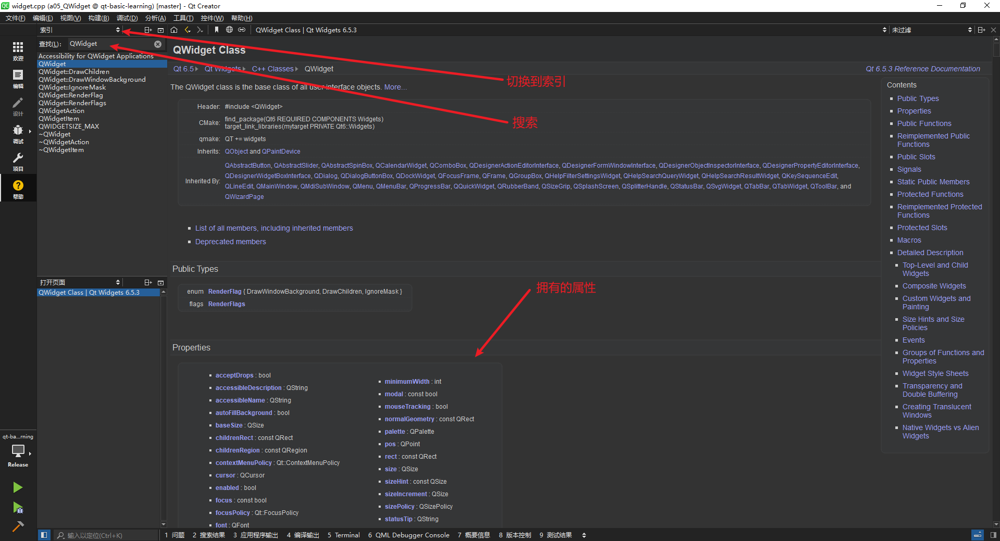
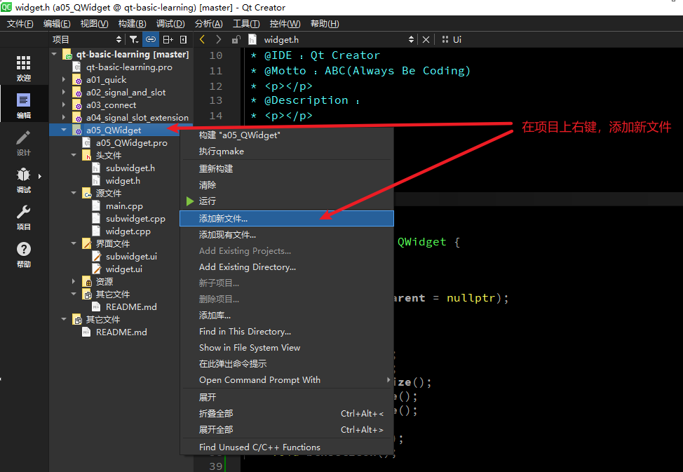
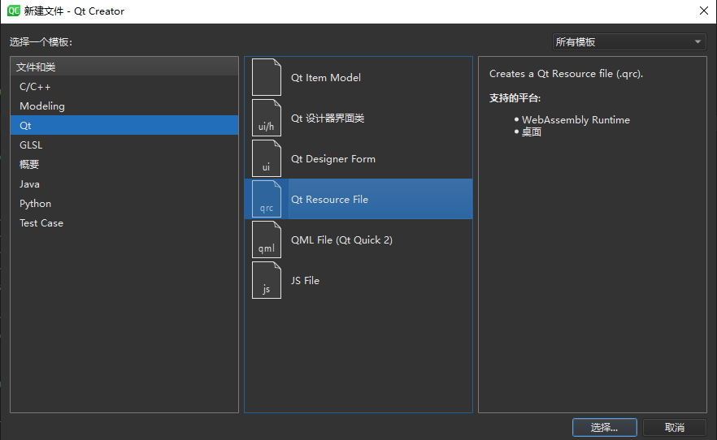
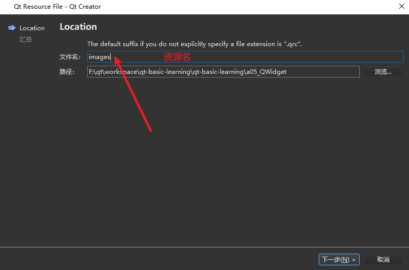
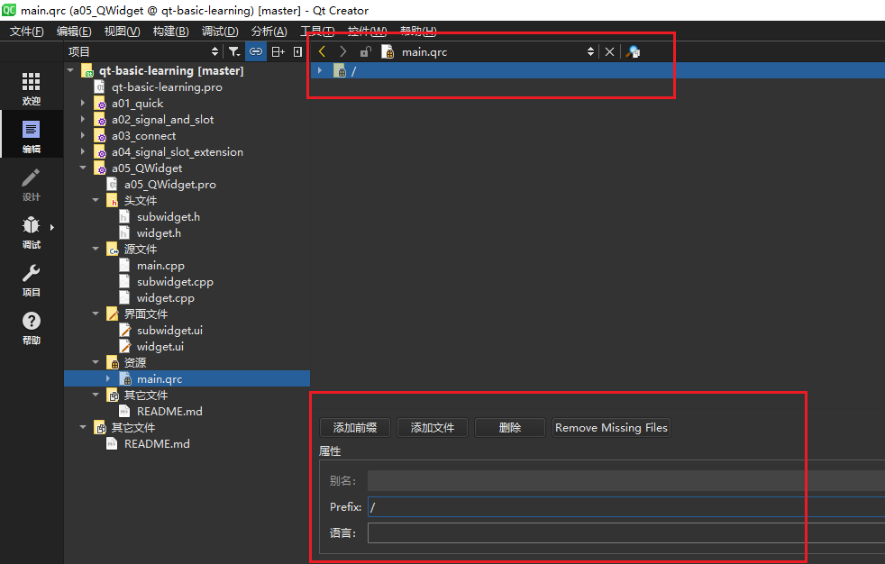
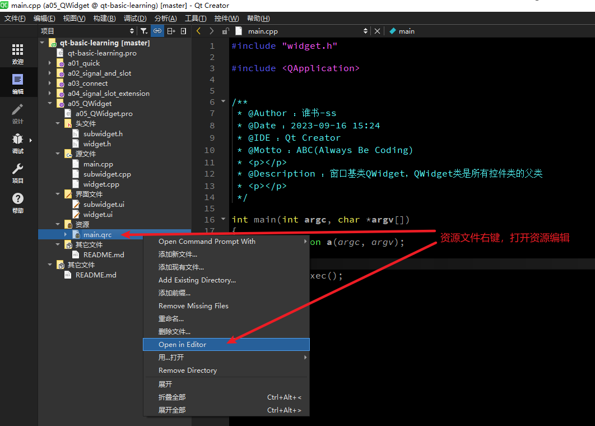
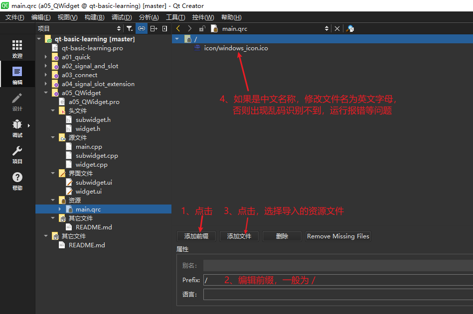
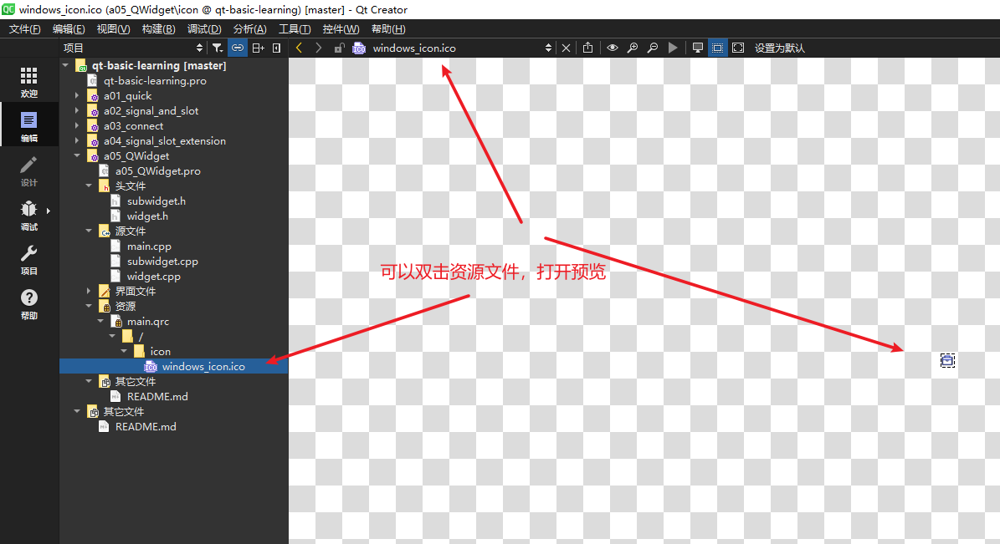

# a05_QWidget

## 学习内容

由于`QWidget`类是所有控件类的父类，并且在`a01_quick`中就已经使用到了，因此需要先来学习QWidget相关技术点。

- 所有窗口类的基类
  Qt中有3个窗口的基类：`QWidget`、`QMainWindow`、`QDialog`；在创建Qt工程时，会让我们选择继承自哪一个窗口类；其中，`QMainWindow`、`QDialog`都是继承自`QWidge`
- 所有控件类的基类
  Qt中的控件类（按钮、输入框、单选框等）也属于窗口类，它们的基类也是`QWidget`
- 可以内嵌到其他窗口的内部，此时需要给其指定父窗口
- 可以作为独立的窗口显示，此时不能给其指定父窗口

基于案例一步步的使用！


## 如何显示QWidget窗口

1、新建一个基于QWidget的子窗口类，类名为`SubWidget`，

2、以创建工程时创建的`Widget`为父类（`widget.cpp`），要显示子窗口`SubWidget`（`subWidget.cpp`），需要在父类`Widget`中调用，即在`widget.cpp`中调用
```c++
#include "widget.h"
#include "ui_widget.h"
#include "subwidget.h"


/**
 * @Author ：谁书-ss
 * @Date ：2023-09-16 15:24
 * @IDE ：Qt Creator
 * @Motto ：ABC(Always Be Coding)
 * <p></p>
 * @Description ：
 * <p></p>
 */

Widget::Widget(QWidget *parent)
    : QWidget(parent)
    , ui(new Ui::Widget) {
    ui->setupUi(this);

    //未指定父窗口，那么这个窗口就是独立的窗口，需要调用其show方法来显示，运行之后，出现两个独立窗口
    //SubWidget* subWidget = new SubWidget();
    //subWidget->setWindowTitle("SubWidget");
    //subWidget->show();

    // 如果指定了父窗口，那么就不需要调用show方法了，因为父窗口显示时，会将其子窗口一起显示出来。
    SubWidget *subWidget = new SubWidget(this);
    subWidget->setWindowTitle("SubWidget");

}

Widget::~Widget() {
    delete ui;
}
```

## 常用的属性和方法

### Qt帮助文档

可以点击`Qt Creator`工具左侧的【帮助】，切换到【索引】，输入QWidget，就可以查看 QWidget 的详细帮助文档，如下：




### 设置窗口属性

位置、大小、标题、图标、资源文件

`widget.h` 头文件
```c++
#ifndef WIDGET_H
#define WIDGET_H

#include <QWidget>


/**
 * @Author ：谁书-ss
 * @Date ：2023-09-16 15:24
 * @IDE ：Qt Creator
 * @Motto ：ABC(Always Be Coding)
 * <p></p>
 * @Description ：
 * <p></p>
 */

QT_BEGIN_NAMESPACE
namespace Ui {
    class Widget;
}
QT_END_NAMESPACE

class Widget : public QWidget {
    Q_OBJECT

public:
    Widget(QWidget *parent = nullptr);
    ~Widget();

public slots:
    void btnGetSize();
    void btnSetSize();
    void btnSetFixedSize();
    void btnSetMinSize();
    void btnSetMaxSize();
    void btnMove();
    void btnSetTitle();
    void btnSetIcon();

private:
    Ui::Widget *ui;
};
#endif // WIDGET_H

```


`widget.cpp` 源文件
```c++
#include "widget.h"
#include "ui_widget.h"

#include "QDebug"

/**
 * @Author ：谁书-ss
 * @Date ：2023-09-16 15:24
 * @IDE ：Qt Creator
 * @Motto ：ABC(Always Be Coding)
 * <p></p>
 * @Description ：
 * <p></p>
 */

Widget::Widget(QWidget *parent)
    : QWidget(parent)
    , ui(new Ui::Widget) {
    ui->setupUi(this);

    //未指定父窗口，那么这个窗口就是独立的窗口，需要调用其show方法来显示，运行之后，出现两个独立窗口
    // SubWidget* subWidget = new SubWidget();
    // subWidget->setWindowTitle("SubWidget");
    // subWidget->show();

    // 如果指定了父窗口，那么就不需要调用show方法了，因为父窗口显示时，会将其子窗口一起显示出来。
    // SubWidget *subWidget = new SubWidget(this);
    // subWidget->setWindowTitle("SubWidget");

    // 获取窗口大小，位置
    connect(ui->btnGetSize, &QPushButton::clicked, this, &Widget::btnGetSize);
    // 设置窗口大小
    connect(ui->btnSetSize, &QPushButton::clicked, this, &Widget::btnSetSize);
    // 设置窗口固定大小
    connect(ui->btnSetFixedSize, &QPushButton::clicked, this, &Widget::btnSetFixedSize);
    // 设置窗口最小大小
    connect(ui->btnSetMinSize, &QPushButton::clicked, this, &Widget::btnSetMinSize);
    // 设置窗口最大大小
    connect(ui->btnSetMaxSize, &QPushButton::clicked, this, &Widget::btnSetMaxSize);
    // 设置窗口移动到：（100,100）
    connect(ui->btnMove, &QPushButton::clicked, this, &Widget::btnMove);
    // 设置窗口标题
    connect(ui->btnSetTitle, &QPushButton::clicked, this, &Widget::btnSetTitle);
    // 设置窗口Icon
    connect(ui->btnSetIcon, &QPushButton::clicked, this, &Widget::btnSetIcon);

}

Widget::~Widget() {
    delete ui;
}

void Widget::btnGetSize() {
    qDebug() << "--------------获取窗口信息---------------";
    QRect rect = this->geometry();
    qDebug() << "左上：" << rect.topLeft();
    qDebug() << "右上：" << rect.topRight();
    qDebug() << "左下：" << rect.bottomLeft();
    qDebug() << "右下：" << rect.bottomRight();
    qDebug() << "宽：" << rect.width();
    qDebug() << "高：" << rect.height();
}
void Widget::btnSetSize() {
    qDebug() << "--------------设置窗口大小---------------";
    this->resize(400, 400);
}
void Widget::btnSetFixedSize() {
    qDebug() << "--------------设置窗口固定大小---------------";
    this->setFixedSize(500, 500);
}
void Widget::btnSetMinSize() {
    qDebug() << "--------------设置窗口最小大小---------------";
    this->setMinimumSize(300, 300);
}
void Widget::btnSetMaxSize() {
    qDebug() << "--------------设置窗口最大大小---------------";
    this->setMaximumSize(600, 600);
}
void Widget::btnMove() {
    qDebug() << "--------------设置窗口移动到：（100,100）---------------";
    this->move(100, 100);
}
void Widget::btnSetTitle() {
    qDebug() << "--------------设置窗口标题---------------";
    this->setWindowTitle("标题05_QWidget");
}
void Widget::btnSetIcon() {
    qDebug() << "--------------设置窗口Icon---------------";
    // 不能用中文
    this->setWindowIcon(QIcon(":/icon/windows_icon.ico"));
}

```

### 图标、资源文件的使用

项目右键 > 添加新文件。如下图所示：


QT > Qt Resource File。如下图所示：


`文件名`不是具体导入的图片名或视频文件名称。这里的`文件名`相当于一个文件夹的名称，而文件夹下可以有多张图片或视频文件，所以这里的`文件名`其实就是一个资源文件的分组名。如下图所示：


点击下一步；点击完成之后，进入到资源编辑页面。如下图所示：


如果没有出现上面的资源编辑页面，就进行以下操作。如下图所示：


添加资源文件（图片、视频），操作完之后，记得`Ctrl + S`保存


查看预览资源

