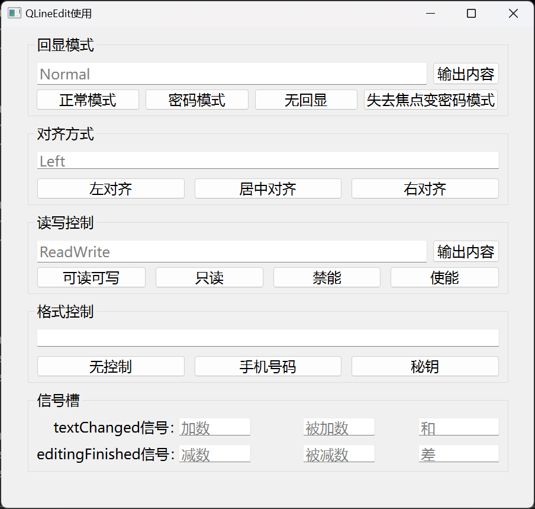

# a08_QLineEdit

## 学习内容

`QLineEdit`是Qt中的文本框，准确地说是单行文本框，通常用于接受用户的输入。

`QLineEdit` 中内置的信号
- cursorPositionChanged(int, int)
- editingFinished()
- inputRejected()
- returnPressed()
- selectionChanged()
- textChanged(QString)
- textEdited(QString)


## 属性和方法

**效果**




`widget.h` 头文件
```c++
#ifndef WIDGET_H
#define WIDGET_H

#include <QWidget>


/**
 * @Author ：谁书-ss
 * @Date ：2023-12-03 14:56
 * @IDE ：Qt Creator
 * @Motto ：ABC(Always Be Coding)
 * <p></p>
 * @Description ：
 * <p></p>
 */

QT_BEGIN_NAMESPACE
namespace Ui {
class Widget;
}
QT_END_NAMESPACE

class Widget : public QWidget
{
    Q_OBJECT

public:
    Widget(QWidget *parent = nullptr);
    ~Widget();

private slots:
    // 回显模式
    void btnEchoNormal();
    void btnEchoPassword();
    void btnEchoNoEcho();
    void btnEchoPasswordEchoOnEdit();
    void btnEchoPrint();
    // 对齐方式
    void btnAlignLeft();
    void btnAlignCenter();
    void btnAlignRight();
    // 读写控制
    void btnAccessReadWrite();
    void btnAccessReadOnly();
    void btnAccessDisabled();
    void btnAccessEnabled();
    void btnAccessPrint();
    // 格式控制
    void btnMaskNone();
    void btnMaskPhone();
    void btnMaskLicense();
    // 信号槽
    void leAdd1_TextChanged(const QString &arg1);
    void leAdd2_TextChanged(const QString &arg1);
    void leSub1_EditingFinished();
    void leSub2_EditingFinished();


private:
    Ui::Widget *ui;
};
#endif // WIDGET_H

```

`widget.cpp` 源文件
```c++
#include "widget.h"
#include "ui_widget.h"
#include "QDebug"
#include "qvalidator.h"

#include "QMessageBox"
#include "QTime"
#include "QPixmap"

/**
 * @Author ：谁书-ss
 * @Date ：2023-12-03 14:56
 * @IDE ：Qt Creator
 * @Motto ：ABC(Always Be Coding)
 * <p></p>
 * @Description ：
 * <p></p>
 */

Widget::Widget(QWidget *parent)
    : QWidget(parent)
    , ui(new Ui::Widget) {
    ui->setupUi(this);
    this->setWindowTitle("QLineEdit使用");

    // 默认 正常模式
    btnEchoNormal();
    // 默认 左对齐
    btnAlignLeft();
    // 默认 可读可写
    btnAccessReadWrite();
    // 默认 无格式控制
    btnMaskNone();
    // 设置校验,只允许文本框中输入整数
    ui->leAdd1->setValidator(new QIntValidator(this));
    ui->leAdd1->setPlaceholderText("加数");
    ui->leAdd2->setValidator(new QIntValidator(this));
    ui->leAdd2->setPlaceholderText("被加数");
    ui->leAddResult->setPlaceholderText("和");
    // 设置校验,只允许文本框中输入整数
    ui->leSub1->setValidator(new QIntValidator(this));
    ui->leSub1->setPlaceholderText("减数");
    ui->leSub2->setValidator(new QIntValidator(this));
    ui->leSub2->setPlaceholderText("被减数");
    ui->leSubResult->setPlaceholderText("差");


    // 1、回显模式
    connect(ui->btnEchoNormal, &QPushButton::clicked, this, &Widget::btnEchoNormal);
    connect(ui->btnEchoPassword, &QPushButton::clicked, this, &Widget::btnEchoPassword);
    connect(ui->btnEchoNoEcho, &QPushButton::clicked, this, &Widget::btnEchoNoEcho);
    connect(ui->btnEchoPasswordEchoOnEdit, &QPushButton::clicked, this, &Widget::btnEchoPasswordEchoOnEdit);
    connect(ui->btnEchoPrint, &QPushButton::clicked, this, &Widget::btnEchoPrint);
    // 2、对齐方式
    connect(ui->btnAlignLeft, &QPushButton::clicked, this, &Widget::btnAlignLeft);
    connect(ui->btnAlignCenter, &QPushButton::clicked, this, &Widget::btnAlignCenter);
    connect(ui->btnAlignRight, &QPushButton::clicked, this, &Widget::btnAlignRight);
    // 3、读写控制
    connect(ui->btnAccessReadWrite, &QPushButton::clicked, this, &Widget::btnAccessReadWrite);
    connect(ui->btnAccessReadOnly, &QPushButton::clicked, this, &Widget::btnAccessReadOnly);
    connect(ui->btnAccessDisabled, &QPushButton::clicked, this, &Widget::btnAccessDisabled);
    connect(ui->btnAccessEnabled, &QPushButton::clicked, this, &Widget::btnAccessEnabled);
    connect(ui->btnAccessPrint, &QPushButton::clicked, this, &Widget::btnAccessPrint);
    // 4、格式控制
    connect(ui->btnMaskNone, &QPushButton::clicked, this, &Widget::btnMaskNone);
    connect(ui->btnMaskPhone, &QPushButton::clicked, this, &Widget::btnMaskPhone);
    connect(ui->btnMaskLicense, &QPushButton::clicked, this, &Widget::btnMaskLicense);
    // 5、信号槽演示
    connect(ui->leAdd1, &QLineEdit::textChanged, this, &Widget::leAdd1_TextChanged);
    connect(ui->leAdd2, &QLineEdit::textChanged, this, &Widget::leAdd1_TextChanged);
    connect(ui->leSub1, &QLineEdit::editingFinished, this, &Widget::leSub1_EditingFinished);
    connect(ui->leSub2, &QLineEdit::editingFinished, this, &Widget::leSub2_EditingFinished);
}

Widget::~Widget() {
    delete ui;
}

// 1、回显模式
// 1.1 正常模式
void Widget::btnEchoNormal() {
    ui->leEcho->clear();
    ui->leEcho->setEchoMode(QLineEdit::Normal);
    ui->leEcho->setPlaceholderText("Normal");
}
// 1.2 密码模式
void Widget::btnEchoPassword() {
    ui->leEcho->clear();
    ui->leEcho->setEchoMode(QLineEdit::Password);
    ui->leEcho->setPlaceholderText("Password");
}
// 1.3 不回显
void Widget::btnEchoNoEcho() {
    ui->leEcho->clear();
    ui->leEcho->setEchoMode(QLineEdit::NoEcho);
    ui->leEcho->setPlaceholderText("NoEcho");
}
// 1.4 失去焦点时为密码模式
void Widget::btnEchoPasswordEchoOnEdit() {
    ui->leEcho->clear();
    ui->leEcho->setEchoMode(QLineEdit::PasswordEchoOnEdit);
    ui->leEcho->setPlaceholderText("PasswordEchoOnEdit");
}
// 输出内容
void Widget::btnEchoPrint() {
    QMessageBox::information(this, "回显模式", ui->leEcho->text());
}

// 2、对齐方式
// 2.1 左对齐
void Widget::btnAlignLeft() {
    ui->leAlignment->setAlignment(Qt::AlignLeft);
    ui->leAlignment->setPlaceholderText("Left");
}
// 2.2 居中对齐
void Widget::btnAlignCenter() {
    ui->leAlignment->setAlignment(Qt::AlignCenter);
    ui->leAlignment->setPlaceholderText("Center");
}
// 2.3 右对齐
void Widget::btnAlignRight() {
    ui->leAlignment->setAlignment(Qt::AlignRight);
    ui->leAlignment->setPlaceholderText("Right");
}

// 3、读写控制
// 3.1 可读可写
void Widget::btnAccessReadWrite() {
    ui->leAccess->setReadOnly(false);
    ui->leAccess->setPlaceholderText("ReadWrite");
}
// 3.2 只读
void Widget::btnAccessReadOnly() {
    ui->leAccess->setReadOnly(true);
    ui->leAccess->setPlaceholderText("ReadOnly");
}
// 3.3 禁能
void Widget::btnAccessDisabled() {
    ui->leAccess->setEnabled(false);
    ui->leAccess->setPlaceholderText("Disabled");
}
// 3.4 使能
void Widget::btnAccessEnabled() {
    ui->leAccess->setEnabled(true);
    ui->leAccess->setPlaceholderText("Enabled");
}
// 输出内容
void Widget::btnAccessPrint() {
    QMessageBox::information(this, "文本框演示", ui->leAccess->text());
}

// 4、格式控制
// 4.1 无格式
void Widget::btnMaskNone() {
    ui->leMask->setInputMask("");
}
// 4.2 电话号码格式
void Widget::btnMaskPhone() {
    // ;# - 表示格式字符串结束，并且未输入时显示#
    ui->leMask->setInputMask("99999999999;#");
}
// 4.3 密钥格式
void Widget::btnMaskLicense() {
    ui->leMask->setInputMask(">AAAAA-AAAAA-AAAAA-AAAAA-AAAAA;*");
}

// 5、信号槽演示
// 5.1 textChanged信号 - 实现自动计算加法结果
void Widget::leAdd1_TextChanged(const QString &arg1) {
    int sum = arg1.toInt() + ui->leAdd2->text().toInt();
    ui->leAddResult->setText(QString::number(sum));
}
void Widget::leAdd2_TextChanged(const QString &arg1) {
    int sum = arg1.toInt() + ui->leAdd1->text().toInt();
    ui->leAddResult->setText(QString::number(sum));
}
// 5.2 editingFinished信号 - 实现自动计算减法结果
void Widget::leSub1_EditingFinished() {
    int result = ui->leSub1->text().toInt() - ui->leSub2->text().toInt();
    ui->leSubResult->setText(QString::number(result));
}
void Widget::leSub2_EditingFinished() {
    int result = ui->leSub1->text().toInt() - ui->leSub2->text().toInt();
    ui->leSubResult->setText(QString::number(result));
}

```

