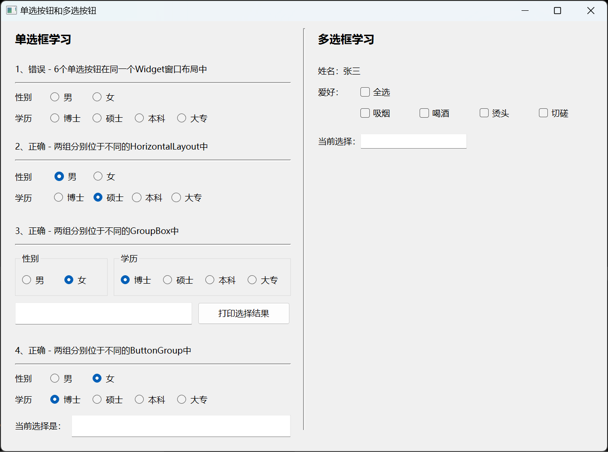

# a09_QRadioButton_and_QCheckBox

## 学习内容

- Qt中的单选按钮类是`QRadioButton`
  它是一个可以切换选中（checked）或未选中（unchecked）状态的单选按钮，单选按钮常用在 “多选一” 的场景，也就是说，在一组单选按钮中，一次只能选中一个单选按钮。比如性别中的 “男女” 二选一，学历中的 “博士/硕士/本科/其他” 四选一，等等。
- Qt中的复选按钮类是`QCheckBox`
  它和单选按钮很相似，单选按钮常用在 “多选一” 的场景，而复选按钮常用在 "多选多"的场景比如喜欢的水果选项中，可以在 “苹果/桃/梨/橘子/香蕉” 中选择多个。


## 属性和方法

### 文本
这两个是其父类 QAbstractButton 中的属性和方法，因此 QPushButton、QRadioButton、QCheckBox 都具有该属性
```c++
// 获取和设置显示的文本
QString text() const
void setText(const QString &text)
```

### 状态

单选按钮，有选中（Checked）和非选中（UnChecked）这两种状态；
```c++
// 获取和设置单选按钮的选中状态
bool isChecked() const
void setChecked(bool)
```

复选按钮可以有三种状态：
- Qt::Checked 选中
- Qt::Unchecked 非选中
- Qt::PartiallyChecked 半选中，比如当一组复选按钮中只选择了部分时，可以设置其父项为半选状态，如下

可以设置复选按钮，是否支持三态，如下：
```c++
// 用于获取和设置是否支持三态
bool isTristate() const
void setTristate(bool y = true)
```

如果不支持三态，使用方法单选按钮一样，只有选中（Checked）和非选中（unchecked）两种状态，没有半选中状态（ PartiallyChecked ）

此时可以使用如下获取复选按钮是否选中：
```c++
// 获取和设置复选按钮是否选中：checked/unchecked
bool isChecked() const
void setChecked(bool)
```

如果支持三态，除了选中（Checked）和非选中（unchecked）两种状态，还有半选中状态（ PartiallyChecked ）

此时可以使用如下获取复选按钮的状态：
```c++
// 设置和获取复选按钮的状态
Qt::CheckState checkState() const
void setCheckState(Qt::CheckState state)
```

### 自动排他

单选按钮实现的是 “多选一”，因此单选按钮的该属性默认是使能的，复选按钮同样可以设置是否自动排他
```c++
// 获取和设置自动排他
bool autoExclusive() const
void setAutoExclusive(bool)
```

## 案例

**效果**



`widget.h` 头文件
```c++
#ifndef WIDGET_H
#define WIDGET_H

#include <QWidget>
#include <QButtonGroup>

/**
 * @Author ：谁书-ss
 * @Date ：2023-12-03 17:09
 * @IDE ：Qt Creator
 * @Motto ：ABC(Always Be Coding)
 * <p></p>
 * @Description ：
 * <p></p>
 */

QT_BEGIN_NAMESPACE
namespace Ui {
class Widget;
}
QT_END_NAMESPACE

class Widget : public QWidget
{
    Q_OBJECT

public:
    Widget(QWidget *parent = nullptr);
    ~Widget();

private slots:
    void btnGetSelectionClicked();
    void onRadioButtonClicked();
    void cbAllClicked();
    void onStateChanged();

private:
    Ui::Widget *ui;
    QButtonGroup* buttonGroup;
    QButtonGroup* buttonGroup2;
};
#endif // WIDGET_H

```

`widget.cpp` 源文件
```c++
#include "widget.h"
#include "ui_widget.h"


/**
 * @Author ：谁书-ss
 * @Date ：2023-12-03 17:09
 * @IDE ：Qt Creator
 * @Motto ：ABC(Always Be Coding)
 * <p></p>
 * @Description ：
 * <p></p>
 */

Widget::Widget(QWidget *parent)
    : QWidget(parent)
    , ui(new Ui::Widget)
{
    ui->setupUi(this);
    this->setWindowTitle("单选按钮和多选按钮");

    // =========================================================== 单选组件
    // 第二组
    ui->rb2_1->setChecked(true);
    ui->rb2_4->setChecked(true);
    // 第三组
    ui->rb3_2->setChecked(true);
    ui->rb3_3->setChecked(true);
    connect(ui->btn3, &QPushButton::clicked, this, &Widget::btnGetSelectionClicked);
    // 第四组
    buttonGroup = new QButtonGroup(this);
    buttonGroup->addButton(ui->rb4_1, 1);
    buttonGroup->addButton(ui->rb4_2, 2);
    ui->rb4_2->setChecked(true);
    buttonGroup2 = new QButtonGroup(this);
    buttonGroup2->addButton(ui->rb4_3, 3);
    buttonGroup2->addButton(ui->rb4_4, 4);
    buttonGroup2->addButton(ui->rb4_5, 5);
    buttonGroup2->addButton(ui->rb4_6, 6);
    ui->rb4_3->setChecked(true);

    connect(ui->rb4_1, &QRadioButton::clicked, this, &Widget::onRadioButtonClicked);
    connect(ui->rb4_2, &QRadioButton::clicked, this, &Widget::onRadioButtonClicked);
    connect(ui->rb4_3, &QRadioButton::clicked, this, &Widget::onRadioButtonClicked);
    connect(ui->rb4_4, &QRadioButton::clicked, this, &Widget::onRadioButtonClicked);
    connect(ui->rb4_5, &QRadioButton::clicked, this, &Widget::onRadioButtonClicked);
    connect(ui->rb4_6, &QRadioButton::clicked, this, &Widget::onRadioButtonClicked);


    // =========================================================== 多选组件
    // 这里需要将“全选”按钮的状态设置为false
    // 鼠标点击时，只允许在checked和unchecked之间切换，不允许出现半选状态
    ui->cbAll->setTristate(false);
    // 多选按
    connect(ui->cbAll, &QCheckBox::stateChanged, this, &Widget::cbAllClicked);
    // 5个复选按钮对应同一个槽函数
    connect(ui->cb1, &QCheckBox::stateChanged, this, &Widget::onStateChanged);
    connect(ui->cb2, &QCheckBox::stateChanged, this, &Widget::onStateChanged);
    connect(ui->cb3, &QCheckBox::stateChanged, this, &Widget::onStateChanged);
    connect(ui->cb4, &QCheckBox::stateChanged, this, &Widget::onStateChanged);


}

Widget::~Widget()
{
    delete ui;
}

void Widget::btnGetSelectionClicked(){
    QString s;

    if(ui->rb3_1->isChecked()) {
        s += ui->rb3_1->text();
    } else if(ui->rb3_2->isChecked()) {
        s += ui->rb3_2->text();
    }

    if(ui->rb3_3->isChecked()) {
        s += ui->rb3_3->text();
    } else if(ui->rb3_4->isChecked()) {
        s += ui->rb3_4->text();
    } else if(ui->rb3_5->isChecked()) {
        s += ui->rb3_5->text();
    } else if(ui->rb3_6->isChecked()) {
        s += ui->rb3_6->text();
    }

    ui->te3->setText(s);
}

void Widget::onRadioButtonClicked()
{
    QString s;

    int checkedGenderId = buttonGroup->checkedId();
    if(checkedGenderId == 1) {
        s += "男";
    } else if(checkedGenderId == 2) {
        s += "女";
    }

    int checkedEduId = buttonGroup2->checkedId();
    if(checkedEduId == 3) {
        s += "博士";
    } else if(checkedEduId == 4) {
        s += "硕士";
    } else if(checkedEduId == 5) {
        s += "本科";
    } else if(checkedEduId == 6) {
        s += "大专";
    } else if(checkedEduId == 6) {
        s += "其他";
    }

    ui->te4->setText(s);
}

void Widget::cbAllClicked() {
    Qt::CheckState state = ui->cbAll->checkState();
    if(state == Qt::Checked) {
        ui->cb1->setChecked(true);
        ui->cb2->setChecked(true);
        ui->cb3->setChecked(true);
        ui->cb4->setChecked(true);
    } else if(state == Qt::Unchecked) {
        ui->cb1->setChecked(false);
        ui->cb2->setChecked(false);
        ui->cb3->setChecked(false);
        ui->cb4->setChecked(false);
    } else {

    }
}

void Widget::onStateChanged() {
    QString s;

    int cb1Checked = ui->cb1->isChecked();
    int cb2Checked = ui->cb2->isChecked();
    int cb3Checked = ui->cb3->isChecked();
    int cb4Checked = ui->cb4->isChecked();

    if(cb1Checked && cb2Checked && cb3Checked && cb4Checked) {
        // 全部选中
        ui->cbAll->setCheckState(Qt::Checked);
    } else if (!(cb1Checked || cb2Checked || cb3Checked || cb4Checked)) {
        // 全部未选中
        ui->cbAll->setCheckState(Qt::Unchecked);
    } else {
        // 部分选中
        ui->cbAll->setCheckState(Qt::PartiallyChecked);
    }

    if(cb1Checked) {
        s += ui->cb1->text() += " ";
    }
    if(cb2Checked) {
        s += ui->cb2->text() += " ";
    }
    if(cb3Checked) {
        s += ui->cb3->text() += " ";
    }
    if(cb4Checked) {
        s += ui->cb4->text() += " ";
    }

    ui->leResult->setText(s);
}

```
