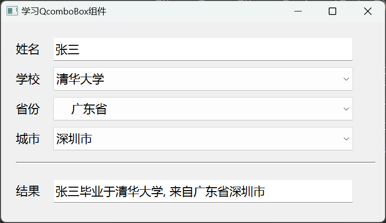

# a10_QComboBox

## 学习内容

Qt中的组合框是集 按钮和下拉列表于一体的控件，它占用的屏幕空间很小，对应的类是`QComboBox`


## 属性和方法

### 文本

当前组合框中当前项的索引和文本
```c++
// 获取当前条目的索引和文本
int currentIndex() const
QString currentText() const

// 获取和设置指定索引条目的文本    
QString itemText(int index) const
void setItemText(int index, const QString &text)
```


### 图标

给条目添加图标

```c++
// 获取和设置对应索引条目的图标
QIcon itemIcon(int index) const
void setItemIcon(int index, const QIcon &icon)
```


### 插入和删除

向组合框`QComboBox`中插入和删除项目

**新增条目：可以一次新增一个条目，也可以一次新增多个条目**

```c++
// 一次新增一个条目
void addItem(const QString &text, const QVariant &userData = QVariant())
void addItem(const QIcon &icon, const QString &text, const QVariant &userData = QVariant())
    
// 一次新增多个条目    
void addItems(const QStringList &texts)
```

**插入条目：可以一次插入一个条目，也可以一次插入多个条目**

```c++
// 一次插入一个条目
void insertItem(int index, const QString &text, const QVariant &userData = QVariant())
void insertItem(int index, const QIcon &icon, const QString &text, const QVariant &userData = QVariant())

// 一次插入一个条目
void insertItems(int index, const QStringList &list)
```

**插入策略：在插入条目时，还可以指定插入的策略**

```c++
// 获取和设置插入策略
QComboBox::InsertPolicy insertPolicy() const
void setInsertPolicy(QComboBox::InsertPolicy policy)
```

常用的插入策略有：

- QComboBox::NoInsert 不插入
- QComboBox::InsertAtTop 作为第一条条目插入（替换原第一条条目）
- QComboBox::InsertAtCurrent 替换当前条目
- QComboBox::InsertAtBottom 在最后一个条目之后插入
- QComboBox::InsertAfterCurrent 在当前条目之后插入
- QComboBox::InsertBeforeCurrent 在当前条目之前插入
- QComboBox::InsertAlphabetically 按英文字母顺序插入

**插入分隔符：用于在条目之间插入一条分隔符**

```c++
// 在指定索引位置处插入分隔符
void insertSeparator(int index)
```

**删除条目：删除指定索引位置的条目**

```c++
// 删除指定索引的条目
void removeItem(int index)
```


### 信号槽

```c++
// 当前选中的条目变化时，会发射这两个信号
void currentIndexChanged(int index)
void currentTextChanged(const QString &text)
```

## 案例

**效果**



`widget.h` 头文件
```c++
#ifndef WIDGET_H
#define WIDGET_H

#include <QWidget>


/**
 * @Author ：谁书-ss
 * @Date ：2023-12-05 16:24
 * @IDE ：Qt Creator
 * @Motto ：ABC(Always Be Coding)
 * <p></p>
 * @Description ：
 * <p></p>
 */

QT_BEGIN_NAMESPACE
namespace Ui {
class Widget;
}
QT_END_NAMESPACE

class Widget : public QWidget
{
    Q_OBJECT

public:
    Widget(QWidget *parent = nullptr);
    ~Widget();

private slots:
    void onCboUniversityChanged(int index);
    void onCboProvinceChanged(int index);
    void onCboCityChanged(int index);
    void onLineEditChanged();

private:
    Ui::Widget *ui;
};
#endif // WIDGET_H

```

`widget.cpp` 源文件
```c++
#include "widget.h"
#include "ui_widget.h"


/**
 * @Author ：谁书-ss
 * @Date ：2023-12-05 16:24
 * @IDE ：Qt Creator
 * @Motto ：ABC(Always Be Coding)
 * <p></p>
 * @Description ：
 * <p></p>
 */

QStringList gdCityList = {"广州市", "深圳市", "珠海市", "东莞市"};
QStringList zjCityList = {"杭州市", "宁波市", "温州市", "绍兴市"};
QStringList sdCityList = {"济南市", "青岛市", "烟台市", "威海市"};
QStringList hbCityList = {"石家庄市", "保定市", "廊坊市", "衡水市"};
QStringList nmCityList = {"呼和浩特市", "包头市", "呼伦贝尔市", "赤峰市"};
QStringList hnCityList = {"郑州市", "新乡市", "鹤壁市", "安阳市", "濮阳市"};

Widget::Widget(QWidget *parent)
    : QWidget(parent)
    , ui(new Ui::Widget) {
    ui->setupUi(this);
    this->setWindowTitle("学习QcomboBox组件");

    // 添加大学
    ui->cboUniversity->addItem("清华大学");
    ui->cboUniversity->addItem("北京大学");
    ui->cboUniversity->addItem("中国人民大学");

    // 添加省份
    ui->cboProvince->addItem("广东省");
    ui->cboProvince->addItem("浙江省");
    ui->cboProvince->addItem("山东省");
    ui->cboProvince->addItem("河北省");
    ui->cboProvince->addItem("内蒙古自治区省");
    ui->cboProvince->addItem("河南省");

    // 为省份条目添加图标
    ui->cboProvince->setItemIcon(0, QIcon(":/icon/gd.ico"));
    ui->cboProvince->setItemIcon(1, QIcon(":/icon/zj.ico"));
    ui->cboProvince->setItemIcon(2, QIcon(":/icon/sd.ico"));
    ui->cboProvince->setItemIcon(3, QIcon(":/icon/hb.ico"));
    ui->cboProvince->setItemIcon(4, QIcon(":/icon/nm.ico"));
    ui->cboProvince->setItemIcon(5, QIcon(":/icon/he.ico"));
    // 默认选中第一项-广东省
    ui->cboProvince->setCurrentIndex(0);

    // 添加城市
    ui->cboCity->addItems(gdCityList);

    // 信号槽
    connect(ui->cboUniversity, &QComboBox::currentIndexChanged, this, &Widget::onCboUniversityChanged);
    connect(ui->cboProvince, &QComboBox::currentIndexChanged, this, &Widget::onCboProvinceChanged);
    connect(ui->cboCity, &QComboBox::currentIndexChanged, this, &Widget::onCboCityChanged);

    // 姓名文本框变化时，更新结果
    connect(ui->leName, &QLineEdit::textChanged, this, &Widget::onLineEditChanged);

}

Widget::~Widget() {
    delete ui;
}

void Widget::onCboUniversityChanged(int index) {
    // 获取姓名、大学、省份、城市
    QString name = ui->leName->text();
    QString university = ui->cboUniversity->currentText();
    QString province = ui->cboProvince->currentText();
    QString city = ui->cboCity->currentText();

    if(!name.isEmpty()) {
        ui->leResult->setText(name + "毕业于" + university + ", 来自" + province + city);
    }
}

void Widget::onCboProvinceChanged(int index) {
    // 先将city对应的列表清空
    ui->cboCity->clear();

    switch (index) {
    case 0:
        ui->cboCity->addItems(gdCityList);
        break;
    case 1:
        ui->cboCity->addItems(zjCityList);
        break;
    case 2:
        ui->cboCity->addItems(sdCityList);
        break;
    case 3:
        ui->cboCity->addItems(hbCityList);
        break;
    case 4:
        ui->cboCity->addItems(nmCityList);
        break;
    case 5:
        ui->cboCity->addItems(hnCityList);
        break;
    default:
        break;
    }

    // 获取姓名、大学、省份、城市
    QString name = ui->leName->text();
    QString university = ui->cboUniversity->currentText();
    QString province = ui->cboProvince->currentText();
    QString city = ui->cboCity->currentText();

    if(!name.isEmpty()) {
        ui->leResult->setText(name + "毕业于" + university + ", 来自" + province + city);
    }
}

void Widget::onCboCityChanged(int index) {
    // 获取姓名、大学、省份、城市
    QString name = ui->leName->text();
    QString university = ui->cboUniversity->currentText();
    QString province = ui->cboProvince->currentText();
    QString city = ui->cboCity->currentText();

    if(!name.isEmpty()) {
        ui->leResult->setText(name + "毕业于" + university + ", 来自" + province + city);
    }
}

void Widget::onLineEditChanged() {
    // 获取姓名、大学、省份、城市
    QString name = ui->leName->text();
    QString university = ui->cboUniversity->currentText();
    QString province = ui->cboProvince->currentText();
    QString city = ui->cboCity->currentText();

    if(!name.isEmpty()) {
        ui->leResult->setText(name + "毕业于" + university + ", 来自" + province + city);
    }
}

```

