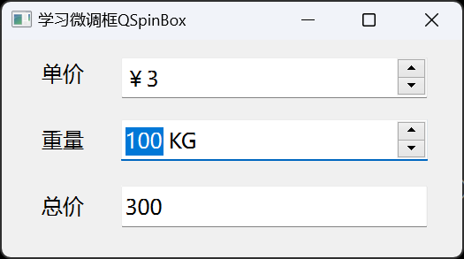

# a11_QSpinBox

## 学习内容

微调框`QSpinBox`，允许按照一定的步长，来增加或减少其中显示的数值

修改微调框数值的方式包括：
- 单击右侧的向上/向下按钮
- 按键盘的向上/向下键
- 在微调框获取焦点时，通过鼠标滚轮的上下滚动
- 手动输入

`QSpinBox` ：用于整数的显示和输入
`DoubleSpinBox` ：用于浮点数的显示和输入

它们都是 `QAbstractSpinBox` 的子类，具有大多数相同的属性，只是参数类型不同（一个`int`，一个`double`）


## 属性和方法

### 值

微调框和值相关的属性包括：当前值、最大值、最小值

```c++
// 获取和设置当前值
int value() const
void setValue(int val)

// 获取和设置最大值
int maximum() const
void setMaximum(int max)

// 获取和设置最小值
int minimum() const
void setMinimum(int min)

// 一次设置最大值和最小值
void setRange(int minimum, int maximum)
```


### 步长

步长是指按右侧上下调整按钮时的单步改变值，也就是按一次，增加或减少的值

```c++
// 获取和设置步长
 int singleStep() const
 void setSingleStep(int val)
```


### 循环

`wrapping` 属性用于设置是否允许循环

比如范围设置为 `0-99`

- 当数值达到 `99` 时，再点击向上的按钮，此时数值会变为 `0`
- 当数值达到 `0` 时，再点击向下的按钮，此时数值会变为 `99`

```c++
// 获取和设置是否允许循环
bool wrapping() const
void setWrapping(bool w)
```


### 加速

用于设置数值增加和减少的速度

如果设置为 `true`，随着长按向上/向下箭头时间的增加，数值会加速增加/减少。

```c++
// 获取和设置是否允许加速
bool isAccelerated() const
void setAccelerated(bool on)
```


### 前缀、后缀

用于设置微调框的前缀和后缀显示，比如，如果微调框中显示的是重量，可以添加一个 KG 的后缀，如果微调框中显示的是单价，可以添加一个 ￥ 的前缀

```c++
// 获取和设置前缀
QString prefix() const
void setPrefix(const QString &prefix)
 
// 获取和设置后缀
QString suffix() const
void setSuffix(const QString &suffix)
```


### 信号槽

当微调框中的数值发生变化时，会发射 `valueChanged` 信号

```c++
void valueChanged(int i)
```


## 案例

**效果**




`widget.h` 头文件
```c++
#ifndef WIDGET_H
#define WIDGET_H

#include <QWidget>


/**
 * @Author ：谁书-ss
 * @Date ：2023-12-05 17:14
 * @IDE ：Qt Creator
 * @Motto ：ABC(Always Be Coding)
 * <p></p>
 * @Description ：
 * <p></p>
 */

QT_BEGIN_NAMESPACE
namespace Ui {
class Widget;
}
QT_END_NAMESPACE

class Widget : public QWidget
{
    Q_OBJECT

public:
    Widget(QWidget *parent = nullptr);
    ~Widget();

private slots:
    void sbPriceChanged(double privce);
    void sbWeightChanged(int weight);

private:
    Ui::Widget *ui;
};
#endif // WIDGET_H

```

`widget.cpp` 源文件
```c++
#include "widget.h"
#include "ui_widget.h"


/**
 * @Author ：谁书-ss
 * @Date ：2023-12-05 17:14
 * @IDE ：Qt Creator
 * @Motto ：ABC(Always Be Coding)
 * <p></p>
 * @Description ：
 * <p></p>
 */

Widget::Widget(QWidget *parent)
    : QWidget(parent)
    , ui(new Ui::Widget) {
    ui->setupUi(this);
    this->setWindowTitle("学习微调框QSpinBox");

    // 1、设置单价
    // 设置最大值和最小值
    ui->sbPrice->setMinimum(1);
    ui->sbPrice->setMaximum(100);
    // ui->sbPrice->setRange(1, 100);

    // 设置前缀
    ui->sbPrice->setPrefix("￥");

    // 设置步长
    ui->sbPrice->setSingleStep(1);

    // 设置加速
    ui->sbPrice->setAccelerated(true);

    // 设置循环
    ui->sbPrice->setWrapping(true);


    // 2、设置重量
    // 设置最大值和最小值
    ui->sbWeight->setMaximum(200);
    ui->sbWeight->setMinimum(100);
    // ui->sbWeight->setRange(100, 200);

    // 设置后缀
    ui->sbWeight->setSuffix(" KG");

    // 设置步长
    ui->sbWeight->setSingleStep(1);

    // 设置加速
    ui->sbWeight->setAccelerated(true);

    // 设置循环
    ui->sbWeight->setWrapping(true);


    connect(ui->sbPrice, &QSpinBox::valueChanged, this, &Widget::sbPriceChanged);
    connect(ui->sbWeight, &QSpinBox::valueChanged, this, &Widget::sbWeightChanged);
}

Widget::~Widget() {
    delete ui;
}

void Widget::sbPriceChanged(double privce) {
    double price = privce;
    // double price = ui->dsbPrice->value();

    int weight = ui->sbWeight->value();

    ui->leTotal->setText(QString::number(price * weight));
}

void Widget::sbWeightChanged(int weight) {
    double price = ui->sbPrice->value();

    // int weight = ui->sbWeight->value();

    ui->leTotal->setText(QString::number(price * weight));
}

```

