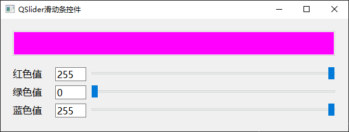

# a12_QSlider

## 学习内容

`QSlider`是滑动条控件，滑动条可以在一个范围内拖动，并将其位置转换为整数。


## 属性和方法

`QSlider`继承自`QAbstractSlider`，它的绝大多数属性都是从`QAbstractSlider`继承而来的。

`QSlider`有很多属性，完整的可查看帮助文档。这里仅列出常用的属性和方法。

### 值

滑动条和值相关的属性包括：当前值、最大值、最小值。
```c++
// 获取和设置当前值
int value() const;
void setValue(int);

// 获取和设置最大值
int maximum() const;
void setMaximum(int);

// 获取和设置最小值
int minimum() const;
void setMinimum(int);

// 一次设置最大值和最小值
void setRange(int min, int max)
```

### 方向

`Qt`中滑动条有水平滑动条和垂直滑动条之分，只需修改`QSlider`的`orientation`属性，就可以滑动条的外观即可变为水平或者垂直的
```c++
// 获取和设置滑动条的方向
Qt::Orientation orientation() const;
void setOrientation(Qt::Orientation);
```

### 步长

步长是指滑动条一次增加或减少的值，包括两个步长：

- `singleStep`：是指按键盘的左右箭头（←/→）时的步长
- `pageStep`：是指点击滑块两侧时的步长

```c++
// 获取和设置singleStep
int singleStep() const;
void setSingleStep(int);

// 获取和设置pageStep
int pageStep() const;
void setPageStep(int);
```

### 信号槽

```c++
// 当滑块被按下时发射该信号
void sliderPressed();

// 当滑块移动时发射该信号
void sliderMoved(int value);

// 当滑块释放时发射该信号
void sliderReleased();

// 当滑动条的值改变时，发射该信号
void valueChanged(int value);
```


## 案例

三个滑动条，分别用来调节 RGB 三个颜色的值，并显示到左侧各自的文本框中，并且将 RGB 这三个颜色的组合，设置为上面的文本框的背景颜色

**效果**



`widget.h` 头文件
```c++
#ifndef WIDGET_H
#define WIDGET_H

#include <QWidget>


/**
 * @Author ：谁书-ss
 * @Date ：2023-12-07 10:39
 * @IDE ：Qt Creator
 * @Motto ：ABC(Always Be Coding)
 * <p></p>
 * @Description ：
 * <p></p>
 */

QT_BEGIN_NAMESPACE
namespace Ui {
class Widget;
}
QT_END_NAMESPACE

class Widget : public QWidget
{
    Q_OBJECT

public:
    Widget(QWidget *parent = nullptr);
    ~Widget();

private slots:
    void hsRedChanged(int value);
    void hsGreenChanged(int value);
    void hsBlueChanged(int value);
    void leRedResultChanged(const QString &arg1);
    void leGreenResultChanged(const QString &arg1);
    void leBlueResultChanged(const QString &arg1);

private:
    Ui::Widget *ui;
};
#endif // WIDGET_H
```

`widget.cpp` 源文件
```c++
#include "widget.h"
#include "ui_widget.h"

#include "qdebug.h"
#include "qvalidator.h"

/**
 * @Author ：谁书-ss
 * @Date ：2023-12-07 10:39
 * @IDE ：Qt Creator
 * @Motto ：ABC(Always Be Coding)
 * <p></p>
 * @Description ：
 * <p></p>
 */

Widget::Widget(QWidget *parent)
    : QWidget(parent)
    , ui(new Ui::Widget) {
    ui->setupUi(this);
    this->setWindowTitle("QSlider滑动条控件");

    // 初始化红色滑动条
    ui->hsRed->setMinimum(0);
    ui->hsRed->setMaximum(255);
    // ui->hsRed->setRange(0, 255);


    ui->hsRed->setSingleStep(1);
    ui->hsRed->setPageStep(10);

    ui->hsRed->setOrientation(Qt::Horizontal);

    // 初始化绿色滑动条
    ui->hsGreen->setMinimum(0);
    ui->hsGreen->setMaximum(255);
    // ui->hsGreen->setRange(0, 255);

    ui->hsGreen->setSingleStep(5);
    ui->hsGreen->setPageStep(20);

    ui->hsGreen->setOrientation(Qt::Horizontal);

    // 初始化蓝色滑动条
    ui->hsBlue->setMinimum(0);
    ui->hsBlue->setMaximum(255);
    // ui->hsBlue->setRange(0, 255);

    ui->hsBlue->setSingleStep(10);
    ui->hsBlue->setPageStep(50);

    ui->hsBlue->setOrientation(Qt::Horizontal);

    // 初始化文本框的显示和背景色
    QString red = QString::number(ui->hsRed->value());
    QString green = QString::number(ui->hsGreen->value());
    QString blue = QString::number(ui->hsBlue->value());
    ui->leRedResult->setText(red);
    ui->leGreenResult->setText(green);
    ui->leBlueResult->setText(blue);

    QString style = "background-color: rgb(" + red + "," +  green + ","  + blue + ");";
    ui->leResult->setStyleSheet(style);
    ui->leResult->setEnabled(false);


    // 连接滑动条控件
    connect(ui->hsRed, &QSlider::sliderMoved, this, &Widget::hsRedChanged);
    connect(ui->hsGreen, &QSlider::sliderMoved, this, &Widget::hsGreenChanged);
    connect(ui->hsBlue, &QSlider::sliderMoved, this, &Widget::hsBlueChanged);


    // 输入框，只能是整数，且限制最小最大值
    ui->leRedResult->setValidator(new QIntValidator(this));
    ui->leGreenResult->setValidator(new QIntValidator(this));
    ui->leBlueResult->setValidator(new QIntValidator(this));

    // 连接输入框，直接输入一个值，更改颜色，并更改滑块
    connect(ui->leRedResult, &QLineEdit::textChanged, this, &Widget::leRedResultChanged);
    connect(ui->leGreenResult, &QLineEdit::textChanged, this, &Widget::leGreenResultChanged);
    connect(ui->leBlueResult, &QLineEdit::textChanged, this, &Widget::leBlueResultChanged);
}

Widget::~Widget() {
    delete ui;
}

void Widget::hsRedChanged(int value) {
    // 获取rgb的值
    //QString redNumber = QString::number(ui->hsRed->value());
    QString redNumber = QString::number(value);
    QString greenNumber = QString::number(ui->hsGreen->value());
    QString blueNumber = QString::number(ui->hsBlue->value());

    // 显示右侧文本框
    ui->leRedResult->setText(redNumber);

    // 颜色结果
    QString style = "background-color: rgb(" + redNumber + "," +  greenNumber + ","  + blueNumber + ");";
    qDebug() << style;
    ui->leResult->setStyleSheet(style);
}

void Widget::hsGreenChanged(int value) {
    // 获取rgb的值
    QString redNumber = QString::number(ui->hsRed->value());
    QString greenNumber = QString::number(value);
    QString blueNumber = QString::number(ui->hsBlue->value());

    // 显示右侧文本框
    ui->leGreenResult->setText(greenNumber);

    // 颜色结果
    QString style = "background-color: rgb(" + redNumber + "," +  greenNumber + ","  + blueNumber + ");";
    qDebug() << style;
    ui->leResult->setStyleSheet(style);
}

void Widget::hsBlueChanged(int value) {
    // 获取rgb的值
    QString redNumber = QString::number(ui->hsRed->value());
    QString greenNumber = QString::number(ui->hsGreen->value());
    QString blueNumber = QString::number(value);

    // 显示右侧文本框
    ui->leBlueResult->setText(blueNumber);

    // 颜色结果
    QString style = "background-color: rgb(" + redNumber + "," +  greenNumber + ","  + blueNumber + ");";
    qDebug() << style;
    ui->leResult->setStyleSheet(style);
}

void Widget::leRedResultChanged(const QString &arg1) {
    int value = arg1.toInt();
    ui->hsRed->setValue(value);
    hsRedChanged(value);
}

void Widget::leGreenResultChanged(const QString &arg1) {
    int value = arg1.toInt();
    ui->hsGreen->setValue(value);
    hsGreenChanged(value);
}

void Widget::leBlueResultChanged(const QString &arg1) {
    int value = arg1.toInt();
    ui->hsBlue->setValue(value);
    hsBlueChanged(value);
}
```


