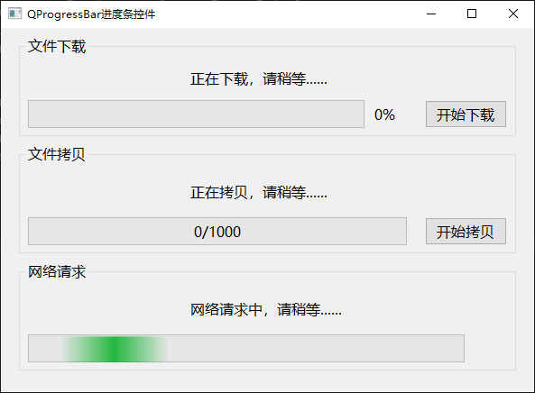

# a13_QProgressBar

## 学习内容

`QProgressBar`是进度条控件，进度条用来指示任务的完成情况。


## 属性和方法

### 值

进度条和值相关的属性包括：当前值、最大值、最小值
```c++
// 获取和设置当前值
int value() const;
void setValue(int);

// 获取和设置最大值
int maximum() const;
void setMaximum(int);

// 获取和设置最小值
int minimum() const;
void setMinimum(int);

// 一次设置最大值和最小值
void setRange(int min, int max)
    
// 复位当前值    
void QProgressBar::reset()
```


### 方向

`Qt`中进度条有水平进度条和垂直进度条之分，只需修改`QProgressBar`的 `orientation`属性，就可以将进度条的外观变为水平或者垂直的

```c++
// 获取和设置滑动条的方向
Qt::Orientation orientation() const
void setOrientation(Qt::Orientation)
```

其中，Qt::Orientation 是一个枚举类型，有两种取值：

- `Qt::Horizontal`：水平
- `Qt::Vertical`：垂直


### 外观

可以设置进度条的文本是否显示

```c++
// 获取和设置进度条的文本是否显示
bool isTextVisible() const
void setTextVisible(bool visible)
```

设置文本的显示位置

```c++
Qt::Alignment alignment() const
void setAlignment(Qt::Alignment alignment)
```

文本的显示格式，也就是进度条显示的进度值的方式

```c++
// 获取格式
QString format() const;

// 设置格式
void setFormat(const QString &format);

// 复位格式
void resetFormat()
```

格式有三种：
- `%p`：百分比
- `%v`：当前值
- `%m`：最大值

还可以设置进度条的进度增长方向

```c++
// 获取和设置是否外观反转
bool invertedAppearance() const
void setInvertedAppearance(bool invert)
```

通常，进度条进度的增长方向从左到右，而外观反转，将进度条的进度增长方向修改为从右向左。


### 信号槽

```c++
// 当进度条的值改变时，发射该信号
void valueChanged(int value)
```


## 案例

三个不同样式的进度条使用：文件下载、文件拷贝、网络请求

**效果**



`widget.h` 头文件
```c++
#ifndef WIDGET_H
#define WIDGET_H

#include <QWidget>
#include "QTimer"
#include "QMessageBox"

/**
 * @Author ：谁书-ss
 * @Date ：2023-12-07 14:22
 * @IDE ：Qt Creator
 * @Motto ：ABC(Always Be Coding)
 * <p></p>
 * @Description ：
 * <p></p>
 */

QT_BEGIN_NAMESPACE
namespace Ui {
class Widget;
}
QT_END_NAMESPACE

class Widget : public QWidget
{
    Q_OBJECT

public:
    Widget(QWidget *parent = nullptr);
    ~Widget();

private slots:
    void btnFileDownload();
    void btnFileCopy();
    void onFileDownloadTimeout();
    void onFileCopyTimeout();


private:
    Ui::Widget *ui;

    QTimer *mTimerFileDownload;
    QTimer *mTimerFileCopy;

};
#endif // WIDGET_H
```

`widget.cpp` 源文件
```c++
#include "widget.h"
#include "ui_widget.h"


/**
 * @Author ：谁书-ss
 * @Date ：2023-12-07 14:22
 * @IDE ：Qt Creator
 * @Motto ：ABC(Always Be Coding)
 * <p></p>
 * @Description ：
 * <p></p>
 */

Widget::Widget(QWidget *parent)
    : QWidget(parent)
    , ui(new Ui::Widget) {
    ui->setupUi(this);
    this->setWindowTitle("QProgressBar进度条控件");

    // 1.下载
    ui->pgbFileDownload->setMinimum(0);
    ui->pgbFileDownload->setMaximum(100);
    // ui->pbDownload->setRange(0, 100);

    ui->pgbFileDownload->setValue(0);

    // 设置文本的显示位置
    ui->pgbFileDownload->setAlignment(Qt::AlignRight);
    // 设置是否显示文本
    // ui->pbDownload->setTextVisible(false);

    mTimerFileDownload = new QTimer();
    mTimerFileDownload->setInterval(10);

    connect(ui->btnFileDownload, &QPushButton::clicked, this, &Widget::btnFileDownload);
    connect(mTimerFileDownload, &QTimer::timeout, this, &Widget::onFileDownloadTimeout);

    // 2.拷贝
    ui->pgbFileCopy->setMinimum(0);
    ui->pgbFileCopy->setMaximum(1000);
    // ui->pbCopy->setRange(0, 1000);

    ui->pgbFileCopy->setValue(0);

    // 设置文本的显示位置
    ui->pgbFileCopy->setAlignment(Qt::AlignCenter);
    // 显示格式
    ui->pgbFileCopy->setFormat("%v/%m");

    mTimerFileCopy = new QTimer();
    mTimerFileCopy->setInterval(5);

    connect(ui->btnFileCopy, &QPushButton::clicked, this, &Widget::btnFileCopy);
    connect(mTimerFileCopy, &QTimer::timeout, this, &Widget::onFileCopyTimeout);


    // 3、网络
    ui->pgbNetwork->setMinimum(0);
    ui->pgbNetwork->setMaximum(0);

}

Widget::~Widget() {
    delete ui;
}

void Widget::btnFileDownload() {
    ui->pgbFileDownload->reset();
    // 启动定时器
    mTimerFileDownload->start();
}

void Widget::btnFileCopy() {
    ui->pgbFileCopy->reset();
    // 启动定时器
    mTimerFileCopy->start();
}

void Widget::onFileDownloadTimeout() {
    int currentValue = ui->pgbFileDownload->value();

    if(currentValue >= ui->pgbFileDownload->maximum()) {
        mTimerFileDownload->stop();
        QMessageBox::information(this, "提示", "文件下载完成！");
    } else {
        ui->pgbFileDownload->setValue(ui->pgbFileDownload->value() + 1);
        qDebug() << ui->pgbFileDownload->value();
    }
}

void Widget::onFileCopyTimeout() {
    int currentValue = ui->pgbFileCopy->value();

    if(currentValue >= ui->pgbFileCopy->maximum()) {
        mTimerFileCopy->stop();
        QMessageBox::information(this, "提示", "文件拷贝完成！");
    } else {
        ui->pgbFileCopy->setValue(ui->pgbFileCopy->value() + 1);
        qDebug() << ui->pgbFileCopy->value();
    }
}
```

