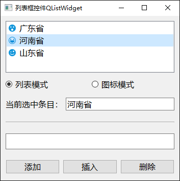
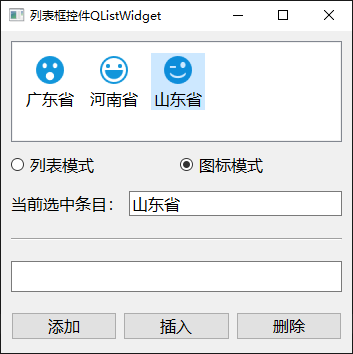

# a14_QListWidget

## 学习内容

`Qt`中的列表框控件，对应的类是`QListWidget`，它用于显示多个列表项，列表项对应的类是`QListWidgetItem`。


## 属性和方法

### 显示模式

列表框控件，支持两种显示模式：列表模式和图标模式

```c++
// 获取和设置显示模式
QListView::ViewMode viewMode() const
void setViewMode(QListView::ViewMode mode)
```

其中，`QListView::ViewMode`是一个枚举，有两个取值：

- `QListView::ListMode`：列表模式
- `QListView::IconMode`：图标模式

该属性既可以在属性窗口中设置，也可以在代码中动态设置


### 交替背景色

设置相邻行交替显示不同的背景色，便于显示和浏览时的定位

```c++
// 获取和设置交替显示
bool alternatingRowColors() const
void setAlternatingRowColors(bool enable)
```

### 添加条目

```c++
// 在尾部添加
void addItem(const QString &label)
void addItem(QListWidgetItem *item)
void addItems(const QStringList &labels)

// 在指定行之前添加
void insertItem(int row, QListWidgetItem *item)
void insertItem(int row, const QString &label)
void insertItems(int row, const QStringList &labels)
```

使用包含 QListWidgetItem 参数的函数，可以为条目指定图标
```c++
QListWidgetItem::QListWidgetItem(const QIcon &icon, const QString &text, QListWidget *parent = nullptr, int type = Type)  
```

### 删除条目

```c++
// 方法一
QListWidgetItem* item = ui->lwProvince->currentItem();
ui->lwProvince->removeItemWidget(item);
delete item;

// 方法二
int row = ui->lwProvince->currentRow();
QListWidgetItem* item = ui->lwProvince->takeItem(row);
delete item;
```

**注意：需要手动 delete 掉条目**


### 信号槽

列表控件的信号和槽有很多，在帮助文档中搜索。

```c++
// 当条目被单击时，发射该信号
void itemClicked(QListWidgetItem *item);

// 当条目被双击时，发射该信号
void itemDoubleClicked(QListWidgetItem *item);
```


## 案例

**效果**

列表模式



图标模式




`widget.h` 头文件
```c++
#ifndef WIDGET_H
#define WIDGET_H

#include <QWidget>
#include <QListWidgetItem>
#include <QButtonGroup>

/**
 * @Author ：谁书-ss
 * @Date ：2023-12-08 08:27
 * @IDE ：Qt Creator
 * @Motto ：ABC(Always Be Coding)
 * <p></p>
 * @Description ：
 * <p></p>
 */

QT_BEGIN_NAMESPACE
namespace Ui {
class Widget;
}
QT_END_NAMESPACE

class Widget : public QWidget
{
    Q_OBJECT

public:
    Widget(QWidget *parent = nullptr);
    ~Widget();
private slots:
    void rbModeClicked();
    void onItemClicked(QListWidgetItem *item);
    void onItemDoubleClicked(QListWidgetItem *item);
    void onBtnAddClicked();
    void onBtnInsertClicked();
    void onBtnDeleteClicked();
private:
    Ui::Widget *ui;

    QButtonGroup * operateButtonGroup;
};
#endif // WIDGET_H
```

`widget.cpp` 源文件
```c++
#include "widget.h"
#include "ui_widget.h"

#include "QDebug"
#include "QRandomGenerator"

/**
 * @Author ：谁书-ss
 * @Date ：2023-12-08 08:27
 * @IDE ：Qt Creator
 * @Motto ：ABC(Always Be Coding)
 * <p></p>
 * @Description ：
 * <p></p>
 */

QStringList iconStringList = {
    ":/FILES/chijing.png",
    ":/FILES/ku.png",
    ":/FILES/nu.png",
    ":/FILES/xiao.png",
    ":/FILES/zhayan.png"
};

Widget::Widget(QWidget *parent)
    : QWidget(parent)
    , ui(new Ui::Widget) {
    ui->setupUi(this);
    this->setWindowTitle("列表框控件QListWidget");

    // 添加默认条目
    QListWidgetItem *item1 = new QListWidgetItem();
    item1->setText("广东省");
    item1->setIcon(QIcon(":/FILES/chijing.png"));
    ui->lwProvince->addItem(item1);

    QListWidgetItem *item2 = new QListWidgetItem();
    item2->setText("河南省");
    item2->setIcon(QIcon(":/FILES/xiao.png"));
    ui->lwProvince->addItem(item2);

    QListWidgetItem *item3 = new QListWidgetItem();
    item3->setText("山东省");
    item3->setIcon(QIcon(":/FILES/zhayan.png"));
    ui->lwProvince->addItem(item3);

    // 默认是列表模式
    operateButtonGroup = new QButtonGroup(this);
    operateButtonGroup->addButton(ui->rbListMode, 0);
    operateButtonGroup->addButton(ui->rbIconMode, 1);
    ui->rbListMode->setChecked(true);
    ui->lwProvince->setViewMode(QListView::ListMode);
    connect(ui->rbListMode, &QRadioButton::clicked, this, &Widget::rbModeClicked);
    connect(ui->rbIconMode, &QRadioButton::clicked, this, &Widget::rbModeClicked);

    // 条目单击和双击的信号槽
    connect(ui->lwProvince, &QListWidget::itemClicked, this, &Widget::onItemClicked);
    connect(ui->lwProvince, &QListWidget::itemDoubleClicked, this, &Widget::onItemDoubleClicked);

    // add/insert/delete
    connect(ui->btnAdd, &QPushButton::clicked, this, &Widget::onBtnAddClicked);
    connect(ui->btnInsert, &QPushButton::clicked, this, &Widget::onBtnInsertClicked);
    connect(ui->btnDelete, &QPushButton::clicked, this, &Widget::onBtnDeleteClicked);

}

Widget::~Widget() {
    delete ui;
}

// 单选按钮，选择显示模式
void Widget::rbModeClicked() {
    int localCheckedId = operateButtonGroup->checkedId();
    if (localCheckedId == 0) {
        //列表模式
        ui->lwProvince->setViewMode(QListView::ListMode);
        // 条目间距
        ui->lwProvince->setSpacing(2);
    } else if (localCheckedId == 1) {
        //图标模式
        ui->lwProvince->setViewMode(QListView::IconMode);
        // 条目间距
        ui->lwProvince->setSpacing(10);
    } else {
        qDebug() << "无效模式选择";

    }

}
// 单击 选中
void Widget::onItemClicked(QListWidgetItem *item) {
    ui->leCurrentItem->setText(item->text());
}

// 双击 可编辑
void Widget::onItemDoubleClicked(QListWidgetItem *item) {
    item->setFlags(Qt::ItemIsEditable | Qt::ItemIsSelectable | Qt::ItemIsEnabled);
}

// 添加
void Widget::onBtnAddClicked() {
    // 获取 0-4 随机数
    int iconIndex = QRandomGenerator::global()->generate() % 5;

    QIcon icon(iconStringList[iconIndex]);
    QString text = ui->leInput->text();
    if(text.isEmpty()) {
        qDebug() << "添加内容不能为空";
    }
    QListWidgetItem *item = new QListWidgetItem(icon, text);

    ui->lwProvince->addItem(item);
}

// 插入
void Widget::onBtnInsertClicked() {
    // 获取 0-4 随机数
    int iconIndex = QRandomGenerator::global()->generate() % 5;

    QIcon icon(iconStringList[iconIndex]);
    QString text = ui->leInput->text();
    if(text.isEmpty()) {
        qDebug() << "插入内容不能为空";
    }
    QListWidgetItem *item = new QListWidgetItem(icon, text);

    // 获取当前选中的行
    int localCurrentRow = ui->lwProvince->currentRow();

    ui->lwProvince->insertItem(localCurrentRow, item);
}

void Widget::onBtnDeleteClicked() {
#if 0
    // 方法一
    QListWidgetItem* item = ui->lwProvince->currentItem();
    ui->lwProvince->removeItemWidget(item);
    delete item;
#else
    // 方法二
    int row = ui->lwProvince->currentRow();
    QListWidgetItem* item = ui->lwProvince->takeItem(row);
    delete item;
#endif
}
```
