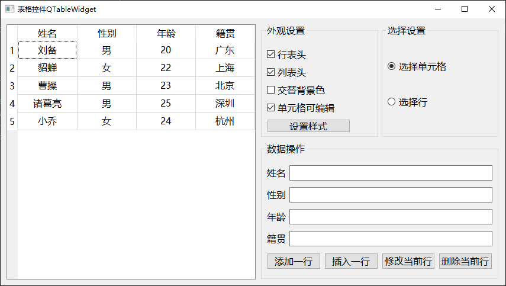

# a15_：QTableWidget

## 学习内容

`QTableWidget`是`Qt`中的表格控件，可以行列的形式来展示数据。


## 属性和方法

### 行列数目、行表头、列表头

表格控件的第一行称为行表头，用于设置每一列的标题。

表格控件的第一列称为列表头，用于设置每一行的标题，通常缺省则默认显示行号。

设置和获取行列的数目
```c++
// 获取/设置行的数目
int rowCount() const
void setRowCount(int rows)
// 获取/设置列的数目    
int columnCount() const
void setColumnCount(int columns)
```

设置行列表头
```c++
// 设置行表头
void setHorizontalHeaderLabels(const QStringList &labels)
// 设置列表头 - 通常不设置，则默认为行号
void setVerticalHeaderLabels(const QStringList &labels)
```

设置列的宽度
```c++
// 获取行表头
QHeaderView *horizontalHeader() const
// 设置列的宽度    
void QHeaderView::setSectionResizeMode(QHeaderView::ResizeMode mode)
```

其中`ResizeMode`是一个枚举，取值如下：
- ==HeaderView::Interactive== 0 用户可拖动改变列宽
- ==QHeaderView::Fixed== 2 固定列宽
- ==QHeaderView::Stretch== 1 拉伸自适应列宽大小
- ==QHeaderView::ResizeToContents== 3 根据内容设置列宽

通常，先整体设置为 QHeaderView::Stretch， 然后根据需要对单独的列进行设置，如下：
```c++
// 1、先设置自适应宽度，再单独设置某一列的宽度规则
ui->twStudent->horizontalHeader()->setSectionResizeMode(QHeaderView::Stretch);    //先自适应宽度

// 2、然后，单独设置某一列根据内容调整宽度，或者单独设置某一列为固定宽度
// ui->twStudent->horizontalHeader()->setSectionResizeMode(0, QHeaderView::ResizeToContents);

ui->twStudent->horizontalHeader()->setSectionResizeMode(0, QHeaderView::Fixed);
ui->twStudent->setColumnWidth(0, 80);
```


### 单元格

每个网格单元称为一个单元格。每个单元格有一个行号、列号。

在 QTableWidget 表格控件中，每一个单元格是一个 QTableWidgetItem 对象，可以设置其文字内容等。

获取和设置单元格
```c++
// 获取和设置指定行列位置的单元格
QTableWidgetItem *item(int row, int column) const;
void setItem(int row, int column, QTableWidgetItem *item)
// 构造 QTableWidgetItem
QTableWidgetItem(const QIcon &icon, const QString &text, int type = Type)
QTableWidgetItem(const QString &text, int type = Type)
```

单元格文本对齐方式
```c++
// 获取和设置单元格文本的对齐方式
int textAlignment() const
void setTextAlignment(int alignment)
```

参数`alignment`是一个枚举类型，常用取值如下：
- ==Qt::AlignLeft== （0x0001） 水平方向-左对齐
- ==Qt::AlignRight== （0x0002） 水平方向-右对齐
- ==Qt::AlignHCenter== （0x0004） 水平方向-居中对齐
- ==Qt::AlignTop== （0x0020） 垂直方向-上对齐
- ==Qt::AlignBottom== （0x0040） 垂直方向-下对齐
- ==Qt::AlignVCenter== （0x0080） 垂直方向-居中对齐
- ==Qt::AlignCenter== （AlignVCenter | AlignHCenter） 垂直方向和水平方向-居中对齐

上面的每一个宏，都代表 16 进制中的一位，可以进行或（|）操作，来同时设置多个对齐方式。
```c++
// 获取和设置单元格是否可编辑
QAbstractItemView::EditTriggers editTriggers() const
void setEditTriggers(QAbstractItemView::EditTriggers triggers)
```

这是继承自其父类`QAbstractItemView`中的方法其中，QAbstractItemView::EditTriggers 是一个枚举，常用取值如下：

- ==AbstractItemView::NoEditTriggers== 0 不可编辑
- ==QAbstractItemView::CurrentChanged== 1 当切换单元格时
- ==QAbstractItemView::DoubleClicked== 2 当双击单元格时
- ==QAbstractItemView::SelectedClicked== 4 当单击一个已选中的单元格时
- ==QAbstractItemView::EditKeyPressed== 8 当一个单元格获取焦点，按编辑按键时（F2）
- ==QAbstractItemView::AnyKeyPressed== 16 当一个单元格获取焦点，按任意键时
- ==QAbstractItemView::AllEditTriggers== 31 以上所有条件的组合。（31 = 1|2|4|8|16）


### 隔行交替背景色

奇数行和偶数行，它们的背景色不同，便于用户浏览。

```c++
// 获取和设置是否允许隔行交替背景色
bool alternatingRowColors() const
void setAlternatingRowColors(bool enable)
```

这是继承自其父类 `QAbstractItemView` 中的方法。


### 选择模式、选择行为

所谓选择行为，是指当点击一个单元格时，是选中该单元格，还是选中一整行。

```c++
// 获取和设置选择行为
QAbstractItemView::SelectionBehavior selectionBehavior() const
void setSelectionBehavior(QAbstractItemView::SelectionBehavior behavior)
```

这是继承自其父类`QAbstractItemView`中的方法其中 `QAbstractItemView::SelectionBehavior` 是一个枚举，取值为：

- ==QAbstractItemView::SelectItems== 0 选中单元格
- ==QAbstractItemView::SelectRows== 1 选中单元格所在行
- ==QAbstractItemView::SelectColumns== 2 选中单元格所在列

所谓选择模式，是指设置表格控件只可选择单行、可选择多行等。

```c++
// 获取和设置选择模式
QAbstractItemView::SelectionMode selectionMode() const
void setSelectionMode(QAbstractItemView::SelectionMode mode)
```

这是继承自其父类`QAbstractItemView`中的方法，其中 `QAbstractItemView::SelectionMode`是一个枚举，取值为：

- ==QAbstractItemView::NoSelection== 0 不可选择
- ==QAbstractItemView::SingleSelection== 1 单行选择，一次只允许选择一行
- ==QAbstractItemView::MultiSelection== 2 多行选择，鼠标单击就可以选择多行
- ==QAbstractItemView::ExtendedSelection== 3 扩展选择，按shift键选中一个范围内的行，ctrl键可以选中不相邻的行
- ==QAbstractItemView::ContiguousSelection== 4 相邻选择，按shift键或ctrl键都可以选中一个范围内的行


### 设置样式表

通过设置样式表，可以使的表格控件更加美观。

```c++
void Widget::on_btnStyleSheet_clicked()
{
    QString cellStyle = R"(
        QTableView
        {
            text-align:center;
            background-color: rgba(255, 255, 255, 0);
            alternate-background-color:#e3edf9;
            font:14px "微软雅黑";
            color:#677483;
            gridline-color: #ccddf0;
        }
    )";


    const QString horizontalHeaderStyle = R"(
        QHeaderView::section {
            color: black;
            font:bold 14px "微软雅黑";
            text-align:center;
            height:32px;
            background-color: #d1dff0;
            border:1px solid #8faac9;
            border-left:none;
        }
    )";

    const QString verticalHeaderStyle = R"(
        QHeaderView::section {
            color: black;
            font:bold 14px "微软雅黑";
            width:60px;
            text-align:center;

            background-color: #d1dff0;
            border:1px solid #8faac9;
            border-left:none;
        }
    )";

    ui->twStudent->setStyleSheet(cellStyle);
    ui->twStudent->horizontalHeader()->setStyleSheet(horizontalHeaderStyle);
    ui->twStudent->verticalHeader()->setStyleSheet(verticalHeaderStyle);
}
```

以上`R`包裹的字符串，就是C++中的原始字符串，原始字符串：使用前缀`R`来标识，并用`"( 和 )"`用作定界符，就是所见即所得，不用写难以理解的转义字符。


## 案例

**效果**




`widget.h` 头文件
```c++
#ifndef WIDGET_H
#define WIDGET_H

#include <QWidget>
#include <QButtonGroup>
#include <QTableWidgetItem>

/**
 * @Author ：谁书-ss
 * @Date ：2023-12-12 08:49
 * @IDE ：Qt Creator
 * @Motto ：ABC(Always Be Coding)
 * <p></p>
 * @Description ：
 * <p></p>
 */

QT_BEGIN_NAMESPACE
namespace Ui {
class Widget;
}
QT_END_NAMESPACE

class Widget : public QWidget
{
    Q_OBJECT

public:
    Widget(QWidget *parent = nullptr);
    ~Widget();
    void appendOneRow(QString name, QString gender, int age, QString province);
private:
    Ui::Widget *ui;
    QButtonGroup *mButtonGroupSelection;
private slots:
    void btnStyleSheetClicked();
    void onSelectionRadioButtonClicked();
    void onItemClicked(QTableWidgetItem *item);
    void insertOneRow(int row, QString name, QString gender, int age, QString province);
    void btnAppendClicked();
    void btnInsertClicked();
    void btnDeleteClicked();
    void btnModifyClicked();
};
#endif // WIDGET_H
```

`widget.cpp` 源文件
```c++
#include "widget.h"
#include "ui_widget.h"


/**
 * @Author ：谁书-ss
 * @Date ：2023-12-12 08:49
 * @IDE ：Qt Creator
 * @Motto ：ABC(Always Be Coding)
 * <p></p>
 * @Description ：
 * <p></p>
 */

Widget::Widget(QWidget *parent)
    : QWidget(parent)
    , ui(new Ui::Widget)
{
    ui->setupUi(this);
    this->setWindowTitle("表格控件QTableWidget");

    // 设置单元格的列
    ui->twStudent->setColumnCount(4);

    QStringList horizontalList;
    horizontalList << "姓名";
    horizontalList << "性别";
    horizontalList << "年龄";
    horizontalList << "籍贯";

    ui->twStudent->setHorizontalHeaderLabels(horizontalList);

    // 设置列的宽度
    ui->twStudent->horizontalHeader()->setSectionResizeMode(QHeaderView::Stretch);

    // 设置初始化数据
    this->appendOneRow("刘备", "男", 20, "广东");
    this->appendOneRow("貂蝉", "女", 22, "上海");
    this->appendOneRow("曹操", "男", 23, "北京");
    this->appendOneRow("诸葛亮", "男", 25, "深圳");
    this->appendOneRow("小乔", "女", 24, "杭州");

    // 设置行表头是否显示
    if(ui->twStudent->horizontalHeader()->isHidden()) {
        ui->cboHHeader->setChecked(false);
    } else {
        ui->cboHHeader->setChecked(true);
    }
    connect(ui->cboHHeader, &QCheckBox::stateChanged, this, [=](int state){
        if(state == Qt::Checked) {
            ui->twStudent->horizontalHeader()->show();
        } else {
            ui->twStudent->horizontalHeader()->hide();
        }
    });

    // 设置列表头
    // 首先根据在属性窗口中设置的属性，初始化复选框
    if(ui->twStudent->verticalHeader()->isHidden()) {
        ui->cboVHeader->setChecked(false);
    } else {
        ui->cboVHeader->setChecked(true);
    }
    // 点击复选框时，显示或者隐藏列表头
    connect(ui->cboVHeader, &QCheckBox::stateChanged, this, [=](int state) {
        if(state == Qt::Checked) {
            ui->twStudent->verticalHeader()->show();
        } else if(state == Qt::Unchecked) {
            ui->twStudent->verticalHeader()->hide();
        }
    });

    // 交替显示行的背景色
    // 首先根据在属性窗口中设置的属性，初始化复选框
    if(ui->twStudent->alternatingRowColors()) {
        ui->cboAlternate->setChecked(true);
    } else {
        ui->cboAlternate->setChecked(false);
    }
    // 点击复选框时，使能或者禁能交替背景色
    connect(ui->cboAlternate, &QCheckBox::stateChanged, this, [=](int state) {
        if(state == Qt::Checked) {
            ui->twStudent->setAlternatingRowColors(true);
        } else if(state == Qt::Unchecked) {
            ui->twStudent->setAlternatingRowColors(false);
        }
    });

    // 设置样式
    connect(ui->btnStyleSheet, &QPushButton::clicked, this, &Widget::btnStyleSheetClicked);

    // 设置单元格是否可编辑
    // 首先根据在属性窗口中设置的属性，初始化复选按钮
    int trigger = ui->twStudent->editTriggers();
    if(trigger == QAbstractItemView::NoEditTriggers) {
        ui->cboEditCell->setChecked(false);
    } else {
        ui->cboEditCell->setChecked(true);
    }
    // 点击复选按钮时，使能或者禁能单元格编辑
    connect(ui->cboEditCell, &QCheckBox::stateChanged, this, [=](int state) {
        if(state == Qt::Checked) {
            // 当双击单元格/选中单元格然后单击/按下编辑键F2，都可以编辑单元格。
            ui->twStudent->setEditTriggers(QAbstractItemView::DoubleClicked |
                                           QAbstractItemView::SelectedClicked |
                                           QAbstractItemView::EditKeyPressed);
        } else if(state == Qt::Unchecked) {
            ui->twStudent->setEditTriggers(QAbstractItemView::NoEditTriggers);
        }
    });

    // 设置行选择还是单元格选择
    // 首先根据在属性窗口中设置的属性，初始化单选按钮的选中状态
    int selectionBehavior = ui->twStudent->selectionBehavior();
    if(selectionBehavior == QAbstractItemView::SelectItems) {
        ui->rbCell->setChecked(true);
    } else if(selectionBehavior == QAbstractItemView::SelectRows){
        ui->rbRow->setChecked(true);
    }
    // 点击单选按钮时，使能单元格选中或者行选中
    mButtonGroupSelection = new QButtonGroup(this);
    mButtonGroupSelection->addButton(ui->rbCell, 0);
    mButtonGroupSelection->addButton(ui->rbRow, 1);
    connect(ui->rbCell, &QRadioButton::clicked, this, &Widget::onSelectionRadioButtonClicked);
    connect(ui->rbRow, &QRadioButton::clicked, this, &Widget::onSelectionRadioButtonClicked);

    // 单元格点击时， 将对应行的数据显示到文本框
    connect(ui->twStudent, &QTableWidget::itemClicked, this, &Widget::onItemClicked);

    // 添加一行
    connect(ui->btnAppend, &QPushButton::clicked, this, &Widget::btnAppendClicked);
    // 插入一行
    connect(ui->btnInsert, &QPushButton::clicked, this, &Widget::btnInsertClicked);
    // 删除一行
    connect(ui->btnDelete, &QPushButton::clicked, this, &Widget::btnDeleteClicked);
    // 修改当前行
    connect(ui->btnModify, &QPushButton::clicked, this, &Widget::btnModifyClicked);
}

Widget::~Widget()
{
    delete ui;
}

void Widget::appendOneRow(QString name, QString gender, int age, QString province)
{
    int count = ui->twStudent->rowCount();

    ui->twStudent->setRowCount(count + 1);

    QTableWidgetItem *nameItem = new QTableWidgetItem(name);
    QTableWidgetItem *genderItem = new QTableWidgetItem(gender);
    QTableWidgetItem *ageItem = new QTableWidgetItem(QString::number(age));
    QTableWidgetItem *provinceItem = new QTableWidgetItem(province);

    nameItem->setTextAlignment(Qt::AlignCenter);
    genderItem->setTextAlignment(Qt::AlignCenter);
    ageItem->setTextAlignment(Qt::AlignCenter);
    provinceItem->setTextAlignment(Qt::AlignCenter);

    ui->twStudent->setItem(count, 0, nameItem);
    ui->twStudent->setItem(count, 1, genderItem);
    ui->twStudent->setItem(count, 2, ageItem);
    ui->twStudent->setItem(count, 3, provinceItem);

}

void Widget::btnStyleSheetClicked()
{
    QString cellStyle = R"(
        QTableView
        {
            text-align:center;
            background-color: rgba(255, 255, 255, 0);
            alternate-background-color:#e3edf9;
            font:14px "微软雅黑";
            color:#677483;
            gridline-color: #ccddf0;
        }
    )";


    const QString horizontalHeaderStyle = R"(
        QHeaderView::section {
            color: black;
            font:bold 14px "微软雅黑";
            text-align:center;
            height:32px;
            background-color: #d1dff0;
            border:1px solid #8faac9;
            border-left:none;
        }
    )";

    const QString verticalHeaderStyle = R"(
        QHeaderView::section {
            color: black;
            font:bold 14px "微软雅黑";
            width:60px;
            text-align:center;

            background-color: #d1dff0;
            border:1px solid #8faac9;
            border-left:none;
        }
    )";

    ui->twStudent->setStyleSheet(cellStyle);
    ui->twStudent->horizontalHeader()->setStyleSheet(horizontalHeaderStyle);
    ui->twStudent->verticalHeader()->setStyleSheet(verticalHeaderStyle);
}

void Widget::onSelectionRadioButtonClicked()
{
    int checkedId = mButtonGroupSelection->checkedId();
    if(checkedId == 0) {
        ui->twStudent->setSelectionMode(QAbstractItemView::SingleSelection);
        ui->twStudent->setSelectionBehavior(QAbstractItemView::SelectItems);
    } else if(checkedId == 1) {
        ui->twStudent->setSelectionMode(QAbstractItemView::SingleSelection);
        ui->twStudent->setSelectionBehavior(QAbstractItemView::SelectRows);
    }
}

void Widget::onItemClicked(QTableWidgetItem *item)
{
    int row = item->row();

    QString name = ui->twStudent->item(row, 0)->text();
    QString gender = ui->twStudent->item(row, 1)->text();
    QString age = ui->twStudent->item(row, 2)->text();
    QString province = ui->twStudent->item(row, 3)->text();

    ui->leName->setText(name);
    ui->leGender->setText(gender);
    ui->leAge->setText(age);
    ui->leProvince->setText(province);
}

void Widget::insertOneRow(int row, QString name, QString gender, int age, QString province)
{
    ui->twStudent->insertRow(row);

    // 上面 insertRow 只是插入一个空行，需要手动添加每个单元格的内容
    QTableWidgetItem* nameItem = new QTableWidgetItem(name);
    QTableWidgetItem* genderItem = new QTableWidgetItem(gender);
    QTableWidgetItem* ageItem = new QTableWidgetItem(QString::number(age));
    QTableWidgetItem* provinceItem = new QTableWidgetItem(province);

    nameItem->setTextAlignment(Qt::AlignCenter);
    genderItem->setTextAlignment(Qt::AlignCenter);
    ageItem->setTextAlignment(Qt::AlignCenter);
    provinceItem->setTextAlignment(Qt::AlignCenter);

    ui->twStudent->setItem(row, 0, nameItem);
    ui->twStudent->setItem(row, 1, genderItem);
    ui->twStudent->setItem(row, 2, ageItem);
    ui->twStudent->setItem(row, 3, provinceItem);
}

void Widget::btnAppendClicked()
{
    QString name = ui->leName->text();
    QString gender = ui->leGender->text();
    int age = ui->leAge->text().toInt();
    QString province = ui->leProvince->text();

    appendOneRow(name, gender, age, province);
}

void Widget::btnInsertClicked()
{
    QString name = ui->leName->text();
    QString gender = ui->leGender->text();
    int age = ui->leAge->text().toInt();
    QString province = ui->leProvince->text();

    // 获取当前选中的行号
    int currentRow = ui->twStudent->currentRow();

    insertOneRow(currentRow, name, gender, age, province);
}

void Widget::btnDeleteClicked()
{
    // 获取当前选中的行号
    int currentRow = ui->twStudent->currentRow();
    ui->twStudent->removeRow(currentRow);
}

void Widget::btnModifyClicked()
{
    QString name = ui->leName->text();
    QString gender = ui->leGender->text();
    int age = ui->leAge->text().toInt();
    QString province = ui->leProvince->text();

    // 获取当前选中的行号
    int currentRow = ui->twStudent->currentRow();

    QTableWidgetItem* nameItem = new QTableWidgetItem(name);
    QTableWidgetItem* genderItem = new QTableWidgetItem(gender);
    QTableWidgetItem* ageItem = new QTableWidgetItem(QString::number(age));
    QTableWidgetItem* provinceItem = new QTableWidgetItem(province);

    nameItem->setTextAlignment(Qt::AlignCenter);
    genderItem->setTextAlignment(Qt::AlignCenter);
    ageItem->setTextAlignment(Qt::AlignCenter);
    provinceItem->setTextAlignment(Qt::AlignCenter);

    ui->twStudent->setItem(currentRow, 0, nameItem);
    ui->twStudent->setItem(currentRow, 1, genderItem);
    ui->twStudent->setItem(currentRow, 2, ageItem);
    ui->twStudent->setItem(currentRow, 3, provinceItem);
}
```
