# a16_QEvent

事件，在 Qt 中是很重要的一块内容，在实际工作中用到的也很多。

实际工作中，往往窗口是相互嵌套的，比如一个标签放在一个`widget`中，一个`widget`也可能放在另一个`widget`中，这时就涉及在父子窗口之间的传递，什么时候需要传递，什么时候又要终止传递。这是需要搞清楚的。

总结了一张图：

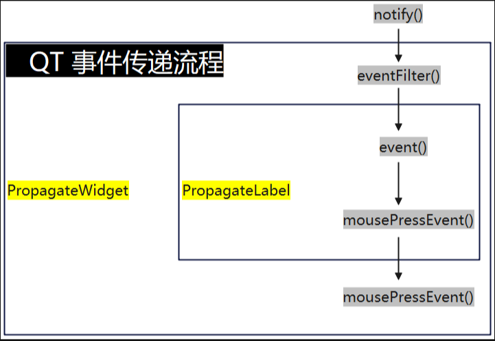


<br><br>

## 学习内容

详细讲解以下事件：

- 鼠标进入/离开事件
- 鼠标按下/移动/释放事件
- 键盘事件
- 定时器事件
- 拖动事件
- 绘图事件
- 右键菜单


<br><br>

## 创建整体布局

### 新建工程

新建一个窗口类 MainWidget，继承自 QWidget，并且取消 “Generate form” 复选框。

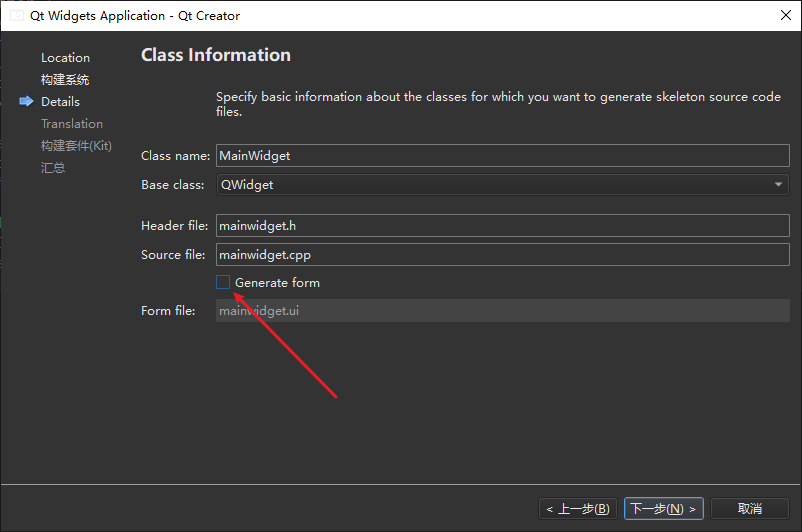

也就是不使用 UI设计师界面拖拽控件，而是纯代码来实现界面。最终新建工程如下：

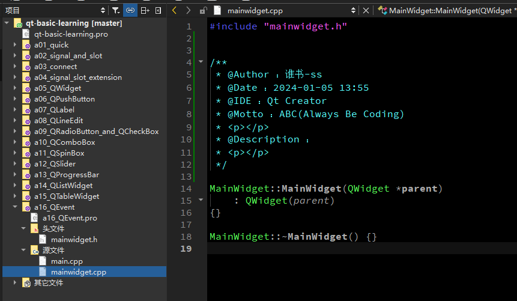


<br><br>

### 整体布局规划

首先，来到 mainwidget.h 添加两个成员变量 navWidget、mainWidget，如下：

```c++
#include <QStackedWidget>

class MainWidget : public QWidget
{
private:
    QWidget* navWidget;
    
    QWidget* mainWidget;
    QStackedWidget* stackedWidget;
};
```

然后，来到 MainWidget 构造，添加左侧导航、右侧主体的整体框架

```c++
#include <QHBoxLayout>
#include <QVBoxLayout>

MainWidget::MainWidget(QWidget* parent) : QWidget(parent)
{
    // 1. 整体采用水平布局
    QHBoxLayout* horizontalLayout = new QHBoxLayout(this);
    horizontalLayout->setSpacing(0);
    horizontalLayout->setContentsMargins(0, 0, 0, 0);

    // 2. 导航窗体
    navWidget = new QWidget(this);
    QVBoxLayout* leftLayout = new QVBoxLayout(navWidget);
    leftLayout->setSpacing(0);
    leftLayout->setContentsMargins(0, 0, 0, 0);

    horizontalLayout->addWidget(navWidget);

    // 3. 主窗体
    mainWidget = new QWidget(this);
    mainWidget->setMinimumWidth(400);
    QVBoxLayout* rightLayout = new QVBoxLayout(mainWidget);
    rightLayout->setSpacing(0);
    rightLayout->setContentsMargins(5, 5, 5, 5);
    stackedWidget = new QStackedWidget(mainWidget);

    rightLayout->addWidget(stackedWidget);

    horizontalLayout->addWidget(mainWidget);
}
```

<br>

==左侧导航采用垂直布局，添加多个 QPushButton；右侧主体采用 QStackedWidget，可以同时填充多个子页面，方便在多个子页面之间切换。==


<br><br>

### 实现左侧导航

首先，来到 mainwidget.h 添加 一个初始化左侧导航的成员函数，如下：

```c++
// 为了把多个 QPushButton 统一管理并实现互斥，放到一个 QButtonGroup 中
#include <QButtonGroup> 

class MainWidget : public QWidget
{
private:
    void initNav();
    QButtonGroup* btnGroup;
};
```

然后，来到 mainwidget.cpp 实现 initNav() 成员函数，如下：

```c++
#include <QPushButton>

void MainWidget::initNav()
{
    // 按钮文字集合
    QStringList names;
    names << "鼠标进入/离开"
          << "鼠标按下/移动/释放"
          << "键盘事件"
          << "定时器事件"
          << "拖动事件"
          << "绘图事件"
          << "右键菜单"
          << "总结：事件的传递流程";

    btnGroup = new QButtonGroup(this);

    //自动生成按钮
    for ( int i = 0; i < names.count(); i++ ) {
        QPushButton* btn = new QPushButton;
        //设置按钮固定高度
        btn->setMinimumHeight(60);
        //设置按钮的文字
        btn->setText(QString("%1. %2").arg(i + 1, 2, 10, QChar('0')).arg(names.at(i)));
        //设置按钮可选中按下类似复选框的功能
        btn->setCheckable(true);
        // 设置按钮的样式
        navWidget->setStyleSheet(R"(
            QPushButton {
                    font: 25px;
                    text-align : left;
            }
        )");
        // 将按钮添加到 btnGroup
        btnGroup->addButton(btn, i);
        //将按钮加入到布局
        navWidget->layout()->addWidget(btn);
    }
}
```

最后，在 mainwidget.cpp 构造中调用 initNav() 即可

```c++
MainWidget::MainWidget(QWidget* parent) : QWidget(parent)
{
    // ...
    
    initNav();
}
```

最终效果如下：

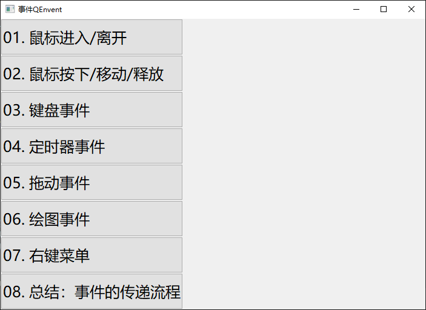


<br><br>

### 实现右侧主体

右侧主体采用`QStackedWidget`，可以同时填充多个子页面，方便在多个子页面之间切换。因此，要创建8个子窗口。

首先，添加第一个窗口：鼠标进入/离开窗口，对应的文件为`enter_leave_widget.cpp.h`

在左侧项目文件名上右键，然后选择`“添加新文件”`，选择 `“C++ Class”`，如下：

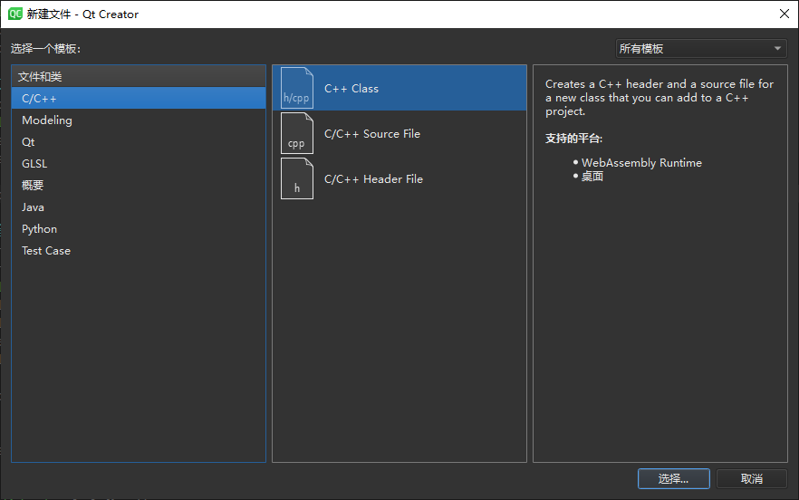

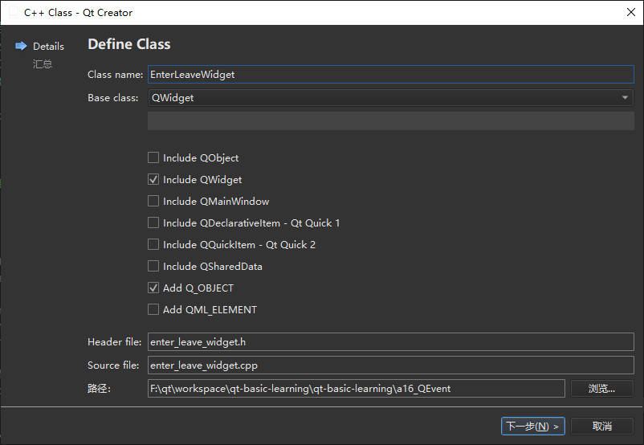

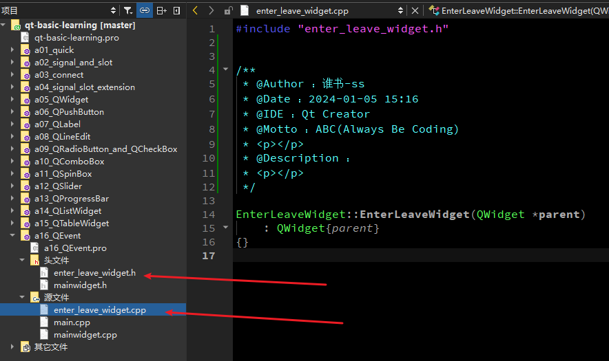

为了便于区分，在该页面添加一个标签，并修改 text 为 “鼠标进入/离开”，如下：

```c++
#include "enter_leave_widget.h"

#include <QLabel>
#include <QVBoxLayout>


/**
 * @Author ：谁书-ss
 * @Date ：2024-01-05 15:16
 * @IDE ：Qt Creator
 * @Motto ：ABC(Always Be Coding)
 * <p></p>
 * @Description ：
 * <p></p>
 */

EnterLeaveWidget::EnterLeaveWidget(QWidget *parent)
    : QWidget{parent}
{
    QVBoxLayout* verticalLayout = new QVBoxLayout(this);
    verticalLayout->setSpacing(0);
    verticalLayout->setContentsMargins(0, 0, 0, 0);

    QLabel* lbl = new QLabel(this);
    lbl->setText("鼠标进入/离开");
    lbl->setFrameShape(QFrame::Box);
    lbl->setFixedHeight(50);
    lbl->setAlignment(Qt::AlignCenter);
    lbl->setStyleSheet("background-color: blue;color: white;font-size: 25px");
    verticalLayout->addWidget(lbl);
}
```

然后，根据上述方法，创建剩余的7个子窗口，类名称分别如下：

- ==PressMoveReleaseWidget==  鼠标按下/移动/释放
- ==KeyWidget==  键盘事件
- ==TimerWidget==  定时器事件
- ==DragWidget==  拖动事件
- ==PaintWidget==  绘图事件
- ==ContextWidget==  右键菜单
- ==PropagateWidget==  总结：事件的传递流程

剩余的7个子窗口的头文件和源文件，依然使用下划线命名法，分别如下

- ==press_move_release_widget==  鼠标按下/移动/释放
- ==key_widget==  键盘事件
- ==timer_widget==  定时器事件
- ==drag_widget==  拖动事件
- ==paint_widget==  绘图事件
- ==context_widget==  右键菜单
- ==propagate_widget==  总结：事件的传递流程

<br>

最终效果如下：

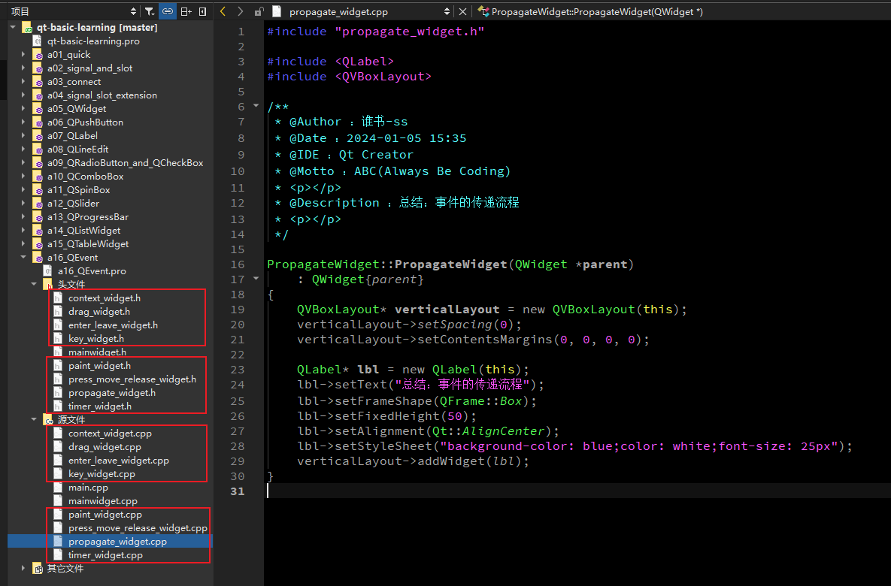


<br><br>

### 左右联动

#### 添加8个窗体

实现点击左侧导航栏的按钮，切换右侧的子界面，首先，在`mainwidget.h`中，添加一个 `initMain()`的成员函数：


<br><br>

#### 关联槽函数

首先，在 mainwidget.h 中，声明左侧导航按钮的槽函数：

```c++
class MainWidget : public QWidget
{
private slots:
    void buttonClicked();  //导航按钮单击事件
};
```

并在 mainwidget.cpp 中 实现该槽函数，如下：

```c++
void MainWidget::buttonClicked()
{
    // 识别按下了哪个按钮
    int index = btnGroup->checkedId();
    stackedWidget->setCurrentIndex(index);
}
```

然后，需要在 initNav() 函数中，关联一下信号槽，如下：

```c++
void MainWidget::initNav()
{
    for ( int i = 0; i < names.count(); i++ ) {
        
        // ...
        
        // 关联信号槽
        connect(btn, &QPushButton::clicked, this, &MainWidget::btnClicked);
    }
}
```

最后，为了默认选中第一项，在 initNav() 最后添加如下一行：

```c++
void MainWidget::initNav()
{
 	// ...
    
    // 默认选中第一项
    btnGroup->button(0)->click();
}
```

此时，运行，就可以左右联动了，如下：

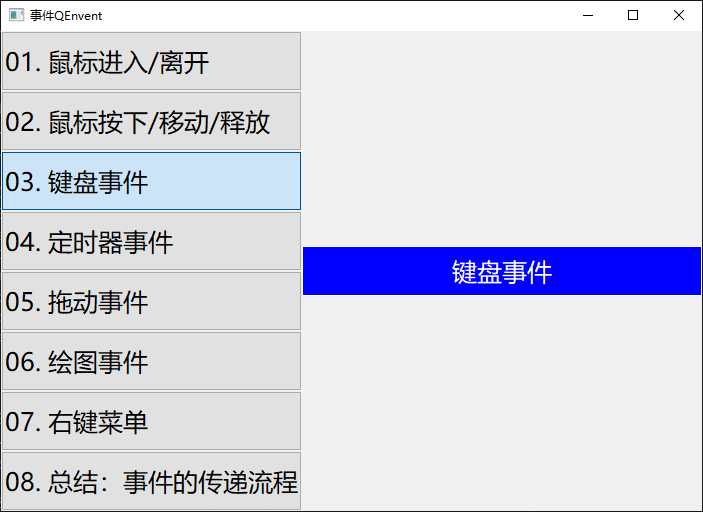


<br><br>

## 鼠标进入、离开事件

`QEvent::Enter`：鼠标进入事件，当鼠标进入到窗口/控件内部时，触发该事件

`QEvent::Leave`：鼠标离开事件，当鼠标进入到窗口/控件内部时，触发该事件


<br><br>

### 通过自定义控件实现

#### 添加自定义控件类 LabelX

首先，在左侧项目文件名上右键，然后选择 “添加新文件”，选择 “C++ Class”，如下：

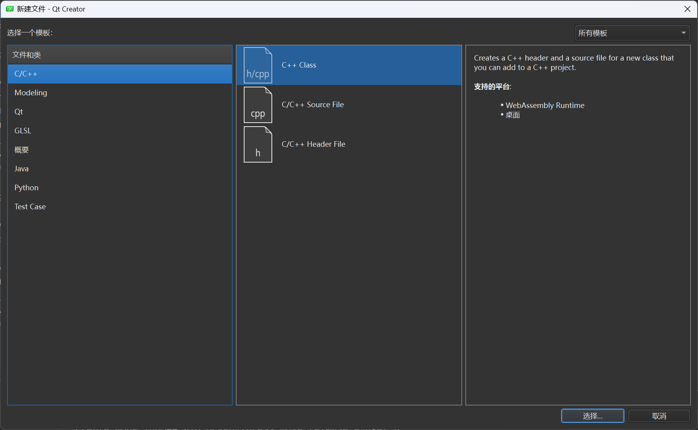

新建类文件信息如下：

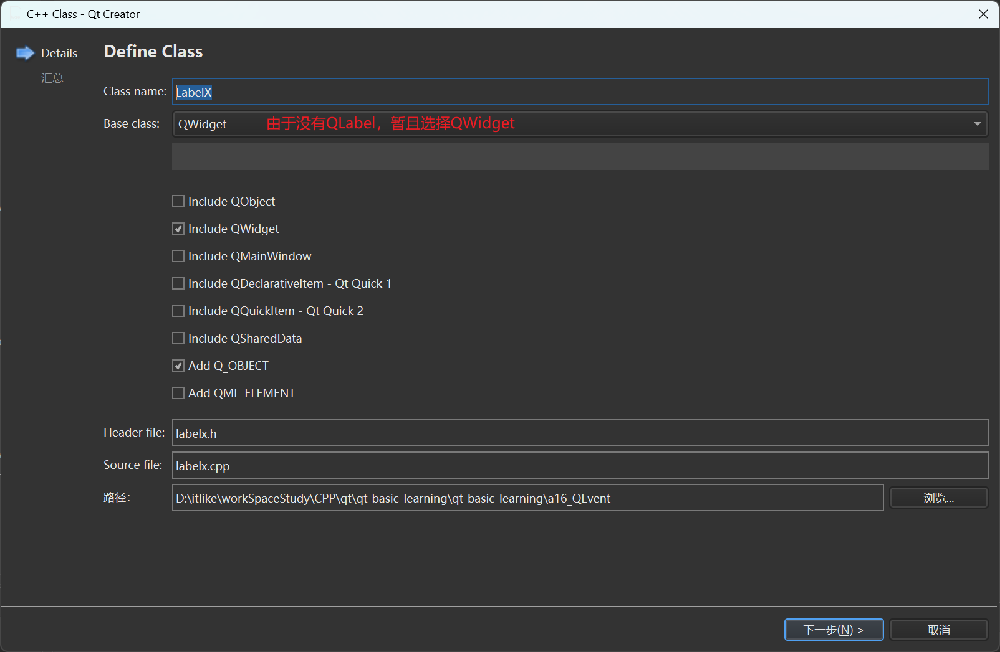

然后，把父类修改为`QLabel`，来到`labelx.h`将父类由`QWidget`修改为`QLabel`，如下：
```c++
#ifndef LABELX_H
#define LABELX_H

#include <QLabel>


/**
 * @Author ：谁书-ss
 * @Date ：2024-01-11 22:18
 * @IDE ：Qt Creator
 * @Motto ：ABC(Always Be Coding)
 * <p></p>
 * @Description ：
 * <p></p>
 */


class LabelX : public QLabel
{
    Q_OBJECT
public:
    explicit LabelX(QWidget *parent = nullptr);

signals:
};

#endif // LABELX_H
```

来到`labelx.cpp`将父类由`QWidget`修改为`QLabel`，如下：

```c++
#include "labelx.h"


/**
 * @Author ：谁书-ss
 * @Date ：2024-01-11 22:18
 * @IDE ：Qt Creator
 * @Motto ：ABC(Always Be Coding)
 * <p></p>
 * @Description ：
 * <p></p>
 */

LabelX::LabelX(QWidget *parent)
    : QLabel{parent}
{}
```


<br><br>

#### 重写 enterEvent/leaveEvent

首先，来到 `labelx.h`，声明这两个函数：

```c++
class LabelX : public QLabel
{
protected:
    // 鼠标进入/离开事件
    void enterEvent(QEnterEvent* enterEvent);
    void leaveEvent(QEvent* event);
};
```

然后，来到 `labelx.cpp` 实现这两个函数：

```c++
static int cnt = 1;

void LabelX::enterEvent(QEnterEvent* enterEvent)
{
    Q_UNUSED(enterEvent)
    //qDebug() << "enterEvent: " << cnt++;
    this->setText(QString("enterEvent: %1").arg(cnt++));
}

void LabelX::leaveEvent(QEvent* event)
{
    Q_UNUSED(event)
    //qDebug() << "leaveEvent: " << cnt++;
    this->setText(QString("leaveEvent: %1").arg(cnt++));
}
```

可以通过 `qDebug()` 在控制台输出，不过为了更直观，直接显示到标签上；

定义了一个静态变量，实现对进入和离开的计数；

使用 `Q_UNUSED` 宏，可以消除 `“unused parameter”` 的警告；


<br><br>

#### 将 LabelX 显示到界面

来到 `enter_leave_widget.cpp`，在构造函数中添加 `LabelX` 控件，如下：

```c++
#include "enter_leave_widget.h"

#include <QLabel>
#include <QVBoxLayout>

#include <labelx.h>

/**
 * @Author ：谁书-ss
 * @Date ：2024-01-05 15:16
 * @IDE ：Qt Creator
 * @Motto ：ABC(Always Be Coding)
 * <p></p>
 * @Description ：鼠标进入/离开
 * <p></p>
 */

EnterLeaveWidget::EnterLeaveWidget(QWidget *parent)
    : QWidget{parent}
{
    QVBoxLayout* verticalLayout = new QVBoxLayout(this);
    verticalLayout->setSpacing(0);
    verticalLayout->setContentsMargins(0, 0, 0, 0);

    // 使用自定义的标签控件LabelX
    LabelX* lblx = new LabelX(this);
    lblx->setText("鼠标进入/离开");
    lblx->setFrameShape(QFrame::Box);
    lblx->setFixedHeight(50);
    lblx->setAlignment(Qt::AlignCenter);
    lblx->setStyleSheet("background-color: blue;color: white;font-size: 25px");
    verticalLayout->addWidget(lblx);
}
```

此时运行程序，每当鼠标进入和离开标签时，计数都会加1，如下：

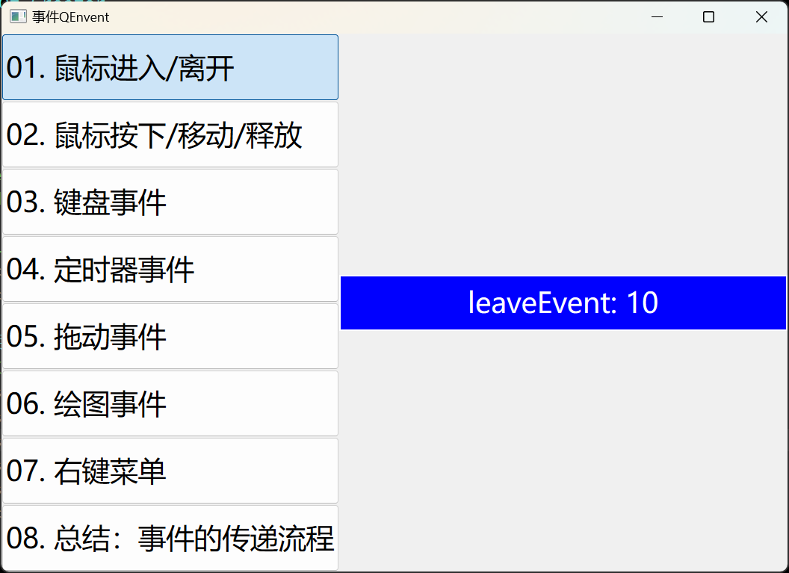


<br><br>

### 通过事件过滤器实现

#### 添加一个 QLabel

首先，在 `enter_leave_widget.h` 文件中添加一个 `QLabel` 的成员变量，如下：

```c++
#include <QLabel>

class EnterLeaveWidget : public QWidget
{
private:
    QLabel* lbl;
};
```

然后，在 `enter_leave_widget.cpp` 的构造中，添加一个 `QLabel` 控件，如下：

```c++
EnterLeaveWidget::EnterLeaveWidget(QWidget* parent) : QWidget{parent}
{
    // 2. 添加一个标准的QLabel
    lbl = new QLabel(this);
    lbl->setText("");
    lbl->setFrameShape(QFrame::Box);
    lbl->setFixedHeight(50);
    lbl->setAlignment(Qt::AlignCenter);
    lbl->setStyleSheet("background-color: red;color: white;font-size: 25px");
    verticalLayout->addWidget(lbl);
}
```


<br><br>

#### 为 QLabel 安装事件过滤器

在 `enter_leave_widget.cpp` 的构造中，为 `QLabel` 控件安装事件过滤器，如下：

```c++
EnterLeaveWidget::EnterLeaveWidget(QWidget* parent) : QWidget{parent}
{
    // ...
    lbl->installEventFilter(this);
}
```

这里将 lbl 的事件过滤器指定为 `this`，那么所有的发给 `lbl` 的事件都会被当前窗口截获。


<br><br>

#### 重写 eventFilter() 函数

重写当前窗口的 `eventFilter()` 函数，首先，在 `enter_leave_widget.h`文件中声明该函数，如下：

```c++
class EnterLeaveWidget : public QWidget
{
protected:
    bool eventFilter(QObject* watched, QEvent* event);
};
```

然后，在 `enter_leave_widget.cpp` 文件中实现该函数，如下：

```c++
#include <QEvent>

static int cnt = 1;
// 查看帮助文档， 拷贝
bool EnterLeaveWidget::eventFilter(QObject* watched, QEvent* event)
{
    if ( watched == lbl ) {
        if ( event->type() == QEvent::Enter ) {
            lbl->setText(QString("enterEvent: %1").arg(cnt++));
        } else if ( event->type() == QEvent::Leave ) {
            lbl->setText(QString("leaveEvent: %1").arg(cnt++));
        }
    }

    return QWidget::eventFilter(watched, event);
}
```

注意：

这里判断下事件是否是发向 `lbl` 的，然后再做处理，因为还有可能监控其他的控件；

通过 `QEvent` 类的 `type()` 函数，可以判断事件的类型；

以上还通过一个静态变量，来对事件计数；

最后调用下父类的 `QWidget::eventFilter(watched, event)`，其他事件交由父类处理；

此时运行，在当前窗口就可以截获发向 `QLabel` 的进入和离开事件了，如下：


<br><br>

## 鼠标按下、移动、释放事件

### 按下、移动、释放事件的基本使用

#### 鼠标按下、释放事件

首先，来到 labelx.h，声明这 3 个函数：

```c++
class LabelX : public QLabel
{
protected:
    void mousePressEvent(QMouseEvent *qmouseEvent);
    void mouseReleaseEvent(QMouseEvent *qmouseEvent);
    void mouseMoveEvent(QMouseEvent *qmouseEvent);
};
```

然后，来到 labelx.cpp 实现这 3 个函数：

```c++
void LabelX::mousePressEvent(QMouseEvent *qmouseEvent) {

    qDebug() << "mousePressEvent: " << qmouseEvent->button() << qmouseEvent->pos() << qmouseEvent->globalPosition();
    if (qmouseEvent->button() == Qt::LeftButton) {
        qDebug() << "左键按下: " << "x=" << qmouseEvent->position().x() << ", y=" << qmouseEvent->position().y();
    }
    if (qmouseEvent->button() == Qt::RightButton) {
        qDebug() << "右键按下: " << "x=" << qmouseEvent->position().x() << ", y=" << qmouseEvent->position().y();
    }
}

void LabelX::mouseReleaseEvent(QMouseEvent *qmouseEvent) {
    qDebug() << "mouseReleaseEvent: " << qmouseEvent->button() << qmouseEvent->pos() << qmouseEvent->globalPosition();
    if (qmouseEvent->button() == Qt::LeftButton) {
        qDebug() << "左键释放: " << "x=" << qmouseEvent->position().x() << ", y=" << qmouseEvent->position().y();
    }
    if (qmouseEvent->button() == Qt::RightButton) {
        qDebug() << "右键释放: " << "x=" << qmouseEvent->position().x() << ", y=" << qmouseEvent->position().y();
    }
}

void LabelX::mouseMoveEvent(QMouseEvent *qmouseEvent) {
    
}
```

最后，来到 press_move_release_widget.cpp，在构造函数中添加 LabelX 控件，如下：

```c++
#include "press_move_release_widget.h"

#include <QVBoxLayout>
#include "labelx.h"

/**
 * @Author ：谁书-ss
 * @Date ：2024-01-05 15:30
 * @IDE ：Qt Creator
 * @Motto ：ABC(Always Be Coding)
 * <p></p>
 * @Description ：鼠标按下/移动/释放
 * <p></p>
 */

PressMoveReleaseWidget::PressMoveReleaseWidget(QWidget *parent)
    : QWidget{parent} {
    QVBoxLayout *verticalLayout = new QVBoxLayout(this);
    verticalLayout->setSpacing(0);
    verticalLayout->setContentsMargins(0, 0, 0, 0);

    // 自定义的LabelX
    LabelX *lblx = new LabelX(this);
    lblx->setText("鼠标按下/移动/释放");
    lblx->setFrameShape(QFrame::Box);
    lblx->setFixedHeight(50);
    lblx->setAlignment(Qt::AlignCenter);
    lblx->setStyleSheet("background-color: blue;color: white;font-size: 25px");
    verticalLayout->addWidget(lblx);
}
```


<br><br>

#### 鼠标移动事件

鼠标移动，与鼠标按下和释放，在判断按键时有些许不同，此时不能使用`ev->button()`，而是要使用`ev->buttons()`

```c++
void LabelX::mouseMoveEvent(QMouseEvent *qmouseEvent) {
    qDebug() << "mouseReleaseEvent: " << qmouseEvent->button() << qmouseEvent->pos() << qmouseEvent->globalPosition();
}
```

在移动过程中，判断有左键按下的代码，如下：

```c++
void LabelX::mouseMoveEvent(QMouseEvent *qmouseEvent) {
    qDebug() << "mouseReleaseEvent: " << qmouseEvent->buttons() << qmouseEvent->pos() << qmouseEvent->globalPosition();
    if (qmouseEvent->buttons() & Qt::LeftButton) {
        qDebug() << "鼠标左键移动中：x=" << qmouseEvent->position().x() << "， y=" << qmouseEvent->position().y();
    }
}
```


<br><br>

#### 鼠标跟踪

以上，需要鼠标保持按下的状态下，系统才会调用 mouseMoveEvent，实际工作中往往有这么一种需求：

鼠标悬浮在控件上，而不是按下，就触发 mouseMoveEvent 事件，这怎么实现呢？

答案：设置鼠标跟踪，默认情况下鼠标跟踪是关闭的，需要开启

首先，来到 labelx.cpp 中，设置标签使能鼠标跟踪，如下：

```c++
LabelX::LabelX(QWidget* parent) : QLabel{parent}
{
    this->setMouseTracking(true);

    // ...
}
```

然后，在 mouseMoveEvent 中添加打印，如下：

```c++
void LabelX::mouseMoveEvent(QMouseEvent *qmouseEvent) {
    qDebug() << "mouseReleaseEvent: " << qmouseEvent->buttons() << qmouseEvent->pos() << qmouseEvent->globalPosition();
    if (qmouseEvent->buttons() & Qt::LeftButton) {
        qDebug() << "鼠标左键移动中：x=" << qmouseEvent->position().x() << "， y=" << qmouseEvent->position().y();
    }
}
```

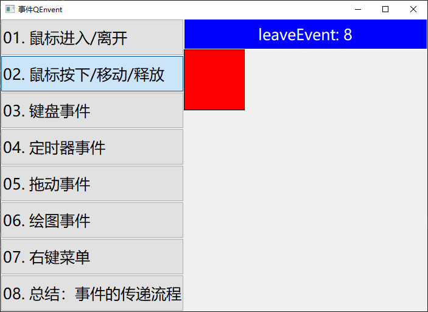


<br><br>

### 鼠标事件移动标签

#### 界面上添加标签

首先，在`press_move_release_widget.h`中添加成员变量：

```c++
#ifndef PRESSMOVERELEASEWIDGET_H
#define PRESSMOVERELEASEWIDGET_H

#include <QWidget>
#include <QLabel>

/**
 * @Author ：谁书-ss
 * @Date ：2024-01-05 15:30
 * @IDE ：Qt Creator
 * @Motto ：ABC(Always Be Coding)
 * <p></p>
 * @Description ：鼠标按下/移动/释放
 * <p></p>
 */

class PressMoveReleaseWidget : public QWidget {
    Q_OBJECT
public:
    explicit PressMoveReleaseWidget(QWidget *parent = nullptr);
private:
    QLabel *lbl;
    QWidget *widget;
signals:
};

#endif // PRESSMOVERELEASEWIDGET_H
```

在`QLable`外边套一层`QWidget`，是为了让标签在这个`widget`范围内移动


然后，在`press_move_release_widget.cpp`的构造中添加一个标签：

```c++
PressMoveReleaseWidget::PressMoveReleaseWidget(QWidget *parent)
    : QWidget{parent} {
    QVBoxLayout *verticalLayout = new QVBoxLayout(this);
    verticalLayout->setSpacing(0);
    verticalLayout->setContentsMargins(0, 0, 0, 0);

    // ...

    // 标准的QLabel
    widget = new QWidget(this);
    lbl = new QLabel(widget);
    lbl->setText("");
    lbl->setFrameShape(QFrame::Box);
    lbl->setFixedSize(100, 100);
    lbl->setStyleSheet("background-color: red");
    verticalLayout->addWidget(widget);
}
```


<br><br>

#### 为QLabel安装事件过滤器

```c++
PressMoveReleaseWidget::PressMoveReleaseWidget(QWidget *parent)
    : QWidget{parent} {
    QVBoxLayout *verticalLayout = new QVBoxLayout(this);
    verticalLayout->setSpacing(0);
    verticalLayout->setContentsMargins(0, 0, 0, 0);

    // ...

    // 安装事件过滤器
    lbl->installEventFilter(this);
}
```


<br><br>

#### 重写eventFilter()函数

重写当前窗口的 eventFilter() 函数

首先，在 press_move_release_widget.h 文件中声明该函数，

同时声明记录窗口位置和鼠标按下位置的变量，如下：

```c++
#ifndef PRESSMOVERELEASEWIDGET_H
#define PRESSMOVERELEASEWIDGET_H

#include <QWidget>
#include <QLabel>

/**
 * @Author ：谁书-ss
 * @Date ：2024-01-05 15:30
 * @IDE ：Qt Creator
 * @Motto ：ABC(Always Be Coding)
 * <p></p>
 * @Description ：鼠标按下/移动/释放
 * <p></p>
 */

class PressMoveReleaseWidget : public QWidget {
    Q_OBJECT
public:
    explicit PressMoveReleaseWidget(QWidget *parent = nullptr);
private:
    // ...

    // 鼠标按下的位置
    QPointF localGlobalPosition;
    // 标签的位置（左上角的点top-left）
    QPoint wndPos;
signals:
};

#endif // PRESSMOVERELEASEWIDGET_H
```

然后，在`press_move_release_widget.cpp`文件中实现该函数，如下：

```c++
#include <QEvent>
#include <QMouseEvent>
#include <QDebug>

bool PressMoveReleaseWidget::eventFilter(QObject *watched, QEvent *event) {
    if (watched != lbl) {
        return QWidget::eventFilter(watched, event);
    }

    if (event->type() == QEvent::MouseButtonPress) {
        qDebug() << "MouseButtonPress";
        QMouseEvent *mouseEvent = static_cast<QMouseEvent *>(event);
        localGlobalPosition = mouseEvent->globalPosition();
        wndPos = lbl->pos();
        qDebug() << wndPos;
    } else if (event->type() == QEvent::MouseMove) {
        qDebug() << "MouseMove";
        QMouseEvent *mouseEvent = static_cast<QMouseEvent *>(event);
        QPointF dstPos = wndPos + (mouseEvent->globalPosition() - localGlobalPosition);
        lbl->move(dstPos.x(), dstPos.y());
        // 超出了最左边
        if (lbl->pos().x() < 0) {
            qDebug() << "超出了最左边，x：" << lbl->pos().x() << "，y：" << dstPos.y();
            lbl->move(0, dstPos.y());
        }
        // 超出了最右边
        if (lbl->pos().x() > widget->width() - lbl->width()) {
            qDebug() << "超出了最右边，x：" << lbl->pos().x() << "，y：" << dstPos.y();
            lbl->move(widget->width() - lbl->width(), dstPos.y());
        }
        // 超出了最上边
        if (lbl->pos().y() < 0) {
            qDebug() << "超出了最上边，x：" << lbl->pos().x() << "，y：" << dstPos.y();
            lbl->move(dstPos.x(), 0);
        }
        // 超出了最下边
        if (lbl->pos().y() > widget->height() - lbl->height()) {
            qDebug() << "超出了最下边，x：" << lbl->pos().x() << "，y：" << dstPos.y();
            lbl->move(dstPos.x(), widget->height() - lbl->height());
        }
    } else if (event->type() == QEvent::MouseButtonRelease) {
        qDebug() << "MouseButtonRelease";
    }
    return false;
}
```

这里有些实现细节，说明如下：

如果不是`lbl`的事件，直接调用父类处理`return QWidget::eventFilter(watched, event)`
在鼠标按下时，记录`lbl`的位置和鼠标按下位置，作为窗口移动时的参考
当`lbl`超出`widget`边界时，让它等于边界值

此时，就可以通过鼠标拖动标签，在 widget 范围内移动了，如下：

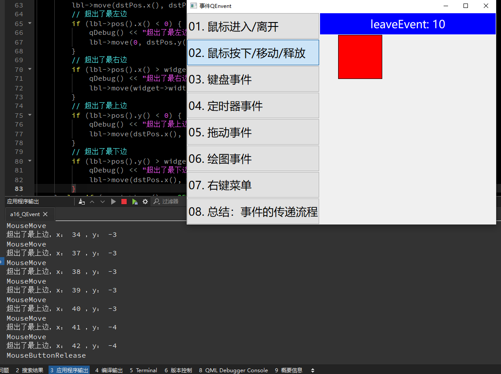


<br><br>

## 键盘事件

- ==QEvent::KeyPress==：键盘按下时，触发该事件，它对应的子类是`QKeyEvent`
- ==QEvent::KeyRelease==：键盘抬起时，触发该事件，它对应的子类是`QKeyEvent`


<br><br>

### 键盘按下、释放事件的基本使用

只需重写`keyPressEvent()`和`keyPressEvent()`两个函数即可

首先，在`key_widget.h`中添加两个函数的声明

```c++
#ifndef KEYWIDGET_H
#define KEYWIDGET_H

#include <QWidget>


/**
 * @Author ：谁书-ss
 * @Date ：2024-01-05 15:30
 * @IDE ：Qt Creator
 * @Motto ：ABC(Always Be Coding)
 * <p></p>
 * @Description ：键盘事件
 * <p></p>
 */

class KeyWidget : public QWidget {
    Q_OBJECT
public:
    explicit KeyWidget(QWidget *parent = nullptr);
protected:
    // 按键按下
    void keyPressEvent(QKeyEvent *keyEvent);
    // 按键抬起
    void keyReleaseEvent(QKeyEvent *keyEvent);
signals:
};

#endif // KEYWIDGET_H
```

然后，来到 key_widget.cpp 实现这 2 个函数：

```c++
#include "key_widget.h"

#include <QLabel>
#include <QVBoxLayout>
#include <QKeyEvent>

/**
 * @Author ：谁书-ss
 * @Date ：2024-01-05 15:30
 * @IDE ：Qt Creator
 * @Motto ：ABC(Always Be Coding)
 * <p></p>
 * @Description ：键盘事件
 * <p></p>
 */

KeyWidget::KeyWidget(QWidget *parent)
    : QWidget{parent} {
    QVBoxLayout *verticalLayout = new QVBoxLayout(this);
    verticalLayout->setSpacing(0);
    verticalLayout->setContentsMargins(0, 0, 0, 0);

    QLabel *lbl = new QLabel(this);
    lbl->setText("键盘事件");
    lbl->setFrameShape(QFrame::Box);
    lbl->setFixedHeight(50);
    lbl->setAlignment(Qt::AlignCenter);
    lbl->setStyleSheet("background-color: blue;color: white;font-size: 25px");
    verticalLayout->addWidget(lbl);
}

void KeyWidget::keyPressEvent(QKeyEvent *keyEvent) {
    // 普通键
    switch (keyEvent->key() ) {
    case Qt::Key_Return:
        qDebug() << "Enter";
        break;
    case Qt::Key_Escape:
        qDebug() << "Esc";
        break;
    case Qt::Key_Control:
        qDebug() << "Ctrl";
        break;
    case Qt::Key_Shift:
        qDebug() << "Shift";
        break;
    case Qt::Key_Alt:
        qDebug() << "Alt";
        break;
    case Qt::Key_Up:
        qDebug() << "Up";
        break;
    case Qt::Key_Down:
        qDebug() << "Down";
        break;
    case Qt::Key_Left:
        qDebug() << "Left";
        break;
    case Qt::Key_Right:
        qDebug() << "Right";
        break;
    case Qt::Key_A:
        qDebug() << "A";
        break;
    case Qt::Key_B:
        qDebug() << "B";
        break;
    case Qt::Key_C:
        qDebug() << "C";
        break;
    case Qt::Key_D:
        qDebug() << "D";
        break;
    default:
        break;
    }

    // 两键组合
    //    qDebug() << event->modifiers(); // QFlags<Qt::KeyboardModifier>(ShiftModifier|ControlModifier)
    // event->modifiers()，用来判读是否按下 Ctrl/Shift/Alt 键
    if ((keyEvent->modifiers() == Qt::ControlModifier) && (keyEvent->key() == Qt::Key_A) ) {
        qDebug() << "Ctrl + A";
    }
    if ((keyEvent->modifiers() == Qt::ShiftModifier) && (keyEvent->key() == Qt::Key_C) ) {
        qDebug() << "Shift + B";
    }
    if ((keyEvent->modifiers() == Qt::AltModifier) && (keyEvent->key() == Qt::Key_B) ) {
        qDebug() << "ALT + C";
    }
    // 三键组合Shift + Ctrl + D 的实现
    if ((keyEvent->modifiers() == (Qt::ShiftModifier | Qt::ControlModifier)) && (keyEvent->key() == Qt::Key_D) ) {
        qDebug() << "CTRL + Shift + D";
    }
}

void KeyWidget::keyReleaseEvent(QKeyEvent *keyEvent) {
    switch (keyEvent->key()) {
    case Qt::Key_Return:
        qDebug() << "keyReleaseEvent: Enter";
        break;
    case Qt::Key_Escape:
        qDebug() << "keyReleaseEvent: Esc";
        break;
    case Qt::Key_Up:
        qDebug() << "keyReleaseEvent: Up";
        break;
    case Qt::Key_Down:
        qDebug() << "keyReleaseEvent: Down";
        break;
    case Qt::Key_Left:
        qDebug() << "keyReleaseEvent: Left";
        break;
    case Qt::Key_Right:
        qDebug() << "keyReleaseEvent: Right";
        break;
    case Qt::Key_A:
        qDebug() << "keyReleaseEvent: A";
        break;
    case Qt::Key_B:
        qDebug() << "keyReleaseEvent: B";
        break;
    case Qt::Key_C:
        qDebug() << "keyReleaseEvent: C";
        break;
    case Qt::Key_D:
        qDebug() << "keyReleaseEvent: D";
        break;
    case Qt::Key_Control:
        qDebug() << "keyReleaseEvent: Ctrl";
        break;
    case Qt::Key_Shift:
        qDebug() << "keyReleaseEvent: Shift";
        break;
    case Qt::Key_Alt:
        qDebug() << "keyReleaseEvent: Alt";
        break;
    }
}
```

说明：
- 每个按键对应一个枚举值，比如`Qt::Key_A`代表按键`A`，`Qt::Key_Control`代表`Crtl`键，等等
- `QKeyEvent`类的`key()`方法，可以获取当前按下的哪个按键
- 判断`Ctrl/Shift/Alt`等控制按键，需要使用`QKeyEvent`类的`modifiers()`方法

最后，还需要在构造中添加如下语句：

```c++
KeyWidget::KeyWidget(QWidget *parent)
    : QWidget{parent} {
    // ...

    setFocusPolicy(Qt::StrongFocus);

    // ...
}
```

此时，运行程序，可以看到打印如下：

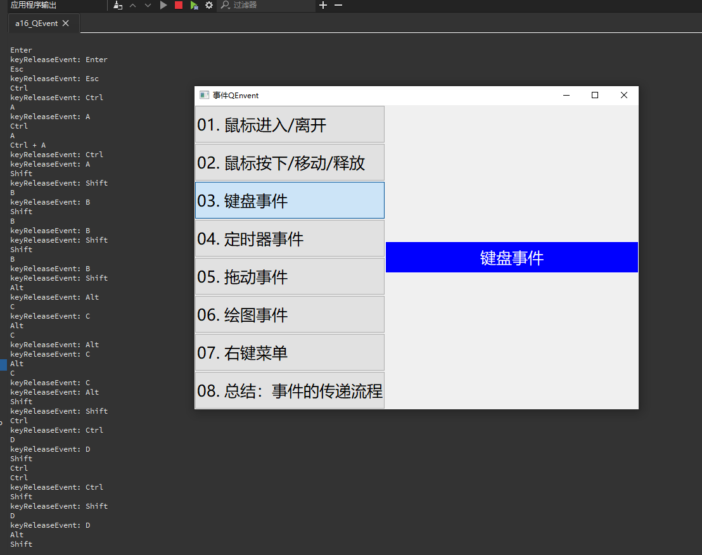


<br><br>

### 键盘事件移动标签

接下来，实现一个小案例：通过上下左右按键，来移动标签的位置


<br><br>

#### 界面上添加标签

首先，在`key_widget.h`中添加成员变量：

```c++
#ifndef KEYWIDGET_H
#define KEYWIDGET_H

#include <QWidget>
#include <QLabel>


/**
 * @Author ：谁书-ss
 * @Date ：2024-01-05 15:30
 * @IDE ：Qt Creator
 * @Motto ：ABC(Always Be Coding)
 * <p></p>
 * @Description ：键盘事件
 * <p></p>
 */

class KeyWidget : public QWidget {
    Q_OBJECT
public:
    explicit KeyWidget(QWidget *parent = nullptr);
private:
    QLabel *lbl2;

// ...

signals:
};

#endif // KEYWIDGET_H
```

然后，在`key_widget.cpp`的构造中添加一个标签：

```c++
KeyWidget::KeyWidget(QWidget *parent)
    : QWidget{parent} {
    
    // ...

    lbl2 = new QLabel(this);
    lbl2->setText("");
    lbl2->setFrameShape(QFrame::Box);
    lbl2->setFixedSize(100, 100);
    lbl2->setStyleSheet("background-color: red");
}
```

此时，运行效果如下：

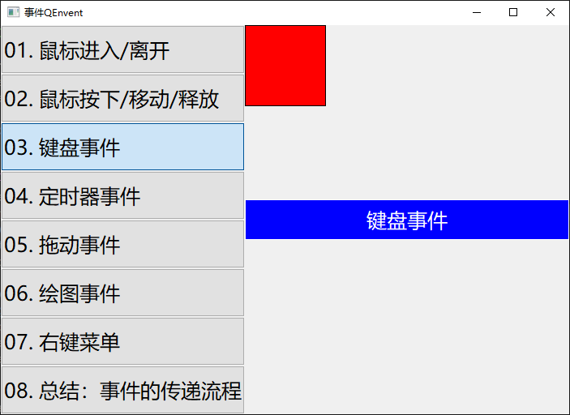


<br><br>

#### 移动标签

只需修改上下左右按键的逻辑即可（当移动到尽头，则从另一端重新出现开始移动）：

```c++
void KeyWidget::keyPressEvent(QKeyEvent *keyEvent) {

    // ...

    switch (keyEvent->key() ) {
    case Qt::Key_Up:
        qDebug() << "Up";
        lbl2->move(lbl2->x(), lbl2->y() - 20);
        if (lbl2->y() + lbl2->height() <= 0 ) {
            lbl2->move(lbl2->x(), this->height());
        }
        break;
    case Qt::Key_Down:
        qDebug() << "Down";
        lbl2->move(lbl2->x(), lbl2->y() + 20);
        if (lbl2->y() >= this->height() ) {
            lbl2->move(lbl2->x(), 0);
        }
        break;
    case Qt::Key_Left:
        qDebug() << "Left";
        lbl2->move(lbl2->x() - 20, lbl2->y());
        if (lbl2->x() + lbl2->width() <= 0 ) {
            lbl2->move(this->width(), lbl2->y());
        }
        break;
    case Qt::Key_Right:
        qDebug() << "Right";
        lbl2->move(lbl2->x() + 20, lbl2->y());
        if (lbl2->x() >= this->width() ) {
            lbl2->move(0, lbl2->y());
        }
        break;
    }

    // ...

}
```

此时，按键盘上的上下左右箭头，效果如下：

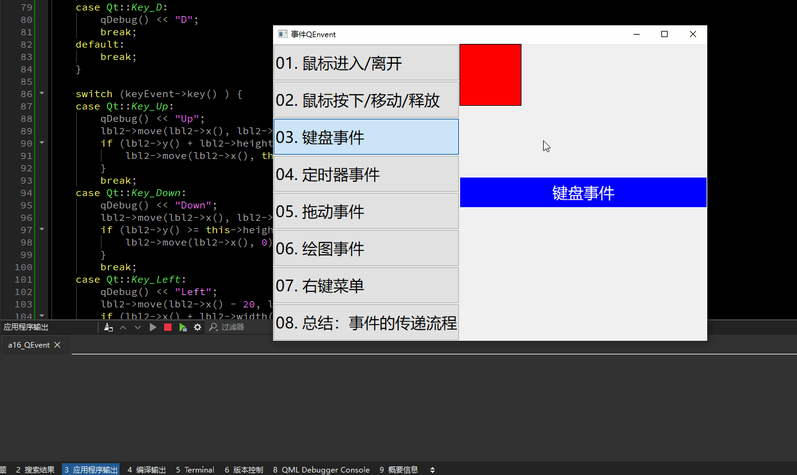


<br><br>

## 定时器事件

QT 中使用定时器，有两种方式：
- 定时器类：`QTimer`
- 定时器事件：`QEvent::Timer`，对应的子类是`QTimerEvent`


<br><br>

### 界面布局

把两个标签以及 “启动”、“停止”、“复位” 三个按钮布局在界面上。

首先，来到`timer_widget.h`，声明两个标签：

```c++
#ifndef TIMERWIDGET_H
#define TIMERWIDGET_H

#include <QWidget>
#include <QLabel>

/**
 * @Author ：谁书-ss
 * @Date ：2024-01-05 15:31
 * @IDE ：Qt Creator
 * @Motto ：ABC(Always Be Coding)
 * <p></p>
 * @Description ：定时器事件
 * <p></p>
 */

class TimerWidget : public QWidget {
    Q_OBJECT
public:
    explicit TimerWidget(QWidget *parent = nullptr);
private:
    QLabel *lbl1;
    QLabel *lbl2;
signals:
};

#endif // TIMERWIDGET_H
```

然后，来到`timer_widget.cpp`，添加两个标签：

```c++
#include "timer_widget.h"

#include <QLabel>
#include <QVBoxLayout>
#include <QPushButton>


/**
 * @Author ：谁书-ss
 * @Date ：2024-01-05 15:31
 * @IDE ：Qt Creator
 * @Motto ：ABC(Always Be Coding)
 * <p></p>
 * @Description ：定时器事件
 * <p></p>
 */

TimerWidget::TimerWidget(QWidget *parent)
    : QWidget{parent} {
    QVBoxLayout *verticalLayout = new QVBoxLayout(this);
    verticalLayout->setSpacing(0);
    verticalLayout->setContentsMargins(0, 0, 0, 0);

    // 1. 添加第一个QLabel
    lbl1 = new QLabel(this);
    lbl1->setText("");
    lbl1->setFrameShape(QFrame::Box);
    lbl1->setFixedSize(100, 100);
    lbl1->setStyleSheet("background-color: red;");
    verticalLayout->addWidget(lbl1);

    // 2. 添加第二个QLabel
    lbl2 = new QLabel(this);
    lbl2->setText("");
    lbl2->setFrameShape(QFrame::Box);
    lbl2->setFixedSize(100, 100);
    lbl2->setStyleSheet("background-color: blue;");
    verticalLayout->addWidget(lbl2);

    // 3. 添加按钮的水平布局
    QHBoxLayout *horizontalLayout = new QHBoxLayout(this);
    horizontalLayout->setSpacing(0);
    horizontalLayout->setContentsMargins(0, 0, 0, 0);

    QPushButton *btnStart = new QPushButton(this);
    btnStart->setText("开始");
    horizontalLayout->addWidget(btnStart);

    QPushButton *btnStop = new QPushButton(this);
    btnStop->setText("停止");
    horizontalLayout->addWidget(btnStop);

    QPushButton *btnReset = new QPushButton(this);
    btnReset->setText("复位");
    horizontalLayout->addWidget(btnReset);
    verticalLayout->addLayout(horizontalLayout);

    this->setStyleSheet(R"(
        QPushButton {
            font-size: 22px;
        }
    )");
}
```

此时运行程序，效果如下：

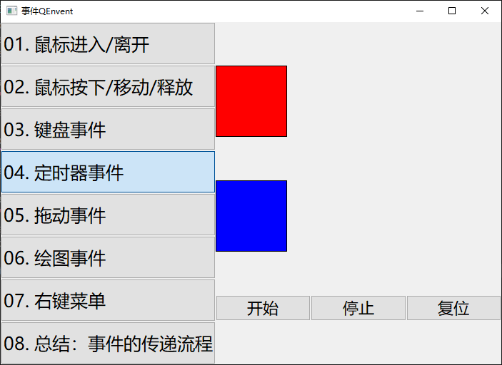


<br><br>

### 关联信号槽

首先，来到`timer_widget.h`，声明 3 个槽函数

```c++
class TimerWidget : public QWidget
{
private slots:
    void onStartClicked();
    void onStopClicked();
    void onResetClicked();
};
```

然后，来到`timer_widget.cpp`，做一个空实现：

```c++
void TimerWidget::onStartClicked() {

}

void TimerWidget::onStopClicked() {

}

void TimerWidget::onResetClicked() {

}
```

最后，来到`timer_widget.cpp`，在构造中连接信号槽：

```c++
TimerWidget::TimerWidget(QWidget *parent)
    : QWidget{parent} {
    
    // ...
    
    connect(btnStart, &QPushButton::clicked, this, &TimerWidget::onStartClicked);
    connect(btnStop, &QPushButton::clicked, this, &TimerWidget::onStopClicked);
    connect(btnReset, &QPushButton::clicked, this, &TimerWidget::onResetClicked);
}
```


<br><br>

### 重写timerEvent

当定时时间到，就会自动调用`timerEvent()`函数。

首先，来到`timer_widget.h`中，声明`timerEvent()`函数，并声明两个定时器`id`：

```c++
class TimerWidget : public QWidget
{
protected:
    void timerEvent(QTimerEvent* event);
    
private:
    int id1;
    int id2;
};
```

然后，来到`timer_widget.cpp`中，实现`timerEvent()`函数：

```c++
void TimerWidget::timerEvent(QTimerEvent* event)
{
    //    qDebug() << "timerEvent";
    if ( event->timerId() == id1 ) {
        lbl1->move(lbl1->x() + 5, lbl1->y());
        if ( lbl1->x() >= this->width() ) {
            lbl1->move(0, lbl1->y());
        }
    } else if ( event->timerId() == id2 ) {
        lbl2->move(lbl2->x() + 5, lbl2->y());
        if ( lbl2->x() >= this->width() ) {
            lbl2->move(0, lbl2->y());
        }
    }
}
```

说明：

- 在`timerEvent()`函数中，向右移动标签。当标签超出当前窗口，重新回到最左侧
- 可以启动多个定时器，在`timerEvent()`中，使用`QTimerEvent`类的`timerId()`函数可以获取哪个定时器定时时间到


<br><br>

### 实现槽函数，启动定时器

上一步中提到，定时时间到时，移动标签，那么就需要先启动定时器，并指定一个定时间隔。

首先，在 “启动” 按钮的槽函数中，启动定时器：

```c++
void TimerEventWidget::onStartClicked()
{
    // 时间间隔10ms
    id1 = startTimer(10);
    // 时间间隔20ms
    id2 = startTimer(20);
}
```

然后，在 “停止” 按钮的槽函数中，停止定时器：

```c++
void TimerWidget::onStopClicked() {
    killTimer(id1);
    killTimer(id2);
}
```

最后，在 “复位” 按钮的槽函数中，复位标签位置到最左侧：

```c++
void TimerWidget::onResetClicked() {
    lbl1->move(0, lbl1->y());
    lbl2->move(0, lbl2->y());
}
```

此时运行，点击按钮，效果如下：

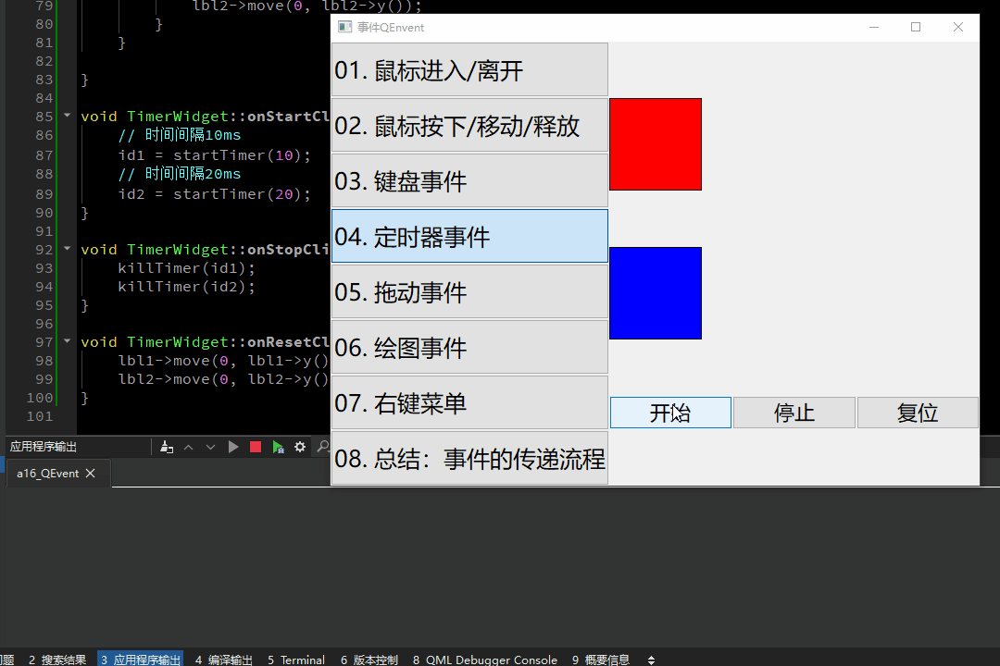


<br><br>

### 定时器类`QTimer`

接下来，使用定时器类`QTimer`来实现以上同样的效果

首先，在`timer_widget.h`声明两个定时器类的对象，以及定时超时的槽函数：

```c++
#include <QTimer>

class TimerWidget : public QWidget {
private slots:
    void onTimeout1();
    void onTimeout2();

private:
    QTimer *timer1;
    QTimer *timer2;
};
```

然后，在`timer_widget.cpp`中实现两个定时超时槽函数：

```c++
void TimerWidget::onTimeout1() {
    lbl1->move(lbl1->x() + 5, lbl1->y());
    if (lbl1->x() >= this->width()) {
        lbl1->move(0, lbl1->y());
    }
}

void TimerWidget::onTimeout2() {
    lbl2->move(lbl2->x() + 5, lbl2->y());
    if (lbl2->x() >= this->width()) {
        lbl2->move(0, lbl2->y());
    }
}
```

这里移动标签，并在标签超出当前窗口边界时，复位到最左侧

接着，修改 “启动”、“停止” 按钮的槽函数。

为便于切换定时器类和定时器事件这两种方式，定义了一个宏：

```c++
#define USE_TIMER_EVENT

void TimerWidget::onStartClicked() {
#ifdef USE_TIMER_EVENT
    // 时间间隔10ms
    id1 = startTimer(10);
    // 时间间隔20ms
    id2 = startTimer(20);
#else
    timer1->start(20);
    timer2->start(10);
#endif
}

void TimerWidget::onStopClicked() {
#ifdef USE_TIMER_EVENT
    killTimer(id1);
    killTimer(id2);
#else
    timer1->stop();
    timer2->stop();
#endif
}
```

最后，在 timer_widget.cpp 的构造中创建定时器，并关联槽函数：

```c++
TimerWidget::TimerWidget(QWidget *parent)
    : QWidget{parent} {
    // ...
    
    timer1 = new QTimer(this);
    connect(timer1, &QTimer::timeout, this, &TimerWidget::onTimeout1);

    timer2 = new QTimer(this);
    connect(timer2, &QTimer::timeout, this, &TimerWidget::onTimeout2);
}
```

此时，运行效果如下：

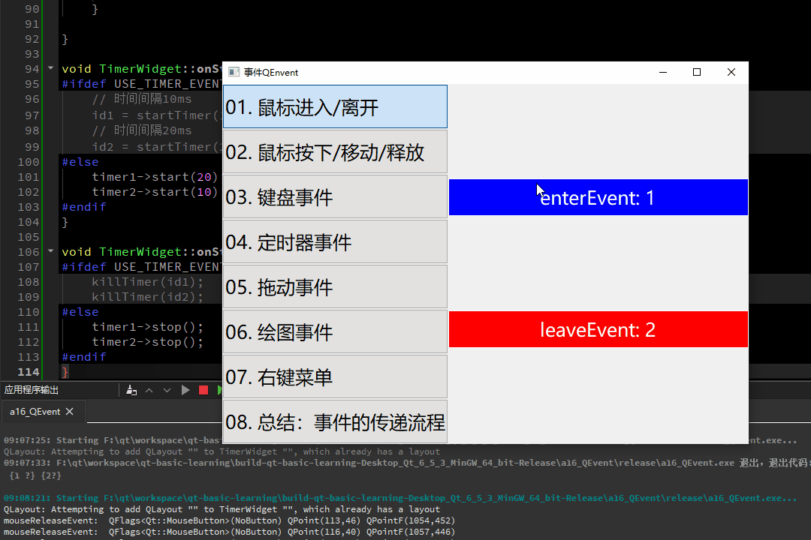


### 完整代码

`timer_widget.h` 头文件
```c++
#ifndef TIMERWIDGET_H
#define TIMERWIDGET_H

#include <QWidget>
#include <QLabel>
#include <QTimer>

/**
 * @Author ：谁书-ss
 * @Date ：2024-01-05 15:31
 * @IDE ：Qt Creator
 * @Motto ：ABC(Always Be Coding)
 * <p></p>
 * @Description ：定时器事件
 * <p></p>
 */

class TimerWidget : public QWidget {
    Q_OBJECT
public:
    explicit TimerWidget(QWidget *parent = nullptr);
private:
    QLabel *lbl1;
    QLabel *lbl2;
    int id1;
    int id2;

    QTimer *timer1;
    QTimer *timer2;


protected:
    void timerEvent(QTimerEvent *event);


private slots:
    void onStartClicked();
    void onStopClicked();
    void onResetClicked();

    void onTimeout1();
    void onTimeout2();


signals:
};

#endif // TIMERWIDGET_H
```

`timer_widget.cpp` 源文件
```c++
#include "timer_widget.h"

#include <QLabel>
#include <QVBoxLayout>
#include <QPushButton>
#include <QTimerEvent>

#define USE_TIMER_EVENT1


/**
 * @Author ：谁书-ss
 * @Date ：2024-01-05 15:31
 * @IDE ：Qt Creator
 * @Motto ：ABC(Always Be Coding)
 * <p></p>
 * @Description ：定时器事件
 * <p></p>
 */

TimerWidget::TimerWidget(QWidget *parent)
    : QWidget{parent} {
    QVBoxLayout *verticalLayout = new QVBoxLayout(this);
    verticalLayout->setSpacing(0);
    verticalLayout->setContentsMargins(0, 0, 0, 0);

    // 1. 添加第一个QLabel
    lbl1 = new QLabel(this);
    lbl1->setText("");
    lbl1->setFrameShape(QFrame::Box);
    lbl1->setFixedSize(100, 100);
    lbl1->setStyleSheet("background-color: red;");
    verticalLayout->addWidget(lbl1);

    // 2. 添加第二个QLabel
    lbl2 = new QLabel(this);
    lbl2->setText("");
    lbl2->setFrameShape(QFrame::Box);
    lbl2->setFixedSize(100, 100);
    lbl2->setStyleSheet("background-color: blue;");
    verticalLayout->addWidget(lbl2);

    // 3. 添加按钮的水平布局
    QHBoxLayout *horizontalLayout = new QHBoxLayout(this);
    horizontalLayout->setSpacing(0);
    horizontalLayout->setContentsMargins(0, 0, 0, 0);

    QPushButton *btnStart = new QPushButton(this);
    btnStart->setText("开始");
    horizontalLayout->addWidget(btnStart);

    QPushButton *btnStop = new QPushButton(this);
    btnStop->setText("停止");
    horizontalLayout->addWidget(btnStop);

    QPushButton *btnReset = new QPushButton(this);
    btnReset->setText("复位");
    horizontalLayout->addWidget(btnReset);
    verticalLayout->addLayout(horizontalLayout);

    this->setStyleSheet(R"(
        QPushButton {
            font-size: 22px;
        }
    )");

    connect(btnStart, &QPushButton::clicked, this, &TimerWidget::onStartClicked);
    connect(btnStop, &QPushButton::clicked, this, &TimerWidget::onStopClicked);
    connect(btnReset, &QPushButton::clicked, this, &TimerWidget::onResetClicked);

    timer1 = new QTimer(this);
    connect(timer1, &QTimer::timeout, this, &TimerWidget::onTimeout1);

    timer2 = new QTimer(this);
    connect(timer2, &QTimer::timeout, this, &TimerWidget::onTimeout2);
}

void TimerWidget::timerEvent(QTimerEvent *event) {
    qDebug() << "timerEvent";
    if (event->timerId() == id1) {
        lbl1->move(lbl1->x() + 5, lbl1->y());
        if (lbl1->x() >= this->width()) {
            lbl1->move(0, lbl1->y());
        }
    } else if (event->timerId() == id2) {
        lbl2->move(lbl2->x() + 5, lbl2->y());
        if (lbl2->x() >= this->width()) {
            lbl2->move(0, lbl2->y());
        }
    }

}

void TimerWidget::onStartClicked() {
#ifdef USE_TIMER_EVENT
    // 时间间隔10ms
    id1 = startTimer(10);
    // 时间间隔20ms
    id2 = startTimer(20);
#else
    timer1->start(20);
    timer2->start(10);
#endif
}

void TimerWidget::onStopClicked() {
#ifdef USE_TIMER_EVENT
    killTimer(id1);
    killTimer(id2);
#else
    timer1->stop();
    timer2->stop();
#endif
}

void TimerWidget::onResetClicked() {
    lbl1->move(0, lbl1->y());
    lbl2->move(0, lbl2->y());
}

void TimerWidget::onTimeout1() {
    lbl1->move(lbl1->x() + 5, lbl1->y());
    if (lbl1->x() >= this->width()) {
        lbl1->move(0, lbl1->y());
    }
}

void TimerWidget::onTimeout2() {
    lbl2->move(lbl2->x() + 5, lbl2->y());
    if (lbl2->x() >= this->width()) {
        lbl2->move(0, lbl2->y());
    }
}
```


<br><br>

## 拖放事件

- ==QEvent::DragEnter==：当拖动文件进入到窗口/控件中时，触发该事件，它对应的子类是 QDragEnterEvent
- ==QEvent::DragLeave==：当拖动文件离开窗口/控件时，触发该事件，它对应的子类是 QDragLeaveEvent
- ==QEvent::DragMove==：当拖动文件在窗口/控件中移动时，触发该事件，它对应的子类是 QDragMoveEvent
- ==QEvent::Drop==：当拖动文件在窗口/控件中释放时，触发该事件，它对应的子类是 QDropEvent


<br><br>

### 自定义控件TextEditX

自定义一个标签控件`TextEditX`，让它继承自`QTextEdit`，然后重写拖放相关的函数。


<br><br>

#### 添加自定义控件类TextEditX

首先，在左侧项目文件名上右键，然后选择 “添加新文件”，选择 “C++ Class”，如下：

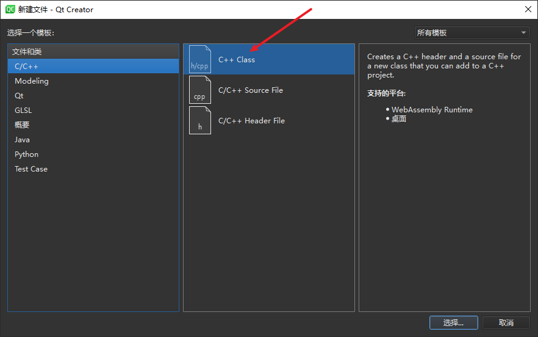

新建类文件信息如下：

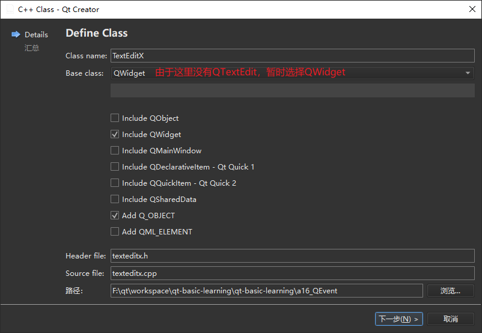

然后，把父类修改为`QTextEdit`，来到`texteditx.h`将父类由`QWidget`修改为`QTextEdit`，如下：

```c++
#ifndef TEXTEDITX_H
#define TEXTEDITX_H

#include <QTextEdit>


/**
 * @Author ：谁书-ss
 * @Date ：2024-01-18 08:15
 * @IDE ：Qt Creator
 * @Motto ：ABC(Always Be Coding)
 * <p></p>
 * @Description ：
 * <p></p>
 */


class TextEditX : public QTextEdit {
    Q_OBJECT
public:
    explicit TextEditX(QWidget *parent = nullptr);

signals:
};

#endif // TEXTEDITX_H
```

来到`texteditx.cpp`将父类由`QWidget`修改为`QTextEdit`，如下：

```c++
#include "texteditx.h"


/**
 * @Author ：谁书-ss
 * @Date ：2024-01-18 08:15
 * @IDE ：Qt Creator
 * @Motto ：ABC(Always Be Coding)
 * <p></p>
 * @Description ：
 * <p></p>
 */

TextEditX::TextEditX(QWidget *parent)
    : QTextEdit{parent}
{}
```


<br><br>

#### 重写拖放函数

首先，来到`textedit.h`，声明这4个拖放函数：

```c++
#ifndef TEXTEDITX_H
#define TEXTEDITX_H

#include <QTextEdit>
#include <QDragEnterEvent>
#include <QDragLeaveEvent>
#include <QDragMoveEvent>
#include <QDropEvent>


/**
 * @Author ：谁书-ss
 * @Date ：2024-01-18 08:15
 * @IDE ：Qt Creator
 * @Motto ：ABC(Always Be Coding)
 * <p></p>
 * @Description ：
 * <p></p>
 */

class TextEditX : public QTextEdit {
    Q_OBJECT
public:
    explicit TextEditX(QWidget *parent = nullptr);
protected:
    void dragEnterEvent(QDragEnterEvent *event);
    void dragMoveEvent(QDragMoveEvent *event);
    void dragLeaveEvent(QDragLeaveEvent *event);
    void dropEvent(QDropEvent *event);
signals:
};

#endif // TEXTEDITX_H
```

然后，来到`textedit.cpp`实现这4个函数（这里仅仅是加一句打印）：

```c++
#include "texteditx.h"

#include <QDebug>

/**
 * @Author ：谁书-ss
 * @Date ：2024-01-18 08:15
 * @IDE ：Qt Creator
 * @Motto ：ABC(Always Be Coding)
 * <p></p>
 * @Description ：
 * <p></p>
 */

TextEditX::TextEditX(QWidget *parent)
    : QTextEdit{parent}
{
    this->setAcceptDrops(true);
}

void TextEditX::dragEnterEvent(QDragEnterEvent *event) {
    qDebug() << "dragEnterEvent";

    // 判断是正常的文件，表明用户可以在这个窗口部件上拖放对象
    // 默认情况下，窗口部件是不接受拖动的，Qt会自动改变光标来向用户说明这个窗口部件是不是有效的放下点
    event->acceptProposedAction();
}

void TextEditX::dragMoveEvent(QDragMoveEvent *event) {
    qDebug() << "dragMoveEvent";
}

void TextEditX::dragLeaveEvent(QDragLeaveEvent *event) {
    qDebug() << "dragLeaveEvent";
}

void TextEditX::dropEvent(QDropEvent *event) {
    qDebug() << "dropEvent";
}
```


<br><br>

#### 将TextEditX显示到界面

来到`drag_widget.cpp`，在构造函数中添加`TextEditX`控件，如下：

```c++
#include "drag_widget.h"

#include <QVBoxLayout>
#include <texteditx.h>

/**
 * @Author ：谁书-ss
 * @Date ：2024-01-05 15:32
 * @IDE ：Qt Creator
 * @Motto ：ABC(Always Be Coding)
 * <p></p>
 * @Description ：拖动事件
 * <p></p>
 */

DragWidget::DragWidget(QWidget *parent)
    : QWidget{parent} {
    QVBoxLayout *verticalLayout = new QVBoxLayout(this);
    verticalLayout->setSpacing(0);
    verticalLayout->setContentsMargins(10, 10, 10, 10);

    // 添加自定义控件TextEditX
    TextEditX *textEditx = new TextEditX(this);
    textEditx->setPlaceholderText("支持文件拖放的方式，来打开文件");
    verticalLayout->addWidget(textEditx);
}
```

此时运行程序，效果如下：

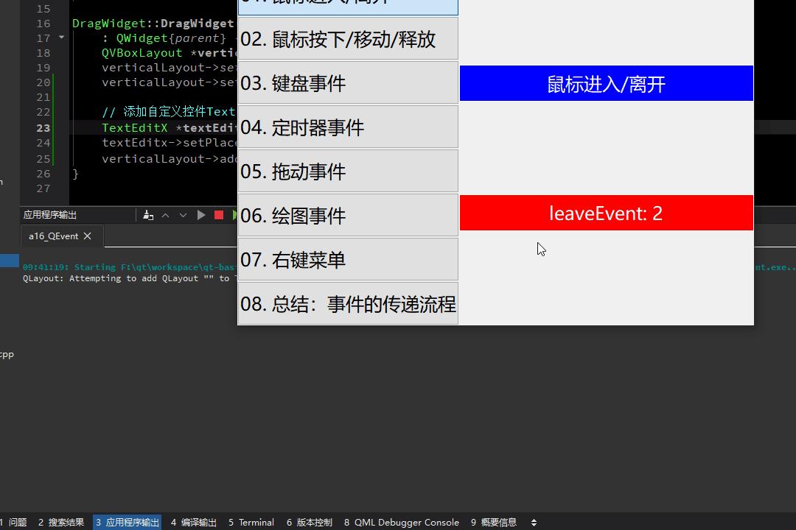


<br><br>

### 实现打开文件功能

只需修改`dropEvent()`函数，如下：

```c++
#include "texteditx.h"

#include <QDebug>
#include <QFile>
#include <QMimeData>
#include <QApplication>


/**
 * @Author ：谁书-ss
 * @Date ：2024-01-18 08:15
 * @IDE ：Qt Creator
 * @Motto ：ABC(Always Be Coding)
 * <p></p>
 * @Description ：
 * <p></p>
 */

TextEditX::TextEditX(QWidget *parent)
    : QTextEdit{parent}
{
    this->setAcceptDrops(true);
}

void TextEditX::dragEnterEvent(QDragEnterEvent *event) {
    qDebug() << "dragEnterEvent";

    // 判断是正常的文件，表明用户可以在这个窗口部件上拖放对象
    // 默认情况下，窗口部件是不接受拖动的，Qt会自动改变光标来向用户说明这个窗口部件是不是有效的放下点
    event->acceptProposedAction();
}

void TextEditX::dragMoveEvent(QDragMoveEvent *event) {
    qDebug() << "dragMoveEvent";
}

void TextEditX::dragLeaveEvent(QDragLeaveEvent *event) {
    qDebug() << "dragLeaveEvent";
}

void TextEditX::dropEvent(QDropEvent *event) {
    qDebug() << "dropEvent";

    QList<QUrl> urls = event->mimeData()->urls();
    if (urls.isEmpty()) {
        return;
    }
    QString fileName = urls.first().toLocalFile();

    qDebug() << urls.first() << "  :  " << fileName;

    QFile file(fileName);
    if (file.open(QIODevice::ReadOnly)) {
        setPlainText(file.readAll());
    }
}
```

拖放一个桌面文件到 TextEditX 中，效果如下：

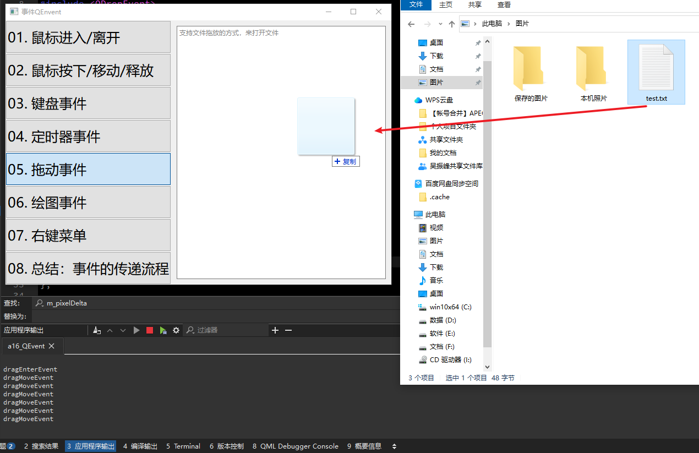

<br>

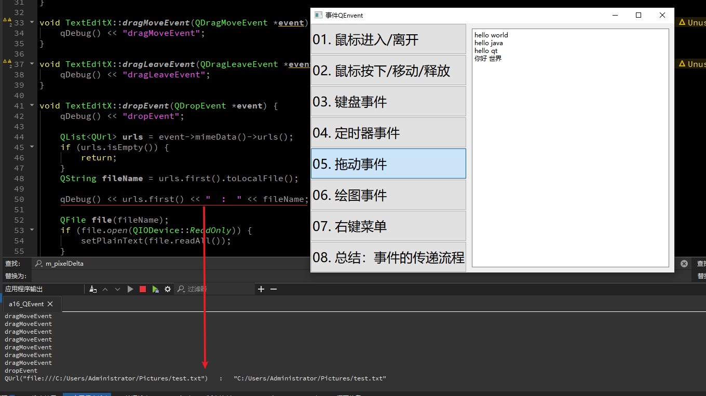


<br><br>

### 实现鼠标滚轮放大字体

以上在`TextEditX`中显示的文本，字体大小固定，接下来实现，通过鼠标滚轮来设置字体大小

首先，在`texteditx.h`中，声明鼠标滚轮滚动的事件`wheelEvent()`，如下：

```c++
class TextEditX : public QTextEdit {
protected:
    void wheelEvent(QWheelEvent* e);
};
```

然后，实现`wheelEvent()`函数：

```c++
#include <QApplication>

void TextEditX::wheelEvent(QWheelEvent *e) {
    // ctrl键的判断
    if (QApplication::keyboardModifiers() == Qt::ControlModifier) {
        qDebug() << "滚轮滚动大小：" << e->angleDelta().y();
        // zoomIn/zoomOut可以直接修改字体大小
        if (e->angleDelta().y() > 0) {
            // 滚轮远离使用者, 进行放大
            this->zoomIn();
        } else {
            // 进行缩小
            this->zoomOut();
        }
    } else {
        // 调用父类的，否则无法实现文本的上下滚动。
        QTextEdit::wheelEvent(e);
    }
}
```

此时，运行效果如下：

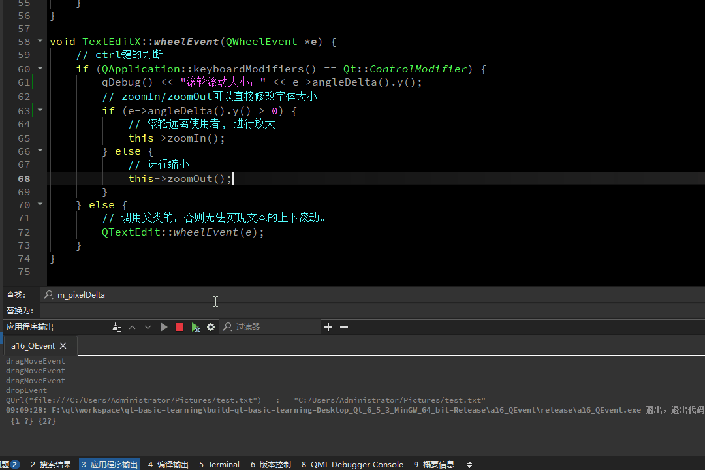


<br><br>

## 绘图事件


<br><br>

## 右键菜单


<br><br>

## 总结：事件的传递流程


