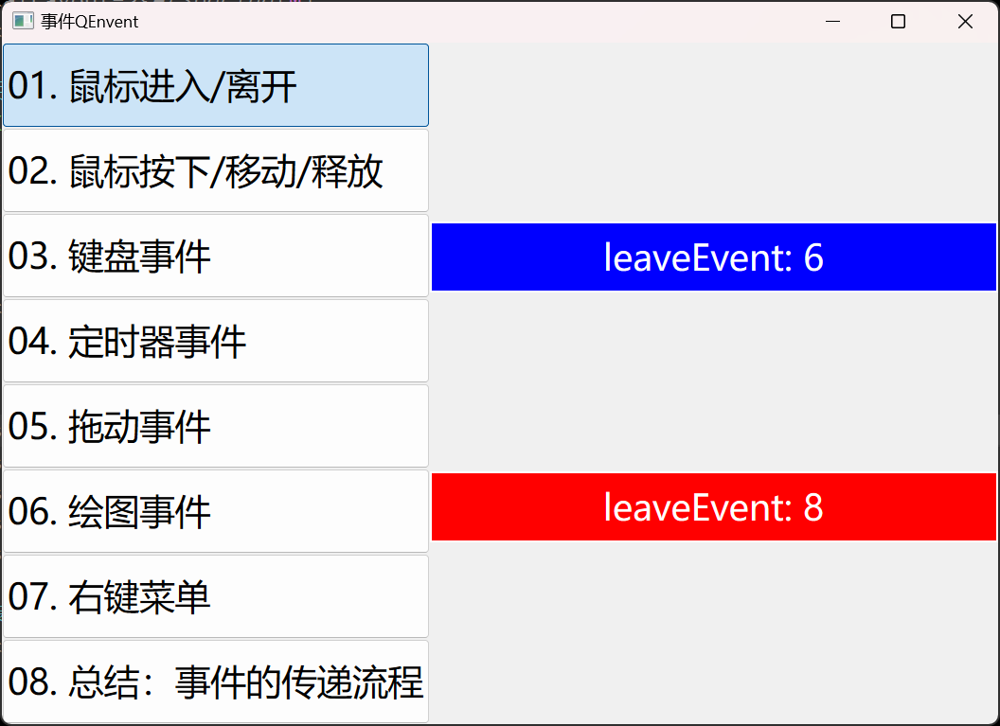

# a16_QEvent

事件，在 Qt 中是很重要的一块内容，在实际工作中用到的也很多。

实际工作中，往往窗口是相互嵌套的，比如一个标签放在一个`widget`中，一个`widget`也可能放在另一个`widget`中，这时就涉及在父子窗口之间的传递，什么时候需要传递，什么时候又要终止传递。这是需要搞清楚的。

总结了一张图：


<br><br>

## 学习内容

详细讲解以下事件：

- 鼠标进入/离开事件
- 鼠标按下/移动/释放事件
- 键盘事件
- 定时器事件
- 拖动事件
- 绘图事件
- 右键菜单


<br><br>

## 创建整体布局

### 新建工程

新建一个窗口类 MainWidget，继承自 QWidget，并且取消 “Generate form” 复选框。


也就是不使用 UI设计师界面拖拽控件，而是纯代码来实现界面。最终新建工程如下：


<br><br>

### 整体布局规划

首先，来到 mainwidget.h 添加两个成员变量 navWidget、mainWidget，如下：

```c++
#include <QStackedWidget>

class MainWidget : public QWidget
{
private:
    QWidget* navWidget;
    
    QWidget* mainWidget;
    QStackedWidget* stackedWidget;
};
```

然后，来到 MainWidget 构造，添加左侧导航、右侧主体的整体框架

```c++
#include <QHBoxLayout>
#include <QVBoxLayout>

MainWidget::MainWidget(QWidget* parent) : QWidget(parent)
{
    // 1. 整体采用水平布局
    QHBoxLayout* horizontalLayout = new QHBoxLayout(this);
    horizontalLayout->setSpacing(0);
    horizontalLayout->setContentsMargins(0, 0, 0, 0);

    // 2. 导航窗体
    navWidget = new QWidget(this);
    QVBoxLayout* leftLayout = new QVBoxLayout(navWidget);
    leftLayout->setSpacing(0);
    leftLayout->setContentsMargins(0, 0, 0, 0);

    horizontalLayout->addWidget(navWidget);

    // 3. 主窗体
    mainWidget = new QWidget(this);
    mainWidget->setMinimumWidth(400);
    QVBoxLayout* rightLayout = new QVBoxLayout(mainWidget);
    rightLayout->setSpacing(0);
    rightLayout->setContentsMargins(5, 5, 5, 5);
    stackedWidget = new QStackedWidget(mainWidget);

    rightLayout->addWidget(stackedWidget);

    horizontalLayout->addWidget(mainWidget);
}
```

<br>

==左侧导航采用垂直布局，添加多个 QPushButton；右侧主体采用 QStackedWidget，可以同时填充多个子页面，方便在多个子页面之间切换。==


<br><br>

### 实现左侧导航

首先，来到 mainwidget.h 添加 一个初始化左侧导航的成员函数，如下：

```c++
// 为了把多个 QPushButton 统一管理并实现互斥，放到一个 QButtonGroup 中
#include <QButtonGroup> 

class MainWidget : public QWidget
{
private:
    void initNav();
    QButtonGroup* btnGroup;
};
```

然后，来到 mainwidget.cpp 实现 initNav() 成员函数，如下：

```c++
#include <QPushButton>

void MainWidget::initNav()
{
    // 按钮文字集合
    QStringList names;
    names << "鼠标进入/离开"
          << "鼠标按下/移动/释放"
          << "键盘事件"
          << "定时器事件"
          << "拖动事件"
          << "绘图事件"
          << "右键菜单"
          << "总结：事件的传递流程";

    btnGroup = new QButtonGroup(this);

    //自动生成按钮
    for ( int i = 0; i < names.count(); i++ ) {
        QPushButton* btn = new QPushButton;
        //设置按钮固定高度
        btn->setMinimumHeight(60);
        //设置按钮的文字
        btn->setText(QString("%1. %2").arg(i + 1, 2, 10, QChar('0')).arg(names.at(i)));
        //设置按钮可选中按下类似复选框的功能
        btn->setCheckable(true);
        // 设置按钮的样式
        navWidget->setStyleSheet(R"(
            QPushButton {
                    font: 25px;
                    text-align : left;
            }
        )");
        // 将按钮添加到 btnGroup
        btnGroup->addButton(btn, i);
        //将按钮加入到布局
        navWidget->layout()->addWidget(btn);
    }
}
```

最后，在 mainwidget.cpp 构造中调用 initNav() 即可

```c++
MainWidget::MainWidget(QWidget* parent) : QWidget(parent)
{
    // ...
    
    initNav();
}
```

最终效果如下：


<br><br>

### 实现右侧主体

右侧主体采用`QStackedWidget`，可以同时填充多个子页面，方便在多个子页面之间切换。因此，要创建8个子窗口。

首先，添加第一个窗口：鼠标进入/离开窗口，对应的文件为`enter_leave_widget.cpp.h`

在左侧项目文件名上右键，然后选择`“添加新文件”`，选择 `“C++ Class”`，如下：


为了便于区分，在该页面添加一个标签，并修改 text 为 “鼠标进入/离开”，如下：

```c++
#include "enter_leave_widget.h"

#include <QLabel>
#include <QVBoxLayout>


/**
 * @Author ：谁书-ss
 * @Date ：2024-01-05 15:16
 * @IDE ：Qt Creator
 * @Motto ：ABC(Always Be Coding)
 * <p></p>
 * @Description ：
 * <p></p>
 */

EnterLeaveWidget::EnterLeaveWidget(QWidget *parent)
    : QWidget{parent}
{
    QVBoxLayout* verticalLayout = new QVBoxLayout(this);
    verticalLayout->setSpacing(0);
    verticalLayout->setContentsMargins(0, 0, 0, 0);

    QLabel* lbl = new QLabel(this);
    lbl->setText("鼠标进入/离开");
    lbl->setFrameShape(QFrame::Box);
    lbl->setFixedHeight(50);
    lbl->setAlignment(Qt::AlignCenter);
    lbl->setStyleSheet("background-color: blue;color: white;font-size: 25px");
    verticalLayout->addWidget(lbl);
}
```

然后，根据上述方法，创建剩余的7个子窗口，类名称分别如下：

- ==PressMoveReleaseWidget==  鼠标按下/移动/释放
- ==KeyWidget==  键盘事件
- ==TimerWidget==  定时器事件
- ==DragWidget==  拖动事件
- ==PaintWidget==  绘图事件
- ==ContextWidget==  右键菜单
- ==PropagateWidget==  总结：事件的传递流程

剩余的7个子窗口的头文件和源文件，依然使用下划线命名法，分别如下

- ==press_move_release_widget==  鼠标按下/移动/释放
- ==key_widget==  键盘事件
- ==timer_widget==  定时器事件
- ==drag_widget==  拖动事件
- ==paint_widget==  绘图事件
- ==context_widget==  右键菜单
- ==propagate_widget==  总结：事件的传递流程

<br>

最终效果如下：


<br><br>

### 左右联动

#### 添加8个窗体

实现点击左侧导航栏的按钮，切换右侧的子界面，首先，在`mainwidget.h`中，添加一个 `initMain()`的成员函数：


<br><br>

#### 关联槽函数

首先，在 mainwidget.h 中，声明左侧导航按钮的槽函数：

```c++
class MainWidget : public QWidget
{
private slots:
    void buttonClicked();  //导航按钮单击事件
};
```

并在 mainwidget.cpp 中 实现该槽函数，如下：

```c++
void MainWidget::buttonClicked()
{
    // 识别按下了哪个按钮
    int index = btnGroup->checkedId();
    stackedWidget->setCurrentIndex(index);
}
```

然后，需要在 initNav() 函数中，关联一下信号槽，如下：

```c++
void MainWidget::initNav()
{
    for ( int i = 0; i < names.count(); i++ ) {
        
        // ...
        
        // 关联信号槽
        connect(btn, &QPushButton::clicked, this, &MainWidget::btnClicked);
    }
}
```

最后，为了默认选中第一项，在 initNav() 最后添加如下一行：

```c++
void MainWidget::initNav()
{
 	// ...
    
    // 默认选中第一项
    btnGroup->button(0)->click();
}
```

此时，运行，就可以左右联动了，如下：


<br><br>

## 鼠标进入、离开事件

`QEvent::Enter`：鼠标进入事件，当鼠标进入到窗口/控件内部时，触发该事件

`QEvent::Leave`：鼠标离开事件，当鼠标进入到窗口/控件内部时，触发该事件


<br><br>

### 通过自定义控件实现

#### 添加自定义控件类 LabelX

首先，在左侧项目文件名上右键，然后选择 “添加新文件”，选择 “C++ Class”，如下：


新建类文件信息如下：


然后，把父类修改为`QLabel`，来到`labelx.h`将父类由`QWidget`修改为`QLabel`，如下：
```c++
#ifndef LABELX_H
#define LABELX_H

#include <QLabel>


/**
 * @Author ：谁书-ss
 * @Date ：2024-01-11 22:18
 * @IDE ：Qt Creator
 * @Motto ：ABC(Always Be Coding)
 * <p></p>
 * @Description ：
 * <p></p>
 */


class LabelX : public QLabel
{
    Q_OBJECT
public:
    explicit LabelX(QWidget *parent = nullptr);

signals:
};

#endif // LABELX_H
```

来到`labelx.cpp`将父类由`QWidget`修改为`QLabel`，如下：

```c++
#include "labelx.h"


/**
 * @Author ：谁书-ss
 * @Date ：2024-01-11 22:18
 * @IDE ：Qt Creator
 * @Motto ：ABC(Always Be Coding)
 * <p></p>
 * @Description ：
 * <p></p>
 */

LabelX::LabelX(QWidget *parent)
    : QLabel{parent}
{}
```


<br><br>

#### 重写 enterEvent/leaveEvent

首先，来到 `labelx.h`，声明这两个函数：

```c++
class LabelX : public QLabel
{
protected:
    // 鼠标进入/离开事件
    void enterEvent(QEnterEvent* enterEvent);
    void leaveEvent(QEvent* event);
};
```

然后，来到 `labelx.cpp` 实现这两个函数：

```c++
static int cnt = 1;

void LabelX::enterEvent(QEnterEvent* enterEvent)
{
    Q_UNUSED(enterEvent)
    //qDebug() << "enterEvent: " << cnt++;
    this->setText(QString("enterEvent: %1").arg(cnt++));
}

void LabelX::leaveEvent(QEvent* event)
{
    Q_UNUSED(event)
    //qDebug() << "leaveEvent: " << cnt++;
    this->setText(QString("leaveEvent: %1").arg(cnt++));
}
```

可以通过 `qDebug()` 在控制台输出，不过为了更直观，直接显示到标签上；

定义了一个静态变量，实现对进入和离开的计数；

使用 `Q_UNUSED` 宏，可以消除 `“unused parameter”` 的警告；


<br><br>

#### 将 LabelX 显示到界面

来到 `enter_leave_widget.cpp`，在构造函数中添加 `LabelX` 控件，如下：

```c++
#include "enter_leave_widget.h"

#include <QLabel>
#include <QVBoxLayout>

#include <labelx.h>

/**
 * @Author ：谁书-ss
 * @Date ：2024-01-05 15:16
 * @IDE ：Qt Creator
 * @Motto ：ABC(Always Be Coding)
 * <p></p>
 * @Description ：鼠标进入/离开
 * <p></p>
 */

EnterLeaveWidget::EnterLeaveWidget(QWidget *parent)
    : QWidget{parent}
{
    QVBoxLayout* verticalLayout = new QVBoxLayout(this);
    verticalLayout->setSpacing(0);
    verticalLayout->setContentsMargins(0, 0, 0, 0);

    // 使用自定义的标签控件LabelX
    LabelX* lblx = new LabelX(this);
    lblx->setText("鼠标进入/离开");
    lblx->setFrameShape(QFrame::Box);
    lblx->setFixedHeight(50);
    lblx->setAlignment(Qt::AlignCenter);
    lblx->setStyleSheet("background-color: blue;color: white;font-size: 25px");
    verticalLayout->addWidget(lblx);
}
```

此时运行程序，每当鼠标进入和离开标签时，计数都会加1，如下：


<br><br>

### 通过事件过滤器实现

#### 添加一个 QLabel

首先，在 `enter_leave_widget.h` 文件中添加一个 `QLabel` 的成员变量，如下：

```c++
#include <QLabel>

class EnterLeaveWidget : public QWidget
{
private:
    QLabel* lbl;
};
```

然后，在 `enter_leave_widget.cpp` 的构造中，添加一个 `QLabel` 控件，如下：

```c++
EnterLeaveWidget::EnterLeaveWidget(QWidget* parent) : QWidget{parent}
{
    // 2. 添加一个标准的QLabel
    lbl = new QLabel(this);
    lbl->setText("");
    lbl->setFrameShape(QFrame::Box);
    lbl->setFixedHeight(50);
    lbl->setAlignment(Qt::AlignCenter);
    lbl->setStyleSheet("background-color: red;color: white;font-size: 25px");
    verticalLayout->addWidget(lbl);
}
```


<br><br>

#### 为 QLabel 安装事件过滤器

在 `enter_leave_widget.cpp` 的构造中，为 `QLabel` 控件安装事件过滤器，如下：

```c++
EnterLeaveWidget::EnterLeaveWidget(QWidget* parent) : QWidget{parent}
{
    // ...
    lbl->installEventFilter(this);
}
```

这里将 lbl 的事件过滤器指定为 `this`，那么所有的发给 `lbl` 的事件都会被当前窗口截获。


<br><br>

#### 重写 eventFilter() 函数

重写当前窗口的 `eventFilter()` 函数，首先，在 `enter_leave_widget.h`文件中声明该函数，如下：

```c++
class EnterLeaveWidget : public QWidget
{
protected:
    bool eventFilter(QObject* watched, QEvent* event);
};
```

然后，在 `enter_leave_widget.cpp` 文件中实现该函数，如下：

```c++
#include <QEvent>

static int cnt = 1;
// 查看帮助文档， 拷贝
bool EnterLeaveWidget::eventFilter(QObject* watched, QEvent* event)
{
    if ( watched == lbl ) {
        if ( event->type() == QEvent::Enter ) {
            lbl->setText(QString("enterEvent: %1").arg(cnt++));
        } else if ( event->type() == QEvent::Leave ) {
            lbl->setText(QString("leaveEvent: %1").arg(cnt++));
        }
    }

    return QWidget::eventFilter(watched, event);
}
```

注意：

这里判断下事件是否是发向 `lbl` 的，然后再做处理，因为还有可能监控其他的控件；

通过 `QEvent` 类的 `type()` 函数，可以判断事件的类型；

以上还通过一个静态变量，来对事件计数；

最后调用下父类的 `QWidget::eventFilter(watched, event)`，其他事件交由父类处理；

此时运行，在当前窗口就可以截获发向 `QLabel` 的进入和离开事件了，如下：




<br><br>

## 鼠标按下、移动、释放事件

### 


<br><br>

## 键盘事件


<br><br>

## 定时器事件


<br><br>

## 拖动事件


<br><br>

## 绘图事件


<br><br>

## 右键菜单


<br><br>

## 总结：事件的传递流程