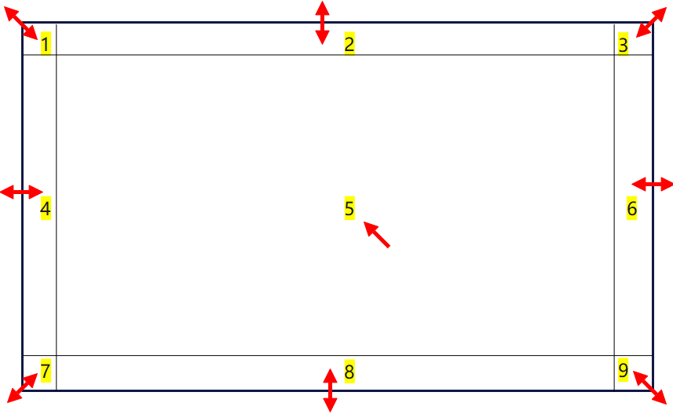
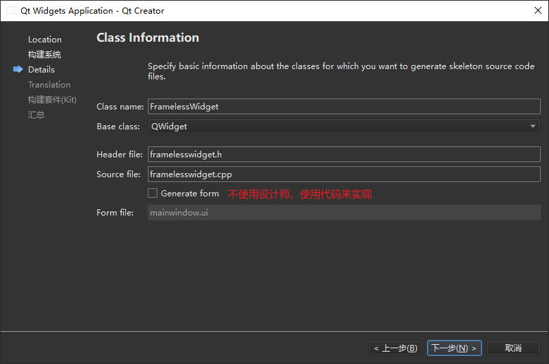
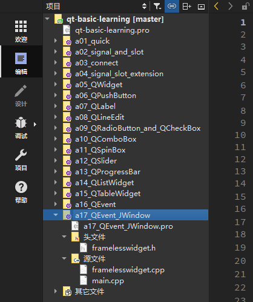
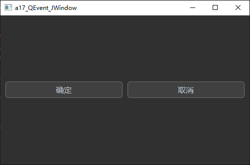
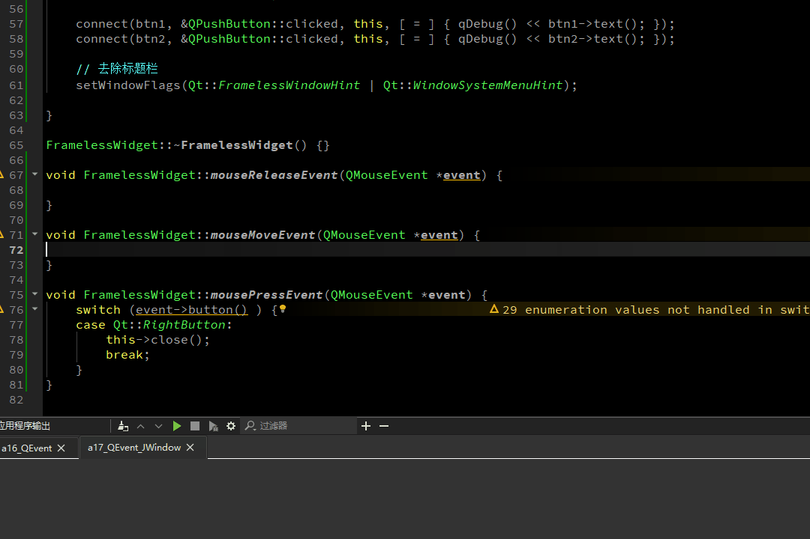
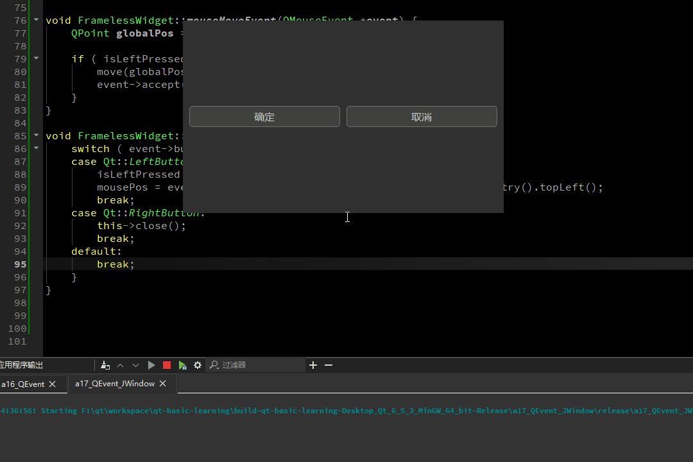
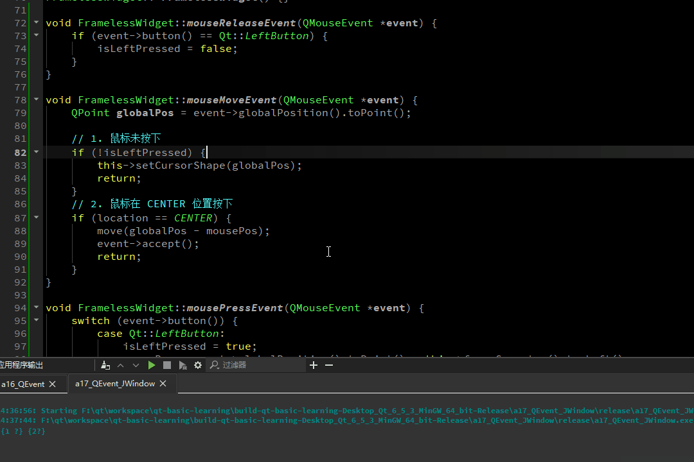
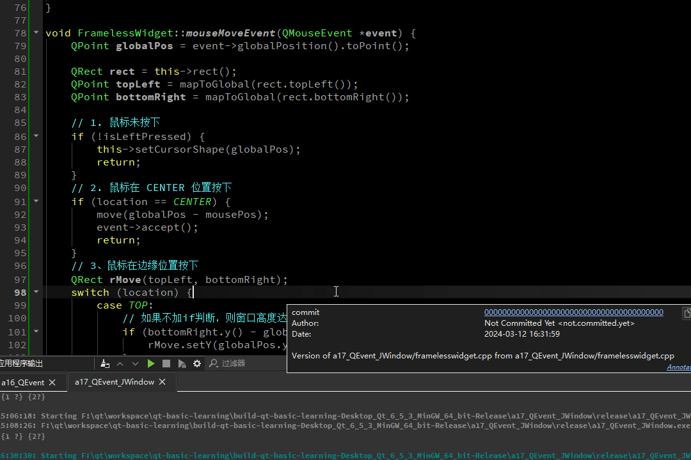

# a17_QEvent_JWindow

## 学习内容

实现一个非常精简的无边框窗口，支持拖动4个边和4个角来缩放窗口。

整体效果说明：

- 当鼠标位于 12346789 区域时，鼠标形状如上，可以进行窗口缩放；
- 当鼠标位于 5 区域时，鼠标恢复正常形状如上，可以进行窗口的移动；




<br><br>

## 新建工程，去掉边框

### 新建工程






<br><br>

### 添加按钮，设置背景色等

在空白界面上，添加两个水平布局的按钮，并设置窗体的最小大小，设置窗体的背景色，在`framelesswidget.cpp`中添加如下：

```c++
#include "framelesswidget.h"

#include <QPushButton>
#include <QHBoxLayout>
#include <QDebug>


/**
 * @Author ：谁书-ss
 * @Date ：2024-03-11 11:37
 * @IDE ：Qt Creator
 * @Motto ：ABC(Always Be Coding)
 * <p></p>
 * @Description ：
 * <p></p>
 */

FramelessWidget::FramelessWidget(QWidget *parent)
    : QWidget(parent) {
    // 设置最小宽高
    this->setMinimumWidth(500);
    this->setMinimumHeight(300);

    // 设置背景色
    this->setStyleSheet("background:#303030");

    QHBoxLayout *layout = new QHBoxLayout(this);
    layout->setSpacing(10);
    layout->setContentsMargins(10, 10, 10, 10);

    QPushButton *btn1 = new QPushButton("确定");
    QPushButton *btn2 = new QPushButton("取消");

    layout->addWidget(btn1);
    layout->addWidget(btn2);

    QString style = R"(
        QPushButton {
            background-color: rgb(64, 64, 64);
            font:16px "Microsoft YaHei";
            color:rgb(200,200,200);
            border: 1px solid #707070;
            border-radius: 5px;
            padding: 5px;
        }
        QPushButton:hover {
            background-color: rgb(40, 40, 40);
        }
        QPushButton:pressed {
            background-color: rgb(64, 64, 64);
        }
    )";

    btn1->setStyleSheet(style);
    btn2->setStyleSheet(style);

    connect(btn1, &QPushButton::clicked, this, [ = ] { qDebug() << btn1->text(); });
    connect(btn2, &QPushButton::clicked, this, [ = ] { qDebug() << btn2->text(); });

}

FramelessWidget::~FramelessWidget() {}
```

此时运行，效果如下：




<br><br>

### 去除标题栏

自带的标题栏很丑，在构造中，添加一条语句即可去除，如下：

```c++
FramelessWidget::FramelessWidget(QWidget* parent)
    : QWidget(parent) {
    
	// ...
    
    // 去除标题栏
    setWindowFlags(Qt::FramelessWindowHint | Qt::WindowSystemMenuHint);
}
```


<br><br>

### 右键退出

没有了标题栏，也就没有了右上角的 “关闭” 按钮，就无法退出程序了

接下来增加一个右键退出的功能

首先， 在`framelesswidget.h`中，声明虚函数`mousePressEvent()`，如下：

```c++
#ifndef FRAMELESSWIDGET_H
#define FRAMELESSWIDGET_H

#include <QWidget>


/**
 * @Author ：谁书-ss
 * @Date ：2024-03-11 11:37
 * @IDE ：Qt Creator
 * @Motto ：ABC(Always Be Coding)
 * <p></p>
 * @Description ：
 * <p></p>
 */

class FramelessWidget : public QWidget {
    Q_OBJECT

public:
    FramelessWidget(QWidget *parent = nullptr);
    ~FramelessWidget();
protected:
    void mouseReleaseEvent(QMouseEvent* event);
    void mouseMoveEvent(QMouseEvent* event);
    void mousePressEvent(QMouseEvent* event);
};
#endif // FRAMELESSWIDGET_H
```

然后，在`framelesswidget.cpp`中，实现`mousePressEvent()`，如下：

```c++
#include <QMouseEvent>


void FramelessWidget::mouseReleaseEvent(QMouseEvent *event) {

}

void FramelessWidget::mouseMoveEvent(QMouseEvent *event) {

}

void FramelessWidget::mousePressEvent(QMouseEvent *event) {
    switch (event->button() ) {
    case Qt::RightButton:
        this->close();
        break;
    }
}
```

此时，点击右键就可以直接退出程序，如下：




<br><br>

## 拖动窗口

由于没有了标题栏，无法移动窗口。接下来就实现窗口的移动

首先，在`framelesswidget.h`中，声明需要的成员变量和成员函数：

```c++
#ifndef FRAMELESSWIDGET_H
#define FRAMELESSWIDGET_H

#include <QWidget>


/**
 * @Author ：谁书-ss
 * @Date ：2024-03-11 11:37
 * @IDE ：Qt Creator
 * @Motto ：ABC(Always Be Coding)
 * <p></p>
 * @Description ：
 * <p></p>
 */

// 针对9个区域，定义了一个枚举变量；
enum Location {
    TOP,
    BOTTOM,
    LEFT,
    RIGHT,
    TOP_LEFT,
    TOP_RIGHT,
    BOTTOM_LEFT,
    BOTTOM_RIGHT,
    CENTER
};

class FramelessWidget : public QWidget {
    Q_OBJECT

public:
    FramelessWidget(QWidget *parent = nullptr);
    ~FramelessWidget();
protected:
    void mouseReleaseEvent(QMouseEvent* event);
    void mouseMoveEvent(QMouseEvent* event);
    void mousePressEvent(QMouseEvent* event);
private:
    // 鼠标左键是否按下
    bool isLeftPressed;
    // 记录鼠标按下的位置
    QPoint mousePos;
    Location location;
};
#endif // FRAMELESSWIDGET_H
```

然后，修改鼠标按下、移动和释放的 3 个事件处理函数：

```c++
FramelessWidget::FramelessWidget(QWidget* parent)
    : QWidget(parent) {
    
    // ...

    // 在构造中，将左键按下初始化为 false
    isLeftPressed = false;
}

void FramelessWidget::mouseReleaseEvent(QMouseEvent* event) {
    if ( event->button() == Qt::LeftButton ) {
        isLeftPressed = false;
    }
}

void FramelessWidget::mouseMoveEvent(QMouseEvent* event) {
    QPoint globalPos = event->globalPos();

	if ( isLeftPressed ) {
        move(globalPos - mousePos);
        event->accept();
    }
}

void FramelessWidget::mousePressEvent(QMouseEvent* event) {
    switch ( event->button() ) {
        case Qt::LeftButton:
            isLeftPressed = true;
            mousePos = event->globalPos() - this->frameGeometry().topLeft();
            break;
        case Qt::RightButton:
            this->close();
            break;
        default:
            break;
    }
}
```

此时运行效果如下：




<br><br>

## 边界位置，改变鼠标形状

接下来实现鼠标在边界处按下时，可以缩放窗口的功能。

不过本节先来实现当鼠标移动到边界时，改变鼠标的形状的功能。

首先，在`framelesswidget.h`的构造中，开启鼠标跟踪 ：

```c++
FramelessWidget::FramelessWidget(QWidget *parent)
    : QWidget(parent) {
    
    // ......

    // 开启鼠标跟踪
    this->setMouseTracking(true);
}
```

在`framelesswidget.h`声明`setCursorShape()`函数

```c++
// ......

// 定义一个间距
#define PADDING 5

class FramelessWidget : public QWidget {
    Q_OBJECT

//......
private:
    // ......
    void setCursorShape(const QPoint& cursorPoint);
};
#endif // FRAMELESSWIDGET_H
```

并在`framelesswidget.cpp`中实现它：

```c++
void FramelessWidget::setCursorShape(const QPoint &cursorPoint) {
    QRect rect = this->rect();
    QPoint topLeft = mapToGlobal(rect.topLeft());
    QPoint bottomRight = mapToGlobal(rect.bottomRight());

    int x = cursorPoint.x();
    int y = cursorPoint.y();

    if ( x >= topLeft.x() && x <= topLeft.x() + PADDING && y >= topLeft.y() && y <= topLeft.y() + PADDING ) {
        // 左上角
        location = TOP_LEFT;
        this->setCursor(QCursor(Qt::SizeFDiagCursor));
    } else if ( x <= bottomRight.x() && x >= bottomRight.x() - PADDING && y <= bottomRight.y() && y >= bottomRight.y() - PADDING ) {
        // 右下角
        location = BOTTOM_RIGHT;
        this->setCursor(QCursor(Qt::SizeFDiagCursor));
    } else if ( x >= topLeft.x() && x <= topLeft.x() + PADDING && y <= bottomRight.y() && y >= bottomRight.y() - PADDING ) {
        //左下角
        location = BOTTOM_LEFT;
        this->setCursor(QCursor(Qt::SizeBDiagCursor));
    } else if ( x <= bottomRight.x() && x >= bottomRight.x() - PADDING && y >= topLeft.y() && y <= topLeft.y() + PADDING ) {
        // 右上角
        location = TOP_RIGHT;
        this->setCursor(QCursor(Qt::SizeBDiagCursor));
    } else if ( x >= topLeft.x() && x <= topLeft.x() + PADDING ) {
        // 左边
        location = LEFT;
        this->setCursor(QCursor(Qt::SizeHorCursor));
    } else if ( x <= bottomRight.x() && x >= bottomRight.x() - PADDING ) {
        // 右边
        location = RIGHT;
        this->setCursor(QCursor(Qt::SizeHorCursor));
    } else if ( y >= topLeft.y() && y <= topLeft.y() + PADDING ) {
        // 上边
        location = TOP;
        this->setCursor(QCursor(Qt::SizeVerCursor));
    } else if ( y <= bottomRight.y() && y >= bottomRight.y() - PADDING ) {
        // 下边
        location = BOTTOM;
        this->setCursor(QCursor(Qt::SizeVerCursor));
    } else {
        // 默认
        location = CENTER;
        this->setCursor(QCursor(Qt::ArrowCursor));
    }
}
```


最后，修改`mouseMoveEvent()`

```c++
void Dialog::mouseMoveEvent(QMouseEvent* event)
{
    QPoint globalPos = event->globalPos();

    // 1. 鼠标未按下
    if ( !isLeftPressed ) {
        this->setCursorShape(globalPos);
        return;
    }

    // 2. 鼠标在 CENTER 位置按下
    if ( location == CENTER ) {
        move(globalPos - mousePos);
        event->accept();
        return;
    }
}

```

此时运行，当鼠标移动到边界时，就可以改变形状了，如下：




<br><br>

## 实现窗口缩放

本节来实现，当鼠标在边界处按下并拖动时，缩放窗口的功能。

首先，当鼠标按下时，只有在`CENTER`区域，才移动窗口，所以修改`mousePressEvent()`

```c++
void FramelessWidget::mousePressEvent(QMouseEvent *event) {
    switch (event->button()) {
        case Qt::LeftButton:
            isLeftPressed = true;
            // 增加这个 if 判断
            if(location == CENTER) {
                mousePos = event->globalPosition().toPoint() - this->frameGeometry().topLeft();
            }
            break;
        case Qt::RightButton:
            this->close();
            break;
        default:
            break;
    }
}
```

然后，修改`mouseMoveEvent()`，增加以下代码：

```c++
void FramelessWidget::mouseMoveEvent(QMouseEvent *event) {
    QPoint globalPos = event->globalPosition().toPoint();

    QRect rect = this->rect();
    QPoint topLeft = mapToGlobal(rect.topLeft());
    QPoint bottomRight = mapToGlobal(rect.bottomRight());

    // 1. 鼠标未按下
    if (!isLeftPressed) {
        this->setCursorShape(globalPos);
        return;
    }
    // 2. 鼠标在 CENTER 位置按下
    if (location == CENTER) {
        move(globalPos - mousePos);
        event->accept();
        return;
    }
    // 3、鼠标在边缘位置按下
    QRect rMove(topLeft, bottomRight);
    switch (location) {
        case TOP:
            // 如果不加if判断，则窗口高度达到最小高度后，会被鼠标 "向下推走"
            if (bottomRight.y() - globalPos.y() > this->minimumHeight()) {
                rMove.setY(globalPos.y());
            }
            break;
        case BOTTOM:
            rMove.setHeight(globalPos.y() - topLeft.y());
            break;
        case LEFT:
            // 如果不加if判断，则窗口高度达到最小宽度后，会被鼠标 "向右推走"
            if (bottomRight.x() - globalPos.x() > this->minimumWidth()) {
                rMove.setX(globalPos.x());
            }
            break;
        case RIGHT:
            rMove.setWidth(globalPos.x() - topLeft.x());
            break;
        case TOP_LEFT:
            // 如果不加if判断，则窗口达到最小宽高后，会被鼠标 "向右下推走"
            if (bottomRight.x() - globalPos.x() > this->minimumWidth()) {
                rMove.setX(globalPos.x());
            }
            if (bottomRight.y() - globalPos.y() > this->minimumHeight()) {
                rMove.setY(globalPos.y());
            }
            break;
        case TOP_RIGHT:
            rMove.setWidth(globalPos.x() - topLeft.x());
            // 如果不加if判断，则窗口达到最小宽高后，会被鼠标 "向下推走"
            if (bottomRight.y() - globalPos.y() > this->minimumHeight()) {
                rMove.setY(globalPos.y());
            }
            break;
        case BOTTOM_LEFT:
            // 如果不加if判断，则窗口达到最小宽高后，会被鼠标 "向右推走"
            if (bottomRight.x() - globalPos.x() > this->minimumWidth()) {
                rMove.setX(globalPos.x());
            }
            rMove.setHeight(globalPos.y() - topLeft.y());
            break;
        case BOTTOM_RIGHT:
            rMove.setWidth(globalPos.x() - topLeft.x());
            rMove.setHeight(globalPos.y() - topLeft.y());
            break;
        default:
            break;
    }
    this->setGeometry(rMove);
}
```

此时运行效果如下：



